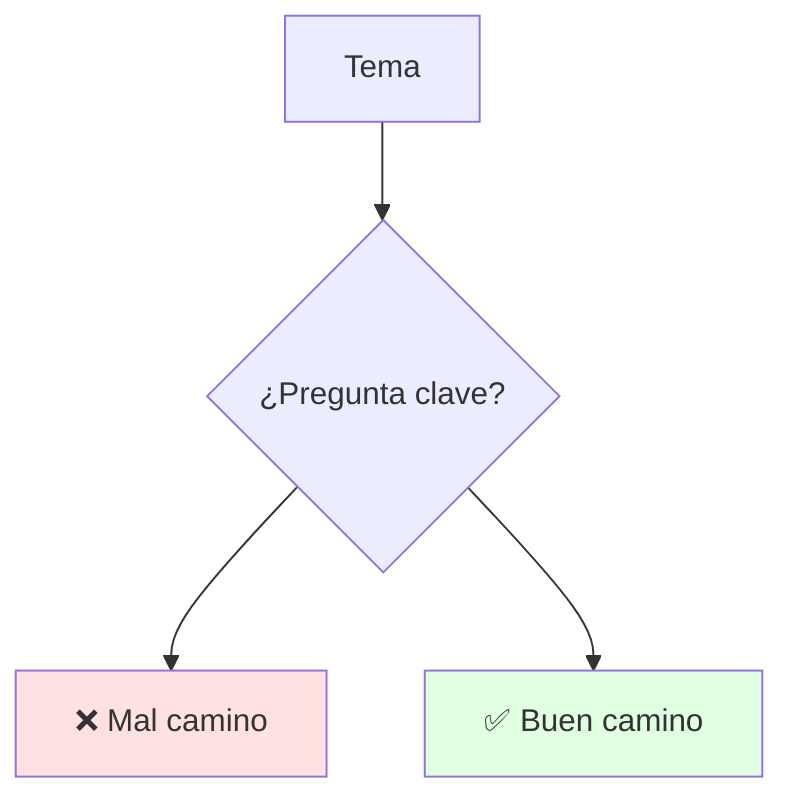
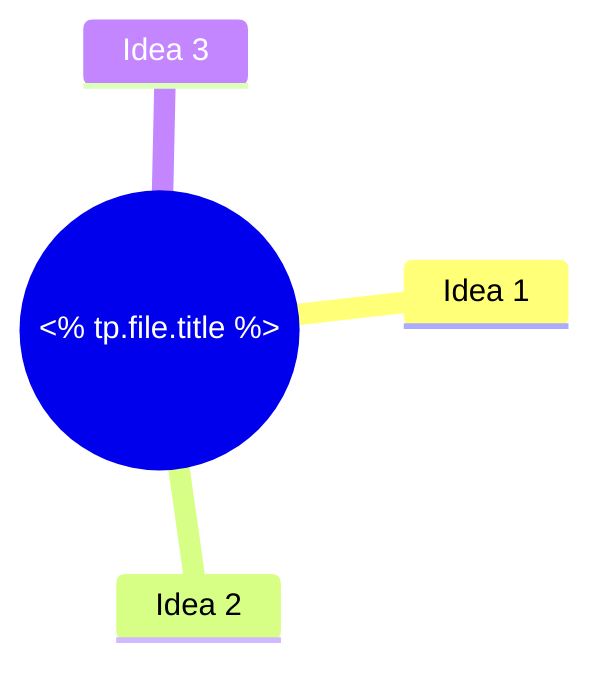

---
{"dg-publish":true,"permalink":"/contenido-extra/plantillas/plantilla-nota-unidad/","tags":[{"<% tp.system.prompt(\"Código materia (ej":"IDIG2012)\") %>"},{"<% tp.system.prompt(\"Tag unidad (ej":"unidad1)\") %>"}],"dg-note-properties":{"tags":[{"<% tp.system.prompt(\"Código materia (ej":"IDIG2012)\") %>"},{"<% tp.system.prompt(\"Tag unidad (ej":"unidad1)\") %>"}]}}
---

# <% tp.file.title %>

## 🎯 Introducción

> [!info] 💡 ¿Por Qué Importa?
>
> (1-2 líneas: qué problema resuelve este tema.)
>
> **Analogía del mundo real:** (compara con algo cotidiano)
>
> | Sin Esto | Con Esto |
> |---|---|
> | (costo) | (beneficio) |
> | (costo) | (beneficio) |

---

## 🧵 Desarrollo

### 🎭 (Subtema 1)

> [!note] 🎨 (Idea central)
>
> (Explicación + tabla si aplica.)
>
> | Aspecto | Detalle |
> |---|---|
> | (fila) | (valor) |

---

## ⚠️ Problemas Comunes y Soluciones

> [!danger] ❌ Error: (nombre)
>
> **Síntomas:** (cómo se ve)
>
> **Solución:**
>
> - (paso 1)
> - (paso 2)

---

## 🎯 Mejores Prácticas

> [!tip] 🏆 Checklist
>
> **1. (Regla)**
>
> - (detalle)

---

## 📊 Resumen Visual

> [!success] 🔍 Comparación Final
>
> | Aspecto | Sin Esto | Con Esto |
> |---|---|---|
> | (criterio) | ❌ | ✅ |

---

## 🚀 Próximos Pasos

> [!quote] 🌟 Continuando
>
> **Has aprendido:**
>
> ✅ (punto 1)
> ✅ (punto 2)
>
> **Próximo tema:**
>
> | Tema | Qué verás | Por qué importa |
> |---|---|---|
> | (siguiente) | (contenido) | (motivo) |

---

## 🔗 Seguir estudiando

> [!info] 📚 Seguir estudiando
>
> - Mapa de contenido: [[<% tp.system.prompt("Nota mapa de contenido") %>\|<% tp.system.prompt("Nota mapa de contenido") %>]]
> - Índice: [[<% tp.system.prompt("Nota índice de unidad") %>\|<% tp.system.prompt("Nota índice de unidad") %>]]
> - Syllabus: [[<% tp.system.prompt("Nota bienvenida/syllabus") %>\|<% tp.system.prompt("Nota bienvenida/syllabus") %>]]

## 📚 Referencias

> [!quote] 📖 Fuentes
>
> - (Libro, cap. X / diapositiva docente / URL verificada)

---

**Tags:** #<% tp.system.prompt("Tag materia") %>
