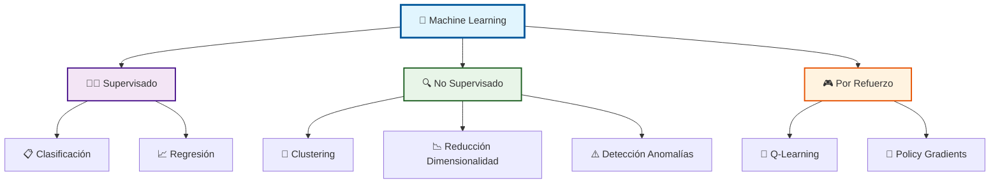
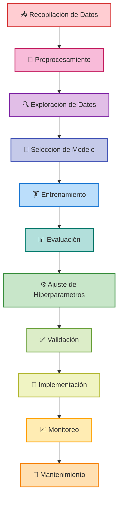
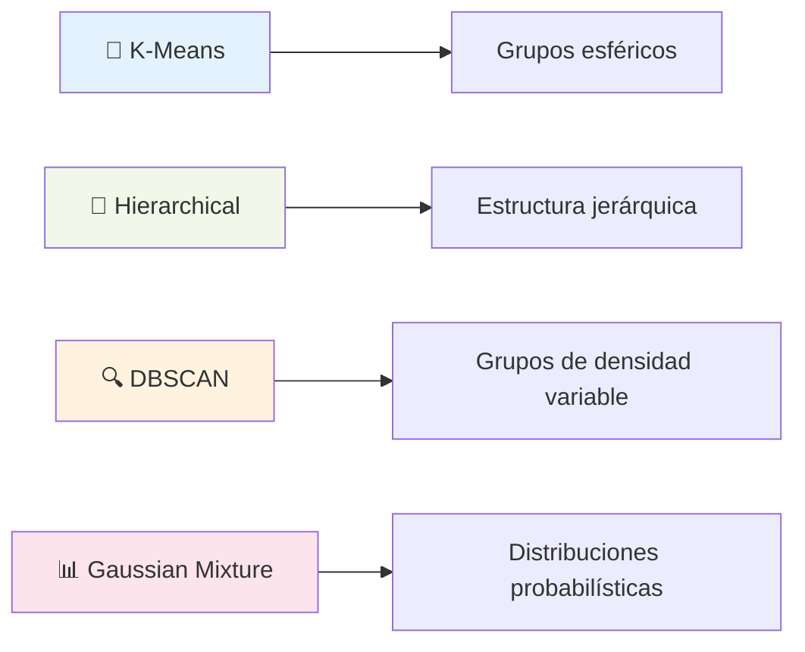
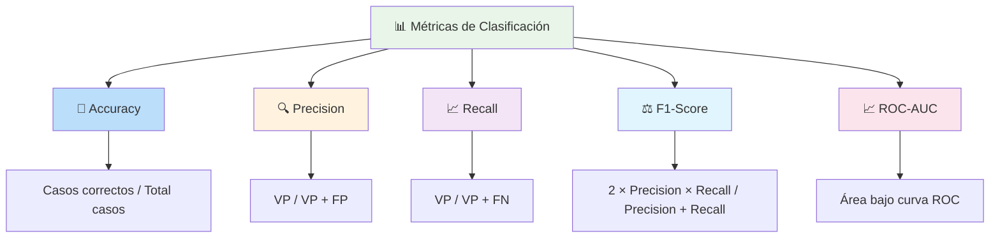
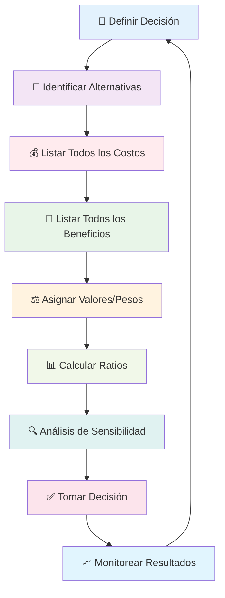
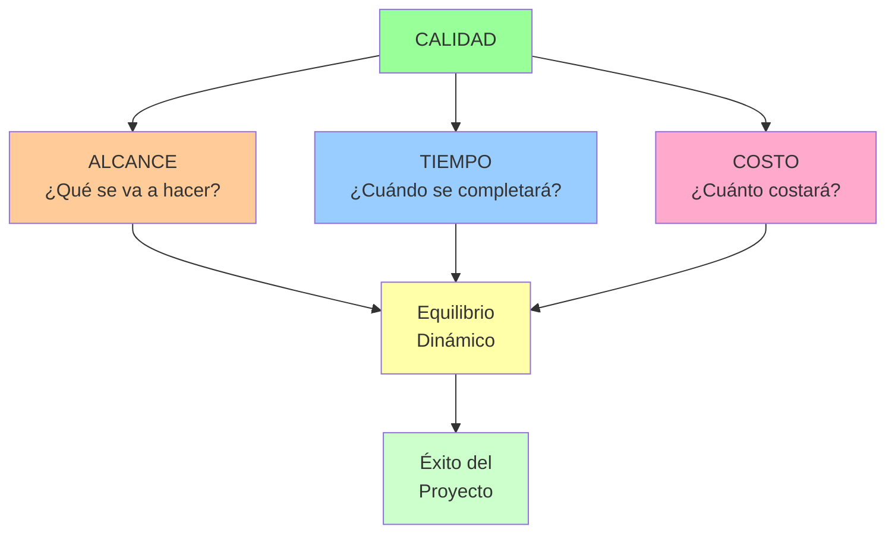

---
{"dg-publish":true,"permalink":"/universidad/1er-semestre/fundamentos-de-programacion/fundamentos-de-fp/machine-learning/","dg-note-properties":{}}
---


# Machine Learning - Aprendizaje Automático 🤖

[!quote]- Cita Inspiradora
> *"El aprendizaje automático no es magia; es tecnología. Pero aplicada correctamente, puede parecer mágica."* - Andrew Ng

> [!info] ## ¿Qué es Machine Learning? 🧠
El Machine Learning (ML) o Aprendizaje Automático es una rama de la inteligencia artificial que permite a las computadoras aprender y tomar decisiones basadas en datos, sin ser programadas explícitamente para cada tarea específica.

### 🎯 Objetivos del Machine Learning
- 📊 Identificar patrones en grandes conjuntos de datos
- 🔮 Realizar predicciones precisas sobre datos futuros
- ⚡ Automatizar procesos de toma de decisiones
- 📈 Mejorar el rendimiento a través de la experiencia

### 🔍 Características Clave
- **Aprendizaje Automático**: Sin programación explícita
- **Basado en Datos**: Utiliza información histórica
- **Adaptativo**: Mejora con más datos
- **Escalable**: Maneja grandes volúmenes de información

> [!tip] ## Tipos de Machine Learning 🔄


### 📊 Comparativa de Tipos

| Tipo | Descripción | Ejemplos de Algoritmos | Casos de Uso Comunes |
|------|-------------|------------------------|----------------------|
| **Supervisado** 👨‍🏫 | Aprende de datos etiquetados | Decision Trees, SVM, Neural Networks | Diagnóstico médico, Reconocimiento de voz, Spam detection |
| **No Supervisado** 🔍 | Encuentra patrones sin etiquetas | K-means, PCA, DBSCAN | Segmentación de clientes, Detección de fraudes, Análisis de mercado |
| **Por Refuerzo** 🎮 | Aprende mediante recompensas/castigos | Q-Learning, AlphaGo, Deep Q-Networks | Juegos, Robótica, Trading automático, Coches autónomos |

> [!warning] ## Proceso Completo de Machine Learning 🔄


### 🛠️ Fases Detalladas del Proceso

#### 1. 📥 Recopilación de Datos
- **Fuentes**: APIs, bases de datos, sensores, web scraping
- **Calidad**: Datos completos, precisos y representativos
- **Volumen**: Suficiente para entrenar modelos robustos

#### 2. 🧹 Preprocesamiento
- **Limpieza**: Eliminar datos faltantes o erróneos
- **Transformación**: Normalización, codificación categórica
- **Feature Engineering**: Crear nuevas variables relevantes

#### 3. 🔍 Exploración de Datos (EDA)
- **Análisis estadístico**: Distribuciones, correlaciones
- **Visualización**: Gráficos, histogramas, scatter plots
- **Patrones**: Identificar tendencias y anomalías

#### 4. 🎯 Selección de Modelo
- **Tipo de problema**: Clasificación, regresión, clustering
- **Complejidad**: Lineal vs no lineal
- **Interpretabilidad**: Trade-off con precisión

> [!example] ## Algoritmos Fundamentales por Categoría 🧮

### 🔄 Algoritmos de Clasificación
| Algoritmo | Ventajas | Desventajas | Mejor para |
|-----------|----------|-------------|------------|
| **Decision Trees** 🌳 | Fácil interpretación, no requiere preparación | Tendencia al overfitting | Datos categóricos, reglas de negocio |
| **Random Forest** 🌲🌲🌲 | Reduce overfitting, maneja datos faltantes | Menos interpretable | Datos mixtos, alta precisión |
| **SVM** ⚡ | Eficaz en alta dimensionalidad | Lento con datasets grandes | Clasificación de texto, imágenes |
| **Neural Networks** 🧠 | Aprende patrones complejos | Caja negra, requiere muchos datos | Reconocimiento de patrones |
| **Naive Bayes** 📊 | Rápido, funciona con pocos datos | Asume independencia de variables | Clasificación de texto |

### 📈 Algoritmos de Regresión
- **Linear Regression** 📏: Relaciones lineales simples
- **Polynomial Regression** 📐: Captura relaciones no lineales
- **Ridge/Lasso** 🎯: Incluye regularización para evitar overfitting
- **Support Vector Regression** ⚡: Versión de SVM para regresión

### 🔍 Algoritmos de Clustering


[!bug]- ## Desafíos y Problemas Comunes ⚠️

### 🚨 Problemas Principales

| Problema | 🔍 Descripción | 💡 Señales de Alerta | 🛠️ Soluciones |
|----------|----------------|---------------------|----------------|
| **Overfitting** 📈 | Memoriza datos de entrenamiento | Alta precisión en entrenamiento, baja en test | Cross-validation, regularización, más datos |
| **Underfitting** 📉 | Modelo demasiado simple | Baja precisión en entrenamiento y test | Modelos más complejos, más características |
| **Sesgo en Datos** ⚖️ | Datos no representativos | Resultados sesgados hacia grupos específicos | Muestreo diverso, auditorías regulares |
| **Dimensionalidad** 📊 | Demasiadas variables (curse of dimensionality) | Modelos lentos, overfitting | PCA, selección de características |
| **Desequilibrio de Clases** ⚖️ | Clases desproporcionadas | Precisión engañosa | SMOTE, cost-sensitive learning |

### 🛡️ Estrategias de Mitigación
- **📊 Cross-validation**: K-fold para evaluar generalización
- **🎯 Regularización**: L1/L2 para controlar complejidad
- **⚙️ Feature Engineering**: Crear características relevantes
- **🤝 Ensemble Methods**: Combinar múltiples modelos
- **📈 Learning Curves**: Monitorear progreso del entrenamiento

> [!success] ## Métricas de Evaluación 📊

### 🎯 Métricas para Clasificación


### 📈 Métricas para Regresión
| Métrica | Fórmula | Interpretación |
|---------|---------|----------------|
| **MAE** 📏 | Mean Absolute Error | Error promedio absoluto |
| **MSE** 📐 | Mean Squared Error | Penaliza errores grandes |
| **RMSE** 📊 | Root MSE | En unidades originales |
| **R²** 🎯 | Coefficient of Determination | Porcentaje de varianza explicada |

[!question]- ## Técnica de Estudio Eficaz: Método CRISP-DM + Flashcards 🧠

### 🎯 Mnemotecnia: "**C**ada **R**eto **I**nteligente **S**e **P**uede **D**ominar **M**ejor"

#### 📚 Fases CRISP-DM:
1. **C**omprender el negocio (Business Understanding)
2. **R**ecopilar datos (Data Understanding)  
3. **I**ngeniarlos (Data Preparation)
4. **S**eleccionar modelo (Modeling)
5. **P**robar resultados (Evaluation)
6. **D**esplegar solución (Deployment)
7. **M**antener y mejorar (Maintenance)

### 🔄 Sistema de Repaso Espaciado
```mermaid
gantt
    title Cronograma de Estudio ML
    dateFormat X
    axisFormat %d
    
    section Conceptos Básicos
    Tipos de ML :done, day1, 1d
    Algoritmos Fundamentales :done, day3, 1d
    
    section Proceso
    CRISP-DM Completo :active, day7, 1d
    Métricas y Evaluación :day15, 1d
    
    section Aplicación
    Implementación Práctica :day21, 1d
    Casos de Estudio :day30, 1d
    
    section Revisión
    Repaso General :day45, 1d
```

### 🃏 Técnica de Flashcards Digitales
**Anverso**: Concepto o algoritmo
**Reverso**: Definición + Cuándo usar + Ejemplo

Ejemplo:
- **Anverso**: "Random Forest 🌲🌲🌲"
- **Reverso**: "Ensemble de árboles de decisión | Reduce overfitting | Usado en: clasificación con alta precisión"

[!quote]- ## Referencias y Conexiones 🔗

### 📖 Enlaces a Otras Notas
- 
<div class="transclusion internal-embed is-loaded"><a class="markdown-embed-link" href="/universidad/1er-semestre/fundamentos-de-programacion/fundamentos-de-programacion/" aria-label="Open link"><svg xmlns="http://www.w3.org/2000/svg" width="24" height="24" viewBox="0 0 24 24" fill="none" stroke="currentColor" stroke-width="2" stroke-linecap="round" stroke-linejoin="round" class="svg-icon lucide-link"><path d="M10 13a5 5 0 0 0 7.54.54l3-3a5 5 0 0 0-7.07-7.07l-1.72 1.71"></path><path d="M14 11a5 5 0 0 0-7.54-.54l-3 3a5 5 0 0 0 7.07 7.07l1.71-1.71"></path></svg></a><div class="markdown-embed">


# Fundamentos de Programación

**Semestre:** 1ro

---

## Fundamentos de FP

## Módulo 1 — Introducción y Ambientes de Programación

## Módulo 2 — Tipos de datos, operadores, cadenas, listas y aleatoriedad

## Módulo 3 — Funciones

## Módulo 4 — Estructuras de control

## Módulo 5 — Diccionarios

## Módulo 6 — Pandas

## Módulo General — Funciones especiales

---

**Tags:** #programacion #python #ESPOL #semester1


</div></div>
 - Base para implementar algoritmos de ML
- ![[Métodos de Estudio\|Métodos de Estudio]] - Para estructurar el aprendizaje de conceptos complejos
- 
<div class="transclusion internal-embed is-loaded"><div class="markdown-embed">


# Análisis Costo-Beneficio 📊

> [!info] Definición El **análisis costo-beneficio** es una técnica sistemática para evaluar decisiones comparando todos los costos (recursos invertidos, oportunidades perdidas, riesgos) con todos los beneficios (ganancias, valor creado, oportunidades generadas) de una acción o proyecto. Es fundamental para optimizar recursos y maximizar valor en cualquier ámbito de la vida.

## 🧮 Componentes del Análisis Costo-Beneficio

> [!tip] Elementos Fundamentales
> 
> ### 1. Identificación de Costos 💰
> 
> - **Costos directos**: Inversión monetaria inmediata
> - **Costos de oportunidad**: Valor de la mejor alternativa sacrificada
> - **Costos ocultos**: Gastos no evidentes inicialmente
> - **Costos de tiempo**: Valor del tiempo invertido
> - **Costos emocionales**: Estrés, ansiedad, energía mental
> 
> ### 2. Identificación de Beneficios 🎯
> 
> - **Beneficios tangibles**: Ganancias cuantificables
> - **Beneficios intangibles**: Satisfacción, aprendizaje, relaciones
> - **Beneficios directos**: Resultados inmediatos de la acción
> - **Beneficios indirectos**: Efectos secundarios positivos
> - **Beneficios a largo plazo**: Valor acumulado en el tiempo

## 📋 Tipos de Análisis Costo-Beneficio

> [!warning] Modalidades de Evaluación
> 
> |Tipo|Aplicación|Características|Ejemplo|
> |---|---|---|---|
> |**Cuantitativo** 📈|Decisiones financieras|Valores numéricos precisos|Inversión en acciones|
> |**Cualitativo** 🎨|Decisiones personales|Valores subjetivos|Cambio de carrera|
> |**Mixto** 🔄|Decisiones complejas|Combina ambos enfoques|Mudanza a otra ciudad|
> |**Multicriterio** 🎯|Decisiones estratégicas|Múltiples factores pesados|Elección de universidad|

## 🔍 Proceso de Análisis Costo-Beneficio



## 📊 Framework de Evaluación Sistemática

> [!info] Metodología Estructurada
> 
> ### Matriz de Evaluación Integral 🗂️
> 
> #### Para Decisión: [Nombre de la Decisión]
> 
> |Factor|Peso (1-5)|Opción A|Opción B|Opción C|
> |---|---|---|---|---|
> |**COSTOS**|||||
> |Inversión Inicial|5|$10,000|$5,000|$15,000|
> |Tiempo Requerido|4|6 meses|3 meses|12 meses|
> |Costo de Oportunidad|4|Alto|Medio|Bajo|
> |Riesgo/Incertidumbre|3|Medio|Bajo|Alto|
> |**BENEFICIOS**|||||
> |ROI Esperado|5|25%|15%|35%|
> |Aprendizaje/Crecimiento|4|Alto|Medio|Muy Alto|
> |Impacto en Red|3|Medio|Alto|Medio|
> |Satisfacción Personal|4|Alto|Medio|Muy Alto|
> |**TOTAL PONDERADO**||**X**|**Y**|**Z**|

## 💡 Técnicas de Cuantificación

> [!tip] Métodos para Valorar Intangibles
> 
> ### 1. Escala de Puntuación (1-10) 📊
> 
> ```
> Beneficio: "Satisfacción en el trabajo"
> - Trabajo actual: 4/10
> - Nueva oportunidad: 8/10
> - Mejora: +4 puntos
> - Valor monetario equivalente: $4,000/año
> ```
> 
> ### 2. Método de Comparación Pareada ⚖️
> 
> - Compara cada factor con todos los demás
> - Asigna importancia relativa
> - Crea jerarquía de prioridades
> 
> ### 3. Análisis de Valor Presente Neto (VPN) 💰
> 
> ```
> VPN = Σ(Beneficios - Costos) / (1 + r)> Donde: r = tasa de descuento, t = tiempo
> ```
> 
> ### 4. Tiempo de Recuperación de Inversión ⏱️
> 
> ```
> Payback = Inversión Inicial / Beneficio Neto Anual
> ```

## 🎯 Análisis Costo-Beneficio Personal

> [!warning] Aplicación a Decisiones de Vida
> 
> ### Áreas de Aplicación Personal 🌱
> 
> #### Educación 🎓
> 
> - **Costos**: Matrícula, tiempo, costo de oportunidad laboral
> - **Beneficios**: Conocimiento, credenciales, red de contactos, salario futuro
> - **Consideraciones**: ROI de diferentes programas, modalidades de estudio
> 
> #### Carrera Profesional 💼
> 
> - **Costos**: Tiempo de transición, reducción salarial inicial, incertidumbre
> - **Beneficios**: Crecimiento profesional, satisfacción, potencial de ingresos
> - **Consideraciones**: Alineación con valores y propósito de vida
> 
> #### Relaciones 💕
> 
> - **Costos**: Tiempo, energía emocional, compromiso, sacrificios
> - **Beneficios**: Compañía, apoyo, crecimiento mutuo, felicidad
> - **Consideraciones**: Reciprocidad, compatibilidad, crecimiento conjunto
> 
> #### Salud y Bienestar 🏃‍♂️
> 
> - **Costos**: Tiempo de ejercicio, costo de alimentación saludable, disciplina
> - **Beneficios**: Energía, longevidad, autoestima, productividad
> - **Consideraciones**: Impacto a largo plazo, calidad de vida

## 🧠 Análisis de Decisiones Cognitivas

> [!info] Factores Psicológicos a Considerar
> 
> ### Sesgos Cognitivos Comunes 🧩
> 
> #### Sesgo de Confirmación 🔍
> 
> - **Problema**: Sobrevalorar beneficios de opción preferida
> - **Solución**: Buscar activamente evidencia contraria
> 
> #### Aversión a la Pérdida 😰
> 
> - **Problema**: Sobrevalorar costos vs. beneficios equivalentes
> - **Solución**: Reformular en términos de ganancias
> 
> #### Sesgo del Presente 📅
> 
> - **Problema**: Subestimar beneficios futuros
> - **Solución**: Usar técnicas de visualización del futuro
> 
> #### Efecto Marco 🖼️
> 
> - **Problema**: Decisión influida por cómo se presenta
> - **Solución**: Analizar desde múltiples perspectivas

## 🔢 Herramientas de Cálculo

> [!warning] Instrumentos de Evaluación Cuantitativa
> 
> ### 1. Ratio Costo-Beneficio Simple 📊
> 
> ```
> Ratio C/B = Beneficios Totales / Costos Totales
> 
> Interpretación:
> - Ratio > 1.0 = Beneficio neto positivo
> - Ratio < 1.0 = Beneficio neto negativo  
> - Ratio = 1.0 = Punto de equilibrio
> ```
> 
> ### 2. Análisis de Punto de Equilibrio 📈
> 
> ```
> Punto de Equilibrio = Costos Fijos / (Precio - Costos Variables)
> ```
> 
> ### 3. Análisis de Sensibilidad 🎚️
> 
> - **Variables clave**: Identifica factores más impactantes
> - **Escenarios**: Mejor caso, caso base, peor caso
> - **Punto de cambio**: Cuándo cambia la decisión óptima
> 
> ### 4. Árbol de Decisión 🌳
> 
> ```
> Valor Esperado = Σ(Probabilidad × Resultado)
> ```

## 🎨 Template de Análisis Personal

> [!tip] Formato Estructurado para Decisiones Personales
> 
> ### Análisis Costo-Beneficio: [Decisión Específica]
> 
> #### 📋 Descripción de la Decisión
> 
> - **Contexto**: [Situación actual y necesidad de decidir]
> - **Alternativas**: [Opciones disponibles]
> - **Timeline**: [Cuándo debe tomarse la decisión]
> 
> #### 💰 Análisis de Costos
> 
> |Tipo de Costo|Descripción|Valor/Impacto|
> |---|---|---|
> |Financiero|[Inversión monetaria]|$X|
> |Tiempo|[Horas/días invertidos]|X horas|
> |Oportunidad|[Qué sacrificas]|[Descripción]|
> |Emocional|[Estrés/ansiedad]|[Escala 1-10]|
> |Riesgo|[Incertidumbres]|[Probabilidad]|
> 
> #### 🎁 Análisis de Beneficios
> 
> |Tipo de Beneficio|Descripción|Valor/Impacto|
> |---|---|---|
> |Financiero|[Ganancias esperadas]|$Y|
> |Profesional|[Crecimiento carrera]|[Descripción]|
> |Personal|[Satisfacción/felicidad]|[Escala 1-10]|
> |Aprendizaje|[Conocimientos/habilidades]|[Descripción]|
> |Red|[Conexiones/relaciones]|[Descripción]|
> 
> #### 📊 Evaluación Final
> 
> - **Ratio Costo-Beneficio**: [Cálculo]
> - **Alineación con valores**: [¿Coherente con valores fundamentales?]
> - **Impacto en propósito**: [¿Contribuye a tu propósito de vida?]
> - **Decisión recomendada**: [Sí/No y por qué]

## 🚀 Casos de Estudio Prácticos

> [!info] Ejemplos de Aplicación Real
> 
> ### Caso 1: Cambio de Carrera Profesional 💼
> 
> **Situación**: Ingeniero considerando MBA
> 
> **Costos**:
> 
> - Financiero: $80,000 (matrícula + gastos)
> - Tiempo: 2 años fuera del mercado laboral
> - Oportunidad: $120,000 en salarios perdidos
> - Emocional: Estrés de estudios + incertidumbre
> 
> **Beneficios**:
> 
> - Financiero: +$30,000/año en salario (10 años = $300,000)
> - Profesional: Acceso a roles de liderazgo
> - Red: Compañeros MBA de alto nivel
> - Personal: Satisfacción de crecimiento
> 
> **Análisis**: Ratio 1.5:1 favorable en 5 años
> 
> ### Caso 2: Compra vs. Renta de Vivienda 🏠
> 
> **Situación**: Pareja joven decidiendo sobre vivienda
> 
> **Comprar**:
> 
> - Costos: Enganche $50,000, mantenimiento, impuestos
> - Beneficios: Equity building, estabilidad, control
> 
> **Rentar**:
> 
> - Costos: Renta mensual, falta de equity
> - Beneficios: Flexibilidad, menos responsabilidad, liquidez
> 
> **Análisis**: Depende de duración planeada en la ubicación

## 🔄 Revisión y Monitoreo Post-Decisión

> [!warning] Seguimiento de Resultados
> 
> ### Sistema de Evaluación Continua 📈
> 
> #### Métricas de Seguimiento (Revisar cada 3 meses)
> 
> 1. **Costos reales vs. estimados**: ¿Se cumplieron las proyecciones?
> 2. **Beneficios reales vs. estimados**: ¿Se materializaron como esperaba?
> 3. **Factores no considerados**: ¿Qué elementos no anticipaste?
> 4. **Satisfacción general**: ¿Te sientes bien con la decisión?
> 
> #### Criterios para Ajuste de Curso 🎯
> 
> - **Desviación >30%** en costos o beneficios principales
> - **Cambio fundamental** en circunstancias externas
> - **Nueva información** que altera la ecuación original
> - **Misalignment** persistente con valores personales

## 📚 Referencias

> [!quote] Enlaces a Notas Relacionadas
> 
> - [[Contenido Extra/02 - Productividad/Aplicacion Práctica/Toma de Decisiones\|Toma de Decisiones]]
> - [[Contenido Extra/01 - Dashboard/Estratégico/Pensamiento Estratégico\|Pensamiento Estratégico]]
> - [[Contenido Extra/01 - Dashboard/Operativo Diario/Planificación Estratégica\|Planificación Estratégica]]
> - [[Contenido Extra/02 - Productividad/Aplicacion Práctica/El Arte de Decir No\|El Arte de Decir No]]
> - [[Contenido Extra/01 - Dashboard/Fundamentos/Clarificación de Valores\|Clarificación de Valores]]
> - [[Contenido Extra/02 - Productividad/Metodologías y Sistemas/Matriz de Eisenhower\|Matriz de Eisenhower]]

## 📖 Notas Recomendadas para Complementar

> [!tip] Prerrequisitos y Temas Relacionados
> 
> ### Prerrequisitos 📋
> 
> - [[Contenido Extra/01 - Dashboard/Estratégico/Pensamiento Estratégico\|Pensamiento Estratégico]] - Marco conceptual para decisiones complejas
> - [[Contenido Extra/01 - Dashboard/Fundamentos/Clarificación de Valores\|Clarificación de Valores]] - Criterios no monetarios de evaluación
> - [[Contenido Extra/02 - Productividad/Metodologías y Sistemas/Técnicas de Concentración\|Técnicas de Concentración]] - Para análisis profundos y objetivos
> 
> ### Herramientas Complementarias 🔗
> 
> - [[Contenido Extra/02 - Productividad/Metodologías y Sistemas/Deep Work\|Deep Work]] - Concentración para análisis detallados
> - [[Contenido Extra/02 - Productividad/Metodologías y Sistemas/Matriz de Eisenhower\|Matriz de Eisenhower]] - Priorización de decisiones por urgencia/importancia
> - [[Contenido Extra/02 - Productividad/Metodologías y Sistemas/Bullet Journal Method (BuJo)\|Bullet Journal Method (BuJo)]] - Registro y seguimiento de decisiones
> - [[Contenido Extra/02 - Productividad/Gestión de Tiempo/Sistemas de Revisión\|Sistemas de Revisión]] - Evaluación periódica de resultados
> 
> ### Aplicación Práctica 📊
> 
> - [[Contenido Extra/01 - Dashboard/Estratégico/Objetivos 2026\|Objetivos 2026]] - Alineación de decisiones con metas
> - [[Contenido Extra/01 - Dashboard/Operativo Diario/Dashboard Semanal\|Dashboard Semanal]] - Monitoreo de progreso en decisiones
> - [[Contenido Extra/01 - Dashboard/Operativo Diario/Tracking de Hábitos\|Tracking de Hábitos]] - Seguimiento de cambios implementados

## 🧠 Técnica de Estudio: Método EVALÚA

> [!tip] Mnemotécnica para el Análisis **E** - Establece el problema y alternativas claramente **V** - Valora todos los costos (directos, indirectos, oportunidad) **A** - Analiza todos los beneficios (tangibles e intangibles) **L** - Lista factores de riesgo e incertidumbre **Ú** - Unifica todo en matriz de evaluación ponderada **A** - Aplica ratios y métricas de decisión
> 
> **Frase memorable**: _"Evaluar Verdaderamente Alternativas Libera Únicas Alternativas"_

## 📊 Plantilla de Decisión Rápida (15 minutos)

> [!warning] Análisis Express para Decisiones Cotidianas
> 
> ```markdown
> ## Decisión: [Nombre]
> ### ⚡ Análisis Rápido
> 
> **Opción A**: [Descripción]
> - Costo principal: [1 factor más importante]
> - Beneficio principal: [1 factor más importante]  
> - Riesgo principal: [1 riesgo clave]
> - Alineación valores (1-10): [Puntuación]
> 
> **Opción B**: [Descripción]
> - Costo principal: [1 factor más importante]
> - Beneficio principal: [1 factor más importante]
> - Riesgo principal: [1 riesgo clave] 
> - Alineación valores (1-10): [Puntuación]
> 
> ### ✅ Decisión
> **Elegida**: [Opción] 
> **Razón principal**: [1 frase]
> **Fecha de revisión**: [3-6 meses]
> ```

## 🎯 Ejercicio Práctico: Análisis de una Decisión Personal

> [!info] Workshop de 2 Horas
> 
> ### Preparación (15 min) 🎯
> 
> - Elige una decisión importante pendiente
> - Reúne información básica disponible
> - Silencia distracciones
> 
> ### Fase 1: Definición (30 min) 📝
> 
> **Actividad 1 (15 min)**: Define claramente el problema y contexto **Actividad 2 (15 min)**: Lista todas las alternativas posibles
> 
> ### Fase 2: Identificación (45 min) 🔍
> 
> **Actividad 3 (20 min)**: Brainstorm completo de costos (todos los tipos) **Actividad 4 (20 min)**: Brainstorm completo de beneficios (todos los tipos)  
> **Actividad 5 (5 min)**: Revisar que no falta nada importante
> 
> ### Descanso (15 min) ☕
> 
> ### Fase 3: Evaluación (45 min) 📊
> 
> **Actividad 6 (20 min)**: Asignar valores/pesos a cada factor **Actividad 7 (15 min)**: Calcular ratios y métricas **Actividad 8 (10 min)**: Análisis de sensibilidad básico
> 
> ### Fase 4: Decisión (30 min) ✅
> 
> **Actividad 9 (15 min)**: Verificar alineación con valores y propósito **Actividad 10 (10 min)**: Tomar decisión final **Actividad 11 (5 min)**: Programar fecha de revisión

---

**Tags**: #analisis-costo-beneficio #toma-decisiones #evaluacion-alternativas #decision-analysis #roi-personal #costo-oportunidad #beneficio-neto #evaluacion-opciones #decision-framework #optimizacion-recursos #analisis-cuantitativo #decision-making

</div></div>
 - Evaluar viabilidad de proyectos de ML
- 
<div class="transclusion internal-embed is-loaded"><div class="markdown-embed">


# Gestión de Proyectos 📊

> [!quote] "Un proyecto es una serie de tareas que tienen un objetivo específico para ser completadas dentro de ciertos parámetros." - Project Management Institute (PMI)

## ¿Qué es la Gestión de Proyectos? 🎯

> [!info] **Definición** La gestión de proyectos es la aplicación de conocimientos, habilidades, herramientas y técnicas para ejecutar proyectos de manera efectiva y eficiente. Es el arte de dirigir y coordinar recursos humanos y materiales durante la vida de un proyecto, utilizando técnicas modernas de gestión para lograr objetivos predefinidos de alcance, costo, tiempo, calidad y satisfacción de los participantes.

> [!tip] **Características de un Proyecto** ✨
> 
> - **Temporal**: Tiene un inicio y fin definidos
> - **Único**: Crea un producto, servicio o resultado específico
> - **Progresivo**: Se desarrolla en etapas incrementales
> - **Recursos limitados**: Restricciones de tiempo, presupuesto y personal
> - **Interdisciplinario**: Requiere diferentes habilidades y conocimientos

## El Triángulo de la Gestión de Proyectos



## Las 5 Fases del Ciclo de Vida del Proyecto

> [!warning] **Fase 1: Iniciación** 🚀
> 
> ### Objetivos Principales:
> 
> - **Definir el proyecto** a alto nivel
> - **Identificar stakeholders** clave
> - **Autorizar el proyecto** formalmente
> - **Establecer el charter del proyecto**
> 
> ### Entregables Clave:
> 
> - Project Charter (Acta de Constitución)
> - Registro de Stakeholders
> - Análisis de Factibilidad
> - Justificación del Negocio
> 
> ### Herramientas:
> 
> - Análisis FODA (SWOT)
> - Análisis Costo-Beneficio
> - Benchmarking
> - Entrevistas con stakeholders

> [!tip] **Fase 2: Planificación** 📋
> 
> ### Componentes del Plan:
> 
> |Área de Conocimiento|Plan Específico|Herramientas|
> |---|---|---|
> |**Alcance**|Plan de Gestión del Alcance|WBS, Diccionario WBS|
> |**Tiempo**|Cronograma del Proyecto|Diagrama de Gantt, PERT|
> |**Costo**|Presupuesto del Proyecto|Estimación por analogía, paramétrica|
> |**Calidad**|Plan de Calidad|Checklists, métricas|
> |**Recursos**|Plan de Recursos Humanos|Matriz RACI, organigramas|
> |**Comunicación**|Plan de Comunicaciones|Matriz de comunicación|
> |**Riesgos**|Plan de Gestión de Riesgos|Registro de riesgos, análisis cualitativo|
> |**Adquisiciones**|Plan de Adquisiciones|Make vs Buy, criterios de selección|
> 
> ### Work Breakdown Structure (WBS):
> 
> ```mermaid
> graph TD
>     A[Proyecto Principal] --> B[Entregable 1]
>     A --> C[Entregable 2]
>     A --> D[Entregable 3]
>     
>     B --> E[Actividad 1.1]
>     B --> F[Actividad 1.2]
>     C --> G[Actividad 2.1]
>     C --> H[Actividad 2.2]
>     D --> I[Actividad 3.1]
>     D --> J[Actividad 3.2]
>     
>     E --> K[Tarea 1.1.1]
>     E --> L[Tarea 1.1.2]
>     
>     style A fill:#e1f5fe
>     style B fill:#f3e5f5
>     style C fill:#f3e5f5
>     style D fill:#f3e5f5
>     style E fill:#fff3e0
>     style F fill:#fff3e0
> ```

> [!info] **Fase 3: Ejecución** ⚡
> 
> ### Actividades Principales:
> 
> - **Coordinar recursos** y personas
> - **Ejecutar el plan** del proyecto
> - **Gestionar expectativas** de stakeholders
> - **Implementar cambios** aprobados
> 
> ### Procesos de Gestión:
> 
> - Dirección y gestión del trabajo del proyecto
> - Gestión del conocimiento del proyecto
> - Gestión de la calidad
> - Adquisición y desarrollo del equipo
> - Gestión de las comunicaciones
> - Gestión del involucramiento de stakeholders

> [!warning] **Fase 4: Monitoreo y Control** 📊
> 
> ### Indicadores Clave de Rendimiento (KPIs):
> 
> #### **Métricas de Tiempo:**
> 
> - **SPI** (Schedule Performance Index) = EV/PV
> - **Variación del Cronograma** = EV - PV
> - **Estimación a la Finalización** = AC + (BAC - EV)/CPI
> 
> #### **Métricas de Costo:**
> 
> - **CPI** (Cost Performance Index) = EV/AC
> - **Variación del Costo** = EV - AC
> - **Índice de Rendimiento del Trabajo** = (BAC - EV)/(BAC - AC)
> 
> #### **Métricas de Calidad:**
> 
> - Defectos por millón
> - Porcentaje de entregables aceptados
> - Índice de satisfacción del cliente
> 
> ### Técnica del Valor Ganado (EVM):
> 
> ```mermaid
> graph LR
>     A[PV<br/>Valor Planificado] --> D[Análisis de<br/>Variaciones]
>     B[EV<br/>Valor Ganado] --> D
>     C[AC<br/>Costo Real] --> D
>     
>     D --> E[SPI = EV/PV<br/>Rendimiento Cronograma]
>     D --> F[CPI = EV/AC<br/>Rendimiento Costo]
>     D --> G[Pronósticos y<br/>Acciones Correctivas]
>     
>     style E fill:#99ff99
>     style F fill:#ffcc99
>     style G fill:#ff9999
> ```

> [!tip] **Fase 5: Cierre** 🎯
> 
> ### Actividades de Cierre:
> 
> - **Aceptación formal** de entregables
> - **Documentación** de lecciones aprendidas
> - **Liberación de recursos** del proyecto
> - **Cierre de contratos** y adquisiciones
> - **Archivo** de documentos del proyecto
> 
> ### Entregables Finales:
> 
> - Informe final del proyecto
> - Documentación de lecciones aprendidas
> - Transferencia de productos/servicios
> - Celebración y reconocimiento del equipo

## Metodologías de Gestión de Proyectos

> [!info] **Metodologías Tradicionales (Waterfall)** 🏗️
> 
> ### Características:
> 
> - **Secuencial**: Cada fase debe completarse antes de la siguiente
> - **Planificación extensiva**: Documentación detallada upfront
> - **Cambios controlados**: Proceso formal para modificaciones
> - **Predictivo**: Basado en requisitos bien definidos
> 
> ### Ventajas:
> 
> - Estructura clara y comprensible
> - Documentación exhaustiva
> - Control riguroso de cambios
> - Adecuado para proyectos con requisitos estables
> 
> ### Desventajas:
> 
> - Poca flexibilidad para cambios
> - Entrega tardía de valor
> - Riesgo alto si los requisitos cambian

> [!tip] **Metodologías Ágiles** 🔄
> 
> ### Principios Fundamentales:
> 
> 1. **Individuos e interacciones** sobre procesos y herramientas
> 2. **Software funcionando** sobre documentación extensiva
> 3. **Colaboración con el cliente** sobre negociación contractual
> 4. **Respuesta ante el cambio** sobre seguir un plan
> 
> ### Framework Scrum:
> 
> ```mermaid
> graph LR
>     A[Product Backlog] --> B[Sprint Planning]
>     B --> C[Sprint Backlog]
>     C --> D[Sprint<br/>1-4 semanas]
>     D --> E[Daily Scrum]
>     E --> D
>     D --> F[Sprint Review]
>     F --> G[Sprint Retrospective]
>     G --> B
>     F --> H[Increment]
>     
>     style D fill:#99ff99
>     style E fill:#ffcc99
>     style F fill:#99ccff
>     style G fill:#ffaacc
> ```
> 
> ### Roles en Scrum:
> 
> - **Product Owner**: Define qué se construye
> - **Scrum Master**: Facilita el proceso
> - **Development Team**: Construye el producto

> [!warning] **Metodologías Híbridas** ⚖️
> 
> ### Cuándo Usar Cada Enfoque:
> 
> |Factor|Tradicional|Ágil|Híbrido|
> |---|---|---|---|
> |**Requisitos**|Estables y claros|Cambiantes|Mixtos|
> |**Equipo**|Distribuido|Co-ubicado|Mixto|
> |**Riesgo**|Bajo|Alto|Medio|
> |**Innovación**|Baja|Alta|Media|
> |**Regulación**|Alta|Baja|Media|
> 
> ### Ejemplos de Híbridos:
> 
> - **Water-Scrum-Fall**: Planificación tradicional + desarrollo ágil + implementación tradicional
> - **Scaled Agile**: Múltiples equipos ágiles coordinados tradicionalmente
> - **Lean-Agile**: Principios Lean aplicados a desarrollo ágil

## Herramientas Digitales de Gestión

> [!tip] **Categorías de Herramientas** 🛠️
> 
> ### **Planificación y Seguimiento:**
> 
> - **Microsoft Project**: Gestión completa, diagramas de Gantt avanzados
> - **Smartsheet**: Colaborativo, basado en web
> - **Monday.com**: Visual, personalizable, intuitivo
> - **Wrike**: Gestión de recursos, reporting avanzado
> 
> ### **Metodologías Ágiles:**
> 
> - **Jira**: Especializado en desarrollo de software
> - **Trello**: Kanban simple y visual
> - **Azure DevOps**: Integrado con herramientas de desarrollo
> - **Notion**: All-in-one con flexibilidad máxima
> 
> ### **Comunicación y Colaboración:**
> 
> - **Slack**: Comunicación en tiempo real
> - **Microsoft Teams**: Integrado con Office 365
> - **Zoom**: Videoconferencias y webinars
> - **Miro**: Pizarras colaborativas virtuales

## Gestión de Riesgos en Proyectos

> [!warning] **Proceso de Gestión de Riesgos** ⚠️
> 
> ### 1. Identificación de Riesgos:
> 
> - **Brainstorming** con el equipo
> - **Análisis de supuestos** del proyecto
> - **Revisión de lecciones aprendidas** de proyectos similares
> - **Técnica Delphi** para consulta a expertos
> 
> ### 2. Análisis Cualitativo:
> 
> |Probabilidad|Impacto Bajo|Impacto Medio|Impacto Alto|
> |---|---|---|---|
> |**Alta**|🟨 Medio|🟧 Alto|🟥 Muy Alto|
> |**Media**|🟩 Bajo|🟨 Medio|🟧 Alto|
> |**Baja**|🟩 Muy Bajo|🟩 Bajo|🟨 Medio|
> 
> ### 3. Estrategias de Respuesta:
> 
> - **Evitar**: Eliminar la amenaza
> - **Mitigar**: Reducir probabilidad o impacto
> - **Transferir**: Pasar el riesgo a terceros
> - **Aceptar**: Reconocer pero no actuar activamente

## Liderazgo de Proyectos vs Gestión

> [!info] **Diferencias Clave** 👥
> 
> |Aspecto|Gestión de Proyectos|Liderazgo de Proyectos|
> |---|---|---|
> |**Enfoque**|Procesos y sistemas|Personas y visión|
> |**Orientación**|Control y eficiencia|Inspiración y cambio|
> |**Tiempo**|Presente y corto plazo|Futuro y largo plazo|
> |**Métodos**|Planificación y organización|Comunicación y motivación|
> |**Objetivo**|Hacer las cosas bien|Hacer las cosas correctas|
> 
> ### Competencias del Líder de Proyectos:
> 
> - **Inteligencia emocional** para manejar conflictos
> - **Comunicación efectiva** para alinear stakeholders
> - **Toma de decisiones** bajo incertidumbre
> - **Adaptabilidad** ante cambios inesperados
> - **Negociación** para resolver conflictos de recursos

## Gestión de Stakeholders

> [!tip] **Análisis de Stakeholders** 🎭
> 
> ### Matriz de Poder vs Interés:
> 
> ```mermaid
> graph TD
>     A[ALTA INFLUENCIA<br/>ALTO INTERÉS<br/>🎯 GESTIONAR DE CERCA] --> B[ALTA INFLUENCIA<br/>BAJO INTERÉS<br/>😊 MANTENER SATISFECHO]
>     C[BAJA INFLUENCIA<br/>ALTO INTERÉS<br/>📢 MANTENER INFORMADO] --> D[BAJA INFLUENCIA<br/>BAJO INTERÉS<br/>👁️ MONITOREAR]
>     
>     style A fill:#ff9999
>     style B fill:#ffcc99
>     style C fill:#99ccff
>     style D fill:#99ff99
> ```
> 
> ### Estrategias por Cuadrante:
> 
> - **Gestionar de cerca**: Comunicación frecuente, involucrar en decisiones
> - **Mantener satisfecho**: Comunicación regular, demostrar valor
> - **Mantener informado**: Updates periódicos, canales apropiados
> - **Monitorear**: Vigilancia ocasional, comunicación mínima

## Técnicas Avanzadas de Estimación

> [!info] **Métodos de Estimación** 📊
> 
> ### **1. Estimación por Analogía:**
> 
> - Comparar con proyectos similares pasados
> - Ajustar por diferencias en complejidad
> - Rápido pero requiere experiencia histórica
> 
> ### **2. Estimación Paramétrica:**
> 
> - Usar datos históricos y variables del proyecto
> - Ejemplo: X horas por punto de función
> - Más preciso con datos estadísticamente válidos
> 
> ### **3. Estimación por Tres Puntos (PERT):**
> 
> - **Optimista (O)**: Mejor escenario posible
> - **Pesimista (P)**: Peor escenario probable
> - **Más Probable (M)**: Escenario más realista
> - **Fórmula**: E = (O + 4M + P) / 6
> 
> ### **4. Planning Poker (Ágil):**
> 
> - Estimación colaborativa del equipo
> - Uso de secuencia Fibonacci para story points
> - Discusión hasta llegar a consenso

## Manejo de Cambios en Proyectos

> [!warning] **Proceso de Control de Cambios** 🔄
> 
> ### Flujo del Proceso:
> 
> ```mermaid
> flowchart TD
>     A[Solicitud de Cambio] --> B{Evaluación Inicial}
>     B --> C[Análisis de Impacto]
>     C --> D[Documentación Detallada]
>     D --> E[Comité de Control de Cambios]
>     E --> F{Decisión}
>     F -->|Aprobado| G[Actualizar Plan del Proyecto]
>     F -->|Rechazado| H[Notificar Rechazo]
>     F -->|Diferido| I[Backlog de Cambios]
>     G --> J[Implementar Cambio]
>     J --> K[Comunicar a Stakeholders]
>     
>     style F fill:#ffffaa
>     style G fill:#99ff99
>     style H fill:#ff9999
>     style I fill:#ffcc99
> ```
> 
> ### Criterios de Evaluación:
> 
> - **Impacto en alcance, tiempo y costo**
> - **Alineación con objetivos del proyecto**
> - **Disponibilidad de recursos**
> - **Riesgos asociados**
> - **Valor para el cliente/negocio**

## Técnica de Estudio: Método PRINCE2

> [!tip] **Método PRINCE2 para Memorizar Principios** 👑
> 
> **P** - **Principios** claros y aplicables **R** - **Roles** definidos con responsabilidades específicas **I** - **Integración** de todas las áreas de conocimiento **N** - **Negocio** como justificación continua **C** - **Control** por etapas del proyecto **E** - **Experiencia** aprovechada mediante lecciones aprendidas **2** - **Dos niveles**: gestión y dirección del proyecto
> 
> ### Los 7 Principios PRINCE2:
> 
> 1. **Justificación comercial continua**
> 2. **Aprender de la experiencia**
> 3. **Roles y responsabilidades definidos**
> 4. **Gestión por etapas**
> 5. **Gestión por excepción**
> 6. **Enfoque en los productos**
> 7. **Adaptación al entorno del proyecto**
> 
> ### Mnemotécnica Visual:
> 
> Imagina un **príncipe medieval** que gestiona la construcción de un castillo. Cada principio representa una torre del castillo que debe estar perfectamente integrada con las demás para que la estructura sea sólida y cumpla su propósito de proteger el reino (objetivos del proyecto).

## Casos de Éxito y Fracaso

> [!info] **Caso de Éxito: Proyecto Manhattan** ⚛️
> 
> **Características del Éxito:**
> 
> - **Objetivo claro y urgente**: Desarrollar arma nuclear antes que el enemigo
> - **Recursos ilimitados**: Presupuesto y personal sin restricciones
> - **Liderazgo fuerte**: General Leslie Groves y Robert Oppenheimer
> - **Gestión de la complejidad**: Múltiples enfoques paralelos
> - **Seguridad y confidencialidad**: Compartimentación de información
> 
> **Lecciones Aprendidas:**
> 
> - La claridad de propósito puede superar cualquier obstáculo técnico
> - El liderazgo dual (administrativo-técnico) puede ser muy efectivo
> - Los proyectos complejos requieren enfoques múltiples y paralelos

> [!warning] **Caso de Fracaso: Berlin Brandenburg Airport** ✈️
> 
> **Factores del Fracaso:**
> 
> - **Cambios constantes** en requisitos y diseño
> - **Falta de expertise** en sistemas complejos de seguridad
> - **Gestión deficiente** de múltiples stakeholders
> - **Subestimación** de la complejidad técnica
> - **Presión política** vs realidad técnica
> 
> **Lecciones Aprendidas:**
> 
> - Los cambios tardíos en proyectos complejos son exponencialmente costosos
> - La expertise técnica específica es irreemplazable
> - La presión política no puede acelerar realidades técnicas

## Métricas de Éxito del Proyecto

> [!tip] **KPIs Cuantitativos** 📈
> 
> ### **Métricas Tradicionales:**
> 
> - **CPI** (Cost Performance Index): Eficiencia de costos
> - **SPI** (Schedule Performance Index): Eficiencia temporal
> - **Quality Index**: % de entregables sin defectos
> - **Scope Creep**: % de cambios no controlados
> 
> ### **Métricas de Valor:**
> 
> - **ROI** (Return on Investment): Retorno de la inversión
> - **NPV** (Net Present Value): Valor presente neto
> - **Payback Period**: Tiempo de recuperación
> - **Business Value Delivered**: Valor entregado al negocio

> [!info] **KPIs Cualitativos** 🎯
> 
> ### **Satisfacción de Stakeholders:**
> 
> - Encuestas de satisfacción del cliente
> - Feedback del equipo del proyecto
> - Evaluación de la alta dirección
> - Percepción de usuarios finales
> 
> ### **Capacidades Organizacionales:**
> 
> - Lecciones aprendidas documentadas
> - Mejoras en procesos organizacionales
> - Desarrollo de competencias del equipo
> - Madurez en gestión de proyectos

## Referencias y Conexiones

> [!quote] **Referencias a Otras Notas**
> 
> - [[Contenido Extra/02 - Productividad/Gestión de Tiempo/Gestión del Tiempo\|Gestión del Tiempo]] - Técnicas específicas de planificación temporal
> - [[Contenido Extra/02 - Productividad/Aplicacion Práctica/Toma de Decisiones\|Toma de Decisiones]] - Procesos decisionales en contextos de proyecto
> - [[Contenido Extra/04 - Liderazgo y Equipos/Liderazgo Personal/Liderazgo Situacional\|Liderazgo Situacional]] - Adaptación del estilo de liderazgo según la fase
> - [[Contenido Extra/04 - Liderazgo y Equipos/Gestión de Relaciones/Gestión de Conflictos\|Gestión de Conflictos]] - Resolución de conflictos entre stakeholders
> - [[Contenido Extra/02 - Productividad/Aplicacion Práctica/La Comunicación Efectiva\|La Comunicación Efectiva]] - Habilidades comunicacionales para PM
> - [[Contenido Extra/02 - Productividad/Aplicacion Práctica/Análisis Costo-Beneficio\|Análisis Costo-Beneficio]] - Evaluación económica de proyectos
> - [[Contenido Extra/04 - Liderazgo y Equipos/Liderazgo Personal/Team Building\|Team Building]] - Construcción y desarrollo de equipos de proyecto
> - [[Contenido Extra/02 - Productividad/Metodologías y Sistemas/Objetivos SMART\|Objetivos SMART]] - Definición clara de objetivos de proyecto
> - [[Contenido Extra/01 - Dashboard/Estratégico/Pensamiento Estratégico\|Pensamiento Estratégico]] - Alineación de proyectos con estrategia organizacional
> - [[Contenido Extra/02 - Productividad/Metodologías y Sistemas/Delegación Efectiva\|Delegación Efectiva]] - Asignación eficiente de responsabilidades
> - [[Contenido Extra/02 - Productividad/Gestión de Tiempo/Gestión del Estrés\|Gestión del Estrés]] - Manejo de presión en entornos de proyecto
> - [[Contenido Extra/04 - Liderazgo y Equipos/Gestión de Relaciones/Feedback y Coaching\|Feedback y Coaching]] - Desarrollo del equipo durante el proyecto

## Notas Recomendadas para Profundizar

> [!info] **Prerrequisitos y Complementos** 📋
> 
> ### **Fundamentos Necesarios:**
> 
> - [[Contenido Extra/02 - Productividad/Gestión de Tiempo/Planificación Estratégica Personal\|Planificación Estratégica Personal]] - Base conceptual de planificación
> - [[Contenido Extra/02 - Productividad/Aplicacion Práctica/Análisis Costo-Beneficio\|Análisis Costo-Beneficio]] - Evaluación económica de alternativas
> - [[Contenido Extra/02 - Productividad/Aplicacion Práctica/Toma de Decisiones\|Toma de Decisiones]] - Procesos decisionales estructurados
> - [[Contenido Extra/02 - Productividad/Aplicacion Práctica/La Comunicación Efectiva\|La Comunicación Efectiva]] - Habilidades comunicacionales esenciales
> 
> ### **Habilidades Complementarias:**
> 
> - [[Contenido Extra/02 - Productividad/Gestión de Tiempo/Time Blocking\|Time Blocking]] - Gestión efectiva del tiempo personal
> - [[Contenido Extra/02 - Productividad/Aplicacion Práctica/Gestión de Reuniones Efectivas\|Gestión de Reuniones Efectivas]] - Coordinación de equipos
> - [[Contenido Extra/02 - Productividad/Aplicacion Práctica/Documentación de Procesos\|Documentación de Procesos]] - Sistematización de procedimientos
> - [[Contenido Extra/02 - Productividad/Metodologías y Sistemas/Técnicas de Concentración\|Técnicas de Concentración]] - Enfoque en tareas complejas
> - [[Contenido Extra/02 - Productividad/Metodologías y Sistemas/Deep Work\|Deep Work]] - Trabajo profundo en planificación y análisis
> 
> ### **Metodologías Específicas:**
> 
> - [[Contenido Extra/02 - Productividad/Metodologías y Sistemas/Bullet Journal Method (BuJo)\|Bullet Journal Method (BuJo)]] - Seguimiento personal de proyectos
> - [[Contenido Extra/02 - Productividad/Metodologías y Sistemas/Objetivos SMART\|Objetivos SMART]] - Definición precisa de objetivos
> - [[Contenido Extra/02 - Productividad/Metodologías y Sistemas/Matriz de Eisenhower\|Matriz de Eisenhower]] - Priorización de actividades
> - [[Contenido Extra/02 - Productividad/Metodologías y Sistemas/Sistemas de Productividad\|Sistemas de Productividad]] - Frameworks de organización personal
> - [[Contenido Extra/07 - Tecnología Digital/Automatizaciones/Automatizaciones Digitales\|Automatizaciones Digitales]] - Optimización de procesos repetitivos
> 
> ### **Aplicación Avanzada:**
> 
> - [[Contenido Extra/07 - Tecnología Digital/Apps Productividad/Apps de Productividad\|Apps de Productividad]] - Herramientas digitales específicas
> - [[Contenido Extra/07 - Tecnología Digital/Productividad Digital/Productividad Digital\|Productividad Digital]] - Optimización de flujos de trabajo digitales
> - [[Contenido Extra/07 - Tecnología Digital/Gamificación Personal\|Gamificación Personal]] - Motivación a través de elementos de juego
> - [[Contenido Extra/02 - Productividad/Gestión de Tiempo/Sistemas de Revisión\|Sistemas de Revisión]] - Evaluación periódica de progreso
> ### Fases y Metodologías
> * Para el éxito de un proyecto, es crucial considerar cómo la gente se adapta a los cambios. Puedes encontrar más detalles aquí: [[Contenido Extra/02 - Productividad/Gestión de Tiempo/Gestión de Cambios\|Gestión de Cambios]]
---

**Tags:** #gestión-proyectos #planificación #metodologías #scrum #agile #waterfall #liderazgo #stakeholders #riesgos #pmbok #prince2 #kanban #gantt #recursos #presupuesto #cronograma #calidad #comunicación #equipos #deliverables #kpis #roi #change-management #estimación #valor-ganado

</div></div>
 - Manejar proyectos de ML efectivamente
- ![[Estadística y Probabilidad\|Estadística y Probabilidad]] - Fundamento matemático del ML
- ![[Visualización de Datos\|Visualización de Datos]] - Comunicar resultados de modelos

[!note]- ## Prerrequisitos y Notas Recomendadas 📋

### 🧮 **Fundamentos Matemáticos (Esenciales)**
- 
<div class="transclusion internal-embed is-loaded"><a class="markdown-embed-link" href="/universidad/1er-semestre/calculo-de-una-variable/calculo-de-una-variable/" aria-label="Open link"><svg xmlns="http://www.w3.org/2000/svg" width="24" height="24" viewBox="0 0 24 24" fill="none" stroke="currentColor" stroke-width="2" stroke-linecap="round" stroke-linejoin="round" class="svg-icon lucide-link"><path d="M10 13a5 5 0 0 0 7.54.54l3-3a5 5 0 0 0-7.07-7.07l-1.72 1.71"></path><path d="M14 11a5 5 0 0 0-7.54-.54l-3 3a5 5 0 0 0 7.07 7.07l1.71-1.71"></path></svg></a><div class="markdown-embed">


# Cálculo de una Variable

**Código:** MATG1045 · **Semestre:** 1ro

---

## Unidad 0 — Preliminares

## Unidad 1 — Límites

## Unidad 2 — Aplicaciones de Límites

## Unidad 3 — Derivadas

## Unidad 4 — Aplicaciones de la Derivada

## Unidad 5 — Integrales

## Unidad 6 — Aplicaciones de la Integral

---

**Tags:** #calculo #ESPOL #MATG1045 #semester1


</div></div>
 - Para entender optimización y gradientes
- ![[Estadística y Probabilidad\|Estadística y Probabilidad]] - Base fundamental para ML
- 
<div class="transclusion internal-embed is-loaded"><a class="markdown-embed-link" href="/universidad/2do-semestre/algebra-lineal/algebra-lineal/" aria-label="Open link"><svg xmlns="http://www.w3.org/2000/svg" width="24" height="24" viewBox="0 0 24 24" fill="none" stroke="currentColor" stroke-width="2" stroke-linecap="round" stroke-linejoin="round" class="svg-icon lucide-link"><path d="M10 13a5 5 0 0 0 7.54.54l3-3a5 5 0 0 0-7.07-7.07l-1.72 1.71"></path><path d="M14 11a5 5 0 0 0-7.54-.54l-3 3a5 5 0 0 0 7.07 7.07l1.71-1.71"></path></svg></a><div class="markdown-embed">


# 🟦 Álgebra Lineal

**Código:** MATG1049 · **Semestre:** 2do · [[Universidad/2do Semestre/Algebra Lineal/Bienvenida y Syllabus Algebra Lineal\|Ver Syllabus completo]]

---

## Unidad 1 — Sistemas Lineales y Matrices *(4h)*

- [[Universidad/2do Semestre/Algebra Lineal/Unidad 1 – Sistemas Lineales y Matrices/I – Sistemas de ecuaciones y representación/01 - Sistema de ecuaciones lineales en R2 y R3\|01 - Sistema de ecuaciones lineales en R2 y R3]]
- [[Universidad/2do Semestre/Algebra Lineal/Unidad 1 – Sistemas Lineales y Matrices/II – Métodos de resolución/01 - Algoritmo de Gauss\|01 - Algoritmo de Gauss]]
- [[Universidad/2do Semestre/Algebra Lineal/Unidad 1 – Sistemas Lineales y Matrices/II – Métodos de resolución/02 - Formas Escalonadas y Matriz Escalonada\|02 - Formas Escalonadas y Matriz Escalonada]]
- [[Universidad/2do Semestre/Algebra Lineal/Unidad 1 – Sistemas Lineales y Matrices/III – Rango y teoremas fundamentales/01 - Rango de una Matriz\|01 - Rango de una Matriz]]
- [[Universidad/2do Semestre/Algebra Lineal/Unidad 1 – Sistemas Lineales y Matrices/III – Rango y teoremas fundamentales/02 - Teorema de Rouché-Frobenius\|02 - Teorema de Rouché-Frobenius]]
- [[Universidad/2do Semestre/Algebra Lineal/Unidad 1 – Sistemas Lineales y Matrices/III – Rango y teoremas fundamentales/03 - Matriz asociada a un S.E.L. y sistema aumentado\|03 - Matriz asociada a un S.E.L. y sistema aumentado]]
- [[Universidad/2do Semestre/Algebra Lineal/Unidad 1 – Sistemas Lineales y Matrices/IV – Estructura de soluciones/01 - Dimensión y descripción del conjunto solución\|01 - Dimensión y descripción del conjunto solución]]

## Unidad 2 — Espacios Vectoriales y Transformaciones Lineales *(14h)*

- [[01 - Vectores en espacios vectoriales (definición y ejemplos)\|01 - Vectores en espacios vectoriales (definición y ejemplos)]]
- [[Universidad/2do Semestre/Algebra Lineal/Unidad 2 – Espacios Vectoriales y Transformaciones Lineales/I – Fundamentos de Espacios Vectoriales/02 - Espacio Vectorial\|02 - Espacio Vectorial]]
- [[03 - Operaciones en un espacio vectorial (conmutatividad, etc.)\|03 - Operaciones en un espacio vectorial (conmutatividad, etc.)]]
- [[Universidad/2do Semestre/Algebra Lineal/Unidad 2 – Espacios Vectoriales y Transformaciones Lineales/I – Fundamentos de Espacios Vectoriales/04 - Lema de Cancelación\|04 - Lema de Cancelación]]
- [[05 - Teoremas fundamentales del espacio vectorial\|05 - Teoremas fundamentales del espacio vectorial]]
- [[Universidad/2do Semestre/Algebra Lineal/Unidad 2 – Espacios Vectoriales y Transformaciones Lineales/I – Fundamentos de Espacios Vectoriales/06 - Operaciones No Convencionales\|06 - Operaciones No Convencionales]]
- [[Universidad/2do Semestre/Algebra Lineal/Unidad 2 – Espacios Vectoriales y Transformaciones Lineales/II – Subespacios y Generación/01 - Subespacios Vectoriales\|01 - Subespacios Vectoriales]]
- [[02 - Combinación lineal\|02 - Combinación lineal]]
- [[03 - Espacio generado por un conjunto de vectores\|03 - Espacio generado por un conjunto de vectores]]
- [[04 - Suma de subespacios\|04 - Suma de subespacios]]
- [[05 - Espacio columna\|05 - Espacio columna]]
- [[06 - Espacio fila\|06 - Espacio fila]]
- [[01 - Dependencia e independencia lineal\|01 - Dependencia e independencia lineal]]
- [[02 - Base y dimensión\|02 - Base y dimensión]]
- [[03 - Coordenadas en un espacio vectorial\|03 - Coordenadas en un espacio vectorial]]
- [[04 - Matriz de cambio de base\|04 - Matriz de cambio de base]]
- [[01 - Transformaciones lineales\|01 - Transformaciones lineales]]
- [[02 - Núcleo e imagen de una transformación lineal\|02 - Núcleo e imagen de una transformación lineal]]
- [[Universidad/2do Semestre/Algebra Lineal/Unidad 2 – Espacios Vectoriales y Transformaciones Lineales/IV – Transformaciones Lineales/03 - Inyectividad y Sobreyectividad\|03 - Inyectividad y Sobreyectividad]]
- [[04 - Biyectividad e isomorfismo\|04 - Biyectividad e isomorfismo]]
- [[05 - Espacios isomorfos\|05 - Espacios isomorfos]]
- [[06 - Inversa de una transformación lineal\|06 - Inversa de una transformación lineal]]
- [[Universidad/2do Semestre/Algebra Lineal/Unidad 2 – Espacios Vectoriales y Transformaciones Lineales/IV – Transformaciones Lineales/07 - Matriz de una Transformación Lineal\|07 - Matriz de una Transformación Lineal]]
- [[08 - Teorema de la dimensión (Rango-Nulidad)\|08 - Teorema de la dimensión (Rango-Nulidad)]]

## Unidad 3 — Espacios con Producto Interno *(6h)*

- [[01 - Producto interno\|01 - Producto interno]]
- [[02 - Norma inducida y distancia\|02 - Norma inducida y distancia]]
- [[03 - Ortogonalidad y conjuntos ortonormales\|03 - Ortogonalidad y conjuntos ortonormales]]
- [[04 - Proyección ortogonal\|04 - Proyección ortogonal]]
- [[05 - Proceso de Gram-Schmidt\|05 - Proceso de Gram-Schmidt]]
- [[06 - Complemento ortogonal\|06 - Complemento ortogonal]]
- [[07 - Teorema de la Descomposición Ortogonal\|07 - Teorema de la Descomposición Ortogonal]]
- [[08 - Desigualdad de Cauchy-Schwarz\|08 - Desigualdad de Cauchy-Schwarz]]
- [[09 - Proyección ortogonal sobre un subespacio\|09 - Proyección ortogonal sobre un subespacio]]

## Unidad 4 — Valores y Vectores Propios *(9h)*

- [[Universidad/2do Semestre/Algebra Lineal/Unidad 2 – Espacios Vectoriales y Transformaciones Lineales/VI - Valores y Vectores propios/01 - Valores y Vectores propios\|01 - Valores y Vectores propios]]
- [[Universidad/2do Semestre/Algebra Lineal/Unidad 2 – Espacios Vectoriales y Transformaciones Lineales/VI - Valores y Vectores propios/02 - Polinomio Característico\|02 - Polinomio Característico]]
- [[03 - Espacio propio y multiplicidades (MA y MG)\|03 - Espacio propio y multiplicidades (MA y MG)]]
- [[05 - Matriz semejante\|05 - Matriz semejante]]
- [[06 - Matriz diagonalizable\|06 - Matriz diagonalizable]]
- [[07 - Matriz ortogonal\|07 - Matriz ortogonal]]
- [[08 - Teorema espectral\|08 - Teorema espectral]]

---

**Tags:** #algebra #lineal #ESPOL #MATG1049


</div></div>
 - Operaciones matriciales y vectoriales
- ![[Estadística Descriptiva\|Estadística Descriptiva]] - Análisis exploratorio de datos

### 💻 **Programación (Requeridos)**
- ![[Variables y Tipos de Datos\|Variables y Tipos de Datos]] - Fundamentos de Python
- ![[Funciones\|Funciones]] - Modularización de código
- ![[Pandas\|Pandas]] - Manipulación de datos
- ![[NumPy\|NumPy]] - Cálculos numéricos
- ![[Matplotlib/Seaborn\|Matplotlib/Seaborn]] - Visualización

### 🎯 **Metodología y Proceso (Complementarios)**
- 
<div class="transclusion internal-embed is-loaded"><div class="markdown-embed">


# Design Thinking

> [!quote] "El pensamiento de diseño es una disciplina que usa la sensibilidad y métodos del diseñador para emparejar las necesidades de las personas con lo que es tecnológicamente factible." - Tim Brown, IDEO

> [!abstract]- ## 🎨 Definición y Concepto Central **Design Thinking** es una metodología de innovación centrada en las personas que integra las necesidades humanas, las posibilidades tecnológicas y los requerimientos para el éxito empresarial. Se basa en la lógica, imaginación, intuición y razonamiento sistémico para explorar posibilidades y crear resultados deseables.
> 
> ### 🧠 Principios Fundamentales
> 
> - **Empatía**: Comprensión profunda del usuario y sus necesidades
> - **Colaboración**: Trabajo interdisciplinario y cocreación
> - **Experimentación**: Prototipado rápido y aprendizaje iterativo
> - **Optimismo**: Creencia en que todo problema tiene solución
> - **Enfoque humano**: Las personas como centro del proceso de innovación

> [!process]- ## 🔄 Las 5 Etapas del Design Thinking
> 
> ```mermaid
> graph LR
>    A[🔍 EMPATIZAR] --> B[🎯 DEFINIR]
>    B --> C[💡 IDEAR]
>    C --> D[🛠️ PROTOTIPAR]
>    D --> E[🧪 TESTEAR]
>    E --> A
>    
>    A1[Observar<br/>Entrevistar<br/>Experimentar] -.-> A
>    B1[Síntesis<br/>Punto de Vista<br/>Problema Central] -.-> B
>    C1[Brainstorming<br/>Pensamiento Lateral<br/>Cantidad → Calidad] -.-> C
>    D1[Construcción Rápida<br/>Representación Ideas<br/>Fallo Rápido] -.-> D
>    E1[Feedback Usuarios<br/>Iteración<br/>Refinamiento] -.-> E
>    
>    style A fill:#e3f2fd
>    style B fill:#f3e5f5
>    style C fill:#fff3e0
>    style D fill:#e8f5e8
>    style E fill:#fce4ec
> ```
> 
> ### 📊 Características por Etapa
> 
> |Etapa|Objetivo Principal|Herramientas Clave|Resultado Esperado|
> |---|---|---|---|
> |**🔍 Empatizar**|Comprender al usuario|Entrevistas, observación, journey maps|Insights profundos sobre necesidades|
> |**🎯 Definir**|Enmarcar el problema|Síntesis, POV statements, HMW questions|Problema bien definido y accionable|
> |**💡 Idear**|Generar soluciones|Brainstorming, SCAMPER, mind mapping|Portfolio diverso de ideas creativas|
> |**🛠️ Prototipar**|Materializar ideas|Mockups, storyboards, role playing|Representaciones tangibles de conceptos|
> |**🧪 Testear**|Validar soluciones|Testing usuarios, feedback loops, métricas|Aprendizajes para siguientes iteraciones|

> [!lightbulb]- ## 💡 Herramientas y Técnicas Específicas
> 
> ### 🎯 Fase de Empatización
> 
> - **Mapa de Empatía**: Canvas para entender pensamientos, sentimientos, acciones del usuario
> - **Customer Journey Map**: Visualización de la experiencia completa del usuario
> - **Entrevistas en Profundidad**: Técnicas de investigación cualitativa
> - **Observación Etnográfica**: Estudio del usuario en su contexto natural
> 
> ### 🧩 Fase de Definición
> 
> - **Statements POV**: "Usuario necesita X porque Y"
> - **Preguntas HMW**: "¿Cómo podríamos...?" para reformular problemas
> - **Matriz de Priorización**: Impacto vs Factibilidad
> - **Problem Statement Canvas**: Estructuración sistemática del problema
> 
> ### 🌟 Fase de Ideación
> 
> ```mermaid
> mindmap
>  root((IDEACIÓN))
>    Brainstorming Clásico
>      Lluvia de ideas
>      Sin juicios
>      Construcción sobre ideas
>    Técnicas Estructuradas
>      SCAMPER
>      6 Sombreros
>      Brainwriting
>    Métodos Visuales
>      Storyboarding
>      Mind Mapping
>      Sketching
>    Enfoques Disruptivos
>      Pensamiento Lateral
>      Provocaciones
>      Analogías
> ```

> [!warning]- ## ⚠️ Retos y Limitaciones del Design Thinking
> 
> ### 🚧 Desafíos Comunes en la Implementación
> 
> - **Superficialidad en la empatía**: Investigación insuficiente del usuario
> - **Sesgo de confirmación**: Buscar solo evidencia que confirme ideas preconcebidas
> - **Prototipado inadecuado**: Demasiado elaborado o demasiado simple
> - **Falta de diversidad**: Equipos homogéneos limitan la creatividad
> - **Resistencia organizacional**: Culturas no innovadoras obstaculizan la implementación
> 
> ### 💡 Estrategias de Mitigación
> 
> |Desafío|Solución Recomendada|
> |---|---|
> |Empatía superficial|Inmersión prolongada en campo + técnicas etnográficas|
> |Sesgo confirmación|Devil's advocate + perspectivas diversas|
> |Prototipado inadecuado|Definir nivel de fidelidad según objetivo|
> |Falta diversidad|Equipos multidisciplinarios + inclusión intencional|
> |Resistencia organizacional|Champions internos + casos de éxito graduales|

> [!rocket]- ## 🚀 Aplicaciones del Design Thinking
> 
> ### 🎓 En Contextos Educativos
> 
> - **Diseño de experiencias de aprendizaje**: Cursos centrados en el estudiante
> - **Solución de problemas académicos**: Metodología para proyectos de investigación
> - **Innovación pedagógica**: Nuevas formas de enseñar y evaluar
> - **Desarrollo de competencias**: Pensamiento crítico y creativo
> 
> ### 🏢 En Organizaciones y Empresas
> 
> - **Desarrollo de productos**: Desde concepto hasta mercado
> - **Mejora de servicios**: Optimización de experiencias cliente
> - **Transformación digital**: Diseño de procesos centrados en usuario
> - **Cultura de innovación**: Metodología para equipos creativos
> 
> ### 🌍 En Problemas Sociales
> 
> - **Innovación social**: Soluciones para desafíos comunitarios
> - **Políticas públicas**: Servicios gubernamentales más efectivos
> - **Sostenibilidad**: Diseño de soluciones ambientalmente responsables

> [!note]- ## 📝 Conexión con Análisis y Resolución de Problemas (ARP)
> 
> ### 🔗 Integración Curricular
> 
> Esta nota proporciona una **introducción conceptual** al Design Thinking como metodología de innovación. Para la aplicación práctica y profundización en técnicas específicas, consultar:
> 
> 📁 **Próximamente en el Vault:**
> 
> ```
> Universidad/
> ├── Análisis y Resolución de Problemas (ARP)/
> │   ├── 01 - Fundamentos del Pensamiento de Diseño/
> │   │   ├── Historia y Evolución del Design Thinking.md
> │   │   ├── Mindsets y Principios Fundamentales.md
> │   │   └── Comparación con Otras Metodologías.md
> │   ├── 02 - Técnicas de Empatización/
> │   │   ├── Investigación Cualitativa Aplicada.md
> │   │   ├── Herramientas de Observación.md
> │   │   └── Construcción de Personas y Journey Maps.md
> │   ├── 03 - Definición y Enmarcado de Problemas/
> │   │   ├── Técnicas de Síntesis.md
> │   │   ├── POV Statements y HMW Questions.md
> │   │   └── Priorización de Oportunidades.md
> │   ├── 04 - Metodologías de Ideación/
> │   │   ├── Brainstorming Avanzado.md
> │   │   ├── Técnicas de Creatividad Estructurada.md
> │   │   └── Evaluación y Selección de Ideas.md
> │   ├── 05 - Prototipado y Testeo/
> │   │   ├── Tipos de Prototipos y Cuándo Usarlos.md
> │   │   ├── Técnicas de Validación.md
> │   │   └── Iteración y Mejora Continua.md
> │   └── 06 - Casos de Estudio y Aplicaciones/
> │       ├── Proyectos Reales de Design Thinking.md
> │       ├── Métricas y Evaluación de Impacto.md
> │       └── Implementación Organizacional.md
> ```
> 
> ### 🎯 Objetivos de Aprendizaje en ARP
> 
> - Aplicar metodología completa en proyectos reales
> - Desarrollar competencias de facilitación de talleres
> - Crear portfolio de herramientas y técnicas especializadas
> - Evaluar impacto y efectividad de soluciones diseñadas

> [!lightbulb]- ## 💡 Técnica de Estudio Específica: Método IDEO-Learn
> 
> ### 🔍 Estructura IDEO-Learn para Design Thinking
> 
> - **I**nvestigar: Inmersión profunda en el contexto y usuarios
> - **D**efinir: Síntesis de insights en oportunidades claras
> - **E**xplorar: Generación divergente de múltiples soluciones
> - **O**ptimizar: Convergencia hacia soluciones más prometedoras
> 
> ### 🛠️ Herramientas de Apoyo para el Aprendizaje
> 
> - **Design Thinking Toolkit**: Plantillas y canvas descargables
> - **Miro/Mural**: Pizarras digitales para trabajo colaborativo
> - **Figma**: Herramientas de prototipado digital
> - **Design Kit de IDEO**: Metodologías y casos de estudio
> - **Portfolios de innovación**: Documentación de procesos y resultados

> [!books]- ## 📚 Referencias y Profundización

> [!quote]- ### Referencias Académicas
> 
> - Brown, T. (2019). _Change by Design: How Design Thinking Transforms Organizations_. Harper Business.
> - Kelley, T., & Kelley, D. (2013). _Creative Confidence: Unleashing the Creative Potential Within Us All_. Crown Business.
> - Kumar, V. (2012). _101 Design Methods: A Structured Approach for Driving Innovation_. Wiley.
> - Plattner, H., Meinel, C., & Leifer, L. (2016). _Design Thinking Research: Understanding Innovation_. Springer.
> - Liedtka, J., & Ogilvie, T. (2011). _Designing for Growth: A Design Thinking Tool Kit for Managers_. Columbia Business School.
> 
> [!note]- ### Notas Recomendadas **Prerrequisitos:**
> 
> - [[Contenido Extra/03 - Aprendizaje/Habilidades Sociales y Emocionales/Pensamiento Crítico\|Pensamiento Crítico]] - Base analítica para evaluación de problemas
> - [[Contenido Extra/08 - Desarrollo Personal/Creatividad y Innovación\|Creatividad y Innovación]] - Fundamentos del pensamiento creativo
> - [[Contenido Extra/03 - Aprendizaje/Habilidades Sociales y Emocionales/Técnicas de Comunicación\|Técnicas de Comunicación]] - Habilidades para entrevistas y presentaciones
> 
> **Complementarias:**
> 
> - [[Contenido Extra/03 - Aprendizaje/Métodos de Estudio/Estrategias de Aprendizaje/Tipos de Aprendizaje/Aprendizaje Colaborativo\|Aprendizaje Colaborativo]] - Trabajo en equipos multidisciplinarios
> - [[Contenido Extra/03 - Aprendizaje/Colaboración Y Redes/Facilitación de Grupos\|Facilitación de Grupos]] - Conducción de talleres y sesiones creativas
> - [[Contenido Extra/02 - Productividad/Gestión de Tiempo/Gestión de Proyectos\|Gestión de Proyectos]] - Organización de iniciativas de innovación
> - [[Contenido Extra/02 - Productividad/Aplicacion Práctica/Toma de Decisiones\|Toma de Decisiones]] - Evaluación y selección de alternativas
> - [[Contenido Extra/02 - Productividad/Aplicacion Práctica/La Comunicación Efectiva\|La Comunicación Efectiva]] - Presentación de propuestas y resultados
> 
> **Profundización:**
> 
> - [[Contenido Extra/02 - Productividad/Aplicacion Práctica/Análisis Costo-Beneficio\|Análisis Costo-Beneficio]] - Evaluación de viabilidad de soluciones
> - [[Contenido Extra/02 - Productividad/Aplicacion Práctica/Gestión del Fracaso\|Gestión del Fracaso]] - Aprendizaje desde la experimentación
> - [[Contenido Extra/04 - Liderazgo y Equipos/Liderazgo Personal/Cultura Organizacional\|Cultura Organizacional]] - Implementación de innovación en organizaciones
> - [[Contenido Extra/03 - Aprendizaje/Habilidades Sociales y Emocionales/Competencias Interpersonales\|Competencias Interpersonales]] - Habilidades para trabajo colaborativo
> 
> **Especialización (Materia ARP):**
> 
> - _Próximamente: Carpeta completa de ARP con técnicas avanzadas, casos prácticos y herramientas especializadas_

#design-thinking #innovación #creatividad #resolución-problemas #metodología #user-centered-design #prototipado #empatía #ideación #ARP #pensamiento-de-diseño

</div></div>
 - Enfoque centrado en problemas
- ![[Análisis de Datos\|Análisis de Datos]] - Exploración y visualización
- ![[Gestión de Calidad\|Gestión de Calidad]] - Control de calidad en datos
- 
<div class="transclusion internal-embed is-loaded"><div class="markdown-embed">


# Documentación de Procesos

> [!info] 🎯 **Objetivo de la Nota** Dominar el arte de documentar procesos de manera sistemática y efectiva para garantizar la consistencia, transferibilidad y mejora continua de actividades tanto personales como organizacionales.

## 🧠 Fundamentos Teóricos

> [!tip] 💡 **Definición de Documentación de Procesos** La documentación de procesos es el arte de capturar, estructurar y comunicar de manera clara y sistemática los pasos, decisiones, recursos y resultados necesarios para completar una actividad específica de forma repetible y optimizable.

### Importancia de la Documentación

> [!note] 📋 **Beneficios Fundamentales**
> 
> |Beneficio|Descripción|Impacto|
> |---|---|---|
> |**Consistencia**|Estandarización de resultados|- Reducción de errores<br>- Calidad uniforme<br>- Predictibilidad|
> |**Transferibilidad**|Conocimiento compartible|- Onboarding eficiente<br>- Continuidad operativa<br>- Escalabilidad|
> |**Mejora Continua**|Identificación de oportunidades|- Optimización sistemática<br>- Innovación dirigida<br>- Eficiencia creciente|
> |**Compliance**|Cumplimiento de estándares|- Auditabilidad<br>- Trazabilidad<br>- Gestión de riesgos|

### Tipos de Procesos

> [!success] 🔄 **Clasificación por Naturaleza**
> 
> ```mermaid
> graph TD
>     A[🎯 Tipos de Procesos] --> B[⚙️ Operativos]
>     A --> C[📊 Gestión]
>     A --> D[🛠️ Soporte]
>     A --> E[🔧 Personales]
>     
>     B --> F[Producción de Valor]
>     B --> G[Entrega al Cliente]
>     
>     C --> H[Planificación Estratégica]
>     C --> I[Control de Gestión]
>     
>     D --> J[RRHH y Capacitación]
>     D --> K[TI y Infraestructura]
>     
>     E --> L[Rutinas Personales]
>     E --> M[Desarrollo de Habilidades]
>     
>     classDef operativo fill:#e8f5e8,stroke:#2e7d32,stroke-width:2px
>     classDef gestion fill:#e3f2fd,stroke:#1565c0,stroke-width:2px
>     classDef soporte fill:#fff3e0,stroke:#ef6c00,stroke-width:2px
>     classDef personal fill:#f3e5f5,stroke:#6a1b9a,stroke-width:2px
>     
>     class B,F,G operativo
>     class C,H,I gestion
>     class D,J,K soporte
>     class E,L,M personal
> ```

## 🏗️ Framework de Documentación: Metodología PROCESS

> [!tip] 🎯 **Sistema Integral para Documentar Procesos**

### P - Purpose (Propósito)

> [!info] 🎯 **Definición del Para Qué**
> 
> #### Elementos del Propósito
> 
> - **Objetivo principal**: ¿Qué se busca lograr?
> - **Valor agregado**: ¿Qué beneficio genera?
> - **Stakeholders**: ¿Quiénes se benefician?
> - **Métricas de éxito**: ¿Cómo se mide el logro?
> 
> #### Template de Propósito
> 
> |Campo|Pregunta Guía|Ejemplo|
> |---|---|---|
> |**Objetivo**|¿Qué resultado se espera?|"Procesar solicitudes de clientes en <24h"|
> |**Alcance**|¿Qué incluye/excluye?|"Desde recepción hasta respuesta final"|
> |**Beneficiarios**|¿Quién recibe valor?|"Clientes externos, equipo de ventas"|
> |**KPI Principal**|¿Cómo se mide éxito?|"Tiempo promedio de respuesta"|

### R - Resources (Recursos)

> [!note] 📦 **Inventario de Elementos Necesarios**
> 
> #### Categorías de Recursos
> 
> |Tipo|Ejemplos|Consideraciones|
> |---|---|---|
> |**Humanos**|Roles, competencias requeridas|- Nivel de experiencia<br>- Disponibilidad<br>- Responsabilidades|
> |**Tecnológicos**|Software, herramientas, sistemas|- Versiones específicas<br>- Licencias<br>- Integraciones|
> |**Informativos**|Documentos, bases de datos|- Fuentes de información<br>- Formatos requeridos<br>- Actualizaciones|
> |**Materiales**|Equipos, suministros físicos|- Especificaciones técnicas<br>- Cantidades<br>- Proveedores|

### O - Outline (Estructura)

> [!success] 📋 **Arquitectura del Proceso**
> 
> #### Niveles de Detalle
> 
> ```mermaid
> graph LR
>     A[🎯 Proceso General] --> B[📊 Subprocesos]
>     B --> C[⚙️ Actividades]
>     C --> D[🔧 Tareas]
>     D --> E[📝 Pasos]
>     
>     F[Ejemplo: Gestión de Proyectos] --> G[Planificación, Ejecución, Cierre]
>     G --> H[Definir alcance, Asignar recursos]
>     H --> I[Crear cronograma, Configurar herramientas]
>     I --> J[Abrir software, Ingresar fechas]
>     
>     style A fill:#e8f5e8,stroke:#2e7d32,stroke-width:3px
>     style B fill:#e3f2fd,stroke:#1565c0,stroke-width:2px
>     style C fill:#fff3e0,stroke:#ef6c00,stroke-width:2px
>     style D fill:#f3e5f5,stroke:#6a1b9a,stroke-width:2px
>     style E fill:#ffebee,stroke:#c62828,stroke-width:2px
> ```

### C - Conditions (Condiciones)

> [!warning] ⚠️ **Prerequisitos y Restricciones**
> 
> #### Tipos de Condiciones
> 
> - **Precondiciones**: Qué debe existir antes de iniciar
> - **Postcondiciones**: Qué debe resultar al finalizar
> - **Reglas de negocio**: Políticas y regulaciones aplicables
> - **Excepciones**: Situaciones que requieren manejo especial
> - **Riesgos identificados**: Problemas potenciales y mitigaciones

### E - Execution (Ejecución)

> [!info] 🔄 **Pasos Detallados del Proceso**
> 
> #### Formato de Paso Estándar
> 
> |Elemento|Descripción|Ejemplo|
> |---|---|---|
> |**#**|Número secuencial|1, 2, 3...|
> |**Acción**|Qué hacer (verbo + objeto)|"Revisar documento de requisitos"|
> |**Responsable**|Quién lo ejecuta|"Analista de sistemas"|
> |**Tiempo**|Duración estimada|"30 minutos"|
> |**Entradas**|Qué se necesita|"Documento de requerimientos v2.0"|
> |**Salidas**|Qué se produce|"Lista de validaciones aprobada"|
> |**Criterios**|Cómo saber que está bien|"Todos los items tienen status"|

### S - Standards (Estándares)

> [!tip] 📏 **Criterios de Calidad y Cumplimiento**
> 
> #### Dimensiones de Estándares
> 
> - **Calidad**: Criterios de aceptación y validación
> - **Tiempo**: SLAs y tiempos máximos/mínimos
> - **Seguridad**: Protocolos de confidencialidad y acceso
> - **Cumplimiento**: Regulaciones y políticas internas
> - **Documentación**: Formatos y niveles de detalle requeridos

### S - Support (Soporte)

> [!note] 🆘 **Sistema de Ayuda y Escalación**
> 
> #### Elementos de Soporte
> 
> |Componente|Propósito|Ejemplos|
> |---|---|---|
> |**FAQ**|Dudas frecuentes|- ¿Qué hacer si el sistema falla?<br>- ¿Cómo manejar excepciones?|
> |**Contactos**|Personas de ayuda|- Experto técnico<br>- Supervisor<br>- Usuario avanzado|
> |**Recursos**|Material de referencia|- Manuales técnicos<br>- Videos tutoriales<br>- Templates|
> |**Escalación**|Manejo de problemas|- Nivel 1: Autoservicio<br>- Nivel 2: Especialista<br>- Nivel 3: Experto|

## 🧠 Técnica de Estudio: Método DOCUMENT

> [!tip] 📚 **Mnemotecnia para Documentación Efectiva**

**D** - **D**efine el propósito claramente **O** - **O**rganiza la información lógicamente  
**C** - **C**aptura todos los detalles relevantes **U** - **U**sa lenguaje claro y preciso **M** - **M**antén formatos consistentes **E** - **E**jemplos y casos prácticos incluidos **N** - **N**avegación fácil y referencias cruzadas **T** - **T**est y valida con usuarios reales

> [!info] 🎨 **Visualización del Método** Imagina la documentación como **construir una casa**: defines los planos (D), organizas los materiales (O), capturas cada detalle arquitectónico (C), usas especificaciones técnicas claras (U), mantienes estándares de construcción (M), incluyes ejemplos de acabados (E), facilitas la navegación entre espacios (N) y pruebas que todo funcione (T).

## 📝 Templates y Formatos

> [!success] 📋 **Plantillas Reutilizables**

### Template Base de Proceso

> [!note] 📄 **Estructura Estándar**
> 
> ```markdown
> # [Nombre del Proceso]
> 
> ## 🎯 Información General
> - **Propósito**: [Descripción del objetivo]
> - **Alcance**: [Qué incluye y qué excluye]
> - **Responsable**: [Dueño del proceso]
> - **Frecuencia**: [Cuándo se ejecuta]
> - **Tiempo estimado**: [Duración total]
> 
> ## 📋 Recursos Necesarios
> ### Personas
> - [Rol 1]: [Responsabilidades específicas]
> - [Rol 2]: [Responsabilidades específicas]
> 
> ### Herramientas
> - [Herramienta 1]: [Propósito de uso]
> - [Herramienta 2]: [Propósito de uso]
> 
> ### Información/Documentos
> - [Documento 1]: [Uso específico]
> - [Documento 2]: [Uso específico]
> 
> ## 🔄 Pasos del Proceso
> | # | Acción | Responsable | Tiempo | Entrada | Salida | Criterio de Calidad |
> |---|--------|-------------|---------|---------|--------|-------------------|
> | 1 | [Descripción] | [Rol] | [Tiempo] | [Input] | [Output] | [Validación] |
> 
> ## ⚠️ Excepciones y Manejo de Errores
> - **Situación**: [Problema potencial]
> - **Solución**: [Cómo resolver]
> - **Escalación**: [A quién contactar]
> 
> ## 📊 Métricas y KPIs
> - [Métrica 1]: [Objetivo/Target]
> - [Métrica 2]: [Objetivo/Target]
> 
> ## 📚 Referencias y Recursos Adicionales
> - [Documento relacionado 1]
> - [Manual de usuario]
> - [Video tutorial]
> 
> ## 📅 Control de Versiones
> - **Versión**: 1.0
> - **Fecha**: [Fecha de creación]
> - **Autor**: [Nombre]
> - **Próxima revisión**: [Fecha]
> ```

### Template para Procedimientos Técnicos

> [!info] 💻 **Documentación Técnica Especializada**
> 
> #### Elementos Adicionales para Procesos Técnicos
> 
> - **Prerrequisitos del sistema**: Versiones, configuraciones
> - **Variables de entorno**: Configuraciones necesarias
> - **Códigos de error**: Interpretación y soluciones
> - **Logs y trazabilidad**: Qué monitorear
> - **Rollback procedure**: Cómo deshacer cambios

### Template para Procesos Personales

> [!tip] 🧑‍💼 **Rutinas y Hábitos Individuales**
> 
> #### Adaptaciones para Uso Personal
> 
> - **Contexto**: Cuándo y dónde se aplica
> - **Motivación**: Por qué es importante
> - **Señales disparadoras**: Qué inicia el proceso
> - **Recompensas**: Beneficios obtenidos
> - **Variaciones**: Adaptaciones según circunstancias

## 🛠️ Herramientas de Documentación

> [!success] 🔧 **Ecosistema de Herramientas**

### Herramientas por Tipo de Proceso

> [!note] 💻 **Selección de Tecnología**
> 
> |Tipo de Proceso|Herramientas Recomendadas|Características|
> |---|---|---|
> |**Procesos Simples**|Obsidian, Notion, Google Docs|- Fácil edición<br>- Colaboración básica<br>- Formato rico|
> |**Procesos Complejos**|Miro + Obsidian, Lucidchart|- Diagramas de flujo<br>- Múltiples vistas<br>- Interactividad|
> |**Procesos Técnicos**|GitLab/GitHub Wiki, Confluence|- Control de versiones<br>- Integración con código<br>- Revisión por pares|
> |**Procesos Regulados**|SharePoint, DocuSign + Obsidian|- Auditabilidad<br>- Firmas digitales<br>- Compliance|

### Elementos Visuales Efectivos

> [!tip] 🎨 **Mejores Prácticas Visuales**
> 
> #### Tipos de Diagramas Útiles
> 
> ```mermaid
> graph TD
>     A[📊 Visualización de Procesos] --> B[🔄 Diagrama de Flujo]
>     A --> C[🏊‍♂️ Swimlanes]
>     A --> D[🗺️ Mapa de Procesos]
>     A --> E[⏱️ Timeline/Gantt]
>     
>     B --> F[Decisiones y bifurcaciones]
>     C --> G[Responsabilidades por rol]
>     D --> H[Vista macro de interacciones]
>     E --> I[Secuencia temporal]
>     
>     style A fill:#e8f5e8,stroke:#2e7d32,stroke-width:3px
>     style B,C,D,E fill:#e3f2fd,stroke:#1565c0,stroke-width:2px
> ```

## 📊 Gestión y Mantenimiento

> [!info] 🔄 **Ciclo de Vida de la Documentación**

### Control de Versiones

> [!warning] 📝 **Gestión de Cambios**
> 
> #### Sistema de Versionado
> 
> |Componente|Formato|Ejemplo|Cuándo Cambiar|
> |---|---|---|---|
> |**Mayor**|X.0.0|2.0.0|Cambios estructurales significativos|
> |**Menor**|X.Y.0|2.1.0|Nuevas funcionalidades o pasos|
> |**Patch**|X.Y.Z|2.1.3|Correcciones menores, clarificaciones|
> 
> #### Log de Cambios Template
> 
> ```markdown
> ## Historial de Versiones
> 
> ### v2.1.3 - 2024-03-15
> **Tipo**: Patch
> **Cambios**:
> - Corregido paso 5: aclaración sobre formato de archivo
> - Actualizado contacto de soporte técnico
> 
> ### v2.1.0 - 2024-02-28
> **Tipo**: Menor  
> **Cambios**:
> - Agregado nuevo paso de validación automática
> - Incluido template de reporte de errores
> ```

### Proceso de Revisión

> [!success] 🔍 **Ciclo de Actualización**
> 
> #### Frecuencias de Revisión
> 
> |Tipo de Proceso|Frecuencia|Disparadores|
> |---|---|---|
> |**Crítico**|Trimestral|- Cambios regulatorios<br>- Incidentes mayores<br>- Feedback negativo|
> |**Importante**|Semestral|- Cambios tecnológicos<br>- Mejoras de eficiencia<br>- Nuevas herramientas|
> |**Rutinario**|Anual|- Revisión planificada<br>- Cambios organizacionales<br>- Optimizaciones|

### Métricas de Efectividad

> [!note] 📈 **Indicadores de Calidad Documental**
> 
> |Métrica|Cálculo|Target|Frecuencia|
> |---|---|---|---|
> |**Tasa de Uso**|(Consultas/Total empleados) × 100|>70%|Mensual|
> |**Precisión**|(Procesos sin errores/Total ejecutados) × 100|>95%|Semanal|
> |**Actualización**|Documentos actualizados/Total documentos|>90%|Trimestral|
> |**Satisfacción Usuario**|Promedio encuesta 1-10|>8.0|Semestral|

## ⚠️ Errores Comunes y Mejores Prácticas

> [!warning] 🚫 **Trampas de la Documentación**

### Errores Frecuentes

> [!danger] ❌ **Problemas Típicos y Soluciones**
> 
> |Error|Consecuencia|Solución|
> |---|---|---|
> |**Exceso de Detalle**|Documentos largos y complejos|- Principio 80/20<br>- Niveles de detalle<br>- Enlaces a detalles|
> |**Lenguaje Técnico**|Usuarios no comprenden|- Glosario incluido<br>- Ejemplos prácticos<br>- Validación con usuarios|
> |**Falta de Actualización**|Información obsoleta|- Calendario de revisiones<br>- Propietarios definidos<br>- Alertas automáticas|
> |**Sin Validación**|Procesos inoperables|- Testing con usuarios reales<br>- Feedback loops<br>- Pilotos antes de despliegue|

### Principios de Excelencia

> [!tip] ⭐ **Golden Rules de Documentación**
> 
> 1. **Claridad sobre Completitud**: Mejor simple y claro que completo y confuso
> 2. **Usuario Primero**: Escribir para quien va a usar, no para quien documenta
> 3. **Mantenimiento Continuo**: Documentación desactualizada es peor que no tener
> 4. **Formato Consistente**: Estándares uniformes facilitan adopción
> 5. **Validación Real**: Solo vale si funciona en condiciones reales

## 🎯 Casos de Aplicación

> [!success] 💼 **Ejemplos Prácticos de Documentación**

### Caso 1: Proceso Académico

> [!info] 🎓 **Rutina de Estudio Efectiva**
> 
> #### Proceso: "Sesión de Estudio Profundo"
> 
> - **Propósito**: Maximizar retención y comprensión en 2 horas
> - **Recursos**: Pomodoro timer, notas Cornell, ambiente silencioso
> - **Pasos**:
>     1. Preparar ambiente (5 min)
>     2. Revisar objetivos de sesión (5 min)
>     3. Ciclo Pomodoro × 4 (100 min)
>     4. Síntesis y próximos pasos (10 min)
> - **Métricas**: Conceptos aprendidos, tiempo efectivo de concentración

### Caso 2: Proceso Profesional

> [!note] 💼 **Onboarding de Nuevo Colaborador**
> 
> #### Proceso: "Integración Efectiva 30-60-90"
> 
> - **Propósito**: Integrar productivamente nuevo talento
> - **Stakeholders**: RRHH, Supervisor, Buddy, Nuevo empleado
> - **Fases**:
>     - **30 días**: Inducción y configuración básica
>     - **60 días**: Proyectos supervisados y networking
>     - **90 días**: Autonomía y contribución independiente
> - **KPIs**: Tiempo hasta productividad, satisfacción empleado, retención

### Caso 3: Proceso Personal

> [!tip] 🏃‍♂️ **Rutina Matutina de Alta Performance**
> 
> #### Proceso: "Morning Power Hour"
> 
> - **Propósito**: Comenzar día con energía y enfoque
> - **Duración**: 60 minutos
> - **Componentes**:
>     1. Hidratación y respiración (10 min)
>     2. Ejercicio físico (20 min)
>     3. Meditación/mindfulness (10 min)
>     4. Planificación del día (10 min)
>     5. Lectura inspiracional (10 min)
> - **Adaptaciones**: Versión de 30 min para días ocupados

## 🔗 Referencias

> [!quote] 📚 **Enlaces a Notas Relacionadas**
> 
> - [[Contenido Extra/02 - Productividad/Metodologías y Sistemas/Sistemas de Productividad\|Sistemas de Productividad]] - Framework para organizar procesos
> - [[Contenido Extra/03 - Aprendizaje/Métodos de Estudio/Mejores Métodos de Estudio/Método 9 - Metodología GTD (Getting Things Done)\|Método 9 - Metodología GTD (Getting Things Done)]] - Captura y organización sistemática
> - [[Contenido Extra/02 - Productividad/Gestión de Tiempo/Gestión de Proyectos\|Gestión de Proyectos]] - Procesos para ejecución de iniciativas
> - [[Contenido Extra/07 - Tecnología Digital/Automatizaciones/Automatizaciones Digitales\|Automatizaciones Digitales]] - Optimización de procesos rutinarios
> - [[Contenido Extra/02 - Productividad/Gestión de Tiempo/Sistemas de Revisión\|Sistemas de Revisión]] - Mantenimiento de información actualizada
> - [[Contenido Extra/02 - Productividad/Aplicacion Práctica/La Comunicación Efectiva\|La Comunicación Efectiva]] - Transmisión clara de procedimientos
> - [[Contenido Extra/01 - Dashboard/Operativo Diario/Planificación Estratégica\|Planificación Estratégica]] - Procesos de alto nivel organizacional
> - [[Contenido Extra/02 - Productividad/Gestión de Tiempo/Time Blocking\|Time Blocking]] - Asignación temporal de procesos
> - [[Contenido Extra/01 - Dashboard/Operativo Diario/Dashboard Semanal\|Dashboard Semanal]] - Seguimiento de procesos clave
> - [[Contenido Extra/01 - Dashboard/Operativo Diario/Tracking de Hábitos\|Tracking de Hábitos]] - Documentación de rutinas personales
> - [[Contenido Extra/02 - Productividad/Aplicacion Práctica/Gestión de Reuniones Efectivas\|Gestión de Reuniones Efectivas]] - Procesos de colaboración grupal

## 📖 Notas Recomendadas para Complementar

> [!info] 📋 **Prerrequisitos y Temas Complementarios**
> 
> ### Prerrequisitos Esenciales
> 
> - [[Contenido Extra/03 - Aprendizaje/Habilidades Sociales y Emocionales/Pensamiento Crítico\|Pensamiento Crítico]] - Análisis lógico de procesos
> - [[Contenido Extra/02 - Productividad/Aplicacion Práctica/La Comunicación Efectiva\|La Comunicación Efectiva]] - Claridad en instrucciones
> - [[Contenido Extra/02 - Productividad/Gestión de Tiempo/Gestión del Tiempo\|Gestión del Tiempo]] - Estimación y planificación temporal
> - [[Contenido Extra/01 - Dashboard/Fundamentos/Autoconocimiento\|Autoconocimiento]] - Comprensión de estilos de trabajo personal
> 
> ### Habilidades de Soporte
> 
> - [[Contenido Extra/03 - Aprendizaje/Métodos de Estudio/Estrategias de Aprendizaje/Sistema Cornell de Notas\|Sistema Cornell de Notas]] - Captura estructurada de información
> - [[Contenido Extra/03 - Aprendizaje/Métodos de Estudio/Estrategias de Aprendizaje/Técnicas de Visualización\|Técnicas de Visualización]] - Representación gráfica de procesos
> - [[Contenido Extra/03 - Aprendizaje/Métodos de Estudio/Mejores Métodos de Estudio/Método 5 - Mapas Mentales\|Método 5 - Mapas Mentales]] - Organización visual de procedimientos
> - [[Contenido Extra/03 - Aprendizaje/Métodos de Estudio/Estrategias de Aprendizaje/Design Thinking\|Design Thinking]] - Diseño centrado en usuario para documentación
> 
> ### Aplicaciones Tecnológicas
> 
> - [[Contenido Extra/07 - Tecnología Digital/Apps Productividad/Apps de Productividad\|Apps de Productividad]] - Herramientas digitales para documentación
> - [[Contenido Extra/07 - Tecnología Digital/Automatizaciones/Automatización de Tareas\|Automatización de Tareas]] - Optimización de procesos documentados
> - [[Contenido Extra/07 - Tecnología Digital/Organización en la Nube\|Organización en la Nube]] - Almacenamiento y acceso a documentación
> - [[Contenido Extra/07 - Tecnología Digital/Productividad Digital/Productividad Digital\|Productividad Digital]] - Ecosistema digital para gestión documental
> 
> ### Contextos Especializados
> 
> - [[Contenido Extra/04 - Liderazgo y Equipos/Liderazgo Personal/Cultura Organizacional\|Cultura Organizacional]] - Adaptación de documentación a contextos
> - [[Contenido Extra/04 - Liderazgo y Equipos/Liderazgo Personal/Desarrollo de Equipos\|Desarrollo de Equipos]] - Procesos colaborativos documentados
> - [[Contenido Extra/02 - Productividad/Gestión de Tiempo/Gestión de Cambios\|Gestión de Cambios]] - Actualización de procesos en transformaciones
> - [[Contenido Extra/02 - Productividad/Metodologías y Sistemas/Delegación Efectiva\|Delegación Efectiva]] - Transferencia de conocimiento procesual
> 
> ### Metodologías Complementarias
> 
> - [[Contenido Extra/02 - Productividad/Metodologías y Sistemas/Bullet Journal Method (BuJo)\|Bullet Journal Method (BuJo)]] - Documentación personal ágil
> - [[Contenido Extra/02 - Productividad/Metodologías y Sistemas/Deep Work\|Deep Work]] - Procesos para trabajo de alta concentración
> - [[Contenido Extra/02 - Productividad/Aplicacion Práctica/Análisis Costo-Beneficio\|Análisis Costo-Beneficio]] - Evaluación de eficiencia procesual
> - [[Contenido Extra/02 - Productividad/Metodologías y Sistemas/Objetivos SMART\|Objetivos SMART]] - Definición de métricas procesales

---

> [!tip] 🎯 **Recordatorio Final** La documentación de procesos no es solo registrar qué se hace, sino crear un sistema vivo que facilite la excelencia, la consistencia y la mejora continua. Un proceso bien documentado es un proceso que se puede optimizar, escalar y transferir efectivamente.

**Tags:** #documentacion #procesos #productividad #sistemas #mejora-continua #estandarizacion #gestion-conocimiento #automatizacion #metodologia-process #templates #control-versiones #optimizacion #transferencia-conocimiento

</div></div>
 - Registro de experimentos

### 🔧 **Herramientas Técnicas (Opcionales pero Útiles)**
- 
<div class="transclusion internal-embed is-loaded"><div class="markdown-embed">


# 💻 Git y GitHub

> [!quote] 🚀 "Git es un cinturón de seguridad para tu código. GitHub es la autopista donde todos los proyectos y el conocimiento se conectan." - anónimo

---

> [!info]- ## 🛠️ Fundamentos: El ecosistema de desarrollo y conocimiento
> 
> ### ¿Qué es Git?
> 
> **Git** es la tecnología subyacente. Es un sistema de control de versiones distribuido que reside en tu máquina. Su propósito es llevar un registro de todos los cambios que se hacen en un conjunto de archivos. Git te permite:
> 
> * **Historial de Cambios**: Volver a una versión anterior de tu proyecto.
> * **Colaboración Offline**: Múltiples personas pueden trabajar en el mismo proyecto sin sobrescribir los cambios de los demás.
> * **Ramificación (Branching)**: Crear "ramas" para trabajar en nuevas funcionalidades sin afectar la versión principal.
> 
> ### ¿Qué es GitHub?
> 
> **GitHub** es una plataforma en la nube que alberga repositorios de Git y proporciona herramientas de colaboración. Es el ecosistema que da vida a Git, permitiendo la interacción y el trabajo en equipo de forma global. Piénsalo como una red social para desarrolladores donde puedes:
> 
> * **Almacenamiento en la Nube**: Respalda tus proyectos y los hace accesibles desde cualquier lugar.
> * **Comunidad y Colaboración**: Permite que otros contribuyan a tu proyecto y que tú contribuyas a proyectos de código abierto.
> * **Gestión de Proyectos**: Ofrece herramientas visuales para gestionar tareas, errores y discusiones.
> 
> ---

> [!success]- ## ⚙️ Características Clave de GitHub
> 
> |Característica|Descripción y Utilidad|
> |---|---|
> |**Repositorio (Repo)**|El proyecto en sí mismo. Es la carpeta principal que contiene todos tus archivos y el historial de cambios de Git.|
> |**Issues**|Una forma de seguir tareas, errores o solicitudes de nuevas funciones. Actúan como listas de tareas para el proyecto.|
> |**Pull Requests (PR)**|Una solicitud para fusionar los cambios que hiciste en una rama a la rama principal. Es el corazón de la colaboración en GitHub, ya que permite la revisión de código antes de ser integrado.|
> |**Actions**|Una herramienta de automatización. Puedes usarla para automatizar tareas, como ejecutar pruebas de código o publicar una página web, cada vez que haces un cambio.|
> |**Gists**|Una forma de compartir fragmentos de código o notas rápidas sin necesidad de crear un repositorio completo.|
> 
> ---

> [!tip]- ## 🚀 El Rol de GitHub en el Ecosistema de Conocimiento
> 
> Más allá del código, GitHub se ha convertido en una herramienta invaluable para la gestión del conocimiento personal.
> 
> 1.  **Versión del Conocimiento**: Puedes usar Git para llevar un historial completo de tus notas. Cada "commit" es un punto de guardado, lo que te permite volver a una versión anterior si borras algo por accidente.
> 2.  **Colaboración en Notas**: Si trabajas en equipo, puedes compartir un vault de Obsidian en GitHub. Así, todos pueden contribuir a las mismas notas y fusionar cambios de forma organizada.
> 3.  **Portafolio Público**: Tus notas, proyectos y conocimientos pueden ser un portafolio público. Puedes usar GitHub Pages para convertir un repositorio de notas en un sitio web público, mostrando tu trabajo y tu forma de pensar.
> 
> ---

> [!example]- **Ejemplo Práctico de un Flujo de Trabajo con Obsidian**
> **Objetivo:** Sincronizar tu vault de Obsidian con GitHub y hacer un "commit" de tus notas.
> 
> 4.  **Instalar un plugin**: Usa un plugin como `Obsidian-Git` para integrar Git directamente en la interfaz de Obsidian.
> 5.  **Sincronización:** Cada vez que termines una sesión de trabajo, el plugin puede automatizar el proceso de `git add`, `git commit` y `git push`.
> 6.  **Buenas Prácticas:** Asegúrate de escribir un mensaje de commit claro (ej. "feat: Añadida nota sobre Zettelkasten" o "fix: Corregido error en la tabla de plugins").
> 
> > **Importante:** Recuerda añadir el archivo `.obsidian/workspace` a tu `.gitignore` para no subir la configuración de la interfaz a GitHub.
> 
> ---

> [!link]- **🔗 Notas Relacionadas y Prerrequisitos**
> 
> ### Prerrequisitos
> 
> * [[Contenido Extra/Comandos de Utilidad/Comandos y Optimización/Línea de Comandos (CLI)\|Línea de Comandos (CLI)]]
> * [[Contenido Extra/07 - Tecnología Digital/Automatizaciones/Automatización de Tareas\|Automatización de Tareas]]
> 
> ### Notas Complementarias
> 
> * [[Contenido Extra/02 - Productividad/Gestión de Tiempo/Gestión de Proyectos\|Gestión de Proyectos]]
> * [[Contenido Extra/07 - Tecnología Digital/Productividad Digital/Productividad Digital\|Productividad Digital]]
> 
> ---
> 
> #git #github #controlDeVersiones #codigo #desarrollo #proyectos #tecnologia #conocimiento

</div></div>
 - Control de versiones para proyectos
- ![[Bases de Datos\|Bases de Datos]] - Almacenamiento y consulta de datos
- ![[APIs y Web Services\|APIs y Web Services]] - Integración de datos
- ![[Cloud Computing\|Cloud Computing]] - Escalabilidad de modelos

[!abstract]- ## Recursos de Aprendizaje y Herramientas 🎓

### 📚 **Libros Fundamentales**
- "Hands-On Machine Learning" - Aurélien Géron (⭐⭐⭐⭐⭐)
- "Pattern Recognition and Machine Learning" - Christopher Bishop
- "The Elements of Statistical Learning" - Hastie, Tibshirani, Friedman
- "Python Machine Learning" - Sebastian Raschka

### 🌐 **Plataformas Online**
- **Coursera**: Machine Learning Course (Andrew Ng) - Clásico fundamental
- **edX**: MIT Introduction to Machine Learning
- **Kaggle Learn**: Cursos gratuitos + competencias
- **Fast.ai**: Enfoque práctico top-down

### 🛠️ **Stack Tecnológico Esencial**

#### 🐍 **Python Ecosystem**

```mermaid
graph LR
    A[🐍 Python] --> B[📊 Pandas]
    A --> C[🔢 NumPy]
    A --> D[📈 Matplotlib]
    A --> E[🤖 Scikit-learn]
    A --> F[🧠 TensorFlow]
    A --> G[🔥 PyTorch]
    A --> H[📊 Seaborn]
    
    style A fill:#306998
    style B fill:#150458
    style C fill:#013243
    style D fill:#11557c
    style E fill:#f7931e
    style F fill:#ff6f00
    style G fill:#ee4c2c
    style H fill:#3776ab
```


#### 📊 **Herramientas de Visualización**
- **Plotly**: Gráficos interactivos
- **Bokeh**: Visualizaciones web
- **Tableau**: Business Intelligence
- **Power BI**: Dashboards empresariales

### 🏆 **Competencias y Práctica**
- **Kaggle**: Competencias de datos
- **DrivenData**: Problemas de impacto social  
- **Analytics Vidhya**: Comunidad y competencias
- **Zindi**: Competencias africanas

---

**Tags:** #MachineLearning #InteligenciaArtificial #Algoritmos #DataScience #Programación #Estadística #Automatización #Tecnología #AprendizajeAutomático #IA #Python #ModelosPredictivos #BigData #DeepLearning #NeuralNetworks #Supervisado #NoSupervisado #Refuerzo #CRISPDM #Scikit-learn