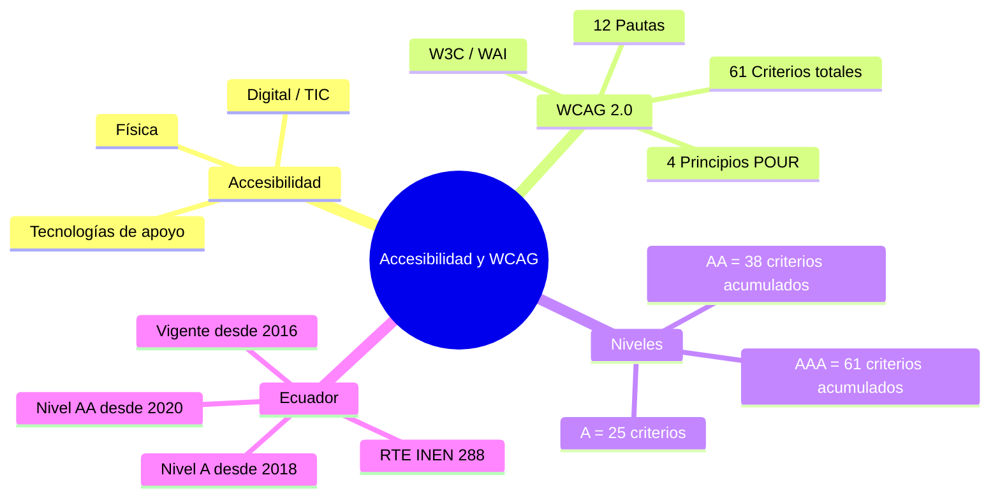

---
{"dg-publish":true,"permalink":"/universidad/2do-semestre/computacion-y-sociedad/unidad-2-implicaciones-sociales/02-accesibilidad-y-wcag/","dg-note-properties":{}}
---


# ♿ Accesibilidad y WCAG

## 🎯 Introducción

> [!info] 💡 ¿Qué es la Accesibilidad?
> 
> La **accesibilidad** es la posibilidad que tengan todas las personas _sin_ que medien **exclusiones de ningún tipo**, como ser culturales, físicas o técnicas, para acceder a un servicio o llegar a visitar un lugar o utilizar un objeto.
> 
> ```mermaid
> graph TD
>     A[Accesibilidad] --> B[Física]
>     A --> C[Digital / TIC]
>     B --> B1[Rampas para sillas de ruedas]
>     B --> B2[Baños adaptados]
>     C --> C1[WCAG]
>     C --> C2[Tecnologías de apoyo]
>     C2 --> D1[Teclados Braille]
>     C2 --> D2[Magnificadores de pantalla]
>     C2 --> D3[Conversores texto-voz]
>     C2 --> D4[Conversores voz-texto]
>     C2 --> D5[Pantallas adaptadas]
> 
>     style B fill:#e1f5ff
>     style C fill:#e1ffe1
>     style C2 fill:#fff4e1
> ```

---

## 📖 Tecnologías de Apoyo

> [!note] 🖥️ Herramientas para personas con necesidades especiales
> 
> Aplicadas a tecnologías de la información:
> 
> |Tecnología|Descripción|
> |---|---|
> |**Teclados Braille**|Para personas con discapacidad visual|
> |**Magnificadores de pantalla**|Amplifican el contenido en pantalla|
> |**Asistentes personales**|Ayudan a operar el dispositivo por voz o gestos|
> |**Conversores texto a voz**|Leen en voz alta el contenido digital|
> |**Conversores voz a texto**|Dictan texto para personas con movilidad reducida|
> |**Pantallas adaptadas**|Interfaces ajustadas a distintas discapacidades|

---

## 📜 WCAG — Web Content Accessibility Guidelines

> [!note] 📋 ¿Qué es WCAG?
> 
> Las **WCAG** (Web Content Accessibility Guidelines — Pautas de Accesibilidad para el Contenido Web) son las directrices de accesibilidad para el contenido web del **W3C** (World Wide Web Consortium), desarrolladas por su iniciativa **WAI** (Web Accessibility Initiative).
> 
> Establecen los **requisitos de accesibilidad que debe cumplir el contenido web** para que pueda ser utilizado por todas las personas, con o sin discapacidad, de forma autónoma o mediante productos de apoyo tecnológico.
> 
> 🔗 https://www.w3.org/TR/WCAG20/

> [!tip] 🕰️ Versiones de WCAG
> 
> WCAG ha evolucionado en varias versiones. El material del curso y el reglamento ecuatoriano se basan específicamente en **WCAG 2.0**.
> 
> |Versión|Publicación|Pautas|Criterios totales|Novedad principal|
> |---|---|---|---|---|
> |**WCAG 2.0**|11 dic. 2008|12|61|Base utilizada por Ecuador (norma NTE INEN-ISO/IEC 40500)|
> |**WCAG 2.1**|5 jun. 2018|13 (+1)|78 (+17)|Móviles, baja visión, discapacidad cognitiva|
> |**WCAG 2.2**|5 oct. 2023|13|87 (+9, -1 obsoleto)|Foco visible, tamaño de objetivos táctiles|
> 
> > 📌 Las versiones son **retrocompatibles**: cumplir WCAG 2.2 implica cumplir automáticamente 2.1 y 2.0. Por eso, aunque existan versiones más nuevas, el contenido de esta nota se centra en **WCAG 2.0**, que es el estándar exigido legalmente en Ecuador.

> [!important] 🌐 El acrónimo POUR
> 
> En inglés, los 4 principios de WCAG forman el acrónimo **POUR**:
>
> |Inglés|Español|Pregunta que responde|
> |---|---|---|
> |**P**erceivable|Perceptible|¿Puede el usuario percibir el contenido?|
> |**O**perable|Operable|¿Puede el usuario interactuar con el contenido?|
> |**U**nderstandable|Comprensible|¿Puede el usuario entender el contenido y su funcionamiento?|
> |**R**obust|Robusto|¿Funciona el contenido en distintos navegadores y tecnologías de apoyo, presentes y futuras?|

> [!note] 🏆 Niveles de conformidad WCAG
> 
> WCAG define tres niveles de conformidad que indican qué tan accesible es un sitio web. Cada nivel es **acumulativo**: para alcanzar AA hay que cumplir también todos los criterios de A.
> 
> |Nivel|Nombre|Criterios (WCAG 2.0)|Significado|
> |---|---|---|---|
> |**A**|Mínimo|**25** criterios|Requisitos básicos sin los cuales algunos usuarios no pueden acceder al contenido en absoluto|
> |**AA**|Intermedio|25 + **13** = **38** criterios|Elimina las barreras de acceso más significativas — es el nivel exigido por la mayoría de legislaciones, incluyendo Ecuador|
> |**AAA**|Óptimo|38 + **23** = **61** criterios|El mayor nivel de accesibilidad posible; el propio W3C reconoce que no siempre es alcanzable para todo tipo de contenido|
> 
> > 💡 Un sitio que cumple nivel **AA** también cumple automáticamente el nivel **A**. Cada nivel es acumulativo, no alternativo.

---

## 🧱 Estructura General: 4 Principios y 12 Pautas

> [!important] 🧱 La jerarquía completa de WCAG 2.0
> 
> WCAG 2.0 se organiza en una jerarquía de 4 niveles: **Principios → Pautas → Criterios de Conformidad → Técnicas**.
> 
> ```mermaid
> graph TD
>     W["WCAG 2.0<br/>4 Principios"] --> P1["1: Perceptible<br/>(4 pautas, 9 criterios AA)"]
>     W --> P2["2: Operable<br/>(4 pautas, 9 criterios AA)"]
>     W --> P3["3: Comprensible<br/>(3 pautas, 5 criterios AA)"]
>     W --> P4["4: Robusto<br/>(1 pauta, 2 criterios AA)"]
> 
>     P1 --> P1a["1.1 Alternativas de texto"]
>     P1 --> P1b["1.2 Multimedia tempodependiente"]
>     P1 --> P1c["1.3 Adaptable"]
>     P1 --> P1d["1.4 Distinguible"]
> 
>     P2 --> P2a["2.1 Accesible por teclado"]
>     P2 --> P2b["2.2 Tiempo suficiente"]
>     P2 --> P2c["2.3 Sin convulsiones"]
>     P2 --> P2d["2.4 Navegable"]
> 
>     P3 --> P3a["3.1 Legible"]
>     P3 --> P3b["3.2 Predecible"]
>     P3 --> P3c["3.3 Asistencia de entrada"]
> 
>     P4 --> P4a["4.1 Compatible"]
> 
>     style W fill:#e1f5ff
>     style P1 fill:#e1ffe1
>     style P2 fill:#fff4e1
>     style P3 fill:#ffe1f5
>     style P4 fill:#f5e1ff
> ```
>
> > 📌 **25 criterios de Nivel A** se distribuyen así entre los 4 principios: Perceptible (9), Operable (9), Comprensible (5), Robusto (2).

---

## 👁️ Principio 1 — Perceptible

> [!note] 👁️ La información debe poder percibirse
> 
> La información y los componentes de la interfaz deben presentarse de forma que los usuarios puedan **percibirlos** — ningún contenido debe ser invisible para todos sus sentidos.
> 
> |Pauta|Descripción|
> |---|---|
> |**1.1 Alternativas de texto**|Todo contenido no textual (imágenes, íconos, gráficos) debe tener una alternativa en texto que describa su función o significado, de modo que pueda convertirse a otros formatos como letra grande, braille, voz o símbolos|
> |**1.2 Multimedia tempodependiente**|El contenido de audio y video debe tener alternativas: **subtítulos** para el audio, **audiodescripción** para el video, y **transcripciones** para contenido solo-audio o solo-video. Incluye también versiones en directo (subtítulos en vivo) en niveles superiores|
> |**1.3 Adaptable**|El contenido debe poder presentarse de distintas formas (por ejemplo, con un lector de pantalla, o en una disposición más simple) sin perder información, estructura ni relaciones lógicas entre elementos|
> |**1.4 Distinguible**|Debe ser fácil ver y escuchar el contenido — contraste suficiente (mínimo **4.5:1** para texto normal), texto redimensionable hasta el 200%, audio controlable, y el color no debe ser el único medio para transmitir información|
> 
> > 💡 **Detalle clave de 1.4:** el criterio de contraste mínimo (4.5:1) es uno de los más auditados en la práctica — herramientas como WebAIM Contrast Checker lo verifican automáticamente.

---

## ⌨️ Principio 2 — Operable

> [!note] ⌨️ La interfaz debe poder operarse
> 
> Los componentes de la interfaz y la navegación deben ser **operables** — los usuarios deben poder interactuar con la página, sin importar qué dispositivo de entrada usen.
> 
> |Pauta|Descripción|
> |---|---|
> |**2.1 Accesible por teclado**|Toda funcionalidad debe poder usarse con solo el teclado, sin requerir mouse — esencial para personas con discapacidad motriz. Tampoco debe existir una "trampa de teclado" de la que el usuario no pueda salir|
> |**2.2 Tiempo suficiente**|Los usuarios deben tener tiempo suficiente para leer y usar el contenido; los límites de tiempo deben poder ajustarse, extenderse o desactivarse (excepto en eventos en tiempo real)|
> |**2.3 Sin convulsiones**|El contenido no debe destellar más de **3 veces por segundo**, para evitar ataques en personas con epilepsia fotosensible|
> |**2.4 Navegable**|El sitio debe proporcionar formas de ayudar a los usuarios a navegar, encontrar contenido y saber dónde se encuentran: títulos de página descriptivos, encabezados y etiquetas claras, orden de foco lógico, propósito de los enlaces identificable por su texto, y foco visible al navegar con teclado|
> 
> > 📌 **Dato del PDF original:** 2.3 en WCAG 2.0 solo cubre "sin convulsiones"; WCAG 2.1 amplía esta pauta agregando también "ni reacciones físicas" (mareo por movimiento en animaciones).

---

## 💡 Principio 3 — Comprensible

> [!note] 💡 El contenido debe poder entenderse
> 
> La información y la operación de la interfaz deben ser **comprensibles** — los usuarios deben poder entender tanto el contenido como cómo funciona la página.
> 
> |Pauta|Descripción|
> |---|---|
> |**3.1 Legible**|El texto debe ser legible y comprensible — el idioma de la página debe estar identificado en el código (`lang="es"`) para que los lectores de pantalla lo pronuncien correctamente|
> |**3.2 Predecible**|Las páginas deben aparecer y funcionar de manera predecible — sin cambios inesperados de contexto al recibir foco o al ingresar datos; los menús de navegación deben mantener un orden consistente entre páginas|
> |**3.3 Asistencia en la entrada**|Los formularios deben ayudar a los usuarios a evitar y corregir errores — con etiquetas claras, instrucciones, identificación automática de errores y mensajes de error descriptivos. En niveles superiores se exige incluso prevención de errores en procesos legales o financieros|

---

## 🔧 Principio 4 — Robusto

> [!note] 🔧 El contenido debe ser compatible a futuro
> 
> El contenido debe ser lo suficientemente **robusto** para ser interpretado de forma fiable por una amplia variedad de agentes de usuario, incluyendo tecnologías de apoyo presentes y **futuras**.
> 
> |Pauta|Criterio|Descripción|
> |---|---|---|
> |**4.1 Compatible**|**4.1.1 Procesamiento**|El código HTML debe ser válido y bien estructurado: etiquetas completas, anidamiento correcto, sin IDs duplicados — para que los lectores de pantalla puedan interpretarlo correctamente|
> |**4.1 Compatible**|**4.1.2 Nombre, función, valor**|Para todo componente de interfaz (formularios, enlaces, elementos generados por scripts), el **nombre** y la **función** deben poder determinarse por software, y los cambios de estado deben notificarse a las tecnologías de apoyo|
> 
> > ⚠️ **Nota de actualización:** el criterio 4.1.1 (Procesamiento) fue declarado **obsoleto en WCAG 2.2** (2023), ya que los navegadores y lectores de pantalla modernos ya no dependen de un análisis estricto del HTML para funcionar correctamente. Sigue vigente en WCAG 2.0, que es la versión normada en Ecuador.

---

## 📋 Criterios Específicos del PDF (WCAG 2.0)

> [!note] 📋 Criterios concretos mencionados en el material del curso
> 
> Estos son los criterios concretos mencionados en el material del curso — todos pertenecen al **Principio 1 (Perceptible)**:
> 
> |Criterio|Nivel|Descripción|
> |---|---|---|
> |**Solo audio / Solo video (pregrabado)**|A|El contenido de solo audio o solo video debe tener una alternativa textual equivalente, como una transcripción|
> |**Subtítulos (pregrabado)**|A|Todo audio sincronizado con video debe incluir subtítulos que describan el diálogo y los sonidos relevantes|
> |**Audiodescripción o alternativa textual (pregrabado)**|A|El video debe ofrecer audiodescripción o alternativa en texto que explique lo que ocurre visualmente|
> |**Cambio de tamaño de texto**|AA|El texto debe poder redimensionarse hasta el 200% sin perder contenido ni funcionalidad|
> |**Etiquetas e instrucciones**|A|Los formularios deben tener etiquetas claras para que los usuarios entiendan qué se espera que ingresen|

---

## 🇪🇨 Marco Legal en Ecuador

> [!warning] ⚖️ Reglamento Técnico Ecuatoriano RTE INEN 288
> 
> Ecuador adoptó las **WCAG 2.0** como su estándar oficial de accesibilidad web, a través de un proceso en dos etapas:
> 
> |Fecha|Hito|
> |---|---|
> |**28 de enero de 2014**|Se publica en el **Registro Oficial Nº 171** la norma **NTE INEN-ISO/IEC 40500**, traducción idéntica de WCAG 2.0 (equivalente al estándar internacional ISO/IEC 40500:2012)|
> |**10 de febrero de 2016**|El Servicio Ecuatoriano de Normalización publica el **Reglamento Técnico Ecuatoriano RTE INEN 288** — "Accesibilidad para el contenido web"|
> |**8 de agosto de 2016**|El reglamento **entra en vigencia** (180 días calendario después de su promulgación)|
> |**8 de agosto de 2018**|Plazo límite: todos los sitios web ecuatorianos que presten un **servicio público** deben ser accesibles bajo **WCAG 2.0 nivel A** (2 años de plazo desde la vigencia)|
> |**8 de agosto de 2020**|Plazo límite: todos los sitios web ecuatorianos que presten un **servicio público** deben ser accesibles bajo **WCAG 2.0 nivel AA** (4 años de plazo desde la vigencia)|
> 
> 🔗 http://accesibilidadweb.dlsi.ua.es/?menu=ecuador

> [!info] 📐 Alcance y mecanismo de cumplimiento
> 
> - **Aplica a:** contenidos web publicados en sitios del **sector público y privado** que presten servicios públicos.
> - **No aplica a:** el software utilizado para *acceder* al contenido web (aplicaciones de usuario, como navegadores), ni al software usado para *generar* dicho contenido (herramientas de autor, como editores web).
> - **Demostración de cumplimiento:** mediante un **certificado de conformidad de primera parte**, que debe colocarse visiblemente en el propio sitio web.
> 
> > 📌 Hasta la fecha, Ecuador **no ha actualizado** su normativa a WCAG 2.1 o 2.2 — el estándar legal vigente sigue siendo **WCAG 2.0 nivel AA**, a diferencia de la Unión Europea, que ya exige WCAG 2.1 mediante la norma EN 301 549.

---

## ❓ Reflexión

> [!question] 🤔 ¿Qué pasa con personas con necesidades especiales?
> 
> En el contexto digital, muchas personas quedan excluidas si los sistemas no están diseñados de forma accesible:
> 
> - Personas con discapacidad visual que no pueden leer pantallas sin lector
> - Personas con discapacidad motriz que no pueden usar un teclado convencional
> - Personas sordas que no pueden consumir contenido de audio sin subtítulos
> 
> La accesibilidad no es opcional — en Ecuador, **es un requisito legal** para servicios públicos digitales, respaldado por el RTE INEN 288 desde 2016.

---

## 📊 Resumen Visual



---

## 📚 Referencias

> [!quote] 📖 Fuentes consultadas
>
> [1] World Wide Web Consortium (W3C). "Web Content Accessibility Guidelines (WCAG) 2.0". Recuperado de https://www.w3.org/TR/WCAG20/
>
> [2] World Wide Web Consortium (W3C) / WAI. "Sumario de WCAG 2". Recuperado de https://www.w3.org/WAI/standards-guidelines/wcag/es
>
> [3] Servicio Ecuatoriano de Normalización (INEN). Reglamento Técnico Ecuatoriano RTE INEN 288 "Accesibilidad para el contenido web" (2016).
>
> [4] Universidad de Alicante. "Ecuador — Accesibilidad Web". Recuperado de http://accesibilidadweb.dlsi.ua.es/?menu=ecuador
>
> [5] Presentación del curso "Computación y Sociedad", Unidad 2, ESPOL — FESD, EYAG1037.

---

**Tags:** #computacion-y-sociedad #unidad2 #accesibilidad #WCAG #WCAG2.0 #W3C #WAI #POUR #discapacidad #RTE-INEN-288 #implicaciones-sociales #ESPOL
