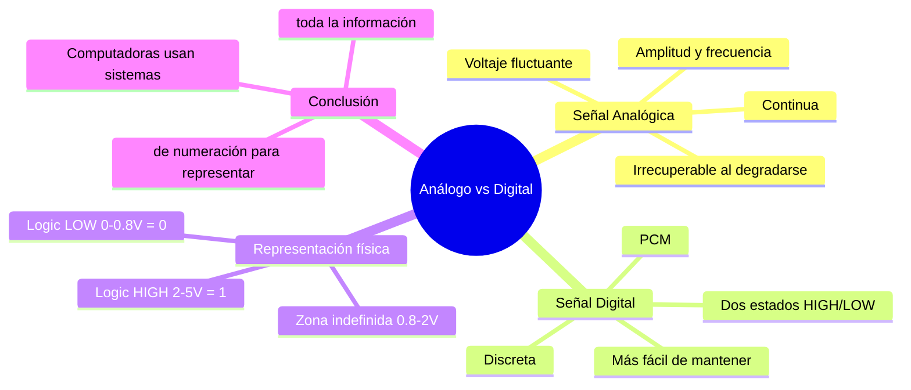

---
{"dg-publish":true,"permalink":"/universidad/2do-semestre/computacion-y-sociedad/unidad-3-representacion-de-la-informacion/i-sistemas-de-numeracion/01-analogo-vs-digital/","dg-note-properties":{}}
---

# 📡 Análogo vs Digital — La Información como Señal

## 🎯 Introducción

> [!info] 💡 ¿Cómo "ve" una computadora la información?
>
> Antes de hablar de sistemas numéricos hay que resolver una pregunta previa: las computadoras manejan texto, números, imágenes, audio y video, pero **¿cómo representan físicamente** toda esa información? La respuesta es que **toda información viaja como una señal eléctrica**, y existen dos formas fundamentalmente distintas de codificar esa señal: **analógica** y **digital**.
>
> ```mermaid
> graph TD
>     A[Información] --> B[Señal Eléctrica]
>     B --> C[Analógica<br/>Continua]
>     B --> D[Digital<br/>Discreta]
>     C --> C1[Voltaje fluctúa<br/>suavemente]
>     D --> D1[Solo 2 estados:<br/>HIGH / LOW]
>
>     style B fill:#e1f5ff
>     style C fill:#ffe1e1
>     style D fill:#e1ffe1
>     style C1 fill:#ffe1e1
>     style D1 fill:#e1ffe1
> ```
>
> |Tipo de señal|Naturaleza|Ejemplo físico|
> |---|---|---|
> |**Analógica**|Continua|Onda de sonido, voltaje variable|
> |**Digital**|Discreta|Pulsos de 0V / 5V|

---

## 🌊 La Señal Analógica

> [!note] 🌊 Comportamiento continuo
>
> Una **señal analógica** fluctúa **continuamente** en voltaje (amplitud) a lo largo del tiempo, igual que una onda senoidal. Se mide en términos de **amplitud** (ancho de onda) y **frecuencia** (MHz).
>
> No existen "saltos" — en cualquier instante de tiempo la señal puede tomar **cualquier valor** dentro de un rango continuo, lo que la hace capaz de representar matices muy finos (como el volumen exacto de un sonido), pero también la hace **frágil**.
>
> > 📌 Toda señal eléctrica se degrada al recorrer un medio de transmisión (cable, aire, etc.). En el caso analógico, esa degradación es **irrecuperable**: una vez que el ruido se mezcla con la señal continua, no hay forma de distinguir cuál era la información original y cuál es el ruido.

---

## 🔲 La Señal Digital

> [!note] 🔲 Comportamiento discreto
>
> Una **señal digital** solo tiene **dos estados posibles** — alto o bajo — y salta **bruscamente** entre ambos extremos, sin pasar por valores intermedios de forma sostenida. Este comportamiento de salto abrupto entre dos niveles se conoce como **modulación de código de pulso (PCM)**.
>
> Estos dos estados se representan con los **dígitos binarios**: `1` (estado alto) y `0` (estado bajo).
>
> > 💡 **Ventaja clave:** si la señal digital se degrada un poco en el camino, el receptor solo necesita decidir "¿esto está más cerca de alto o de bajo?" — una decisión binaria mucho más robusta al ruido que intentar reconstruir una curva continua exacta.

> [!tip] ⚙️ Por qué la electrónica prefiere lo digital
>
> Las señales electrónicas son **mucho más fáciles de mantener** si solo transfieren datos binarios. Esto se debe a tres factores combinados:
>
> | Factor | Analógico | Digital |
> |---|---|---|
> | **Degradación** | Irrecuperable | Regenerable (solo hay que distinguir 2 estados) |
> | **Ruido** | Se mezcla con la señal útil | Tolerable hasta cierto umbral |
> | **Procesamiento** | Requiere circuitos lineales complejos | Compatible con lógica binaria simple |


---

## ⚡ Representación física: niveles de voltaje

> [!note] ⚡ Cómo se traduce un bit a voltaje
>
> Una computadora no almacena literalmente un "1" o un "0" — almacena un **nivel de voltaje**, y ese voltaje se interpreta como bit según el rango en el que caiga:
>
> ```mermaid
> graph TD
>     A["+5 V"] --> B["Logic HIGH<br/>(Binary 1)"]
>     B --> C["+2 V"]
>     C --> D["Zona Indefinida<br/>(no garantizada)"]
>     D --> E["+0.8 V"]
>     E --> F["Logic LOW<br/>(Binary 0)"]
>     F --> G["0 V"]
>
>     style B fill:#e1ffe1
>     style D fill:#fff4e1
>     style F fill:#ffe1e1
> ```
>
> |Rango de voltaje|Estado lógico|Bit|
> |---|---|---|
> |$+2\text{ V}$ a $+5\text{ V}$|Logic **HIGH**|Binary **1**|
> |$+0.8\text{ V}$ a $+2\text{ V}$|**Undefined**|—|
> |$0\text{ V}$ a $+0.8\text{ V}$|Logic **LOW**|Binary **0**|
>
> > 📌 La "zona indefinida" entre 0.8V y 2V existe porque el sistema no puede garantizar una lectura confiable de 0 o 1 en ese rango — los circuitos digitales están diseñados para operar firmemente fuera de esa franja, evitando ambigüedad en la lectura.

> [!example] ✏️ Leyendo una secuencia de pulsos
>
> Una señal digital en el tiempo, con voltaje saltando entre 0V y 5V, se traduce directamente en una cadena de bits:
>
> | Voltaje | 0 | 5 | 0 | 5 | 5 | 0 | 0 | 5 | 0 |
> |---|---|---|---|---|---|---|---|---|---|
> | **Bit** | 0 | 1 | 0 | 1 | 1 | 0 | 0 | 1 | 0 |
>
> Cada transición de voltaje es un pulso, y la secuencia completa de pulsos en el tiempo **es** el dato binario.

---

## 📊 Comparación General

> [!success] 📊 Analógico vs Digital — Resumen
>
> |Propiedad|Analógico|Digital|
> |---|---|---|
> |**Naturaleza**|Continua|Discreta|
> |**Valores posibles**|Infinitos dentro de un rango|Solo 2 (HIGH / LOW)|
> |**Degradación**|Irrecuperable|Regenerable|
> |**Codificación**|Amplitud / frecuencia|Dígitos binarios (0, 1)|
> |**Mecanismo de salto**|N/A (continuo)|Modulación de código de pulso (PCM)|
> |**Uso en computación**|Limitado (sensores, audio crudo)|Universal — base de todo sistema digital|

---

## 📊 Resumen Visual



---

## 📚 Referencias

> [!quote] 📖 Fuentes consultadas
>
> [1] Presentación "Computación y Sociedad — Representación de la información en los sistemas computacionales", Unidad 4 del material (clasificada internamente como Unidad 3 en este vault). Guayaquil, Ecuador: ESPOL — FESD, EYAG1037, 2026.

---

**Tags:** #analogoVsDigital #señalAnaloga #señalDigital #PCM #binario #logicHIGH #logicLOW #representacionInformacion #EYAG1037 #FESD #ESPOL #Unidad3
