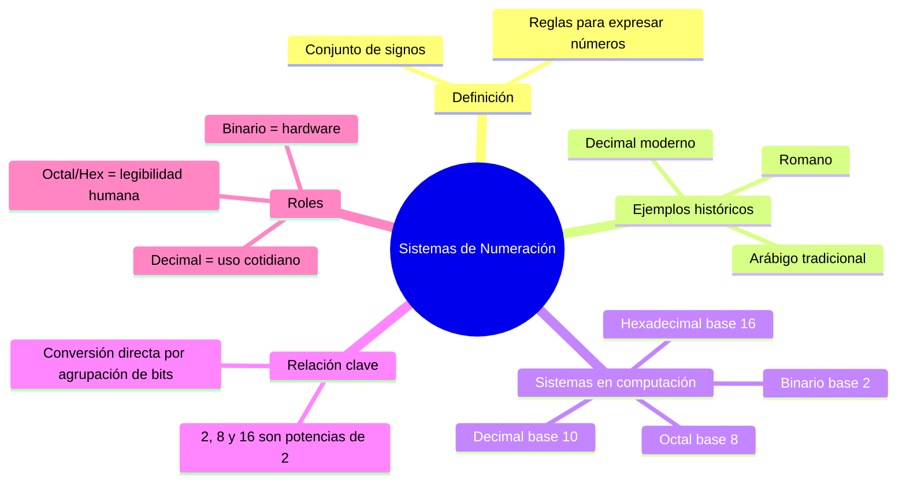

---
{"dg-publish":true,"permalink":"/universidad/2do-semestre/computacion-y-sociedad/unidad-3-representacion-de-la-informacion/i-sistemas-de-numeracion/02-sistemas-de-numeracion-introduccion/","dg-note-properties":{}}
---

# 🔢 Sistemas de Numeración — Introducción

## 🎯 Introducción

> [!info] 💡 ¿Qué es un sistema numérico?
>
> Un **sistema de numeración** define un conjunto de **signos** (símbolos) y **reglas** para expresar números. No es la única forma posible de representar cantidades — a lo largo de la historia han existido sistemas muy distintos entre sí, cada uno con sus propios símbolos y convenciones de combinación.
>
> ```mermaid
> graph TD
>     A[Sistema de Numeración] --> B[Conjunto de signos]
>     A --> C[Reglas de combinación]
>     B --> D["Ej: 0,1,2...9 / I,V,X... / A-F"]
>     C --> E["Ej: notación posicional"]
>
>     style A fill:#e1f5ff
>     style B fill:#e1ffe1
>     style C fill:#fff4e1
> ```

---

## 🏛️ Ejemplos Históricos

> [!note] 🏛️ Distintos sistemas, distintas épocas
>
> |Sistema|Símbolos|Característica|
> |---|---|---|
> |**Romano**|I, V, X, L, C, D, M|No es posicional puro; usa suma y resta de símbolos (1, 5, 10, 50, 100, 500, 1000)|
> |**Arábigo tradicional**|٠ ١ ٢ ٣ ٤ ٥ ٦ ٧ ٨ ٩|Sistema posicional con símbolos propios (sifr, waahid, eeth-nayn...)|
> |**Decimal moderno (arábigo adoptado)**|0,1,2,3,4,5,6,7,8,9|El que usamos cotidianamente; heredado y adaptado del sistema árabe|
>
> > 📌 Curiosamente, el sistema que llamamos "arábigo" en Occidente (0-9) ya tiene una grafía distinta a los símbolos del sistema arábigo tradicional — ambos comparten el mismo principio posicional en base 10, pero no los mismos símbolos.


---

## 💻 Los Cuatro Sistemas Relevantes en Computación

> [!tip] 💻 Binario, Octal, Decimal y Hexadecimal
>
> En el mundo de la computación, prácticamente todo el trabajo de representación numérica gira en torno a **cuatro sistemas**:
>
> ```mermaid
> graph LR
>     A[Sistemas en Computación] --> B[Binario<br/>Base 2]
>     A --> C[Octal<br/>Base 8]
>     A --> D[Decimal<br/>Base 10]
>     A --> E[Hexadecimal<br/>Base 16]
>
>     style B fill:#e1ffe1
>     style C fill:#fff4e1
>     style D fill:#e1f5ff
>     style E fill:#ffe1e1
> ```
>
> |Sistema|Base|Dígitos disponibles|
> |---|---|---|
> |**Binario**|2|0, 1|
> |**Octal**|8|0, 1, 2, 3, 4, 5, 6, 7|
> |**Decimal**|10|0, 1, 2, 3, 4, 5, 6, 7, 8, 9|
> |**Hexadecimal**|16|0-9, A, B, C, D, E, F|

---

## 🔗 La Relación Clave: Potencias de 2

> [!warning] 🔗 Por qué estas bases y no otras
>
> No es casualidad que binario (2), octal (8) y hexadecimal (16) sean todas **potencias de 2**:
>
> $$2 = 2^1 \qquad 8 = 2^3 \qquad 16 = 2^4$$
>
> Esta relación permite convertir directamente entre binario, octal y hexadecimal **agrupando bits**, sin necesidad de pasar por decimal en el proceso intermedio. Es la base de las técnicas de conversión rápida que se ven en las notas de Sistema Octal y Sistema Hexadecimal.
>
> |Sistema|Bits que agrupa|Relación|
> |---|---|---|
> |Octal|3 bits|1 dígito octal = 3 bits|
> |Hexadecimal|4 bits|1 dígito hex = 4 bits (1 nibble)|

---

## ⚙️ ¿Por Qué le Importa Esto a una Computadora?

> [!note] ⚙️ El idioma nativo de la máquina
>
> Internamente, una computadora **solo entiende dos estados eléctricos** (alto/bajo voltaje — ver [[Universidad/2do Semestre/Computación y Sociedad/Unidad 3 - Representación de la información/I - Sistemas de Numeración/01 - Análogo vs Digital\|01 - Análogo vs Digital]]), por lo que el sistema **binario** es su idioma nativo de procesamiento.
>
> Sin embargo, el binario es muy largo y poco legible para un humano (ej. `1101011001010100`), así que existen otros sistemas con propósitos complementarios:
>
> |Sistema|Rol principal|
> |---|---|
> |**Binario**|Representación física real dentro del hardware|
> |**Octal / Hexadecimal**|Forma compacta y legible para humanos de grupos de bits|
> |**Decimal**|Sistema cotidiano humano; la máquina debe convertir hacia/desde él para mostrarnos resultados|

---

## 📊 Resumen Visual



---

## 📚 Referencias

> [!quote] 📖 Fuentes consultadas
>
> [1] Presentación "Computación y Sociedad — Representación de la información en los sistemas computacionales", Unidad 4 del material (clasificada internamente como Unidad 3 en este vault). Guayaquil, Ecuador: ESPOL — FESD, EYAG1037, 2026.

---

**Tags:** #sistemaNumerico #binario #octal #decimal #hexadecimal #notacionPosicional #EYAG1037 #FESD #ESPOL #Unidad3
