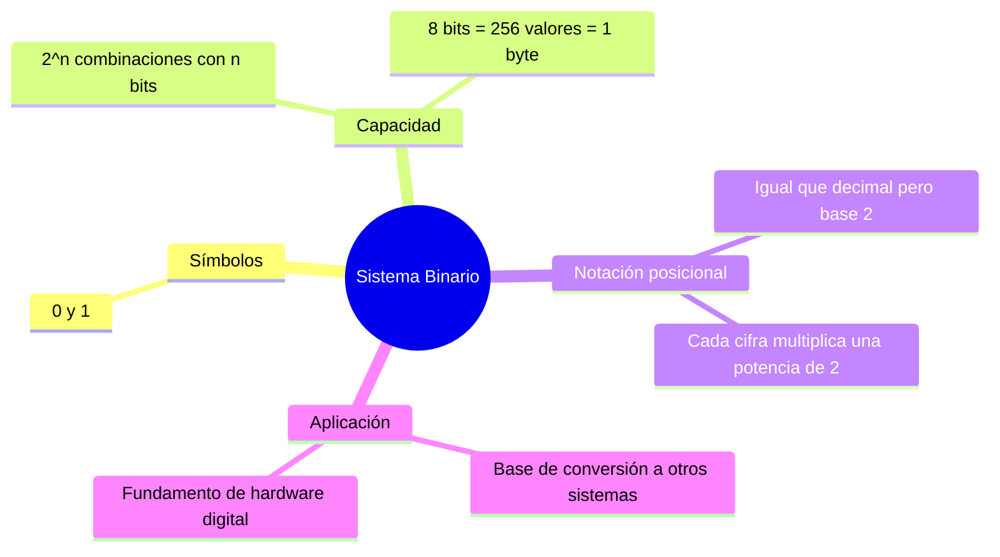

---
{"dg-publish":true,"permalink":"/universidad/2do-semestre/computacion-y-sociedad/unidad-3-representacion-de-la-informacion/i-sistemas-de-numeracion/03-sistema-binario/","dg-note-properties":{}}
---

# 💾 Sistema Binario

## 🎯 Introducción

> [!info] 💡 El sistema de dos símbolos
>
> El sistema binario usa únicamente dos símbolos: **0** y **1**. Es la base de toda la computación moderna porque coincide exactamente con los dos estados físicos que puede distinguir un circuito eléctrico (ver [[Universidad/2do Semestre/Computación y Sociedad/Unidad 3 - Representación de la información/I - Sistemas de Numeración/01 - Análogo vs Digital\|01 - Análogo vs Digital]]): voltaje alto y voltaje bajo.
>
> ```mermaid
> graph LR
>     A[Sistema Binario] --> B[Base 2]
>     A --> C[Símbolos: 0, 1]
>     A --> D[Notación posicional<br/>con potencias de 2]
>
>     style A fill:#e1f5ff
>     style B fill:#e1ffe1
>     style C fill:#fff4e1
> ```


---

## 🧩 Combinaciones Posibles con N Bits

> [!note] 🧩 Cómo crecen las combinaciones
>
> Con *n* bits se pueden representar todas las combinaciones posibles de ceros y unos en esa longitud. La cantidad total de combinaciones distintas sigue la fórmula:
>
> $$\boxed{2^n}$$
>
> |1 Bit|2 Bits|3 Bits|
> |---|---|---|
> |0|00|000|
> |1|01|001|
> ||10|010|
> ||11|011|
> |||100|
> |||101|
> |||110|
> |||111|
>
> > 📌 Con 1 bit hay 2 combinaciones (2¹), con 2 bits hay 4 (2²), con 3 bits hay 8 (2³). El patrón se duplica con cada bit adicional.

---

## 📈 Tabla de Capacidad: 2ⁿ

> [!tip] 📈 Cuántos valores caben en N dígitos
>
> |Dígitos|Valores ($2^n$)|Dígitos|Valores ($2^n$)|Dígitos|Valores ($2^n$)|
> |---|---|---|---|---|---|
> |1|2|5|32|9|512|
> |2|4|6|64|10|1024|
> |3|8|7|128|11|2048|
> |4|16|8|256|12|4096|
>
> > 💡 **Aplicación práctica:** un **byte** (8 bits) puede representar exactamente **256 valores distintos** (de 0 a 255). Esta tabla es la base para entender capacidad de memoria, rangos de direcciones, y tipos de datos en programación.

---

## 🔢 Logaritmos: Encontrando el Número de Bits Necesarios

> [!note] 🔢 La pregunta inversa: "¿Cuántos bits necesito?"
>
> Mientras que la fórmula **2ⁿ** responde "¿cuántos valores caben en n bits?", a veces necesitamos responder lo **opuesto**: dado un número máximo que queremos representar, **¿cuántos bits necesitamos?**
>
> La respuesta usa **logaritmo en base 2**:
>
> $$\boxed{n = \lceil \log_2(N+1) \rceil}$$
>
> donde:
> - **N** es el número máximo que queremos representar
> - **n** es el número mínimo de bits necesarios
> - $\lceil \cdot \rceil$ es el redondeo hacia arriba (función techo)
> - **log₂** es el logaritmo en base 2
>
> #### Ejemplos prácticos:
>
> | Número máximo | Cálculo | Bits necesarios |
> |---|---|---|
> | 255 | log₂(256) = 8 | 8 bits (1 byte) |
> | 1000 | log₂(1001) ≈ 9.97 → ⌈9.97⌉ | 10 bits |
> | 65535 | log₂(65536) = 16 | 16 bits (2 bytes) |
> | 7 | log₂(8) = 3 | 3 bits |
>
> > 📌 **Interpretación:** si quieres representar el número 255, necesitas exactamente 8 bits. Si quieres ir hasta 256, necesitas 9 bits. Cada bit adicional *duplica* la capacidad máxima.
>
> #### Relación inversa:
>
> También puedes calcular el **valor máximo representable** con n bits:
>
> $$\boxed{\text{Máximo} = 2^n - 1}$$
>
> Por ejemplo:
> - 8 bits: máximo = 2⁸ − 1 = **255**
> - 16 bits: máximo = 2¹⁶ − 1 = **65535**
> - 32 bits: máximo = 2³² − 1 = **4294967295**
>
> ```mermaid
> graph LR
>     A["¿Cuántos bits<br/>para N?"] -->|log₂ N| B["Número de bits<br/>n"]
>     B -->|2ⁿ - 1| C["Máximo<br/>representable"]
>     C -->|+1| D["Siguiente potencia<br/>de 2"]
>
>     style A fill:#e1f5ff
>     style B fill:#e1ffe1
>     style C fill:#fff4e1
>     style D fill:#f0e1ff
> ```

---

## 🧮 Notación Posicional

> [!note] 🧮 El mismo principio que el decimal, con otra base
>
> En el sistema **decimal**, cada cifra de un número multiplica una potencia de **10** según su posición:
>
> $$745_{10} = 7\times10^2 + 4\times10^1 + 5\times10^0 = 700+40+5$$
>
> En el sistema **binario**, el mismo principio aplica, pero cada cifra (0 o 1) multiplica una potencia de **2** según su posición:
>
> $$\boxed{\text{valor} = \sum_{i} b_i \times 2^i}$$
>
> donde $b_i$ es cada bit (0 o 1) y $i$ es su posición, comenzando en 0 desde la derecha.
>
> #### El mismo número en diferentes sistemas:
>
> La notación posicional es **universal**. El mismo valor se representa de forma distinta según la base, pero el principio es idéntico. Aquí el **mismo número** en cuatro sistemas numéricos:
>
> |Decimal (base 10)|Binario (base 2)|Octal (base 8)|Hexadecimal (base 16)|
> |---|---|---|---|
> |**5**₁₀|101₂|5₈|5₁₆|
> |**10**₁₀|1010₂|12₈|A₁₆|
> |**15**₁₀|1111₂|17₈|F₁₆|
> |**27**₁₀|11011₂|33₈|1B₁₆|
> |**255**₁₀|11111111₂|377₈|FF₁₆|
>
> #### Cómo se calculan en cada base:
>
> Usando el ejemplo **27₁₀**:
>
> - **Binario:** $27 = 1×2^4 + 1×2^3 + 0×2^2 + 1×2^1 + 1×2^0 = 16 + 8 + 2 + 1 = 11011_2$
> - **Octal:** $27 = 3×8^1 + 3×8^0 = 24 + 3 = 33_8$
> - **Hexadecimal:** $27 = 1×16^1 + 11×16^0 = 16 + 11 = 1B_{16}$ (donde B = 11)
>
> > 📌 **Idea clave:** el binario, octal y hexadecimal no son "otros tipos" de números — son el **mismo concepto posicional** del decimal, solo que con bases distintas (2, 8, 16). La fórmula general es:
> > $$\text{valor}_{base\,10} = \sum_{i=0}^{n-1} d_i \times \text{base}^i$$
> > donde cada dígito $d_i$ multiplica una potencia de la base. Dominar esta equivalencia es la llave para todas las conversiones entre sistemas que se ven en [[Universidad/2do Semestre/Computación y Sociedad/Unidad 3 - Representación de la información/I - Sistemas de Numeración/04 - Conversion Decimal-Binario\|04 - Conversion Decimal-Binario]].

---

## 📊 Resumen Visual



---

## 📚 Referencias

> [!quote] 📖 Fuentes consultadas
>
> [1] Presentación "Computación y Sociedad — Representación de la información en los sistemas computacionales", Unidad 4 del material (clasificada internamente como Unidad 3 en este vault). Guayaquil, Ecuador: ESPOL — FESD, EYAG1037, 2026.

---

**Tags:** #sistemaBinario #base2 #potenciasDe2 #notacionPosicional #byte #bit #EYAG1037 #FESD #ESPOL #Unidad3
