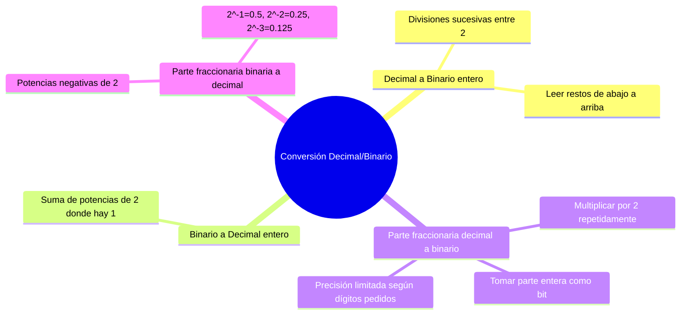

---
{"dg-publish":true,"permalink":"/universidad/2do-semestre/computacion-y-sociedad/unidad-3-representacion-de-la-informacion/i-sistemas-de-numeracion/04-conversion-decimal-binario/","dg-note-properties":{}}
---

# 🔄 Conversión Decimal ↔ Binario

## 🎯 Introducción

> [!info] 💡 Dos direcciones, cuatro casos
>
> Convertir entre decimal y binario tiene **dos direcciones** (decimal→binario y binario→decimal), y cada una se complica un poco cuando el número tiene **parte fraccionaria**. Esta nota cubre los cuatro casos con ejemplos resueltos paso a paso.
>
> ```mermaid
> graph TD
>     A[Conversión Decimal/Binario] --> B[Decimal a Binario]
>     A --> C[Binario a Decimal]
>     B --> B1[Enteros:<br/>divisiones sucesivas ÷2]
>     B --> B2[Fracciones:<br/>multiplicaciones sucesivas ×2]
>     C --> C1[Enteros:<br/>suma de potencias de 2]
>     C --> C2[Fracciones:<br/>potencias negativas de 2]
>
>     style A fill:#e1f5ff
>     style B fill:#e1ffe1
>     style C fill:#fff4e1
> ```

---

## ➗ Decimal a Binario (Números Enteros)

> [!note] ➗ Procedimiento de divisiones sucesivas
>
> | Paso | Acción |
> |---|---|
> | **1** | Dividir el número entre 2 |
> | **2** | Anotar el **cociente** y el **resto** de la operación |
> | **3** | Repetir con el cociente hasta llegar a 0 |
> | **4** | Leer la lista de restos **de abajo hacia arriba** |

> [!example] ✏️ Ejemplo — Convertir 28₁₀ a binario
>
> $$
> \begin{aligned}
> 28 \div 2 &= 14 \quad \text{resto } 0 \\
> 14 \div 2 &= 7 \quad\ \ \text{resto } 0 \\
> 7 \div 2 &= 3 \quad\ \ \text{resto } 1 \\
> 3 \div 2 &= 1 \quad\ \ \text{resto } 1 \\
> 1 \div 2 &= 0 \quad\ \ \text{resto } 1
> \end{aligned}
> $$
>
> Leyendo los restos de abajo hacia arriba: $\boxed{28_{10} = 11100_2}$
>
> > 💡 **Truco mental:** el primer resto obtenido es el bit **menos significativo** (más a la derecha), y el último es el bit **más significativo** (más a la izquierda). Por eso se lee de abajo hacia arriba.

---

## ➕ Binario a Decimal (Números Enteros)

> [!note] ➕ Suma de potencias de 2
>
> Cada bit multiplica la potencia de 2 correspondiente a su posición (empezando en $2^0$ desde la derecha), y se suman todos los productos donde el bit es 1.

> [!example] ✏️ Ejemplo — Convertir 1101011001010100₂ a decimal
>
> Posiciones (de izquierda a derecha, de la 15 a la 0):
>
> ```
> 1  1  0  1  0  1  1  0  0  1  0  1  0  1  0  0
> 15 14 13 12 11 10  9  8  7  6  5  4  3  2  1  0
> ```
>
> Se suman las potencias de 2 donde hay un 1:
>
> $$32768 + 16384 + 4096 + 1024 + 512 + 64 + 16 + 4 = 54868$$
>
> $$\boxed{1101011001010100_2 = 54\,868_{10}}$$


---

## 🔢 Decimal con Fracciones a Binario

> [!warning] 🔢 Parte entera y parte fraccionaria por separado
>
> Cuando el número tiene parte decimal, se procesan **por separado**:
>
> |Parte|Método|
> |---|---|
> |**Entera**|Divisiones sucesivas entre 2 (igual que antes)|
> |**Fraccionaria**|Multiplicaciones sucesivas por 2: en cada paso se toma la **parte entera** del resultado como el siguiente bit, y se continúa con la parte fraccionaria restante|

> [!example] ✏️ Ejemplo — Convertir 42.375₁₀ a binario con 3 dígitos de precisión
>
> **Parte entera (42):**
>
> $$
> \begin{aligned}
> 42 \div 2 &= 21 \quad \text{resto } 0 \\
> 21 \div 2 &= 10 \quad \text{resto } 1 \\
> 10 \div 2 &= 5 \quad\ \ \text{resto } 0 \\
> 5 \div 2 &= 2 \quad\ \ \text{resto } 1 \\
> 2 \div 2 &= 1 \quad\ \ \text{resto } 0 \\
> 1 \div 2 &= 0 \quad\ \ \text{resto } 1
> \end{aligned}
> $$
>
> → $42_{10} = 101010_2$
>
> **Parte fraccionaria (0.375), con 3 dígitos de precisión:**
>
> | Operación | Resultado | Bit |
> |---|---|---|
> | $0.375 \times 2$ | $0.75$ | 0 |
> | $0.75 \times 2$ | $1.50$ | 1 |
> | $0.50 \times 2$ | $1.00$ | 1 |
>
> → $0.375_{10} \approx 0.011_2$
>
> $$\boxed{42.375_{10} = 101010.011_2}$$

> [!danger] ⚠️ Sobre la precisión
>
> No todas las fracciones decimales tienen una representación binaria **exacta y finita** (igual que $1/3$ no tiene representación decimal exacta). Por eso los ejercicios piden una **cantidad específica de dígitos de precisión**: el resultado puede ser una aproximación truncada, no necesariamente exacto.

---

## 🔣 Binario con Fracciones a Decimal

> [!note] 🔣 Potencias negativas de 2
>
> Mismo principio que la conversión entera, pero la parte después del punto usa **potencias negativas de 2**:
>
> $$2^{-1} = 0.5 \qquad 2^{-2} = 0.25 \qquad 2^{-3} = 0.125 \qquad \dots$$

> [!example] ✏️ Ejemplo — Convertir 1100101.110₂ a decimal
>
> $$1\times2^6 + 1\times2^5 + 0\times2^4 + 0\times2^3 + 1\times2^2 + 0\times2^1 + 1\times2^0 + 1\times2^{-1} + 1\times2^{-2} + 0\times2^{-3}$$
>
> $$= 64+32+4+1 + 0.5+0.25 = 100 + 0.5 + 0.25$$
>
> $$\boxed{= 101.75_{10}}$$

---

## 🧪 Ejercicios Propuestos 

> [!example] ✏️ Convertir a binario
>
> - $153.78_{10}$ con precisión de 4 dígitos
> - $294.13_{10}$ con precisión de 4 dígitos
> - $147.21_{10}$ con precisión de 5 dígitos

> [!example] ✏️ Convertir a decimal
>
> - $1111010100.0101001_2$
> - $1101101011.0100111_2$

---

## 📊 Resumen Visual



---

## 📚 Referencias

> [!quote] 📖 Fuentes consultadas
>
> [1] Presentación "Computación y Sociedad — Representación de la información en los sistemas computacionales", Unidad 4 del material (clasificada internamente como Unidad 3 en este vault). Guayaquil, Ecuador: ESPOL — FESD, EYAG1037, 2026.

---

**Tags:** #conversionBinaria #decimalABinario #binarioADecimal #potenciasDe2 #fraccionesBinarias #EYAG1037 #FESD #ESPOL #Unidad3
