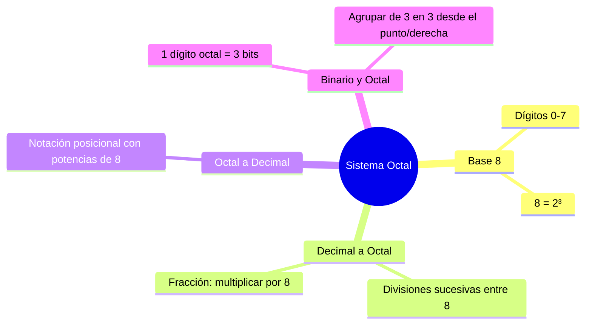

---
{"dg-publish":true,"permalink":"/universidad/2do-semestre/computacion-y-sociedad/unidad-3-representacion-de-la-informacion/i-sistemas-de-numeracion/05-sistema-octal/","dg-note-properties":{}}
---

# 🔷 Sistema Octal

## 🎯 Introducción

> [!info] 💡 El puente de 3 bits
>
> El sistema octal usa base **8**, con dígitos del 0 al 7. Su razón de ser (más allá del decimal) es que $8 = 2^3$, así que **cada dígito octal corresponde exactamente a 3 dígitos binarios**. Esto lo convierte en un "atajo" legible para representar grupos de bits sin pasar por decimal.
>
> ```mermaid
> graph LR
>     A[Sistema Octal] --> B[Base 8]
>     A --> C[Dígitos 0-7]
>     A --> D["8 = 2³"]
>     D --> E[1 dígito octal<br/>= 3 bits]
>
>     style A fill:#e1f5ff
>     style D fill:#fff4e1
>     style E fill:#e1ffe1
> ```


---

## 🗂️ Tabla de Equivalencia: Dígito Octal ↔ 3 Bits

> [!note] 🗂️ La "piedra Rosetta" entre binario y octal
>
> |Dígito octal|$2^2$|$2^1$|$2^0$|Binario|
> |---|---|---|---|---|
> |0|0|0|0|000|
> |1|0|0|1|001|
> |2|0|1|0|010|
> |3|0|1|1|011|
> |4|1|0|0|100|
> |5|1|0|1|101|
> |6|1|1|0|110|
> |7|1|1|1|111|
>
> > 💡 Memorizar (o poder reconstruir rápido) esta tabla es la clave para convertir en ambas direcciones entre binario y octal sin pasar por decimal.


---

## 🔗 Conexión con Lógica Proposicional: Tablas de Verdad

> [!info] 🔗 La misma estructura que en álgebra booleana
>
> Si ya has trabajado con **tablas de verdad** en lógica proposicional (ver [[Universidad/3er Semestre/Matemáticas Discretas/Matemáticas Discretas\|Matemáticas Discretas]]), te resultará familiar esta tabla de equivalencia. No es una coincidencia:
>
> - Una **tabla de verdad con 3 proposiciones** (p, q, r) tiene exactamente **2³ = 8 filas** de todas las combinaciones posibles de verdadero/falso
> - La **tabla de equivalencia octal** tiene exactamente **8 dígitos (0–7)**, porque cada uno se construye con **3 bits** (2³ = 8 combinaciones)
>
> Ambas responden a la **misma fórmula universal:** $2^n$ combinaciones posibles con $n$ unidades binarias.
>
> #### Comparación lado a lado:
>
> |Tabla de Verdad (3 proposiciones)|Tabla Octal (3 bits)|
> |---|---|
> |p \| q \| r \| (resultado) → 2³ = 8 filas|Bit₂ \| Bit₁ \| Bit₀ \| Dígito octal → 2³ = 8 valores|
> |V/F \| V/F \| V/F|1/0 \| 1/0 \| 1/0|
> |**Estructura:** todas las combinaciones exhaustivas|**Estructura:** todas las combinaciones exhaustivas|
>
> > 📌 **Idea transversal:** el principio **2ⁿ** no es exclusivo del sistema octal o binario — es un principio fundamental de **combinatoria** que aparece en lógica proposicional, teoría de conjuntos, y sistemas de numeración. Cuando ves una tabla con potencias de 2, reconoce el patrón subyacente.

---


## ➗ Conversión Decimal → Octal

> [!note] ➗ Mismo método, divisor distinto
>
> Mismo procedimiento que decimal → binario (ver [[Universidad/2do Semestre/Computación y Sociedad/Unidad 3 - Representación de la información/I - Sistemas de Numeración/04 - Conversion Decimal-Binario\|04 - Conversion Decimal-Binario]]), pero dividiendo entre **8** en lugar de 2.

> [!example] ✏️ Ejemplo — Convertir 768₁₀ a octal
>
> $$
> \begin{aligned}
> 768 \div 8 &= 96 \quad \text{resto } 0 \\
> 96 \div 8 &= 12 \quad \text{resto } 0 \\
> 12 \div 8 &= 1 \quad\ \ \text{resto } 4 \\
> 1 \div 8 &= 0 \quad\ \ \text{resto } 1
> \end{aligned}
> $$
>
> Leyendo los restos de abajo hacia arriba: $\boxed{768_{10} = 1400_8}$

> [!example] ✏️ Ejemplo con fracción — Convertir 323.625₁₀ a octal
>
> **Parte entera (323):**
>
> $$
> \begin{aligned}
> 323 \div 8 &= 40 \quad \text{resto } 3 \\
> 40 \div 8 &= 5 \quad\ \ \text{resto } 0 \\
> 5 \div 8 &= 0 \quad\ \ \text{resto } 5
> \end{aligned}
> $$
>
> → $323_{10} = 503_8$
>
> **Parte fraccionaria (0.625):** se multiplica por **8** (en vez de por 2 como en binario):
>
> | Operación | Resultado | Dígito |
> |---|---|---|
> | $0.625 \times 8$ | $5.00$ | 5 |
>
> → $0.625_{10} = 0.5_8$ (exacto, sin necesidad de más iteraciones)
>
> $$\boxed{323.625_{10} = 503.5_8}$$

---

## ➕ Conversión Octal → Decimal

> [!note] ➕ Notación posicional con potencias de 8
>
> Igual que en binario, pero con potencias de 8: $8^0=1$, $8^1=8$, $8^2=64$, $8^3=512$, $8^4=4096$, $8^5=32768$...

> [!example] ✏️ Ejemplo — Convertir 421₈ a decimal
>
> $$4\times8^2 + 2\times8^1 + 1\times8^0 = 256 + 16 + 1$$
>
> $$\boxed{421_8 = 273_{10}}$$

---

## 🔁 Conversión Binario ↔ Octal (Agrupando de 3 en 3)

> [!tip] 🔁 Procedimiento Binario → Octal
>
> | Paso | Acción |
> |---|---|
> | **1** | Agrupar los bits **de 3 en 3**, comenzando desde el punto decimal (o desde la derecha si es entero) |
> | **2** | Rellenar con ceros a la izquierda si el último grupo queda incompleto |
> | **3** | Convertir cada grupo de 3 bits a su dígito octal equivalente (tabla de arriba) |

> [!example] ✏️ Ejemplo — Convertir 001101011011₂ a octal
>
> ```
> 001  101  011  011
>  ↓    ↓    ↓    ↓
>  1    5    3    3
> ```
>
> $$\boxed{001101011011_2 = 1533_8}$$

> [!example] ✏️ Ejemplo inverso — Convertir 2556₈ a binario
>
> Cada dígito octal se expande a sus 3 bits correspondientes:
>
> ```
> 2     5     5     6
> ↓     ↓     ↓     ↓
> 010   101   101   110
> ```
>
> $$\boxed{2556_8 = 010101101110_2}$$

> [!example] ✏️ Ejemplo con decimales — Convertir 101.110₂ a octal
>
> **Parte entera (101):** solo tiene 3 bits, así que no necesita relleno
> ```
> 101
>  ↓
>  5
> ```
>
> **Parte fraccionaria (.110):** solo tiene 3 bits, así que no necesita relleno
> ```
> 110
>  ↓
>  6
> ```
>
> $$\boxed{101.110_2 = 5.6_8}$$
>
> ---
>
> 

> [!example] ✏️ Ejemplo más complejo — Convertir 1011.10101₂ a octal
>
> **Parte entera (1011):** agrupa de 3 en 3 desde la derecha
> ```
> 001  011
>  ↓    ↓
>  1    3
> ```
>
> **Parte fraccionaria (.10101):** agrupa de 3 en 3 desde el punto hacia la derecha. Como sobran bits, **rellena con ceros a la derecha**:
> ```
> 101  010
>  ↓    ↓
>  5    2
> ```
>
> $$\boxed{1011.10101_2 = 13.52_8}$$
>
> > 📌 **Regla clave:** en la parte entera agrupas desde la derecha (hacia la izquierda); en la fraccionaria agrupas desde el punto (hacia la derecha). Rellena con ceros donde sea necesario para completar grupos de 3.


---

## 📊 Resumen Visual



---

## 📚 Referencias

> [!quote] 📖 Fuentes consultadas
>
> [1] Presentación "Computación y Sociedad — Representación de la información en los sistemas computacionales", Unidad 4 del material (clasificada internamente como Unidad 3 en este vault). Guayaquil, Ecuador: ESPOL — FESD, EYAG1037, 2026.

---

**Tags:** #sistemaOctal #base8 #conversionOctal #binarioOctal #EYAG1037 #FESD #ESPOL #Unidad3
