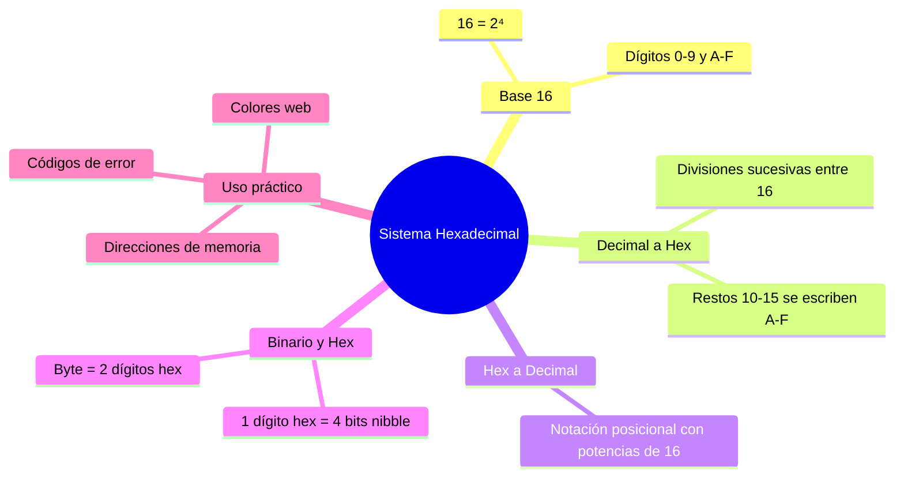

---
{"dg-publish":true,"permalink":"/universidad/2do-semestre/computacion-y-sociedad/unidad-3-representacion-de-la-informacion/i-sistemas-de-numeracion/06-sistema-hexadecimal/","dg-note-properties":{}}
---

# 🔶 Sistema Hexadecimal

## 🎯 Introducción

> [!info] 💡 El puente de 4 bits (un nibble)
>
> El sistema hexadecimal usa base **16**, con 16 símbolos: 0-9 y luego A, B, C, D, E, F para representar los valores 10 a 15. Como $16 = 2^4$, **cada dígito hexadecimal corresponde exactamente a 4 dígitos binarios** — un grupo conocido como **nibble**.
>
> ```mermaid
> graph LR
>     A[Sistema Hexadecimal] --> B[Base 16]
>     A --> C[Dígitos 0-9, A-F]
>     A --> D["16 = 2⁴"]
>     D --> E[1 dígito hex<br/>= 4 bits = 1 nibble]
>
>     style A fill:#e1f5ff
>     style D fill:#fff4e1
>     style E fill:#e1ffe1
> ```

---

## 🗂️ Tabla de Equivalencia: Decimal / Hex / Binario

> [!note] 🗂️ Los 16 símbolos del sistema
>
> |Decimal|Hexadecimal|Binario|
> |---|---|---|
> |0|0|0000|
> |1|1|0001|
> |2|2|0010|
> |3|3|0011|
> |4|4|0100|
> |5|5|0101|
> |6|6|0110|
> |7|7|0111|
> |8|8|1000|
> |9|9|1001|
> |10|**A**|1010|
> |11|**B**|1011|
> |12|**C**|1100|
> |13|**D**|1101|
> |14|**E**|1110|
> |15|**F**|1111|

> [!tip] 💡 Por qué el hexadecimal es tan usado en computación
>
> Con 4 bits se pueden representar $2^4 = 16$ valores distintos — exactamente el rango de un dígito hexadecimal. Esto hace que un **byte** (8 bits) se represente con exactamente **2 dígitos hex**, mucho más compacto y legible que escribir 8 ceros y unos.
>
> > 📌 Por eso colores web (`#FF5733`), direcciones de memoria y códigos de error suelen mostrarse en hexadecimal.

---

## ➗ Conversión Decimal → Hexadecimal

> [!note] ➗ Divisiones sucesivas entre 16
>
> Mismo procedimiento que las conversiones anteriores ([[Universidad/2do Semestre/Computación y Sociedad/Unidad 3 - Representación de la información/I - Sistemas de Numeración/04 - Conversion Decimal-Binario\|04 - Conversion Decimal-Binario]], [[Universidad/2do Semestre/Computación y Sociedad/Unidad 3 - Representación de la información/I - Sistemas de Numeración/05 - Sistema Octal\|05 - Sistema Octal]]), ahora dividiendo entre **16**.

> [!example] ✏️ Ejemplo — Convertir 1957₁₀ a hexadecimal
>
> $$
> \begin{aligned}
> 1957 \div 16 &= 122 \quad \text{resto } 5 \\
> 122 \div 16 &= 7 \quad\ \ \ \text{resto } 10\ (=A) \\
> 7 \div 16 &= 0 \quad\ \ \ \text{resto } 7
> \end{aligned}
> $$
>
> Leyendo los restos de abajo hacia arriba: $\boxed{1957_{10} = 7A5_{16}}$
>
> > ⚠️ **Cuidado con los restos ≥ 10:** cuando el resto de la división es 10, 11, 12, 13, 14 o 15, debe escribirse como **A, B, C, D, E o F** respectivamente — nunca como el número de dos dígitos.

---

## ➕ Conversión Hexadecimal → Decimal

> [!note] ➕ Notación posicional con potencias de 16
>
> Igual que en los demás sistemas, pero con potencias de 16: $16^0=1$, $16^1=16$, $16^2=256$, $16^3=4096$...

> [!example] ✏️ Ejemplo — Convertir 2B6₁₆ a decimal
>
> $$2\times16^2 + 11\times16^1 + 6\times16^0$$
>
> $$= 2\times256 + 11\times16 + 6\times1$$
>
> $$= 512 + 176 + 6$$
>
> $$\boxed{2B6_{16} = 694_{10}}$$
>
> > 📌 Recordar que **B = 11** en decimal, según la tabla de equivalencias de arriba.

---

## 🔁 Conversión Hexadecimal ↔ Binario (Agrupando de 4 en 4)

> [!tip] 🔁 Procedimiento
>
> Cada dígito hexadecimal se traduce directamente a sus 4 bits equivalentes (o viceversa: cada grupo de 4 bits se traduce a un dígito hex), usando la tabla de equivalencia. Igual que con octal, se agrupa desde el punto decimal, o desde la derecha si es un entero.

> [!example] ✏️ Ejemplo — Convertir B6₁₆ a binario
>
> ```
> B      6
> ↓      ↓
> 1011   0110
> ```
>
> $$\boxed{B6_{16} = 10110110_2}$$

> [!example] ✏️ Ejemplo con fracción — Convertir A7.5D₁₆ a binario
>
> ```
> A      7   .   5      D
> ↓      ↓       ↓      ↓
> 1010   0111    0101   1101
> ```
>
> $$\boxed{A7.5D_{16} = 10100111.01011101_2}$$


---

## 🔢 Decimal con Fracciones a Hexadecimal

> [!note] 🔢 Multiplicaciones sucesivas por 16
> 
> Igual que en binario y octal: la parte entera se divide sucesivamente entre 16, y la parte fraccionaria se **multiplica por 16** repetidamente, tomando la parte entera de cada resultado como el siguiente dígito.

> [!example] ✏️ Ejemplo — Convertir 250.025₁₀ a hexadecimal
> 
> **Parte entera (250):**
> 
> $$ \begin{aligned} 250 \div 16 &= 15 \quad \text{resto } 10\ (=A) \ 15 \div 16 &= 0 \quad\ \ \text{resto } 15\ (=F) \end{aligned} $$
> 
> → $250_{10} = FA_{16}$
> 
> **Parte fraccionaria (0.025):**
> 
> |Operación|Resultado|Dígito|
> |---|---|---|
> |$0.025 \times 16$|$0.40$|0|
> |$0.40 \times 16$|$6.40$|6|
> |$0.40 \times 16$|$6.40$|6|
> 
> El proceso se repite infinitamente (período 66):
> 
> $$\boxed{250.025_{10} \approx FA.0\overline{66}_{16}}$$
> 
> > 📌 Cuando multiplicas una fracción por la base, la **parte entera** del resultado es el dígito. En este caso, la parte fraccionaria 0.40 genera un ciclo infinito de 6's. Por eso se escribe con la barra de períodico: $\overline{66}$.

---

## 📊 Comparación General de los 4 Sistemas

> [!success] 📊 Binario, Octal, Decimal y Hexadecimal — Resumen
>
> |Sistema|Base|Dígitos|Bits por dígito|Uso principal|
> |---|---|---|---|---|
> |**Binario**|2|0, 1|1|Representación física en hardware|
> |**Octal**|8|0-7|3|Legibilidad compacta (histórico, sistemas Unix)|
> |**Decimal**|10|0-9|—|Uso cotidiano humano|
> |**Hexadecimal**|16|0-9, A-F|4|Memoria, colores, direcciones, depuración|

---

## 📊 Resumen Visual



---

## 📚 Referencias

> [!quote] 📖 Fuentes consultadas
>
> [1] Presentación "Computación y Sociedad — Representación de la información en los sistemas computacionales", Unidad 4 del material (clasificada internamente como Unidad 3 en este vault). Guayaquil, Ecuador: ESPOL — FESD, EYAG1037, 2026.

---

**Tags:** #sistemaHexadecimal #base16 #nibble #conversionHexadecimal #binarioHex #colorWeb #EYAG1037 #FESD #ESPOL #Unidad3
