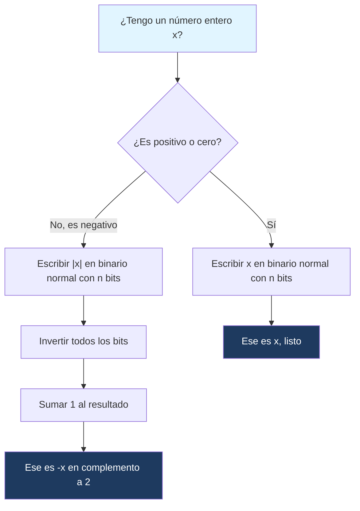

---
{"dg-publish":true,"permalink":"/universidad/2do-semestre/computacion-y-sociedad/unidad-3-representacion-de-la-informacion/i-sistemas-de-numeracion/07-numeros-negativos/","dg-note-properties":{}}
---

# 🔢 Números Negativos en Sistemas Binarios

## 🎯 Introducción

> [!info] 💡 ¿Por qué necesitamos un método especial para los negativos?
> 
> Una computadora solo almacena **0s y 1s** — no existe un símbolo físico para el signo "−" dentro de un circuito digital. Sin embargo, cualquier sistema debe poder sumar $5 - 3$ o representar una temperatura de $-10°C$. Esto llevó a distintos esquemas de codificación a lo largo de la historia de la computación:
> 
> - Las primeras computadoras (años 40-50) experimentaron con **signo-magnitud**, por ser la traducción más directa e intuitiva del sistema decimal con signo.
> - A partir de los años 60, casi todas las arquitecturas migraron a **complemento a 2**, porque simplifica enormemente el diseño del hardware aritmético (un solo circuito suma y resta).
> - Hoy en día, **complemento a 2** es el estándar universal: lo usan procesadores x86, ARM, RISC-V, y prácticamente cualquier lenguaje de programación cuando trabajas con tipos `int` con signo.
> 
> ```mermaid
> graph TD
>     A[Número entero con signo] --> B[Signo-Magnitud]
>     A --> C[Complemento a 2]
>     B --> D[Bit de signo + magnitud separados]
>     C --> E[Codificación unificada]
>     D --> F[Uso histórico / didáctico]
>     E --> G[Estándar en hardware moderno]
>     style A fill:#e1f5ff
>     style C fill:#1e3a5f,color:#fff
>     style G fill:#f5e1ff
> ```

---

## 📋 Fundamentos y Estructura Formal

> [!note] 📋 Definición — Bit de signo
> 
> En ambos sistemas, se reserva el **bit más significativo (MSB)** de la palabra binaria para indicar el signo:
> 
> - $0$ → número **positivo**
> - $1$ → número **negativo**
> 
> Con $n$ bits disponibles, quedan $n-1$ bits para representar la magnitud (en signo-magnitud) o el valor codificado (en complemento a 2).

---

### 🔹 Signo y Magnitud

> [!note] 🔹 Cómo funciona
> 
> El número se divide en dos partes independientes:
> 
> 1. **Bit de signo** (el más a la izquierda).
> 2. **Magnitud** (el valor absoluto del número, en binario normal).
> 
> $$\text{Ejemplo con 8 bits: } +5 = 00000101 \qquad -5 = 10000101$$
> 
> Nota que $+5$ y $-5$ comparten exactamente la misma magnitud (`0000101`); solo cambia el primer bit.

> [!warning]- ⚠️ El problema del "cero doble"
> 
> Signo-magnitud tiene una falla importante: **existen dos representaciones distintas para el cero**.
> 
> $$+0 = 00000000 \qquad -0 = 10000000$$
> 
> Esto complica el hardware (hay que comparar dos patrones de bits distintos para saber si algo es cero) y desperdicia una combinación de bits que podría usarse para representar otro número.

---

### 🔹 Complemento a 2

> [!note] 🔹 Cómo obtener el complemento a 2 de un número
> 
> Para representar $-x$ en complemento a 2, dado $x$ en binario positivo con $n$ bits:
> 
> 1. Escribe $x$ en binario normal (con $n$ bits, rellenando con ceros a la izquierda).
>     
> 2. **Invierte todos los bits** (0→1, 1→0). Esto se llama complemento a 1.
>     
> 3. **Súmale 1** al resultado.
>     
> 
> > [!example]- 🟢 Ejemplo paso a paso: obtener $-5$ en 8 bits
> > 
> > **Paso 1:** $5$ en binario (8 bits) → `00000101`
> > 
> > **Paso 2:** Invertir bits → `11111010`
> > 
> > **Paso 3:** Sumar 1 → `11111011`
> > 
> > Por lo tanto: $-5 = 11111011$ en complemento a 2 (8 bits).

> [!success]- ✅ Principio clave: por qué complemento a 2 es superior
> 
> - **Cero único:** solo existe una representación de $0$ (`00000000`). Si intentas obtener el complemento a 2 de $0$, el resultado vuelve a ser $0$.
> - **Suma y resta con el mismo circuito:** el hardware puede restar simplemente sumando el complemento a 2 del sustraendo — no necesita un circuito separado para resta.
> - **El bit de signo participa en la aritmética:** no hay que "separarlo" como en signo-magnitud, lo que simplifica el diseño del procesador.

> [!tip]- 🖥️ Aplicación práctica en programación
> 
> Cuando declaras `int x = -5;` en C, Java o Python (a bajo nivel), el valor se guarda en memoria en complemento a 2. Esto explica por qué el **overflow** de enteros con signo se comporta de forma predecible: en un `int` de 8 bits, el rango es $-128$ a $127$, y si sumas $127 + 1$, el resultado "da la vuelta" a $-128$ (esto se llama _wraparound_).

---

## 📊 Tabla Comparativa

> [!note] 📊 Signo-Magnitud vs. Complemento a 2
> 
> |Característica|Signo-Magnitud|Complemento a 2|
> |---|---|---|
> |**Bit de signo**|Separado de la magnitud|Integrado en el valor|
> |**Representación del 0**|Dos formas (`+0` y `−0`)|Una sola forma (`00000000`)|
> |**Rango con $n$ bits**|$-(2^{n-1}-1)$ a $+(2^{n-1}-1)$|$-2^{n-1}$ a $+(2^{n-1}-1)$|
> |**Resta**|Requiere lógica adicional|Se resuelve con el mismo sumador|
> |**Uso actual**|Poco común, principalmente didáctico|Estándar en toda la industria|
> |**Ejemplo de $-5$ (8 bits)**|`10000101`|`11111011`|
> 
> > [!tip]- 💡 Nota sobre el rango asimétrico
> > 
> > Fíjate que complemento a 2 puede representar **un número negativo más** que positivos ($-128$ a $127$ con 8 bits, no $-127$ a $127$). Esto ocurre porque no se "desperdicia" ningún patrón de bits en un segundo cero — cada una de las $2^n$ combinaciones representa un número distinto.

---

## 🧭 Diagrama de Decisión — Convertir un número a Complemento a 2



---

## 🧮 Ejemplos Esenciales

> [!example]- 🟢 Ejemplo 1 — Convertir +12 y −12 en 8 bits
> 
> **+12:** $12 = 00001100$
> 
> **−12:**
> 
> 1. $00001100$ (magnitud de 12)
> 2. Invertir → $11110011$
> 3. Sumar 1 → $11110100$
> 
> Resultado: $-12 = 11110100$

> [!example]- 🟢 Ejemplo 2 — Verificar que una suma da 0
> 
> Sumemos $5 + (-5)$ usando las representaciones en complemento a 2 de 8 bits:
> 
> $$00000101 + 11111011 = \underline{1}00000000$$
> 
> El resultado dentro de los 8 bits es `00000000` (el noveno bit "se pierde" por desbordamiento, lo cual es el comportamiento esperado). ✅ Esto confirma que $5 + (-5) = 0$.

> [!example]- 🟢 Ejemplo 3 — Volver de complemento a 2 a decimal
> 
> Dado el número en complemento a 2: `11110110` (8 bits). ¿Qué decimal representa?
> 
> 4. Como el bit de signo es $1$, es negativo.
> 5. Invertir bits: `00001001`
> 6. Sumar 1: `00001010` = $10$ en decimal
> 7. Por lo tanto, el número original es $-10$.

---

## 📝 Ejercicios Progresivos

> [!question] 🟩 Nivel 1 — Básico
> 
> 1. Representa $+9$ en signo-magnitud usando 8 bits.
> 2. Representa $-9$ en signo-magnitud usando 8 bits.
> 3. ¿Cuántas representaciones distintas tiene el número 0 en signo-magnitud?

> [!question] 🟨 Nivel 2 — Intermedio
> 
> 4. Convierte $-20$ a complemento a 2 usando 8 bits (muestra los 3 pasos).
> 5. Dado el número en complemento a 2 `11101001` (8 bits), encuentra su valor decimal.
> 6. ¿Cuál es el rango de valores representables con complemento a 2 usando 4 bits?

> [!question] 🟥 Nivel 3 — Avanzado
> 
> 7. Suma $(-15) + (-10)$ usando complemento a 2 de 8 bits y verifica que el resultado sea correcto.
> 8. Explica por qué $-128$ **no tiene** una representación válida en signo-magnitud de 8 bits, pero sí en complemento a 2 de 8 bits.
> 9. Un programa en C usa un `int` de 8 bits sin verificar límites. Si el valor actual es $127$ y se le suma $1$, ¿qué valor resultará? Explica el fenómeno de _overflow_.

> [!success]- ✅ Respuestas
> 
> **Nivel 1:**
> 
> 10. $+9 = 00001001$
> 11. $-9 = 10001001$
> 12. Dos: `00000000` (+0) y `10000000` (−0)
> 
> **Nivel 2:** 4. $20 = 00010100$ → invertir: $11101011$ → sumar 1: $11101100$. Entonces $-20 = 11101100$. 5. Invertir `11101001` → `00010110`, sumar 1 → `00010111` = 23. Entonces el valor es $-23$. 6. Con 4 bits: $-2^{3}$ a $2^{3}-1$, es decir, $-8$ a $+7$.
> 
> **Nivel 3:** 7. $-15 = 11110001$, $-10 = 11110110$. Suma: $11100111$ (descartando el noveno bit). Convirtiendo de vuelta: invertir → $00011000$, sumar 1 → $00011001 = 25$, entonces el resultado es $-25$. ✅ Correcto, ya que $-15 + (-10) = -25$. 8. En signo-magnitud, el bit de signo y la magnitud son independientes, y con 8 bits la magnitud máxima son 7 bits ($2^7 - 1 = 127$), así que el rango es $-127$ a $+127$. En complemento a 2 no existe una "magnitud separada": el patrón $10000000$ simplemente representa $-128$ por la forma en que se interpreta el valor con signo, aprovechando el espacio que en signo-magnitud se pierde con el cero doble. 9. El resultado será $-128$. Esto ocurre porque $127 = 01111111$, y al sumar 1 se obtiene $10000000$, que en complemento a 2 se interpreta como $-128$ (el valor "da la vuelta" al límite inferior del rango representable).

---

## 🎯 Metas de Aprendizaje

> [!success] ✅ Nivel Básico
> 
> - [ ] Puedo identificar el bit de signo en un número binario.
> - [ ] Puedo representar un número positivo y negativo en signo-magnitud.
> - [ ] Entiendo por qué signo-magnitud tiene dos ceros.

> [!success] ✅ Nivel Intermedio
> 
> - [ ] Puedo convertir un número decimal negativo a complemento a 2 siguiendo los 3 pasos.
> - [ ] Puedo convertir un número en complemento a 2 de vuelta a decimal.
> - [ ] Puedo calcular el rango de valores representables con $n$ bits en complemento a 2.

> [!success] ✅ Nivel Avanzado
> 
> - [ ] Puedo sumar dos números negativos en complemento a 2 y verificar el resultado.
> - [ ] Puedo explicar por qué ocurre el overflow y predecir el resultado de un desbordamiento.
> - [ ] Puedo argumentar por qué el hardware moderno usa complemento a 2 en vez de signo-magnitud.

---

## 📚 Referencias y Conexiones

> [!quote] 📖 Fuentes consultadas
> 
> [1] Material de clase — Unidad 3: Representación de la información, Computación y Sociedad. [2] Patterson, D. & Hennessy, J. _Computer Organization and Design_, capítulo sobre representación de enteros con signo.

> [!quote] 🔗 Conexiones
> 
> - [[Universidad/2do Semestre/Computación y Sociedad/Unidad 3 - Representación de la información/I - Sistemas de Numeración/06 - Sistema Hexadecimal\|06 - Sistema Hexadecimal]] — base para entender la representación compacta de estos valores en binario.
> - [[Universidad/2do Semestre/Computación y Sociedad/Unidad 3 - Representación de la información/I - Sistemas de Numeración/08 - IEEE 754\|08 - IEEE 754]] — el bit de signo aquí es la base conceptual para el signo en punto flotante.

---

**Tags:** #computacion-y-sociedad #representacion-datos #binario #complemento-a-2 #signo-magnitud #unidad3