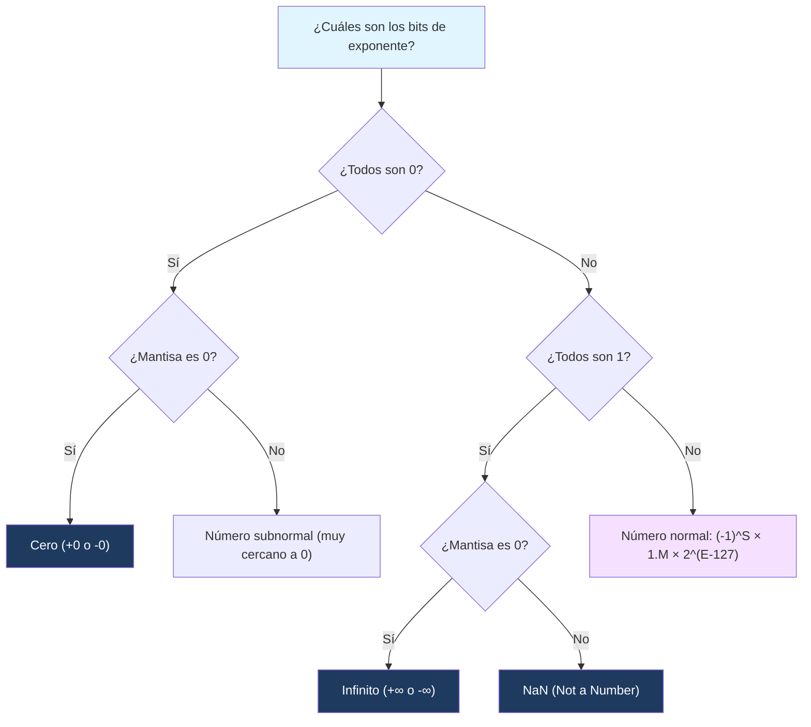

---
{"dg-publish":true,"permalink":"/universidad/2do-semestre/computacion-y-sociedad/unidad-3-representacion-de-la-informacion/i-sistemas-de-numeracion/08-ieee-754/","dg-note-properties":{}}
---

# 🔢 IEEE 754 — Representación de Punto Flotante

## 🎯 Introducción

> [!info] 💡 ¿Por qué no basta con números enteros?
> 
> Complemento a 2 resuelve el problema de los enteros negativos, pero las computadoras también necesitan representar números con decimales: $3.1416$, $0.0001$, o $6.022 \times 10^{23}$. Guardar estos valores de forma directa (como "binario con punto fijo") es ineficiente: o desperdicias precisión en números pequeños, o te quedas sin rango para números muy grandes.
> 
> - En 1985, el **IEEE** (Institute of Electrical and Electronics Engineers) publicó el estándar **IEEE 754**, que unificó la forma en que prácticamente todo el hardware y software representa números reales.
> - Antes de este estándar, cada fabricante de computadoras tenía su propio formato de punto flotante, lo que causaba que el mismo cálculo diera resultados distintos en máquinas distintas.
> - Hoy en día, IEEE 754 es la base de los tipos `float` y `double` en prácticamente todo lenguaje de programación (C, Java, Python, JavaScript).
> 
> ```mermaid
> graph TD
>     A[Número real] --> B[Notación científica en binario]
>     B --> C[Signo]
>     B --> D[Exponente]
>     B --> E[Mantisa / Fracción]
>     C --> F[IEEE 754]
>     D --> F
>     E --> F
>     style A fill:#e1f5ff
>     style F fill:#1e3a5f,color:#fff
> ```

---

> [!info] 📌 Enfoque de esta nota
> 
> En clase se trabajó principalmente con **precisión simple (32 bits)** — es el formato que vas a necesitar dominar a mano para el examen. Esta nota profundiza en precisión simple y deja precisión doble solo como referencia comparativa, ya que en la práctica casi nunca se convierte a mano (son 64 bits, poco práctico para hacerlo sin calculadora).

## 📋 Fundamentos y Estructura Formal

> [!note] 📋 La idea central: notación científica en binario
> 
> Así como en decimal escribimos $6.022 \times 10^{23}$, en binario cualquier número se puede escribir como:
> 
> $$\pm 1.f \times 2^{e}$$
> 
> donde $f$ es la parte fraccionaria (mantisa) y $e$ es el exponente. IEEE 754 divide los bits disponibles en **tres campos** para codificar exactamente esta forma.

> [!note] 📋 Estructura de 32 bits (precisión simple — `float`)
> 
> |Campo|Bits|Posición|
> |---|---|---|
> |**Signo (S)**|1 bit|bit 31|
> |**Exponente (E)**|8 bits|bits 30-23|
> |**Mantisa / Fracción (M)**|23 bits|bits 22-0|
> 
> El valor representado se calcula como:
> 
> $$(-1)^{S} \times 1.M \times 2^{(E - 127)}$$
> 
> El $127$ se llama **sesgo (bias)** y permite representar exponentes tanto positivos como negativos sin necesitar un bit de signo aparte para el exponente.

> [!tip]- 🖥️ Precisión simple vs. doble
> 
> - **`float` (precisión simple):** 32 bits totales, sesgo de $127$, aproximadamente 7 dígitos decimales de precisión.
> - **`double` (precisión doble):** 64 bits totales (1 signo + 11 exponente + 52 mantisa), sesgo de $1023$, aproximadamente 15-16 dígitos decimales de precisión.
> 
> En la mayoría de lenguajes modernos, `double` es el tipo por defecto para decimales porque el hardware actual maneja ambos con velocidad similar, y la precisión extra evita errores de redondeo acumulados.

---

## 🔢 Cómo Convertir un Número a IEEE 754

> [!success]- ✅ Algoritmo paso a paso
> 
> Para convertir un decimal a IEEE 754 (precisión simple, 32 bits):
> 
> 1. **Determinar el signo:** $S = 0$ si es positivo, $S = 1$ si es negativo.
> 2. **Convertir la parte entera y decimal a binario** por separado.
> 3. **Normalizar** el número a la forma $1.f \times 2^{e}$, moviendo el punto binario hasta que quede un solo $1$ antes del punto.
> 4. **Calcular el exponente sesgado:** $E = e + 127$, y convertirlo a binario de 8 bits.
> 5. **Tomar los primeros 23 bits** de la parte fraccionaria $f$ como la mantisa (rellenando con ceros si faltan).

> [!example]- 🟢 Ejemplo paso a paso: representar $10.5$ en IEEE 754
> 
> **Paso 1 — Signo:** $10.5$ es positivo → $S = 0$
> 
> **Paso 2 — Binario:** $10 = 1010_2$, $0.5 = 0.1_2$ → $10.5 = 1010.1_2$
> 
> **Paso 3 — Normalizar:** $1010.1 = 1.0101 \times 2^{3}$ → mantisa $f = 0101$, exponente real $e = 3$
> 
> **Paso 4 — Exponente sesgado:** $E = 3 + 127 = 130 = 10000010_2$
> 
> **Paso 5 — Mantisa a 23 bits:** $0101$ rellenado con ceros → `01010000000000000000000`
> 
> **Resultado final (32 bits):**
> 
> $$0 ; 10000010 ; 01010000000000000000000$$

> [!example]- 🟢 Ejemplo: casos especiales
> 
> IEEE 754 reserva patrones específicos de exponente para representar valores que no son números "normales":
> 
> - **Exponente todo en ceros + mantisa cero:** representa $\pm 0$ (sí, existen $+0$ y $-0$, pero se consideran iguales en comparaciones).
> - **Exponente todo en unos + mantisa cero:** representa $\pm \infty$.
> - **Exponente todo en unos + mantisa distinta de cero:** representa **NaN** (_Not a Number_), el resultado de operaciones indefinidas como $0/0$.

> [!example]- 🟢 Ejemplo paso a paso: representar $-7.25$ en precisión simple
> 
> **Paso 1 — Signo:** $-7.25$ es negativo → $S = 1$
> 
> **Paso 2 — Binario:** $7 = 111_2$, $0.25 = 0.01_2$ → $7.25 = 111.01_2$
> 
> **Paso 3 — Normalizar:** $111.01 = 1.1101 \times 2^{2}$ → mantisa $f = 1101$, exponente real $e = 2$
> 
> **Paso 4 — Exponente sesgado:** $E = 2 + 127 = 129 = 10000001_2$
> 
> **Paso 5 — Mantisa a 23 bits:** `11010000000000000000000`
> 
> **Resultado final (32 bits):**
> 
> $$1 ; 10000001 ; 11010000000000000000000$$

---

## ⚠️ Errores Comunes y Limitaciones

> [!warning]- ⚠️ El problema de la precisión
> 
> No todos los decimales se pueden representar exactamente en binario. Por ejemplo, $0.1$ en binario es una fracción **periódica infinita** ($0.0001100110011\ldots$), así que debe truncarse para caber en 23 o 52 bits. Esto es lo que causa el famoso resultado en casi cualquier lenguaje de programación:
> 
> ```python
> 0.1 + 0.2 == 0.30000000000000004
> ```
> 
> No es un "bug" del lenguaje — es una consecuencia directa de cómo IEEE 754 aproxima los decimales.

> [!warning]- ⚠️ Nunca compares floats con `==`
> 
> Por el problema anterior, comparar directamente dos números de punto flotante con `==` es una fuente común de errores. La práctica correcta es verificar que la diferencia sea menor a un margen de tolerancia (_epsilon_):
> 
> ```python
> abs(a - b) < 0.0000001
> ```

---

## 📊 Tabla Comparativa

> [!note] 📊 Precisión Simple vs. Precisión Doble
> 
> |Característica|`float` (Simple)|`double` (Doble)|
> |---|---|---|
> |**Bits totales**|32|64|
> |**Bit de signo**|1|1|
> |**Bits de exponente**|8|11|
> |**Bits de mantisa**|23|52|
> |**Sesgo (bias)**|127|1023|
> |**Dígitos decimales de precisión**|~7|~15-16|
> |**Uso típico**|Gráficos, memoria limitada|Cálculos científicos, finanzas|

---

## 🧭 Diagrama de Decisión — Identificar el Tipo de Valor IEEE 754



---

## 📝 Ejercicios Progresivos

> [!question] 🟩 Nivel 1 — Básico
> 
> 1. ¿Cuántos bits totales usa `float` (precisión simple) y cómo se dividen entre signo, exponente y mantisa?
> 2. ¿Qué representa el patrón donde el exponente es todo unos y la mantisa es todo ceros?
> 3. Convierte $5.0$ a binario normal (sin normalizar todavía).

> [!question] 🟨 Nivel 2 — Intermedio
> 
> 4. Normaliza $5.0$ a la forma $1.f \times 2^{e}$ y calcula su exponente sesgado ($E = e + 127$).
> 5. Representa $-2.25$ completamente en IEEE 754 de 32 bits (signo, exponente, mantisa).
> 6. Representa $12.5$ completamente en precisión simple (32 bits).
> 7. ¿Por qué $0.1 + 0.2$ no da exactamente $0.3$ en la mayoría de lenguajes de programación?

> [!question] 🟥 Nivel 3 — Avanzado
> 
> 8. Dado el número IEEE 754 (32 bits) `0 10000001 10100000000000000000000`, decodifícalo y calcula su valor decimal.
> 9. Dado el número IEEE 754 (32 bits) `1 01111101 01000000000000000000000`, decodifícalo y calcula su valor decimal.
> 10. Explica la diferencia entre un número "normal" y uno "subnormal" en IEEE 754, y por qué existen los subnormales.
> 11. Un programa financiero necesita sumar millones de transacciones pequeñas. ¿Por qué podría ser riesgoso usar `float` (o punto flotante en general) para dinero?

> [!success]- ✅ Respuestas
> 
> **Nivel 1:**
> 
> 12. 32 bits totales: 1 de signo, 8 de exponente, 23 de mantisa.
> 13. Infinito ($+\infty$ o $-\infty$, según el bit de signo).
> 14. $5.0 = 101.0_2$
> 
> **Nivel 2:** 4. $101.0 = 1.01 \times 2^{2}$ → $e = 2$, $E = 2 + 127 = 129 = 10000001_2$ 5. $2.25 = 10.01_2 = 1.001 \times 2^{1}$. Signo $S=1$ (negativo). Exponente $E = 1 + 127 = 128 = 10000000_2$. Mantisa: `00100000000000000000000`. Resultado: $1;10000000;00100000000000000000000$ 6. $12.5 = 1100.1_2 = 1.1001 \times 2^{3}$. Signo $S=0$ (positivo). Exponente $E = 3 + 127 = 130 = 10000010_2$. Mantisa: `10010000000000000000000`. Resultado: $0;10000010;10010000000000000000000$ 7. Porque $0.1$ y $0.2$ no tienen representación binaria exacta y finita — se truncan al guardarlos, y esa pequeña pérdida de precisión se acumula al sumarlos.
> 
> **Nivel 3:** 8. $S=0$ (positivo), $E = 10000001_2 = 129$, exponente real $e = 129 - 127 = 2$. Mantisa $= 1.101_2$. Valor $= 1.101_2 \times 2^{2} = 110.1_2 = 6.5$ 9. $S=1$ (negativo), $E = 01111101_2 = 125$, exponente real $e = 125 - 127 = -2$. Mantisa $= 1.01_2$. Valor $= -(1.01_2 \times 2^{-2}) = -(0.0101_2) = -0.3125$ 10. Un número "normal" tiene un $1$ implícito antes del punto ($1.f$). Los subnormales ocurren cuando el exponente es todo ceros, y permiten representar números extremadamente cercanos a cero (más cercanos de lo que el formato normal alcanzaría), sacrificando precisión, para evitar un salto abrupto directo a cero. 11. Porque los errores de redondeo de punto flotante se acumulan con cada operación, y en un contexto financiero esos errores minúsculos pueden sumar diferencias reales de dinero. Por eso los sistemas financieros suelen usar tipos de **punto fijo** o **decimal** especializados en vez de `float`/`double`.

---

## 🎯 Metas de Aprendizaje

> [!success] ✅ Nivel Básico
> 
> - [ ] Puedo identificar los tres campos de IEEE 754 (signo, exponente, mantisa) y su tamaño en bits.
> - [ ] Entiendo qué es el sesgo (bias) y para qué sirve.
> - [ ] Sé que no todos los decimales tienen representación exacta en binario.

> [!success] ✅ Nivel Intermedio
> 
> - [ ] Puedo normalizar un número binario a la forma $1.f \times 2^{e}$.
> - [ ] Puedo calcular el exponente sesgado y construir la representación completa de 32 bits.
> - [ ] Puedo explicar por qué comparar floats con `==` es riesgoso.

> [!success] ✅ Nivel Avanzado
> 
> - [ ] Puedo decodificar un número IEEE 754 de 32 bits de vuelta a decimal.
> - [ ] Puedo distinguir entre números normales, subnormales, infinito y NaN.
> - [ ] Puedo argumentar cuándo NO conviene usar punto flotante (ej. cálculos financieros).

---

## 📚 Referencias y Conexiones

> [!quote] 📖 Fuentes consultadas
> 
> [1] Material de clase — Unidad 3: Representación de la información, Computación y Sociedad. [2] IEEE Standard for Floating-Point Arithmetic (IEEE 754-2019).

> [!quote] 🔗 Conexiones
> 
> - [[Universidad/2do Semestre/Computación y Sociedad/Unidad 3 - Representación de la información/I - Sistemas de Numeración/07 - Números Negativos\|07 - Números Negativos]] — el bit de signo y la lógica de exponente sesgado retoman ideas de representación con signo vistas ahí.
> - [[Universidad/2do Semestre/Computación y Sociedad/Unidad 3 - Representación de la información/I - Sistemas de Numeración/06 - Sistema Hexadecimal\|06 - Sistema Hexadecimal]] — IEEE 754 suele expresarse en hexadecimal para abreviar los 32 o 64 bits.

---

**Tags:** #computacion-y-sociedad #representacion-datos #ieee754 #punto-flotante #unidad3