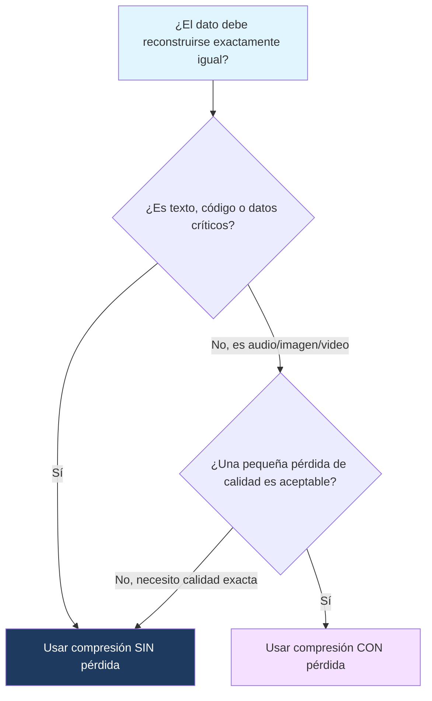

---
{"dg-publish":true,"permalink":"/universidad/2do-semestre/computacion-y-sociedad/unidad-3-representacion-de-la-informacion/ii-compresion-de-datos/01-introduccion-a-la-compresion/","dg-note-properties":{}}
---

# 🗜️ Introducción a la Compresión de Datos

## 🎯 Introducción

> [!info] 💡 ¿Por qué comprimir información?
> 
> Ya viste cómo se representan números y texto en binario — pero esa representación "cruda" casi siempre ocupa más espacio del necesario. La **compresión de datos** busca reducir la cantidad de bits necesarios para almacenar o transmitir información, sin perder (o perdiendo lo mínimo posible) su significado.
> 
> - Los primeros algoritmos de compresión de texto surgieron en los años 50-70 (Shannon-Fano, Huffman), motivados por la necesidad de transmitir telégrafos y datos por líneas telefónicas lentas y costosas.
> - Hoy en día, la compresión está en todas partes: un archivo `.zip`, una foto `.jpg`, un video en streaming, o una llamada por videollamada — todos dependen de algoritmos de compresión funcionando en tiempo real.
> - Sin compresión, plataformas como Netflix o Spotify serían imposibles de operar al costo de ancho de banda que usarías sin comprimir.
> 
> ```mermaid
> graph TD
>     A[Datos originales] --> B[Algoritmo de compresión]
>     B --> C[Con pérdida]
>     B --> D[Sin pérdida]
>     C --> E[Menor tamaño, se descarta info]
>     D --> F[Se puede reconstruir 100% del original]
>     style A fill:#e1f5ff
>     style C fill:#f5e1ff
>     style D fill:#1e3a5f,color:#fff
> ```

---

## 📋 Fundamentos y Estructura Formal

> [!note] 📋 Definición — Compresión de datos
> 
> La **compresión de datos** es el proceso de codificar información usando menos bits que su representación original, aprovechando patrones, redundancia o repetición dentro de los datos.
> 
> Todo algoritmo de compresión trabaja sobre la misma idea: identificar **redundancia** (información repetida o predecible) y **codificarla de forma más compacta**.

> [!note] 📋 Definición — Compresión con pérdida vs. sin pérdida
> 
> - **Sin pérdida (lossless):** el archivo descomprimido es **idéntico bit a bit** al original. No se descarta ninguna información, solo se reorganiza de forma más eficiente.
> - **Con pérdida (lossy):** se descarta información considerada "menos importante" para reducir aún más el tamaño. El archivo descomprimido es una **aproximación** del original, no una copia exacta.

---

## 🔍 Compresión Sin Pérdida (Lossless)

> [!success] ✅ Principio clave
> 
> La compresión sin pérdida es obligatoria cuando **cada bit importa**: código de programación, documentos de texto, bases de datos, archivos ejecutables. Perder un solo bit en un archivo `.docx` o en un programa podría corromperlo por completo.
> 
> Ejemplos de formatos y algoritmos: `.zip`, `.png`, `.flac`, Run Length Encoding, Huffman Encoding.

> [!example] 🟢 Ejemplo intuitivo
> 
> Imagina el texto `AAAAAAAABBBBCCCCCCCCCCDD`. En vez de guardar cada carácter individualmente (24 caracteres), podrías guardar "8 A's, 4 B's, 10 C's, 2 D's" — mucho más compacto, y puedes reconstruir el texto original exactamente.

---

## 🔍 Compresión Con Pérdida (Lossy)

> [!success] ✅ Principio clave
> 
> La compresión con pérdida se usa cuando el receptor (ojo u oído humano) **no puede percibir** ciertos detalles descartados, o cuando una pequeña pérdida de calidad es un precio aceptable por un archivo mucho más pequeño. Es común en audio, imagen y video.
> 
> Ejemplos de formatos: `.jpg`, `.mp3`, `.mp4`, la mayoría de streaming de video.

> [!example] 🟢 Ejemplo intuitivo
> 
> Un archivo `.jpg` puede descartar variaciones de color que el ojo humano casi no distingue, o reducir la resolución en zonas de la imagen sin mucho detalle (como un cielo despejado). El resultado se ve prácticamente igual a simple vista, pero el archivo puede ser 10 veces más pequeño.

> [!warning] ⚠️ Error común: aplicar compresión con pérdida donde no corresponde
> 
> Nunca uses un formato con pérdida para código fuente, archivos ejecutables, o cualquier dato donde la exactitud bit a bit sea crítica. Comprimir un `.txt` con un algoritmo con pérdida podría literalmente cambiar palabras o corromper el archivo, ya que el algoritmo no entiende qué información es "prescindible" en texto estructurado.

---

## 📊 Tabla Comparativa

> [!note] 📊 Compresión Con Pérdida vs. Sin Pérdida
> 
> |Característica|Sin Pérdida (Lossless)|Con Pérdida (Lossy)|
> |---|---|---|
> |**Reconstrucción**|Exacta, bit a bit|Aproximada|
> |**Tasa de compresión típica**|Moderada|Alta|
> |**Casos de uso**|Texto, código, bases de datos|Audio, imagen, video|
> |**Formatos comunes**|`.zip`, `.png`, `.flac`|`.jpg`, `.mp3`, `.mp4`|
> |**Reversibilidad**|Totalmente reversible|No reversible|
> |**Ejemplos de algoritmos**|RLE, Huffman|DCT (base de JPEG), predicción perceptual|

---

## 🧭 Diagrama de Decisión — ¿Qué tipo de compresión usar?



---

## 📝 Ejercicios Progresivos

> [!question] 🟩 Nivel 1 — Básico
> 
> 1. Define con tus propias palabras la diferencia entre compresión con pérdida y sin pérdida.
> 2. Clasifica cada formato como con o sin pérdida: `.png`, `.mp3`, `.zip`, `.jpg`.
> 3. ¿Por qué no se debería comprimir un archivo ejecutable (`.exe`) con un algoritmo con pérdida?

> [!question] 🟨 Nivel 2 — Intermedio
> 
> 4. Un estudiante quiere enviar sus apuntes de clase (documento de texto) por correo y quiere que ocupen menos espacio. ¿Qué tipo de compresión debería usar? Justifica.
> 5. Una app de streaming necesita transmitir video en tiempo real con ancho de banda limitado. ¿Qué tipo de compresión conviene más y por qué?
> 6. Explica por qué la compresión con pérdida generalmente logra tasas de compresión más altas que la compresión sin pérdida.

> [!question] 🟥 Nivel 3 — Avanzado
> 
> 7. ¿Podría un archivo comprimido con pérdida, una vez descomprimido, volver a comprimirse sin pérdida para recuperar el archivo original? Explica por qué sí o por qué no.
> 8. Investiga: ¿por qué los archivos `.gif` usan compresión sin pérdida, a pesar de ser imágenes (donde normalmente uno esperaría compresión con pérdida como en `.jpg`)?
> 9. Un hospital almacena imágenes de resonancias magnéticas. ¿Qué tipo de compresión recomendarías y qué riesgos tendría elegir el tipo incorrecto?

> [!success]- ✅ Respuestas
> 
> **Nivel 1:**
> 
> 10. Sin pérdida: se recupera el archivo original exacto. Con pérdida: se recupera una aproximación, se descarta información permanentemente.
> 11. `.png` → sin pérdida. `.mp3` → con pérdida. `.zip` → sin pérdida. `.jpg` → con pérdida.
> 12. Porque un solo bit incorrecto en un ejecutable puede hacer que el programa no funcione o se corrompa completamente — el código no tolera aproximaciones.
> 
> **Nivel 2:** 4. Sin pérdida, porque es texto y necesita reconstruirse exactamente igual para que las palabras no cambien ni se corrompan. 5. Con pérdida, porque el video ocupa mucho espacio y una ligera reducción de calidad es imperceptible o aceptable a cambio de transmitir en tiempo real con ancho de banda limitado. 6. Porque la compresión con pérdida tiene la libertad de descartar información permanentemente (no solo reorganizarla), lo que permite reducciones de tamaño mucho más agresivas que solo reestructurar los datos existentes.
> 
> **Nivel 3:** 7. No — una vez que la información se descarta en la compresión con pérdida, ya no existe en ningún lado. Comprimir sin pérdida después solo empaquetaría de forma más eficiente la versión ya degradada, pero nunca recuperaría los detalles originales perdidos. 8. Los `.gif` suelen usarse para gráficos simples, logos, o animaciones cortas con pocos colores, donde la nitidez de bordes y texto importa más que en una fotografía — comprimir con pérdida ahí generaría artefactos visibles (bordes borrosos) que no son aceptables para ese tipo de contenido. 9. Se recomienda compresión sin pérdida, porque un médico necesita ver la imagen exacta para diagnosticar — cualquier detalle descartado por compresión con pérdida podría ocultar una anomalía relevante, con consecuencias médicas graves.

---

## 🎯 Metas de Aprendizaje

> [!success] ✅ Nivel Básico
> 
> - [ ] Puedo definir compresión con pérdida y sin pérdida en mis propias palabras.
> - [ ] Puedo clasificar formatos de archivo comunes según su tipo de compresión.
> - [ ] Entiendo por qué la compresión reduce el tamaño de los datos (redundancia).

> [!success] ✅ Nivel Intermedio
> 
> - [ ] Puedo justificar qué tipo de compresión conviene según el contexto de uso.
> - [ ] Entiendo por qué la compresión con pérdida logra tasas más altas que la sin pérdida.
> - [ ] Puedo identificar riesgos de usar el tipo de compresión incorrecto.

> [!success] ✅ Nivel Avanzado
> 
> - [ ] Puedo explicar por qué la compresión con pérdida es irreversible.
> - [ ] Puedo evaluar casos de uso reales (médico, streaming, texto) y recomendar el tipo de compresión adecuado con justificación técnica.

---

## 📚 Referencias y Conexiones

> [!quote] 📖 Fuentes consultadas
> 
> [1] Material de clase — Unidad 3: Representación de la información, Computación y Sociedad.

> [!quote] 🔗 Conexiones
> 
> - [[Universidad/2do Semestre/Computación y Sociedad/Unidad 3 - Representación de la información/I - Sistemas de Numeración/07 - Números Negativos\|07 - Números Negativos]] — ambas notas forman parte del bloque de representación de la información de la Unidad 3.
> - [[Universidad/2do Semestre/Computación y Sociedad/Unidad 3 - Representación de la información/II - Compresión de Datos/02 - Keyword Encoding y ASCII\|02 - Keyword Encoding y ASCII]] — primer algoritmo concreto de compresión sin pérdida que se explora en esta carpeta.

---

**Tags:** #computacion-y-sociedad #compresion-datos #lossless #lossy #unidad3