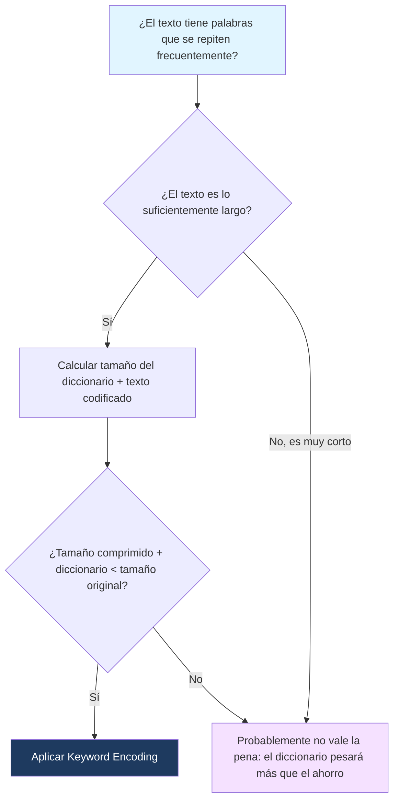

---
{"dg-publish":true,"permalink":"/universidad/2do-semestre/computacion-y-sociedad/unidad-3-representacion-de-la-informacion/ii-compresion-de-datos/02-keyword-encoding-y-ascii/","dg-note-properties":{}}
---

# 🔤 Keyword Encoding y ASCII

## 🎯 Introducción

> [!info] 💡 ¿Cómo se codifica el texto en binario?
> 
> Ya viste cómo comprimir datos en general (con pérdida vs. sin pérdida). Ahora vamos a un caso concreto: **texto**. Antes de comprimir texto, primero hay que entender cómo se codifica cada carácter en binario — eso es lo que hace **ASCII**.
> 
> - ASCII (_American Standard Code for Information Interchange_) se estandarizó en 1963, y asigna a cada carácter (letras, números, símbolos) un valor numérico único representable en binario.
> - **Keyword encoding** es la técnica de sustituir palabras o símbolos frecuentes por códigos más cortos — la base conceptual detrás de casi todo algoritmo de compresión de texto, incluyendo Huffman más adelante.
> - Hoy en día, ASCII sigue siendo la base de Unicode (el estándar moderno que soporta miles de idiomas y emojis), ya que los primeros 128 caracteres de Unicode son idénticos a ASCII.
> 
> ```mermaid
> graph TD
>     A[Texto] --> B[Codificación ASCII]
>     B --> C["Cada carácter = 8 bits"]
>     A --> D[Keyword Encoding]
>     D --> E["Palabras frecuentes = código corto"]
>     C --> F[% de ahorro de bits]
>     E --> F
>     style A fill:#e1f5ff
>     style F fill:#1e3a5f,color:#fff
> ```

---

## 📋 Fundamentos y Estructura Formal

> [!note] 📋 Definición — ASCII de 8 bits
> 
> **ASCII** asigna a cada carácter un número entre $0$ y $255$ (usando 8 bits, es decir, 1 byte por carácter). Esto significa que un texto de $n$ caracteres, codificado en ASCII estándar, siempre ocupa exactamente:
> 
> $$n \times 8 \text{ bits}$$
> 
> Por ejemplo, la palabra `"HOLA"` tiene 4 caracteres, así que ocupa $4 \times 8 = 32$ bits en ASCII, sin importar qué letras sean.

> [!note] 📋 Definición — Keyword Encoding
> 
> **Keyword encoding** consiste en construir un **diccionario** de palabras o símbolos frecuentes en un texto y reemplazarlos por códigos más cortos (por ejemplo, números o símbolos de pocos bits), guardando el diccionario junto con el texto codificado para poder revertir el proceso.
> 
> Esto funciona porque en cualquier idioma natural, ciertas palabras se repiten mucho más que otras (por ejemplo, "el", "la", "de", "que" en español).

---

## 🧮 Cálculo del Porcentaje de Ahorro de Bits

> [!note] 📋 Fórmula — Porcentaje de ahorro de bits
> 
> Para medir qué tan efectiva fue una compresión, se compara el tamaño original contra el tamaño comprimido:
> 
> $$\text{Ahorro} = \left(1 - \frac{\text{Tamaño comprimido}}{\text{Tamaño original}}\right) \times 100%$$
> 
> Un ahorro de $0% significa que la compresión no redujo nada el tamaño; un ahorro cercano a $100%$ significa que el archivo comprimido es casi despreciable en comparación con el original.

> [!example]- 🟢 Ejemplo paso a paso: ahorro de bits con Keyword Encoding
> 
> Supongamos el texto: `"el perro corre y el perro salta"` (32 caracteres incluyendo espacios).
> 
> **Tamaño original en ASCII:** $32 \times 8 = 256$ bits.
> 
> Si codificamos la palabra `"perro"` (5 caracteres = 40 bits en ASCII) con un código de solo 8 bits cada vez que aparece, y aparece 2 veces:
> 
> - Bits ahorrados por sustitución: cada aparición de `"perro"` pasa de $40$ bits a $8$ bits → ahorro de $32$ bits por aparición.
> - Con 2 apariciones: $32 \times 2 = 64$ bits ahorrados.
> - Nuevo tamaño total: $256 - 64 = 192$ bits.
> 
> **Porcentaje de ahorro:**
> 
> $$\left(1 - \frac{192}{256}\right) \times 100% = 25%$$

---

## ⚠️ Errores Comunes y Limitaciones

> [!warning] ⚠️ El diccionario también ocupa espacio
> 
> Un error frecuente es olvidar que el **diccionario de códigos** (qué código representa qué palabra) también debe guardarse o transmitirse junto con el texto codificado — si no, no se puede revertir la compresión. En textos muy cortos, el diccionario puede terminar ocupando más espacio del que se ahorra, haciendo la "compresión" contraproducente.

> [!warning] ⚠️ ASCII vs. Unicode
> 
> No confundas ASCII (8 bits, 256 caracteres posibles, principalmente inglés) con Unicode/UTF-8 (soporta miles de caracteres de todos los idiomas, y usa una cantidad **variable** de bits por carácter — de 8 a 32 bits dependiendo del símbolo). Un emoji o una letra con tilde ya no ocupa 8 bits fijos como en ASCII puro.

---

## 📊 Tabla Comparativa

> [!note] 📊 ASCII vs. Keyword Encoding
> 
> |Característica|ASCII (8 bits)|Keyword Encoding|
> |---|---|---|
> |**Unidad de codificación**|Carácter individual|Palabra o símbolo frecuente|
> |**Tamaño por unidad**|Siempre 8 bits|Variable, generalmente menor a 8 bits × longitud|
> |**Requiere diccionario**|No|Sí|
> |**Efectividad**|Ninguna compresión (es la línea base)|Depende de la repetición de palabras en el texto|
> |**Tipo de compresión**|No aplica (es codificación base)|Sin pérdida|

---

## 🧭 Diagrama de Decisión — ¿Vale la pena aplicar Keyword Encoding?



---

## 📝 Ejercicios Progresivos

> [!question] 🟩 Nivel 1 — Básico
> 
> 1. ¿Cuántos bits ocupa en ASCII la palabra `"GATO"` (4 caracteres)?
> 2. ¿Cuántos bits ocupa en ASCII una oración de 50 caracteres (incluyendo espacios)?
> 3. ¿Por qué ASCII no es, por sí solo, una forma de compresión?

> [!question] 🟨 Nivel 2 — Intermedio
> 
> 4. Un texto de 100 caracteres se comprime a un tamaño equivalente a 60 caracteres. Calcula el porcentaje de ahorro de bits.
> 5. Un texto ocupa originalmente 400 bits. Después de Keyword Encoding (incluyendo el diccionario), ocupa 350 bits. Calcula el porcentaje de ahorro.
> 6. Explica con tus palabras por qué guardar el diccionario de códigos es obligatorio, aunque reduzca el ahorro total.

> [!question] 🟥 Nivel 3 — Avanzado
> 
> 7. Un texto de 200 caracteres (1600 bits en ASCII) contiene la palabra `"computadora"` (11 caracteres) repetida 6 veces. Si se sustituye cada aparición por un código de 8 bits, y el diccionario ocupa 96 bits adicionales, calcula el porcentaje de ahorro final.
> 8. ¿En qué escenario Keyword Encoding podría resultar en un archivo **más grande** que el original? Da un ejemplo numérico.
> 9. Compara conceptualmente Keyword Encoding con Huffman Encoding: ¿en qué se parecen y en qué se diferencian? (No necesitas conocer Huffman en detalle todavía, razona desde la idea general).

> [!success]- ✅ Respuestas
> 
> **Nivel 1:**
> 
> 10. $4 \times 8 = 32$ bits.
> 11. $50 \times 8 = 400$ bits.
> 12. Porque ASCII asigna un tamaño **fijo** (8 bits) a cada carácter sin importar qué tan frecuente sea — no aprovecha ninguna redundancia ni repetición, simplemente traduce cada símbolo a binario.
> 
> **Nivel 2:** 4. $\left(1 - \frac{60}{100}\right) \times 100% = 40%$ 5. $\left(1 - \frac{350}{400}\right) \times 100% = 12.5%$ 6. Porque sin el diccionario, el receptor no sabría qué palabra representa cada código corto — la compresión sería irreversible y se perdería la información original, violando la definición de compresión sin pérdida.
> 
> **Nivel 3:** 7. Tamaño original de "computadora" en ASCII: $11 \times 8 = 88$ bits por aparición, $\times 6 = 528$ bits. Sustituido por código de 8 bits: $8 \times 6 = 48$ bits. Bits ahorrados por sustitución: $528 - 48 = 480$ bits. Nuevo tamaño total: $1600 - 480 + 96 \text{ (diccionario)} = 1216$ bits. Ahorro: $\left(1 - \frac{1216}{1600}\right) \times 100% = 24%$ 8. Cuando el texto es muy corto o las palabras codificadas no se repiten lo suficiente, el diccionario puede pesar más que el ahorro. Ejemplo: un texto de solo 20 bits donde el diccionario necesario ocupa 30 bits — el archivo "comprimido" terminaría pesando 50 bits, más que el original. 9. Se parecen en que ambos sustituyen unidades frecuentes por códigos más cortos para ahorrar espacio, y ambos son técnicas de compresión sin pérdida. Se diferencian en que Keyword Encoding trabaja a nivel de **palabras completas** con un diccionario explícito, mientras que Huffman (como verás después) trabaja a nivel de **caracteres individuales**, asignando códigos de longitud variable según qué tan frecuente es cada carácter, sin necesitar un diccionario de palabras completas.

---

## 🎯 Metas de Aprendizaje

> [!success] ✅ Nivel Básico
> 
> - [ ] Puedo calcular cuántos bits ocupa un texto en ASCII de 8 bits.
> - [ ] Entiendo qué es un diccionario de códigos en Keyword Encoding.
> - [ ] Sé que ASCII por sí solo no es compresión, sino codificación base.

> [!success] ✅ Nivel Intermedio
> 
> - [ ] Puedo calcular el porcentaje de ahorro de bits dado un tamaño original y comprimido.
> - [ ] Entiendo por qué el diccionario debe incluirse en el cálculo del tamaño comprimido.
> - [ ] Puedo identificar cuándo Keyword Encoding no conviene (textos cortos).

> [!success] ✅ Nivel Avanzado
> 
> - [ ] Puedo calcular el ahorro de bits en escenarios con múltiples repeticiones y diccionario incluido.
> - [ ] Puedo dar un ejemplo numérico de cuándo la compresión resulta contraproducente.
> - [ ] Puedo comparar conceptualmente Keyword Encoding con otros algoritmos de compresión sin pérdida.

---

## 📚 Referencias y Conexiones

> [!quote] 📖 Fuentes consultadas
> 
> [1] Material de clase — Unidad 3: Representación de la información, Computación y Sociedad.

> [!quote] 🔗 Conexiones
> 
> - [[Universidad/2do Semestre/Computación y Sociedad/Unidad 3 - Representación de la información/II - Compresión de Datos/01 - Introducción a la Compresión\|01 - Introducción a la Compresión]] — Keyword Encoding es un ejemplo concreto de compresión sin pérdida introducida ahí.
> - [[Universidad/2do Semestre/Computación y Sociedad/Unidad 3 - Representación de la información/II - Compresión de Datos/03 - Run Length Encoding\|03 - Run Length Encoding]] — otro algoritmo de compresión sin pérdida, con un enfoque distinto (repetición consecutiva en vez de palabras frecuentes).

---

**Tags:** #computacion-y-sociedad #compresion-datos #ascii #keyword-encoding #unidad3