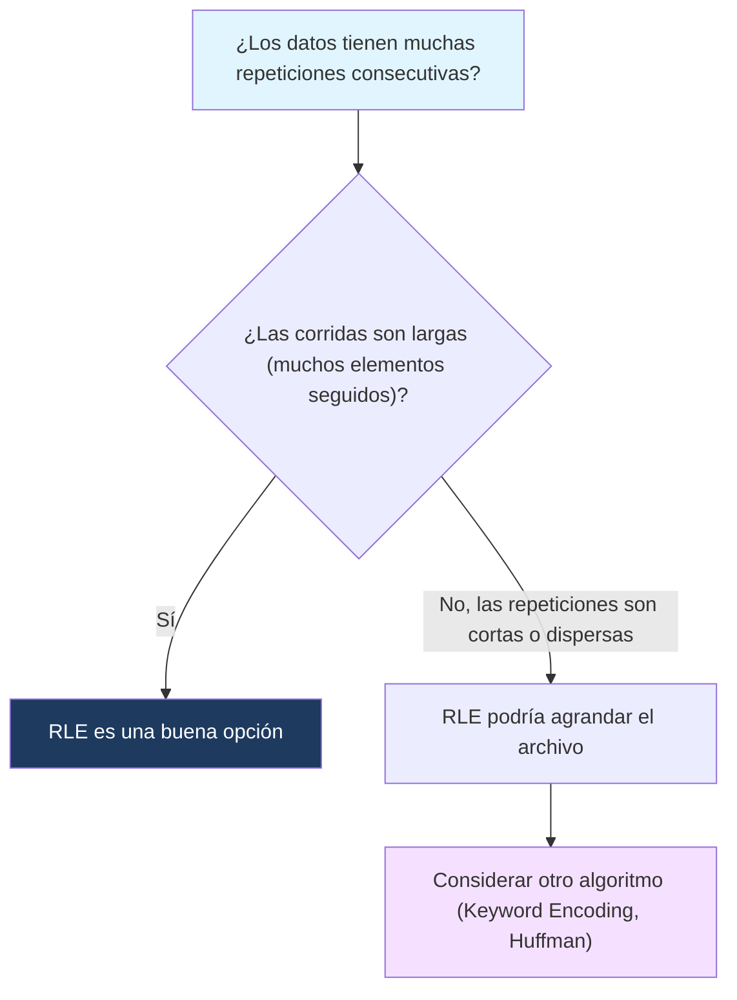

---
{"dg-publish":true,"permalink":"/universidad/2do-semestre/computacion-y-sociedad/unidad-3-representacion-de-la-informacion/ii-compresion-de-datos/03-run-length-encoding/","dg-note-properties":{}}
---

# 🏃 Run Length Encoding (RLE)

## 🎯 Introducción

> [!info] 💡 ¿Qué es Run Length Encoding?
> 
> **Run Length Encoding (RLE)** es uno de los algoritmos de compresión sin pérdida más simples e intuitivos que existen: en vez de guardar cada elemento repetido individualmente, guarda **cuántas veces se repite consecutivamente** un mismo valor.
> 
> - RLE se remonta a los años 60-70, usado originalmente en la transmisión de fax, donde una página con mucho blanco se podía describir como "500 píxeles blancos seguidos" en vez de 500 valores individuales.
> - Hoy en día sigue siendo la base de formatos como `.bmp` (en algunos modos), `.tiff`, y se usa dentro de otros algoritmos más complejos como parte del pipeline de compresión de video e imagen.
> - Es especialmente efectivo en datos con **muchas repeticiones consecutivas**: imágenes con áreas de color sólido, faxes, iconos simples, o ciertos tipos de datos de sensores.
> 
> ```mermaid
> graph TD
>     A["Datos con repeticiones consecutivas"] --> B["Contar 'corridas' (runs)"]
>     B --> C["Reemplazar cada corrida por: valor + cantidad"]
>     C --> D["Datos comprimidos"]
>     style A fill:#e1f5ff
>     style D fill:#1e3a5f,color:#fff
> ```

---

## 📋 Fundamentos y Estructura Formal

> [!note] 📋 Definición — Run Length Encoding
> 
> Dada una secuencia de datos, una **corrida (run)** es una subsecuencia máxima de elementos consecutivos idénticos. RLE codifica cada corrida como un par:
> 
> $$(\text{valor}, \text{cantidad de repeticiones})$$
> 
> Por ejemplo, la secuencia `AAAABBBCCDAA` tiene las corridas: `AAAA` (4 A's), `BBB` (3 B's), `CC` (2 C's), `D` (1 D), `AA` (2 A's). Nota que las dos corridas de `A` son **distintas** porque no son consecutivas entre sí — están separadas por otros caracteres.

> [!note] 📋 Notación común de RLE
> 
> Existen varias formas de escribir el resultado de RLE; en clase probablemente viste alguna de estas:
> 
> - **Valor + cantidad:** `A4B3C2D1A2`
> - **Cantidad + valor:** `4A3B2C1D2A`
> - **Con separadores:** `4A,3B,2C,1D,2A`
> 
> Todas representan la misma información — lo importante es ser consistente con la notación que uses.

---

## 🧮 Cómo Aplicar RLE Paso a Paso

> [!example]- 🟢 Ejemplo paso a paso: comprimir con RLE
> 
> Secuencia original: `WWWWWWWWWWWWBWWWWWWWWWWWWBBBWWWWWWWWWWWWWWWWWWWWWWWWBWWWWWWWWWWWWWW`
> 
> **Paso 1 — Identificar las corridas:**
> 
> - `W` × 12
> - `B` × 1
> - `W` × 12
> - `B` × 3
> - `W` × 24
> - `B` × 1
> - `W` × 14
> 
> **Paso 2 — Codificar cada corrida como (valor, cantidad):**
> 
> $$12W\ 1B\ 12W\ 3B\ 24W\ 1B\ 14W$$
> 
> **Resultado:** la secuencia original tiene 67 caracteres; la versión codificada tiene 7 pares (14 símbolos si cuentas número + letra) — una reducción considerable, típica del comportamiento de RLE en datos con muchas repeticiones consecutivas.

> [!example]- 🟢 Ejemplo paso a paso: calcular el ahorro de bits con RLE
> 
> Secuencia: `AAAAAAAABBBBBBBBBBCCCC` (22 caracteres).
> 
> **Tamaño original en ASCII:** $22 \times 8 = 176$ bits.
> 
> **Corridas:** `A` × 8, `B` × 10, `C` × 4 → 3 pares (valor, cantidad).
> 
> Si cada par se codifica con 8 bits para el valor y 8 bits para la cantidad (16 bits por par):
> 
> **Tamaño comprimido:** $3 \times 16 = 48$ bits.
> 
> **Porcentaje de ahorro:**
> 
> $$\left(1 - \frac{48}{176}\right) \times 100% \approx 72.7%$$

---

## ⚠️ Errores Comunes y Limitaciones

> [!warning] ⚠️ RLE puede hacer el archivo MÁS GRANDE
> 
> Si los datos **no tienen repeticiones consecutivas** (por ejemplo, `ABCABCABC`), RLE puede terminar generando un resultado más grande que el original, porque cada "corrida" de longitud 1 todavía necesita guardar el par (valor, cantidad) — dos símbolos en vez de uno.
> 
> Ejemplo: `ABCABCABC` (9 caracteres) se convertiría en `1A1B1C1A1B1C1A1B1C` (18 símbolos) — el doble de tamaño.

> [!warning] ⚠️ No confundir "corrida" con "aparición total"
> 
> Un error común es contar cuántas veces aparece un carácter **en todo el texto**, en vez de solo en su corrida consecutiva actual. En `AABAA`, la `A` aparece 4 veces en total, pero forma **dos corridas distintas**: `AA` (2) y `AA` (2), separadas por la `B`. RLE nunca junta corridas no consecutivas.

---

## 📊 Tabla Comparativa

> [!note] 📊 RLE vs. Keyword Encoding
> 
> |Característica|Run Length Encoding|Keyword Encoding|
> |---|---|---|
> |**Qué codifica**|Repeticiones consecutivas|Palabras/símbolos frecuentes (no necesariamente consecutivos)|
> |**Requiere diccionario**|No|Sí|
> |**Mejor caso de uso**|Datos con corridas largas (imágenes simples, fax)|Texto natural con vocabulario repetido|
> |**Peor caso**|Datos sin repeticiones consecutivas (puede agrandar el archivo)|Texto sin palabras repetidas|
> |**Complejidad de implementación**|Muy baja|Media (requiere construir y mantener diccionario)|

---

## 🧭 Diagrama de Decisión — ¿Conviene usar RLE?



---

## 📝 Ejercicios Progresivos

> [!question] 🟩 Nivel 1 — Básico
> 
> 1. Codifica con RLE la secuencia: `MMMMMOOOOP`
> 2. ¿Cuántas corridas tiene la secuencia `XXYYYXX`? Escríbelas.
> 3. ¿Por qué RLE es especialmente efectivo para imágenes con grandes áreas de un solo color?

> [!question] 🟨 Nivel 2 — Intermedio
> 
> 4. Codifica con RLE la secuencia: `ZZZZWWWWWWZZZZZZZZWW`
> 5. Una secuencia de 40 caracteres tiene 5 corridas. Si cada par (valor, cantidad) ocupa 16 bits y el original ocupa 320 bits en ASCII, calcula el porcentaje de ahorro de bits.
> 6. Explica por qué la secuencia `ABABABAB` sería un mal caso de uso para RLE.

> [!question] 🟥 Nivel 3 — Avanzado
> 
> 7. Dada la secuencia comprimida `5A2B7C1D3A`, reconstruye la secuencia original y calcula su longitud.
> 8. Una imagen en blanco y negro de 100 píxeles tiene 3 corridas: 60 blancos, 5 negros, 35 blancos. Compara el tamaño en bits usando RLE (cada par ocupa 9 bits: 1 bit color + 8 bits cantidad) contra guardar cada píxel individualmente (1 bit por píxel). ¿RLE conviene aquí?
> 9. Diseña una secuencia de 12 caracteres donde RLE NO logre ningún ahorro de espacio (es decir, el tamaño comprimido sea igual o mayor al original). Justifica tu respuesta.

> [!success]- ✅ Respuestas
> 
> **Nivel 1:**
> 
> 10. `5M4O1P`
> 11. 3 corridas: `XX` (2), `YYY` (3), `XX` (2).
> 12. Porque una imagen con áreas de color sólido genera corridas muy largas de píxeles idénticos consecutivos — mientras más larga la corrida, mayor el ahorro proporcional al codificarla como un solo par (valor, cantidad).
> 
> **Nivel 2:** 4. `4Z6W8Z2W` 5. Tamaño comprimido: $5 \times 16 = 80$ bits. Ahorro: $\left(1 - \frac{80}{320}\right) \times 100% = 75%$ 6. Porque no hay repeticiones consecutivas — cada carácter forma su propia corrida de longitud 1, así que RLE necesitaría guardar un par (valor, cantidad) por cada carácter, duplicando el tamaño en vez de reducirlo.
> 
> **Nivel 3:** 7. Reconstrucción: `AAAAA` + `BB` + `CCCCCCC` + `D` + `AAA` = `AAAAABBCCCCCCCDAAA`. Longitud: $5+2+7+1+3 = 18$ caracteres. 8. **Sin RLE:** $100 \times 1 = 100$ bits. **Con RLE:** $3 \times 9 = 27$ bits. Sí conviene: $27 < 100$, un ahorro de $73%$ — porque hay pocas corridas y son largas. 9. Ejemplo: `ABABABABABAB` (12 caracteres, cada uno es su propia corrida de longitud 1). Codificado: `1A1B1A1B1A1B1A1B1A1B1A1B` (24 símbolos) — el doble del tamaño original, porque ninguna corrida tiene más de un elemento.

---

## 🎯 Metas de Aprendizaje

> [!success] ✅ Nivel Básico
> 
> - [ ] Puedo identificar las corridas (runs) de una secuencia de datos.
> - [ ] Puedo codificar una secuencia simple usando RLE.
> - [ ] Entiendo por qué RLE funciona bien con repeticiones consecutivas largas.

> [!success] ✅ Nivel Intermedio
> 
> - [ ] Puedo calcular el porcentaje de ahorro de bits al aplicar RLE.
> - [ ] Puedo identificar cuándo una secuencia es un mal caso de uso para RLE.
> - [ ] Puedo comparar RLE con Keyword Encoding según el tipo de datos.

> [!success] ✅ Nivel Avanzado
> 
> - [ ] Puedo reconstruir la secuencia original a partir de su versión codificada con RLE.
> - [ ] Puedo comparar cuantitativamente RLE contra almacenamiento sin comprimir en un caso real (ej. imagen binaria).
> - [ ] Puedo diseñar un ejemplo donde RLE no logre ningún ahorro, y justificar por qué.

---

## 📚 Referencias y Conexiones

> [!quote] 📖 Fuentes consultadas
> 
> [1] Material de clase — Unidad 3: Representación de la información, Computación y Sociedad.

> [!quote] 🔗 Conexiones
> 
> - [[Universidad/2do Semestre/Computación y Sociedad/Unidad 3 - Representación de la información/II - Compresión de Datos/02 - Keyword Encoding y ASCII\|02 - Keyword Encoding y ASCII]] — otro algoritmo de compresión sin pérdida, con enfoque en palabras frecuentes en vez de corridas consecutivas.
> - [[Universidad/2do Semestre/Computación y Sociedad/Unidad 3 - Representación de la información/II - Compresión de Datos/04 - Códigos Prefijos y Huffman Encoding\|04 - Códigos Prefijos y Huffman Encoding]] — algoritmo más sofisticado que, a diferencia de RLE, asigna códigos según la frecuencia de cada símbolo individual.

---

**Tags:** #computacion-y-sociedad #compresion-datos #rle #run-length-encoding #unidad3