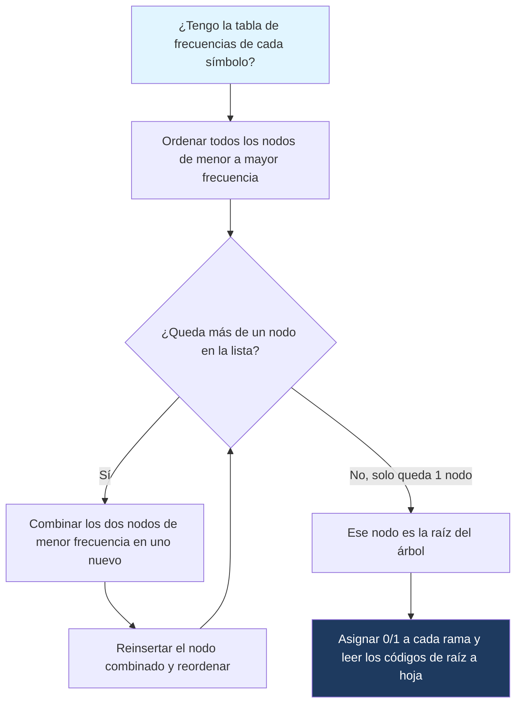

---
{"dg-publish":true,"permalink":"/universidad/2do-semestre/computacion-y-sociedad/unidad-3-representacion-de-la-informacion/ii-compresion-de-datos/04-codigos-prefijos-y-huffman-encoding/","dg-note-properties":{}}
---

# 🌳 Códigos Prefijos y Huffman Encoding

## 🎯 Introducción

> [!info] 💡 ¿Por qué no basta con códigos de longitud fija?
> 
> ASCII usa 8 bits para **cada** carácter, sin importar qué tan frecuente sea. Pero en cualquier texto real, algunas letras aparecen mucho más que otras (en español, la "e" y la "a" son mucho más comunes que la "z" o la "x"). **Huffman Encoding** aprovecha esta idea: asigna códigos **más cortos** a los símbolos más frecuentes y códigos **más largos** a los menos frecuentes.
> 
> - El algoritmo fue creado por David A. Huffman en 1952, como parte de un trabajo de clase en el MIT — su profesor había planteado el problema de encontrar el código binario más eficiente, y Huffman lo resolvió con un enfoque _greedy_ (voraz) que resultó ser óptimo.
> - Es la base de formatos como `.zip`, `.jpg` (en su etapa final de codificación), `.mp3`, y del algoritmo DEFLATE usado en `.png` y `.gzip`.
> - Para que Huffman funcione sin ambigüedad al decodificar, los códigos que genera son siempre **códigos prefijos** — el concepto que vemos primero antes de construir el árbol de Huffman.
> 
> ```mermaid
> graph TD
>     A["Tabla de frecuencias"] --> B["Construir árbol de Huffman"]
>     B --> C["Asignar 0/1 según rama izquierda/derecha"]
>     C --> D["Código prefijo por símbolo"]
>     D --> E["Símbolos frecuentes = código corto"]
>     D --> F["Símbolos raros = código largo"]
>     style A fill:#e1f5ff
>     style D fill:#1e3a5f,color:#fff
> ```

---

## 📋 Fundamentos y Estructura Formal

> [!note] 📋 Definición — Código Prefijo
> 
> Un **código prefijo** (_prefix code_) es un sistema de codificación donde **ningún código es prefijo de otro código**. Esto garantiza que una secuencia de bits se pueda decodificar de forma única, leyendo de izquierda a derecha sin ambigüedad, sin necesitar separadores entre símbolos.
> 
> Ejemplo de código prefijo válido: $A=0$, $B=10$, $C=110$, $D=111$ — ningún código es el inicio de otro.
> 
> Ejemplo de código **inválido**: $A=0$, $B=01$ — aquí $0$ (código de A) es el prefijo de $01$ (código de B), así que al leer `01` no se sabría si es "A seguido de B" o simplemente "B".

> [!note] 📋 Definición — Árbol de Huffman
> 
> Un **árbol de Huffman** es un árbol binario donde:
> 
> - Cada **hoja** representa un símbolo del alfabeto (letra, carácter) junto con su frecuencia.
> - Cada rama se etiqueta con $0$ (izquierda) o $1$ (derecha).
> - El **código** de un símbolo es la secuencia de $0$s y $1$s que se recorre desde la raíz hasta su hoja.
> 
> Como cada símbolo está en una hoja distinta y ningún símbolo es "camino" hacia otro, el código resultante siempre es un código prefijo válido.

---

## 🌲 Algoritmo de Huffman Paso a Paso

> [!success] ✅ Principio clave: estrategia voraz (greedy)
> 
> El algoritmo de Huffman siempre combina los **dos símbolos (o nodos) de menor frecuencia** disponibles en cada paso, construyendo el árbol de abajo hacia arriba. Esta decisión local (siempre tomar los dos más pequeños) garantiza un resultado **globalmente óptimo**: el código prefijo con la menor cantidad de bits promedio posible para esa distribución de frecuencias.

> [!example]- 🟢 Ejemplo paso a paso: construir un árbol de Huffman
> 
> Alfabeto y frecuencias: $A=5$, $B=9$, $C=12$, $D=13$, $E=16$, $F=45$ (total: 100 símbolos).
> 
> **Paso 1:** Ordenar los nodos por frecuencia (menor a mayor): $A(5), B(9), C(12), D(13), E(16), F(45)$
> 
> **Paso 2:** Combinar los dos menores, $A(5)$ y $B(9)$, en un nodo nuevo de frecuencia $14$.
> 
> Lista actualizada: $C(12), AB(14), D(13), E(16), F(45)$ → reordenando: $C(12), D(13), AB(14), E(16), F(45)$
> 
> **Paso 3:** Combinar los dos menores, $C(12)$ y $D(13)$, en un nodo nuevo de frecuencia $25$.
> 
> Lista actualizada: $AB(14), E(16), CD(25), F(45)$
> 
> **Paso 4:** Combinar $AB(14)$ y $E(16)$ → nuevo nodo $ABE(30)$.
> 
> Lista actualizada: $CD(25), ABE(30), F(45)$
> 
> **Paso 5:** Combinar $CD(25)$ y $ABE(30)$ → nuevo nodo $CDABE(55)$.
> 
> Lista actualizada: $F(45), CDABE(55)$
> 
> **Paso 6:** Combinar los últimos dos nodos → raíz del árbol, frecuencia $100$.
> 
> **Árbol resultante y códigos asignados** (izquierda=0, derecha=1):
> 
> ```mermaid
> graph TD
>     R["Raíz (100)"] --> N1["F (45)"]
>     R --> N2["CDABE (55)"]
>     N2 --> N3["CD (25)"]
>     N2 --> N4["ABE (30)"]
>     N3 --> C["C (12)"]
>     N3 --> D["D (13)"]
>     N4 --> N5["AB (14)"]
>     N4 --> E["E (16)"]
>     N5 --> A["A (5)"]
>     N5 --> B["B (9)"]
>     style R fill:#1e3a5f,color:#fff
> ```
> 
> **Códigos finales:** $F=0$, $C=100$, $D=101$, $A=1100$, $B=1101$, $E=111$

---

## 🧮 Calcular el Ahorro de Bits con Huffman

> [!example]- 🟢 Ejemplo: comparar Huffman contra codificación de longitud fija
> 
> Usando el mismo alfabeto del ejemplo anterior ($A=5, B=9, C=12, D=13, E=16, F=45$, total 100 símbolos):
> 
> **Codificación de longitud fija:** con 6 símbolos, se necesitan $\lceil \log_2 6 \rceil = 3$ bits por símbolo → $100 \times 3 = 300$ bits totales.
> 
> **Codificación de Huffman:** se multiplica la frecuencia de cada símbolo por la longitud de su código:
> 
> $$F: 45 \times 1 = 45$$ $$C: 12 \times 3 = 36$$ $$D: 13 \times 3 = 39$$ $$E: 16 \times 3 = 48$$ $$A: 5 \times 4 = 20$$ $$B: 9 \times 4 = 36$$
> 
> **Total con Huffman:** $45+36+39+48+20+36 = 224$ bits.
> 
> **Porcentaje de ahorro respecto a longitud fija:**
> 
> $$\left(1 - \frac{224}{300}\right) \times 100% \approx 25.3%$$

---

## ⚠️ Errores Comunes y Limitaciones

> [!warning] ⚠️ El orden de combinación importa cuando hay empates
> 
> Cuando dos o más nodos tienen la **misma frecuencia**, el orden en que los combines puede generar árboles distintos (y códigos distintos), pero **igualmente óptimos** en cantidad total de bits. No existe un único árbol de Huffman "correcto" para una distribución de frecuencias — pueden existir varias soluciones válidas.

> [!warning] ⚠️ No confundir "código más corto" con "símbolo alfabéticamente primero"
> 
> Un error común es asumir que la letra "A" o el primer símbolo de la lista recibe el código más corto. En realidad, el código más corto siempre lo recibe el símbolo con **mayor frecuencia**, sin importar su posición o nombre — en el ejemplo anterior, $F$ (la más frecuente) recibió el código de un solo bit, no $A$.

> [!warning] ⚠️ Huffman necesita transmitir el árbol (o la tabla de frecuencias)
> 
> Igual que Keyword Encoding necesita su diccionario, Huffman necesita que el receptor conozca el árbol (o las frecuencias) para poder decodificar. En archivos muy pequeños, este costo adicional puede reducir o incluso eliminar el ahorro obtenido.

---

## 📊 Tabla Comparativa

> [!note] 📊 Huffman Encoding vs. RLE vs. Keyword Encoding
> 
> |Característica|Huffman Encoding|Run Length Encoding|Keyword Encoding|
> |---|---|---|---|
> |**Unidad codificada**|Símbolo individual|Corridas consecutivas|Palabras completas|
> |**Longitud del código**|Variable, según frecuencia|Fijo (valor + cantidad)|Variable, con diccionario|
> |**Requiere estructura extra**|Sí (árbol o tabla de frecuencias)|No|Sí (diccionario)|
> |**Tipo de código**|Código prefijo|No aplica|No necesariamente prefijo|
> |**Mejor caso de uso**|Cualquier texto con distribución desigual de frecuencias|Datos con corridas largas|Texto con vocabulario repetido|
> |**Optimalidad**|Óptimo para codificación símbolo por símbolo|No garantiza optimalidad|No garantiza optimalidad|

---

## 🧭 Diagrama de Decisión — Construir un Código de Huffman



---

## 📝 Ejercicios Progresivos

> [!question] 🟩 Nivel 1 — Básico
> 
> 1. ¿Es $A=0, B=1, C=00$ un código prefijo válido? Justifica.
> 2. En un árbol de Huffman, ¿qué determina si un símbolo recibe un código corto o largo?
> 3. ¿Por qué Huffman se considera un algoritmo "greedy" (voraz)?

> [!question] 🟨 Nivel 2 — Intermedio
> 
> 4. Dado el alfabeto $P=2, Q=3, R=5$, construye el árbol de Huffman paso a paso y asigna los códigos.
> 5. Con los códigos obtenidos en el ejercicio anterior, calcula cuántos bits ocuparía codificar una secuencia con esas frecuencias exactas (10 símbolos totales) usando Huffman, y compáralo contra codificación de longitud fija (2 bits por símbolo, ya que hay 3 símbolos).
> 6. Verifica si $X=0, Y=10, Z=11$ es un código prefijo válido.

> [!question] 🟥 Nivel 3 — Avanzado
> 
> 7. Dado el alfabeto $M=1, N=2, O=3, P=4$ (total 10), construye el árbol de Huffman completo y calcula el ahorro de bits respecto a codificación de longitud fija de 2 bits por símbolo.
> 8. Explica por qué, aunque dos árboles de Huffman distintos puedan generar códigos diferentes para el mismo alfabeto, ambos son igualmente "óptimos" en cantidad total de bits.
> 9. Dado el código de Huffman $A=00, B=01, C=10, D=11$, decodifica la secuencia `00011011` y explica por qué, en este caso particular, el resultado es idéntico al que obtendrías con codificación de longitud fija.

> [!success]- ✅ Respuestas
> 
> **Nivel 1:**
> 
> 10. No es válido — $0$ (código de A) es prefijo de $00$ (código de C), lo que genera ambigüedad al decodificar.
> 11. Su frecuencia: los símbolos más frecuentes quedan más cerca de la raíz (código corto), los menos frecuentes quedan más lejos (código largo).
> 12. Porque en cada paso toma la decisión localmente óptima (combinar los dos nodos de menor frecuencia disponibles en ese momento) sin reconsiderar decisiones anteriores, y esa estrategia local resulta en el árbol globalmente óptimo.
> 
> **Nivel 2:** 4. Ordenar: $P(2), Q(3), R(5)$. Combinar $P$ y $Q$ → $PQ(5)$. Quedan $PQ(5), R(5)$ (empate, cualquier orden es válido). Combinar ambos → raíz $(10)$. Códigos: $R=0, P=10, Q=11$ (o equivalente con ramas intercambiadas). 5. Con Huffman: $R: 5\times1=5$, $P: 2\times2=4$, $Q: 3\times2=6$ → total $15$ bits. Con longitud fija: $10 \times 2 = 20$ bits. Ahorro: $\left(1-\frac{15}{20}\right)\times100% = 25%$ 6. Sí es válido — ningún código es prefijo de otro ($0$, $10$, $11$ son todos distinguibles desde el primer bit distinto).
> 
> **Nivel 3:** 7. Ordenar: $M(1), N(2), O(3), P(4)$. Combinar $M,N$ → $MN(3)$. Lista: $O(3), MN(3), P(4)$. Combinar $O, MN$ (empate, se puede elegir cualquiera de los de frecuencia 3) → $OMN(6)$. Lista: $P(4), OMN(6)$. Combinar ambos → raíz $(10)$. Códigos: $P=0$, $O=10$, $M=110$, $N=111$. Bits con Huffman: $P:4\times1=4$, $O:3\times2=6$, $M:1\times3=3$, $N:2\times3=6$ → total $19$ bits. Longitud fija: $10\times2=20$ bits. Ahorro: $\left(1-\frac{19}{20}\right)\times100% = 5%$ 8. Porque la propiedad que Huffman garantiza no es "un único árbol correcto", sino la **cantidad total mínima de bits** dado el algoritmo greedy — cuando hay empates de frecuencia, distintas decisiones de combinación pueden llevar a estructuras de árbol distintas, pero todas ellas producen exactamente la misma suma total de (frecuencia × longitud de código), que es la métrica que Huffman realmente optimiza. 9. Decodificando de 2 en 2 bits: `00`=A, `01`=B, `10`=C, `11`=D → `ABCD`. El resultado coincide con longitud fija porque, en este caso, las frecuencias de los 4 símbolos son tan parecidas entre sí que el árbol de Huffman termina siendo perfectamente balanceado, asignando a todos los símbolos códigos de exactamente la misma longitud (2 bits) — cuando esto ocurre, Huffman no logra ninguna ventaja sobre longitud fija.

---

## 🎯 Metas de Aprendizaje

> [!success] ✅ Nivel Básico
> 
> - [ ] Puedo determinar si un conjunto de códigos es un código prefijo válido.
> - [ ] Entiendo qué es un árbol de Huffman y cómo se lee un código desde la raíz hasta una hoja.
> - [ ] Sé que los símbolos más frecuentes reciben códigos más cortos.

> [!success] ✅ Nivel Intermedio
> 
> - [ ] Puedo construir un árbol de Huffman completo dado un alfabeto con frecuencias.
> - [ ] Puedo calcular el total de bits usados por un código de Huffman.
> - [ ] Puedo comparar el ahorro de Huffman contra codificación de longitud fija.

> [!success] ✅ Nivel Avanzado
> 
> - [ ] Puedo manejar empates de frecuencia al construir el árbol y entender por qué distintos árboles pueden ser igualmente óptimos.
> - [ ] Puedo decodificar una secuencia binaria dado un código de Huffman.
> - [ ] Puedo explicar en qué casos Huffman deja de ofrecer ventaja sobre codificación de longitud fija.

---

## 📚 Referencias y Conexiones

> [!quote] 📖 Fuentes consultadas
> 
> [1] Material de clase — Unidad 3: Representación de la información, Computación y Sociedad. [2] Huffman, D. A. (1952). _A Method for the Construction of Minimum-Redundancy Codes_.

> [!quote] 🔗 Conexiones
> 
> - [[Universidad/2do Semestre/Computación y Sociedad/Unidad 3 - Representación de la información/II - Compresión de Datos/02 - Keyword Encoding y ASCII\|02 - Keyword Encoding y ASCII]] — ambos son algoritmos de compresión sin pérdida basados en sustituir símbolos por códigos más cortos.
> - [[Universidad/2do Semestre/Computación y Sociedad/Unidad 3 - Representación de la información/II - Compresión de Datos/03 - Run Length Encoding\|03 - Run Length Encoding]] — otro algoritmo sin pérdida, útil comparar cuándo conviene cada uno según el tipo de dato.
> - [[Universidad/2do Semestre/Computación y Sociedad/Unidad 3 - Representación de la información/II - Compresión de Datos/01 - Introducción a la Compresión\|01 - Introducción a la Compresión]] — nota introductoria que enmarca Huffman dentro de la clasificación con/sin pérdida.

---

**Tags:** #computacion-y-sociedad #compresion-datos #huffman #codigos-prefijos #unidad3