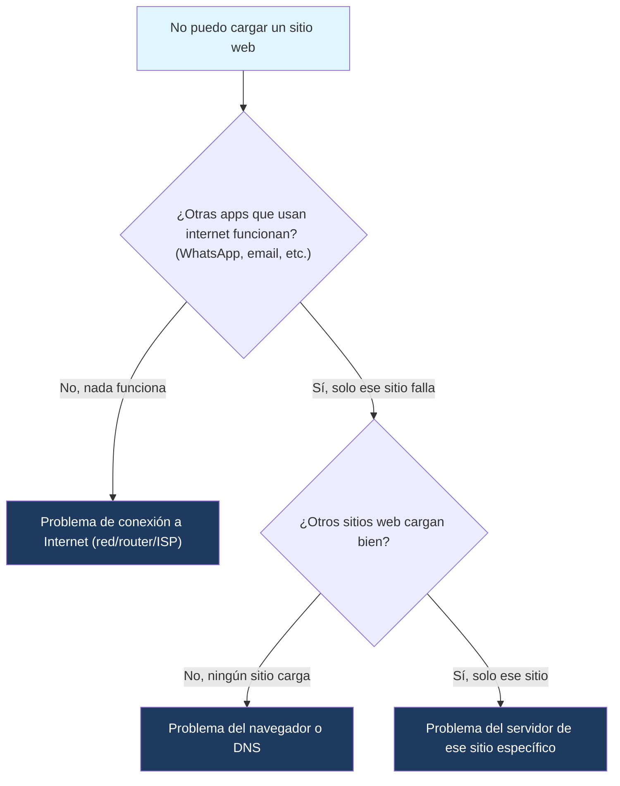

---
{"dg-publish":true,"permalink":"/universidad/2do-semestre/computacion-y-sociedad/unidad-4-historia-de-internet/01-historia-de-internet-y-como-funciona/","dg-note-properties":{}}
---

# 🌐 Historia de Internet y Cómo Funciona

## 🎯 Introducción

> [!info] 💡 ¿Qué es "Internet" y qué es "la Web"?
> 
> En el lenguaje cotidiano usamos "Internet" y "la Web" como sinónimos, pero **no son lo mismo**:
> 
> - **Internet** es la infraestructura física: la red global de computadoras, routers, y cables (incluyendo cables submarinos) que permite que los dispositivos se conecten entre sí y transmitan datos.
> - **La World Wide Web (WWW)** es un sistema de documentos interconectados (páginas web) que **corre sobre** esa infraestructura, usando navegadores, URLs y el protocolo HTTP.
> 
> Internet (con ARPANET como antecesora) existió casi **25 años antes** que la Web. La red y sus protocolos se construyeron primero; la Web fue una aplicación construida **encima** de esa red ya existente, para hacerla usable por personas comunes y no solo especialistas.
> 
> ```mermaid
> graph TD
>     A["Internet (infraestructura física)"] --> B["Redes, routers, cables"]
>     A --> C["Protocolos: TCP/IP, DNS"]
>     A --> D["World Wide Web (WWW)"]
>     D --> E["Páginas web + HTTP + URLs"]
>     A --> F["Otros usos: email, streaming, videollamadas"]
>     style A fill:#e1f5ff
>     style D fill:#1e3a5f,color:#fff
> ```

---

## 📜 Historia de las Redes de Computadoras

> [!note] 📋 De ARPANET a la Web (1967–1991)
> 
> La Internet moderna nació como un proyecto militar/académico en plena Guerra Fría, y evolucionó por décadas antes de convertirse en la Web que usamos hoy.
> 
> ```mermaid
> timeline
>     title Historia de las redes: de ARPANET a la WWW
>     1967 : RAND crea ARPANET (usado en la Guerra Fría)
>     1972 : Surge la idea de acordar protocolos comunes para la red
>     1983 : ARPANET se disgrega ; Aparece MILNET (uso militar)
>     1989 : Netware de Novell conecta PCs a un servidor de archivos
>     1990 : ARPANET desaparece ; TCP/IP sustituye a la mayoría de protocolos
>     1991 : Tim Berners-Lee crea la World Wide Web (WWW)
> ```

> [!example]- 🟢 Detalle de cada hito
> 
> - **1967 — RAND crea ARPANET:** la agencia RAND (financiada por el gobierno de EE.UU.) desarrolla ARPANET, pensada para que la comunicación militar pudiera sobrevivir a un ataque, al no depender de un único punto central.
> - **1972:** distintas instituciones conectadas a ARPANET empiezan a necesitar reglas comunes — surge la idea de **ponerse de acuerdo sobre protocolos** para que computadoras distintas pudieran "hablar el mismo idioma" en la red.
> - **1983 — ARPANET se disgrega:** la red se divide en dos: una parte se queda como red de investigación (ARPANET) y surge **MILNET**, dedicada exclusivamente a uso militar. Esta separación marca el punto donde lo militar y lo académico/civil empiezan a tomar caminos distintos.
> - **1989 — Netware de Novell:** esta tecnología permite conectar PCs personales a un servidor de archivos compartido, un paso importante para llevar redes a empresas y no solo a instituciones de investigación.
> - **1990 — Desaparece ARPANET:** la red original se retira oficialmente. **TCP/IP** (el conjunto de protocolos que ya se venía consolidando) pasa a sustituir a la mayoría de los protocolos anteriores, convirtiéndose en el estándar universal de comunicación entre redes.
> - **1991 — Tim Berners-Lee crea la WWW:** trabajando en el CERN, propone un sistema de documentos enlazados entre sí (hipertexto) accesibles a través de la red — nace la **World Wide Web**, la capa que finalmente hizo Internet accesible y utilizable para el público general.

---

## ⚙️ ¿Cómo Funciona Internet?

> [!note] 📋 Direcciones IP y DNS
> 
> Cada dispositivo conectado a Internet necesita una forma de ser identificado de manera única, igual que una casa necesita una dirección postal.
> 
> - **Dirección IP (Internet Protocol):** un número único (ej. `192.168.1.1`) que identifica a cada dispositivo dentro de una red y permite que los datos sepan a dónde llegar.
> - **DNS (Domain Name System):** como recordar números de IP sería poco práctico para las personas, el DNS funciona como una "guía telefónica" de Internet: traduce nombres fáciles de recordar (como `google.com`) a la dirección IP real del servidor donde vive ese sitio.
> - **TCP/IP:** el conjunto de reglas (protocolos) que define cómo se empaquetan, envían, enrutan y reensamblan los datos entre dispositivos, sin importar qué tipo de red o hardware use cada uno en el camino.

> [!example]- 🟢 El modelo cliente-servidor: cómo se carga una página web
> 
> Cuando escribes una URL o haces clic en un enlace, ocurre un intercambio de solicitud/respuesta entre tu computadora (**cliente**) y la computadora que aloja el sitio (**servidor**):
> 
> ```mermaid
> sequenceDiagram
>     participant U as Usuario
>     participant N as Navegador (Cliente)
>     participant D as DNS
>     participant S as Servidor Web
> 
>     U->>N: Escribe una URL
>     N->>D: ¿Qué IP corresponde a este dominio?
>     D-->>N: Devuelve la dirección IP
>     N->>S: Envía solicitud (Request) a esa IP
>     S-->>N: Responde con texto, imágenes, etc.
>     N-->>U: Muestra la página renderizada
> ```
> 
> El **navegador** es el software que arma la solicitud, la envía al servidor correcto, y cuando llega la respuesta (texto, imágenes, etc.) la interpreta y la muestra en pantalla.

---

## ⚠️ Errores Comunes

> [!warning] ⚠️ No confundir "Internet" con "la Web"
> 
> Un error frecuente es decir "no tengo Internet" cuando en realidad el problema es solo con el navegador o un sitio específico. Internet puede estar funcionando (correo, apps, videollamadas) mientras la Web tiene un problema puntual, y viceversa.

> [!warning] ⚠️ ARPANET no fue "creada por el gobierno para el público"
> 
> ARPANET nació como un proyecto de investigación con fines militares/de defensa durante la Guerra Fría, no como un servicio pensado para uso civil masivo. Su apertura al público y su transformación en la Internet actual fue un proceso gradual de décadas, no una decisión única.

---

## 🧭 Diagrama de Decisión — ¿Es un problema de Internet o de la Web?



---

## 📝 Ejercicios Progresivos

> [!question] 🟩 Nivel 1 — Básico
> 
> 1. Explica con tus propias palabras la diferencia entre "Internet" y "la World Wide Web".
> 2. ¿Qué evento de 1983 marcó una separación importante entre uso militar y uso académico/civil de la red?
> 3. ¿Qué función cumple el DNS y por qué es necesario?

> [!question] 🟨 Nivel 2 — Intermedio
> 
> 4. Ordena cronológicamente y explica brevemente qué pasó en cada año: 1967, 1983, 1990, 1991.
> 5. Describe, en orden, los pasos que ocurren desde que escribes una URL hasta que ves la página cargada (modelo cliente-servidor).

> [!question] 🟥 Nivel 3 — Avanzado
> 
> 6. Explica por qué se dice que TCP/IP "sustituyó a la mayoría de los protocolos" en 1990, y qué problema resolvía tener un protocolo estándar común.
> 7. Argumenta por qué es más preciso decir que "la Web se construyó sobre Internet" que decir que "Internet y la Web nacieron juntas".

> [!success]- ✅ Respuestas
> 
> **Nivel 1:**
> 
> 8. Internet es la infraestructura física de redes, routers y protocolos que conecta dispositivos; la Web es un sistema de documentos enlazados (páginas) que funciona sobre esa infraestructura usando HTTP y navegadores. Internet existe con o sin la Web (ej. correo, videollamadas).
> 9. ARPANET se disgregó y surgió MILNET, una red separada exclusiva para uso militar, mientras el resto siguió como red de investigación/académica.
> 10. El DNS traduce nombres de dominio fáciles de recordar (como un nombre de sitio) a la dirección IP numérica real del servidor, ya que sería poco práctico que las personas memorizaran números de IP para cada sitio que visitan.
> 
> **Nivel 2:**
> 
> 11. 1967: RAND crea ARPANET para uso en la Guerra Fría. 1983: ARPANET se disgrega y aparece MILNET (uso militar). 1990: ARPANET desaparece oficialmente y TCP/IP se convierte en el protocolo estándar. 1991: Tim Berners-Lee crea la World Wide Web.
> 12. El navegador (cliente) consulta al DNS la IP correspondiente al dominio escrito; con esa IP, envía una solicitud (request) al servidor; el servidor procesa la solicitud y responde con los datos (HTML, imágenes, etc.); el navegador recibe la respuesta y la renderiza para que el usuario la vea.
> 
> **Nivel 3:**
> 
> 13. Antes de TCP/IP como estándar único, distintas redes podían usar protocolos incompatibles entre sí, dificultando que se comunicaran. Al adoptar TCP/IP como estándar común, cualquier red o dispositivo que lo implementara podía intercambiar datos con cualquier otro, sin importar el hardware o la red de origen — esto es lo que realmente permitió que redes distintas se unieran en una sola "red de redes" (Internet).
> 14. Internet (con ARPANET como antecesora) llevaba casi 25 años funcionando como red de comunicación antes de que existiera la Web. La Web fue una aplicación específica —un sistema de documentos enlazados con HTTP y navegadores— que Tim Berners-Lee construyó aprovechando una infraestructura de red que ya existía, no una tecnología que apareció al mismo tiempo que la propia red.

---

## 🎯 Metas de Aprendizaje

> [!success] ✅ Nivel Básico
> 
> - [ ] Puedo explicar la diferencia entre Internet y la World Wide Web.
> - [ ] Conozco los hitos principales de la historia de las redes (ARPANET, MILNET, TCP/IP, WWW).
> - [ ] Entiendo para qué sirve el DNS.

> [!success] ✅ Nivel Intermedio
> 
> - [ ] Puedo describir el modelo cliente-servidor y los pasos al cargar una página web.
> - [ ] Puedo ubicar cronológicamente los hitos clave de 1967 a 1991.

> [!success] ✅ Nivel Avanzado
> 
> - [ ] Puedo explicar por qué TCP/IP fue clave para conectar redes distintas entre sí.
> - [ ] Puedo argumentar por qué Internet y la Web no nacieron al mismo tiempo, y qué implica eso.

---

## 📚 Referencias y Conexiones

> [!quote] 📖 Fuentes consultadas
> 
> [1] Material de clase — Unidad 4: Internet, Computación y Sociedad. [2] Leiner, B. M., et al. (2009). _A Brief History of the Internet_. ACM SIGCOMM Computer Communication Review.

> [!quote] 🔗 Conexiones
> 
> - [[Universidad/2do Semestre/Computación y Sociedad/Unidad 4 - Historia de Internet/02 - Evolución de la Web\|02 - Evolución de la Web]] — continúa esta historia: qué pasó con la Web una vez creada en 1991.
> - [[Universidad/2do Semestre/Computación y Sociedad/Unidad 4 - Historia de Internet/03 - Evolución del HTML\|03 - Evolución del HTML]] — el lenguaje que hizo posible la Web que describe esta nota.

---

**Tags:** #computacion-y-sociedad #internet #historia-de-internet #arpanet #unidad4