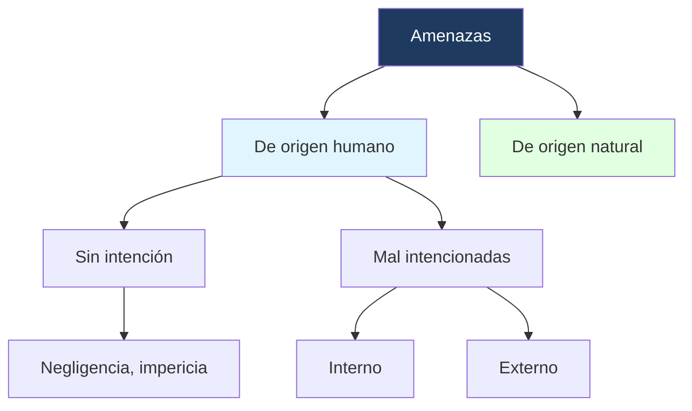
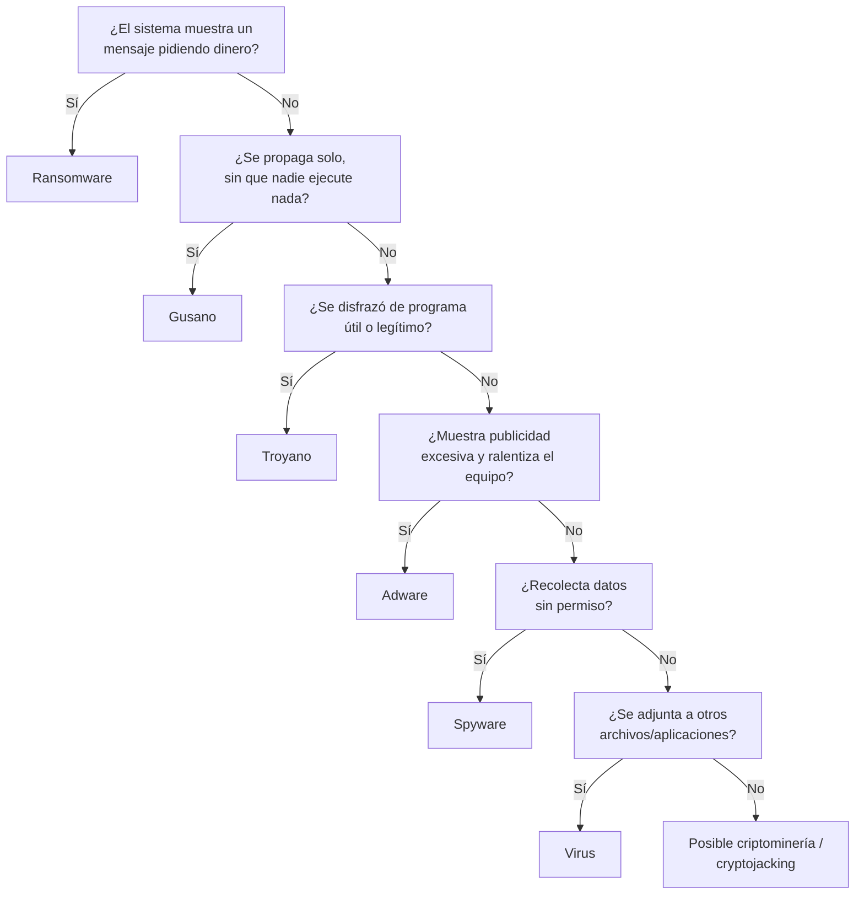

---
{"dg-publish":true,"permalink":"/universidad/2do-semestre/computacion-y-sociedad/unidad-4-historia-de-internet/04-crimenes-informaticos-y-malware/","dg-note-properties":{}}
---


# 🛡️ Crímenes Informáticos y Malware

## 🎯 Introducción

> [!info] 💡 ¿Tu información personal está protegida?
> 
> Antes de entrar en definiciones, vale la pena hacerse la pregunta que abrió la clase: **¿tu información personal se encuentra protegida? ¿Qué has hecho para protegerla?** La mayoría de los crímenes informáticos y del malware que veremos en esta nota existen precisamente porque esa pregunta rara vez tiene una respuesta sólida.
> 
> ```mermaid
> graph TD
>     A[Crimen Informático] --> B[Obtención de info<br/>personal/financiera]
>     A --> C[Manipulación de datos]
>     A --> D[Actos de sabotaje]
>     D --> E[Malware]
>     E --> F[Virus]
>     E --> G[Gusano]
>     E --> H[Troyano]
>     E --> I[Spyware / Adware]
>     E --> J[Ransomware]
>     E --> K[Criptominería]
>     style A fill:#1e3a5f,color:#fff
>     style E fill:#5f1e1e,color:#fff
> ```

---

## 📋 Crimen Informático

> [!note] 📋 Definición — Crimen informático
> 
> Un **crimen informático** (computer crime) es **cualquier actividad ilegal que usa una computadora** como herramienta, objetivo o medio. Incluye tres grandes categorías:
> 
> - **Obtención de información personal o financiera** sin autorización.
> - **Manipulación de los datos** (alterar, borrar o falsificar información).
> - **Actos de sabotaje** — virus, caídas de servidor provocadas intencionalmente, etc.

> [!example] 📝 Ejemplo — Robo de activos o información financiera
> 
> Uno de los casos más comunes de crimen informático es el **robo de activos o información financiera**: un atacante accede a cuentas bancarias, tarjetas de crédito o sistemas de pago para sustraer dinero o datos que luego puede vender o usar directamente.

---

## 🌳 Origen de las Amenazas

> [!note] 🌳 Clasificación por origen
> 
> Toda amenaza informática puede clasificarse según su origen:



> [!warning] 📋 Interno vs. Externo — no confundir
> 
> - **Amenaza mal intencionada interna**: proviene de alguien dentro de la organización (un empleado, por ejemplo) que abusa de su acceso legítimo.
> - **Amenaza mal intencionada externa**: proviene de un atacante sin acceso previo autorizado al sistema.
> - **Sin intención** no significa "sin daño": la negligencia o la impericia (falta de pericia/experiencia) pueden causar el mismo impacto que un ataque deliberado.

---

## 🦠 Malware: Concepto General

> [!note] 📋 Definición — Malware
> 
> **Malware** es el acrónimo, en inglés, de *malicious* + *software*, es decir, **software malicioso**. Se puede considerar malware **todo programa con algún fin dañino**, aunque algunas amenazas modernas combinan características de varios tipos a la vez.

---

## 🧬 Tipos de Malware

### Virus informático

> [!note] 🦠 Virus informático
> 
> Un **virus** es un programa creado para **copiarse y propagarse a sí mismo**, normalmente adjuntándose a otras aplicaciones. Cuando se ejecuta una aplicación infectada, el virus puede infectar otros archivos.
> 
> **Requiere acción humana** para propagarse entre máquinas y sistemas: descargar archivos, intercambiar USB/disquetes, copiar archivos hacia o desde servidores, o enviar adjuntos de correo infectados.

### Gusano (Worm)

> [!note] 🪱 Gusano
> 
> El **gusano** es muy parecido a un virus, pero se diferencia en **cómo se infecta**: se copia a sí mismo entre ordenadores, infectando a otros y **propagándose automáticamente en una red, sin necesitar acción humana**.

> [!warning] ⚠️ Virus vs. Gusano — la diferencia clave
> 
> El criterio que distingue a ambos NO es el daño que causan, sino **si necesitan que un humano ejecute algo** para propagarse. Virus: sí. Gusano: no, se propaga solo por la red.

### Troyano

> [!note] 🐴 Troyano
> 
> Un **troyano** es un programa malware capaz de introducirse en el sistema **permitiendo el acceso a usuarios externos**, a través de una red local o de Internet, con el fin de **controlar el ordenador o robar información sin afectar visiblemente su funcionamiento**. Su nombre viene, como es de esperar, del caballo de Troya: se presenta como algo inofensivo o útil para lograr que el usuario lo instale.

### Spyware

> [!note] 🕵️ Spyware
> 
> Es aquel malware que, **sin permiso ni conciencia del afectado, adquiere información privada** para beneficio propio o de terceros.

### Adware

> [!note] 📢 Adware
> 
> Su nombre viene de la combinación de **AD**vertisement (anuncio) + soft**WARE**. Es un programa malicioso que **se instala sin que el usuario lo note**, y cuya función es descargar y mostrar anuncios publicitarios (ventanas emergentes que pueden aparecer incluso sin estar navegando).
> 
> - No modifica explícitamente el sistema operativo, pero **sí disminuye el rendimiento** del equipo y de la navegación, porque consume procesador, memoria y ancho de banda.
> - Por lo general usa información recopilada por algún **spyware** para decidir qué publicidad mostrar — es común que ambos trabajen juntos.

### Ransomware

> [!note] 🔒 Ransomware
> 
> El **ransomware** es software malicioso que infecta un equipo y **muestra mensajes que exigen el pago de dinero** para restablecer el funcionamiento del sistema. Su función es "secuestrar" información del usuario, ya sea **bloqueando la pantalla** del computador o **cifrando archivos importantes** con una contraseña que solo el atacante conoce.
> 
> Se propaga típicamente a través de enlaces engañosos en correo electrónico, mensajería instantánea o sitios web.

### Criptominería Malware (Cryptojacking)

> [!note] ⛏️ Criptominería malware
> 
> Anteriormente, la mayoría de los códigos de criptominería maliciosos trataban de **descargar y ejecutar un programa de minado** en el dispositivo de la víctima. Sin embargo, una forma de malware más reciente y popular **mina directamente a través del navegador**, con un simple script en JavaScript — sin necesidad de instalar ningún software.
> 
> Este método se conoce como **cryptojacking**, y provoca la misma actividad maliciosa (uso no autorizado de recursos del equipo para minar criptomonedas) sin dejar rastro de instalación.

---

## 📊 Tabla Comparativa de Malware

> [!note] 📊 Comparación de los tipos de malware
> 
> | Tipo | ¿Necesita acción humana para propagarse? | ¿Cómo actúa? | Objetivo principal |
> |---|---|---|---|
> | **Virus** | Sí (ejecutar archivo infectado) | Se adjunta a aplicaciones/archivos | Propagarse e infectar |
> | **Gusano** | No (se propaga solo en red) | Se copia automáticamente entre equipos | Propagarse masivamente |
> | **Troyano** | Sí (instalar algo disfrazado) | Se disfraza de programa útil | Dar acceso remoto al atacante |
> | **Spyware** | Sí (instalación oculta) | Recolecta información sin permiso | Robar información |
> | **Adware** | Sí (instalación oculta) | Muestra publicidad forzada | Lucrar con anuncios |
> | **Ransomware** | Sí (abrir enlace/adjunto) | Cifra o bloquea el sistema | Extorsionar por dinero |
> | **Criptominería** | Sí o No (script en navegador) | Usa recursos del equipo para minar | Generar criptomonedas gratis |

---

## 🧭 Flujograma de Decisión — ¿Qué tipo de malware podría ser?



---

## 🖥️ Aplicación Práctica

> [!tip] 🖥️ Cómo se ve esto en la práctica
> 
> Si en tu computador notas que el ventilador trabaja al máximo y todo va lento **sin que estés haciendo nada pesado**, revisa el uso de CPU en el administrador de tareas — podría ser cryptojacking corriendo en una pestaña del navegador que dejaste abierta. Cerrar la pestaña suele detenerlo de inmediato, a diferencia de un virus o troyano instalado, que persiste tras reiniciar.

---

## 📝 Ejercicios Progresivos

> [!question] 📋 Nivel 1 — Identificación básica
> 
> 1. Un programa se copia a sí mismo entre computadoras de una red sin que nadie haga clic en nada. ¿Qué tipo de malware es?
> 2. ¿Cuál es la diferencia principal entre spyware y adware?
> 3. Menciona las tres categorías generales de crimen informático según la definición vista en clase.

> [!success]- ✅ Respuestas — Nivel 1
> 
> 1. Un **gusano**, porque se propaga automáticamente sin necesitar acción humana.
> 2. El spyware **recolecta información** de forma oculta para beneficio de terceros; el adware **muestra publicidad** de forma forzada (aunque muchas veces usa datos recolectados por spyware para decidir qué anunciar).
> 3. Obtención de información personal/financiera, manipulación de datos, y actos de sabotaje.

> [!question] 📋 Nivel 2 — Análisis de casos
> 
> 4. Un empleado descontento borra registros financieros de su propia empresa antes de renunciar. ¿Es una amenaza de origen humano interna o externa? ¿Con o sin intención?
> 5. Recibes un archivo "gratis_antivirus.exe" de una página desconocida, lo ejecutas, y luego un desconocido tiene control remoto de tu PC. ¿Qué tipo de malware fue?
> 6. Explica por qué el cryptojacking es más difícil de detectar que un ransomware tradicional.

> [!success]- ✅ Respuestas — Nivel 2
> 
> 4. Es una amenaza de **origen humano, mal intencionada, interna**.
> 5. Un **troyano** — se disfrazó de software legítimo (antivirus) para lograr acceso remoto.
> 6. El ransomware **se anuncia a sí mismo** (exige pago explícitamente), mientras que el cryptojacking **busca pasar desapercibido** el mayor tiempo posible para seguir minando; además, al correr solo vía JavaScript en el navegador, no deja instalación visible en el sistema.

> [!question] 📋 Nivel 3 — Aplicación y síntesis
> 
> 7. Diseña un escenario breve (2-3 líneas) donde un mismo ataque combine características de troyano y ransomware.
> 8. ¿Por qué crees que la clasificación "sin intención / mal intencionada" es importante para una empresa al momento de definir políticas de seguridad?
> 9. Compara virus y gusano en términos de velocidad de propagación potencial. ¿Cuál esperarías que se extienda más rápido en una red corporativa y por qué?

> [!success]- ✅ Respuestas — Nivel 3
> 
> 7. Un usuario descarga un archivo adjunto disfrazado de factura (**troyano**), que al ejecutarse instala silenciosamente un segundo programa que cifra los archivos del disco y exige pago (**ransomware**) — muchos ataques reales combinan ambas etapas.
> 8. Porque las medidas de mitigación son distintas: contra amenazas **sin intención** se refuerza la capacitación y los procesos (evitar negligencia/impericia); contra amenazas **mal intencionadas** se refuerzan controles de acceso, monitoreo y auditoría, especialmente para amenazas internas.
> 9. El **gusano** se esperaría más rápido, porque no depende de que cada usuario ejecute algo manualmente — se propaga automáticamente aprovechando la conectividad de la red, mientras que el virus necesita que la acción humana (abrir un archivo) se repita en cada máquina.

---

## 🎯 Metas de Aprendizaje

> [!success] ✅ Nivel Básico
> 
> - [ ] Puedo definir qué es un crimen informático y nombrar sus tres categorías.
> - [ ] Puedo nombrar al menos 5 tipos de malware vistos en clase.
> - [ ] Entiendo la clasificación de amenazas por origen (humano/natural, con/sin intención, interno/externo).

> [!success] ✅ Nivel Intermedio
> 
> - [ ] Puedo diferenciar virus de gusano según su forma de propagación.
> - [ ] Puedo explicar cómo funciona el cryptojacking y por qué es distinto de la criptominería malware "clásica".
> - [ ] Puedo identificar el tipo de malware descrito en un escenario concreto.

> [!success] ✅ Nivel Avanzado
> 
> - [ ] Puedo argumentar por qué ciertos ataques reales combinan varios tipos de malware en distintas etapas.
> - [ ] Puedo proponer medidas de mitigación distintas según el origen de la amenaza (interna/externa, con/sin intención).
> - [ ] Puedo comparar la velocidad y el vector de propagación de los distintos tipos de malware entre sí.

---

## 📚 Referencias

> [!quote] 📖 Fuentes consultadas
> 
> [1] Material de clase, *Computación y Sociedad*, Unidad — Ciberseguridad y Privacidad, diapositivas sobre crímenes informáticos y malware.

## 🔗 Conexiones

> [!quote] 🔗 Notas relacionadas
> 
> - [[Universidad/2do Semestre/Computación y Sociedad/Unidad 4 - Historia de Internet/05 - Ingeniería Social y Fraudes en Línea\|05 - Ingeniería Social y Fraudes en Línea]]
> - [[Universidad/2do Semestre/Computación y Sociedad/Unidad 4 - Historia de Internet/06 - Sabotaje y Ataques de Red\|06 - Sabotaje y Ataques de Red]]
> - [[Universidad/2do Semestre/Computación y Sociedad/Unidad 4 - Historia de Internet/07 - Privacidad y Protección de Datos\|07 - Privacidad y Protección de Datos]]

---

**Tags:** #computacion-y-sociedad #ciberseguridad #malware #crimenes-informaticos #ESPOL
