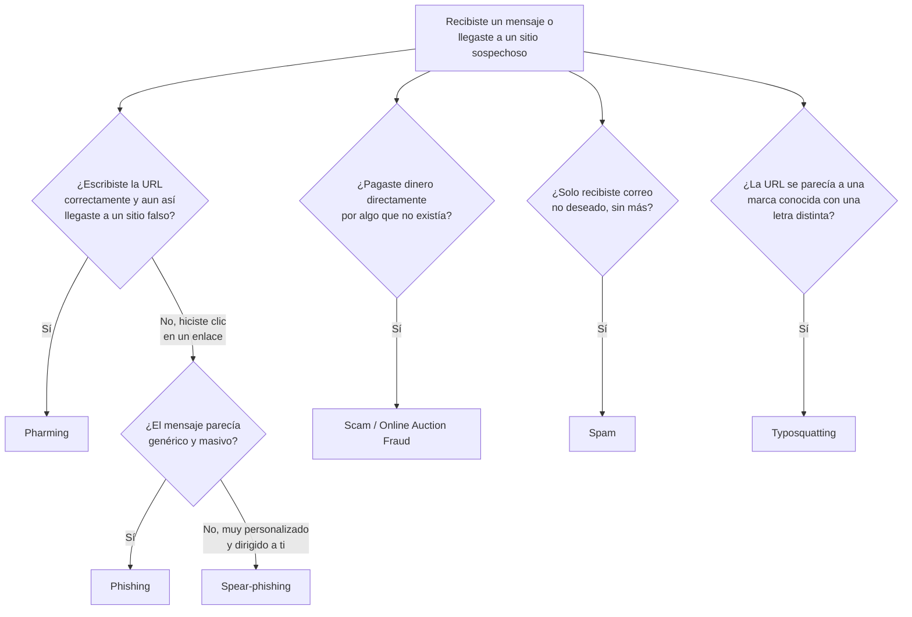

---
{"dg-publish":true,"permalink":"/universidad/2do-semestre/computacion-y-sociedad/unidad-4-historia-de-internet/05-ingenieria-social-y-fraudes-en-linea/","dg-note-properties":{}}
---


# 🎭 Ingeniería Social y Fraudes en Línea

## 🎯 Introducción

> [!info] 💡 El eslabón más débil no es la máquina, eres tú
> 
> No todas las amenazas informáticas atacan directamente al software. Muchas atacan **a la persona**: la manera más eficiente de vulnerar un sistema no siempre es romper el cifrado, sino simplemente **convencer al usuario de que entregue la llave**. Esa es la lógica detrás de toda esta nota.
> 
> ```mermaid
> graph TD
>     A[Ingeniería Social] --> B[Phishing]
>     A --> C[Spear-phishing]
>     A --> D[Pharming]
>     A --> E[Spam]
>     A --> F[Scam]
>     A --> G[Typosquatting]
>     A --> H[Fraude en subastas online]
>     style A fill:#1e3a5f,color:#fff
> ```

---

## 🎭 Ingeniería Social — El Concepto Base

> [!note] 📋 Definición — Ingeniería social
> 
> La **ingeniería social** es una acción o conducta social destinada a obtener información de las personas cercanas por medio de **habilidades sociales**, no técnicas. Se busca que el usuario **comprometa el sistema y revele información valiosa** por medio de variados tipos de engaños, tretas y artimañas.
> 
> Dos formas típicas en que esto ocurre:
> 
> - El usuario es tentado a realizar una acción que vulnera o daña un sistema, por ejemplo, recibiendo un mensaje que lo lleva a **abrir un archivo adjunto**.
> - El usuario es llevado a **confiar información necesaria** para que el atacante realice una acción fraudulenta con los datos obtenidos — como ocurre en el scam y el phishing.

> [!warning] ⚠️ Por qué funciona
> 
> La ingeniería social no explota una vulnerabilidad de software — explota **tendencias humanas naturales**: confiar en una fuente que parece conocida, querer ayudar, actuar rápido ante una urgencia, o evitar el conflicto. Por eso, phishing, spear-phishing y scam son en realidad **variaciones específicas** de esta misma técnica base, no amenazas independientes entre sí.

---

## 🎣 Phishing

> [!note] 🎣 Definición — Phishing
> 
> El **phishing** consiste en el **robo de información personal de los usuarios sin su permiso** (principalmente de acceso a servicios financieros). Utiliza el correo basura (**spam**) para difundirse: una vez que el correo llega al destinatario, intenta engañarlo para que **facilite datos de carácter personal** (número de cuenta, contraseña, número de seguridad social, etc.), normalmente ingresándolos en un sitio falso que imita a uno legítimo.

### Spear-phishing

> [!note] 🎯 Definición — Spear-phishing
> 
> El **spear-phishing** es una variante **dirigida y personalizada** del phishing: el mensaje parece provenir de una identidad — una persona o marca — **conocida y de confianza** para el destinatario.
> 
> **Cómo funciona:**
> 
> 1. El atacante **identifica un objetivo** e investiga a la víctima.
> 2. Envía un correo **dirigido y con apariencia legítima**.
> 3. La víctima **abre un correo que contiene malware**.
> 4. El atacante **usa ese acceso para robar datos** del equipo o la red de la víctima.

> [!note] 📊 Phishing vs. Spear-phishing
> 
> | Característica | Phishing | Spear-phishing |
> |---|---|---|
> | **Alcance** | Amplio, masivo (como pescar con red) | Dirigido a un individuo o empresa específica |
> | **Sofisticación** | Baja — ataque automatizado y genérico | Alta — ataque personalizado (como pescar con arpón) |
> | **Investigación previa** | Mínima o nula | El atacante investiga a la víctima |
> | **Tasa de éxito por víctima** | Baja, pero compensa con volumen | Más alta, por la personalización |

### Pharming

> [!note] 🌐 Definición — Pharming
> 
> El **pharming** redirecciona con mala intención al usuario hacia un **sitio web falso**, mediante la explotación del sistema **DNS** — de ahí que también se le llame **secuestro o envenenamiento del DNS**. Consiste en cambiar las rutas (host) para atrapar víctimas sin que estas noten nada extraño en la barra de direcciones.

> [!warning] ⚠️ Phishing vs. Pharming — la diferencia clave
> 
> En el **phishing**, la víctima debe hacer clic en un enlace engañoso (normalmente desde un correo). En el **pharming**, el usuario puede escribir la dirección correcta y aun así ser **redirigido automáticamente** a un sitio falso, porque el ataque ocurre a nivel de DNS, no del enlace.

---

## ✉️ Spam y 🎭 Scam

> [!note] ✉️ Spam
> 
> Es **todo correo no deseado recibido** por el destinatario, que viene de un envío automático y masivo por parte de quien lo emite. Generalmente se asocia al correo electrónico personal, pero no solo afecta a este — también a foros, blogs y grupos de noticias.

> [!note] 🎭 Scam
> 
> Es el nombre utilizado para las **estafas a través de medios tecnológicos**. Los medios utilizados por el scam son similares a los que utiliza el phishing; sin embargo, su objetivo **no es obtener datos, sino lucrar directamente a través del engaño**.

---

## 🌐 Typosquatting

> [!note] ⌨️ Definición — Typosquatting
> 
> El **typosquatting** (riesgo de dominios similares) ocurre cuando alguien registra un dominio **casi idéntico** a uno legítimo, aprovechando errores comunes al escribir la URL.

> [!example] 📝 Ejemplo — El caso de McDonald's
> 
> La dirección legítima podría ser `www.macdonalds.com`. Si una persona escribe esa dirección pero omite la última "s", lo normal sería que el navegador marque un error. Ahí es donde entra el **typosquatter**, quien registra la dirección `www.mcdonald.com` — la gente que teclea mal la URL termina en una página con publicidad (o algo peor).

---

## 🛒 Fraude en Subastas en Línea (Online Auction Fraud)

> [!note] 🛒 Definición — Online Auction Fraud
> 
> Es una modalidad de fraude donde se crean páginas falsas que imitan sitios de subastas o instituciones legítimas (por ejemplo, imitando a un gobierno o entidad conocida), con una **URL falsa**, para atraer víctimas a "participar" en subastas de vehículos, inmuebles o mercancía diversa que nunca existió.

---

## 🧭 Flujograma de Decisión — ¿Qué tipo de fraude es?



---

## 🖥️ Aplicación Práctica

> [!tip] 🖥️ Cómo protegerte en la práctica
> 
> - Verifica siempre el **dominio exacto** de la URL antes de ingresar credenciales (no solo el "candado" de HTTPS — eso solo indica cifrado, no legitimad del sitio).
> - Ante un correo "urgente" de tu banco o universidad pidiendo confirmar datos, **no hagas clic**: entra directamente escribiendo la dirección oficial en el navegador.
> - Si el mensaje usa tu nombre, tu cargo o detalles muy específicos de tu vida, sospecha aún más — es la marca del **spear-phishing**, no del phishing genérico.

---

## 📝 Ejercicios Progresivos

> [!question] 📋 Nivel 1 — Identificación básica
> 
> 1. ¿Cuál es la diferencia principal entre scam y phishing en cuanto a su objetivo final?
> 2. Un correo masivo y no solicitado que recibes en tu bandeja de entrada, ¿cómo se llama?
> 3. Define con tus palabras qué es la ingeniería social.

> [!success]- ✅ Respuestas — Nivel 1
> 
> 1. El **phishing** busca **obtener datos** personales o financieros; el **scam** busca **lucrar directamente** engañando a la víctima, sin necesariamente robar datos primero.
> 2. **Spam**.
> 3. Es una técnica que usa habilidades sociales (engaño, manipulación, urgencia) para lograr que una persona revele información o realice una acción que compromete un sistema — sin explotar ninguna falla técnica.

> [!question] 📋 Nivel 2 — Análisis de casos
> 
> 4. Escribiste correctamente `www.tubanco.com` en el navegador, pero terminaste en una página que no es la de tu banco. ¿Qué tipo de ataque es y por qué NO es phishing?
> 5. Recibes un correo de "premios@correo-falso.com" ofreciendo un premio genérico a miles de personas. ¿Phishing o spear-phishing? Justifica.
> 6. ¿Por qué el typosquatting es más peligroso en dominios que se parecen visualmente (ej. "rn" vs "m") que en dominios con errores obvios?

> [!success]- ✅ Respuestas — Nivel 2
> 
> 4. Es **pharming**, porque el ataque ocurre a nivel de DNS: aunque escribiste la dirección correcta, el sistema te redirigió a un sitio falso. No es phishing porque el phishing depende de que la víctima haga clic en un enlace engañoso, no de escribir mal nada.
> 5. Es **phishing** genérico, no spear-phishing: el mensaje es masivo, no está dirigido específicamente a ti ni usa información personal tuya — es la característica de un ataque "de red amplia", no "de arpón".
> 6. Porque los errores visualmente casi idénticos (como "rn" que se parece a "m") son mucho más difíciles de detectar a simple vista que un error obvio de tipeo, lo que aumenta la tasa de víctimas que no notan la diferencia.

> [!question] 📋 Nivel 3 — Aplicación y síntesis
> 
> 7. Diseña un escenario de ataque combinado que use typosquatting como primer paso y termine en un scam.
> 8. ¿Por qué se dice que todas las técnicas de esta nota son "variaciones de ingeniería social" y no amenazas completamente independientes?
> 9. Si tuvieras que priorizar la capacitación de una empresa en solo una de estas amenazas por ser la más difícil de detectar técnicamente, ¿cuál elegirías y por qué?

> [!success]- ✅ Respuestas — Nivel 3
> 
> 7. Un usuario escribe mal la URL de una tienda conocida y llega a un dominio de typosquatting que imita perfectamente el sitio original; ahí se le ofrece una "oferta exclusiva" que debe pagar por adelantado — el pago nunca resulta en un producto real, consumando el **scam**.
> 8. Porque en el fondo, todas dependen de **manipular el comportamiento humano** (confianza, urgencia, desconocimiento) en lugar de explotar una falla puramente técnica del sistema; la ingeniería social es el principio, y phishing/scam/pharming/typosquatting son sus implementaciones concretas.
> 9. El **pharming**, porque a diferencia del phishing (que requiere que la víctima cometa un error visible, como hacer clic en un enlace sospechoso), el pharming puede engañar incluso a un usuario que escribe la URL correctamente y revisa el candado HTTPS — el ataque ocurre en una capa que el usuario normal no puede verificar directamente.

---

## 🎯 Metas de Aprendizaje

> [!success] ✅ Nivel Básico
> 
> - [ ] Puedo definir ingeniería social y explicar por qué es la base de las demás amenazas de esta nota.
> - [ ] Puedo distinguir spam de scam.
> - [ ] Puedo reconocer un ejemplo de typosquatting.

> [!success] ✅ Nivel Intermedio
> 
> - [ ] Puedo diferenciar phishing de spear-phishing según el grado de personalización del ataque.
> - [ ] Puedo explicar por qué el pharming es más difícil de detectar que el phishing.
> - [ ] Puedo identificar qué tipo de fraude corresponde a un escenario dado.

> [!success] ✅ Nivel Avanzado
> 
> - [ ] Puedo diseñar un escenario de ataque combinado que use más de una de estas técnicas en distintas etapas.
> - [ ] Puedo argumentar cuál de estas amenazas es más difícil de mitigar solo con capacitación al usuario, y por qué.
> - [ ] Puedo explicar la relación jerárquica entre ingeniería social (concepto base) y sus variantes específicas.

---

## 📚 Referencias

> [!quote] 📖 Fuentes consultadas
> 
> [1] Material de clase, *Computación y Sociedad*, Unidad — Ciberseguridad y Privacidad, diapositivas sobre ingeniería social, phishing, pharming y fraudes en línea.

## 🔗 Conexiones

> [!quote] 🔗 Notas relacionadas
> 
> - [[Universidad/2do Semestre/Computación y Sociedad/Unidad 4 - Historia de Internet/04 - Crímenes Informáticos y Malware\|04 - Crímenes Informáticos y Malware]]
> - [[Universidad/2do Semestre/Computación y Sociedad/Unidad 4 - Historia de Internet/06 - Sabotaje y Ataques de Red\|06 - Sabotaje y Ataques de Red]]
> - [[Universidad/2do Semestre/Computación y Sociedad/Unidad 4 - Historia de Internet/07 - Privacidad y Protección de Datos\|07 - Privacidad y Protección de Datos]]

---

**Tags:** #computacion-y-sociedad #ciberseguridad #ingenieria-social #phishing #fraude #ESPOL
