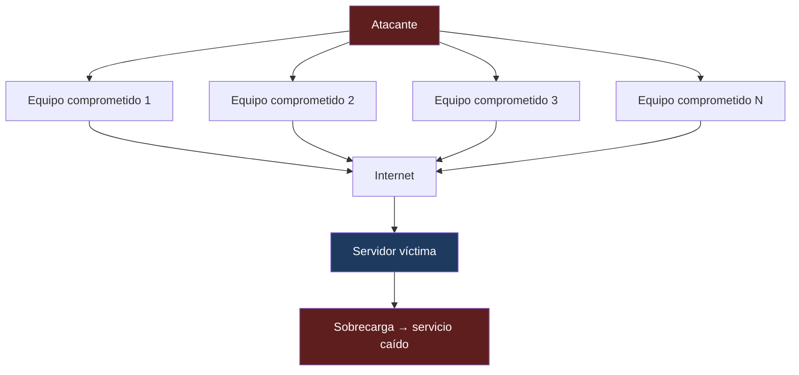
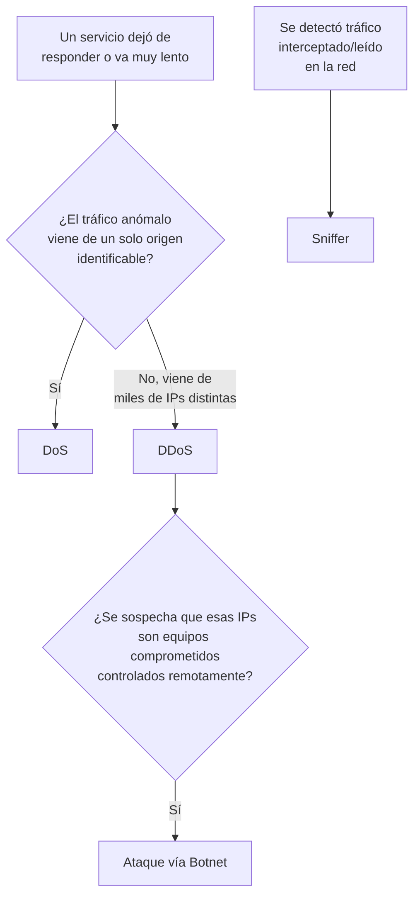

---
{"dg-publish":true,"permalink":"/universidad/2do-semestre/computacion-y-sociedad/unidad-4-historia-de-internet/06-sabotaje-y-ataques-de-red/","dg-note-properties":{}}
---


# 💥 Sabotaje y Ataques de Red

## 🎯 Introducción

> [!info] 💡 Cuando el ataque no busca robar, sino tumbar
> 
> No todo ataque informático busca robar información. Algunos tienen un objetivo distinto: **interrumpir un servicio**, dejarlo inaccesible, o simplemente **observar el tráfico** que circula por una red para recolectar información sin que nadie lo note. Esta nota cubre esas dos familias de ataque: el **sabotaje de servicios** (DoS/DDoS) y la **interceptación de tráfico** (sniffers, botnets como infraestructura).
> 
> ```mermaid
> graph TD
>     A[Ataques de Red] --> B[Sabotaje de Servicios]
>     A --> C[Interceptación de Tráfico]
>     B --> D[DoS]
>     B --> E[DDoS]
>     E --> F[Botnets]
>     C --> G[Sniffer]
>     style A fill:#1e3a5f,color:#fff
> ```

---

## 🕵️ Sniffer (Interceptar)

> [!note] 📋 Definición — Sniffer
> 
> Un **sniffer** es una herramienta (o técnica) que **intercepta y analiza el tráfico de datos** que circula por una red. Un atacante conectado a la misma red puede "escuchar" el tráfico que pasa entre otros equipos y capturar información sensible que viaje sin cifrar (contraseñas, mensajes, datos de sesión).

> [!warning] ⚠️ Por qué el cifrado importa aquí
> 
> Un sniffer no "roba" nada activamente — solo **observa**. Por eso la defensa no es evitar que alguien escuche, sino asegurarse de que lo que escuche **no sirva de nada**: si el tráfico va cifrado (HTTPS, VPN), un sniffer puede capturar los paquetes, pero no puede leer su contenido.

---

## 💥 Sabotaje de Servicios: DoS y DDoS

> [!note] 📋 Definición — DoS (Denial of Service)
> 
> Un ataque de **denegación de servicio (DoS)** es un acto de sabotaje que **intenta inundar un servidor de red o servidor web con tantas solicitudes de acción** que este se **apaga o simplemente no puede atender solicitudes legítimas**, dejando a los usuarios reales sin servicio.

> [!note] 📋 Definición — DDoS (Distributed Denial of Service)
> 
> El **DDoS** es una ampliación del ataque DoS: el ataque de **denegación de servicio distribuido** se lleva a cabo generando un gran flujo de información desde **varios puntos de conexión** hacia un mismo punto de destino.
> 
> La forma más común de realizar un DDoS es a través de una **red de bots (botnet)**, siendo esta técnica el ciberataque más usual y eficaz por su **sencillez tecnológica**.



> [!warning] ⚠️ DoS vs. DDoS — no confundir
> 
> - **DoS**: un solo origen ataca a un solo destino.
> - **DDoS**: **múltiples orígenes** (normalmente una botnet) atacan al mismo destino simultáneamente — por eso es mucho más difícil de bloquear (no basta con bloquear una sola IP).

---

## 🤖 Botnets: La Infraestructura Detrás del DDoS

> [!note] 🤖 Definición — Bot / Botnet
> 
> Un **bot** es un equipo comprometido que un atacante controla de forma remota, generalmente sin que su dueño lo sepa. Un conjunto de estos equipos forma una **red de bots (botnet)**, que el atacante — a menudo llamado "pastor" (*herder*) en el argot del sector — puede alquilar o utilizar directamente para lanzar ataques.
> 
> **Cómo funciona la cadena:**
> 
> - Una **"mafia web"** o comerciantes maliciosos contratan **afiliados**.
> - El **pastor** administra la red de bots y coordina con **expertos** que aportan herramientas (worms, vulnerabilidades, P2P, descargas).
> - La red de bots ejecuta ataques hacia las víctimas: **spam, DDoS, phishing, spyware, lanzamiento de malware**.

> [!tip] 🖥️ Por qué las botnets son un modelo de negocio
> 
> Las botnets no son solo una herramienta técnica — son parte de una economía criminal: se alquilan por tiempo (ej. "$00/semana"), prometen disponibilidad casi permanente y se actualizan constantemente. Esto explica por qué el DDoS es "el ciberataque más usual y eficaz por su sencillez tecnológica": el atacante no necesita programar nada, solo **alquilar acceso** a una infraestructura ya construida por terceros.

---

## 🌐 Ejemplo Real — Servidor Web Bajo Ataque

> [!example] 📝 Ejemplo — Monitoreo de un servidor comprometido
> 
> En clase se mostró una captura del estado de un servidor Apache (`Apache Server Status`) mientras recibía tráfico anómalo — este tipo de panel permite ver en tiempo real cuántas conexiones está atendiendo el servidor, cuántas solicitudes por segundo procesa, y el uso de CPU. Un salto repentino y sostenido en estas métricas, sin una razón de negocio que lo explique (como una campaña de marketing), es una de las señales típicas de un ataque DoS/DDoS en curso.

---

## 🧭 Flujograma de Decisión — ¿Qué tipo de ataque de red es?



---

## 🖥️ Aplicación Práctica

> [!tip] 🖥️ Cómo se mitigan estos ataques en la práctica
> 
> - Contra **sniffers**: usar cifrado extremo a extremo (HTTPS, VPN) para que el tráfico interceptado sea inútil aunque se capture.
> - Contra **DoS/DDoS**: servicios de mitigación que filtran tráfico anómalo antes de que llegue al servidor (CDNs con protección anti-DDoS, límites de tasa por IP, balanceo de carga entre varios servidores).
> - Contra **botnets** como amenaza propia: mantener el software actualizado y usar antivirus/firewall reduce la probabilidad de que **tu** equipo termine siendo parte de una botnet ajena.

---

## 📝 Ejercicios Progresivos

> [!question] 📋 Nivel 1 — Identificación básica
> 
> 1. ¿Qué diferencia hay entre un sniffer y un ataque DoS en cuanto a su objetivo?
> 2. Define con tus palabras qué es una botnet.
> 3. ¿Por qué el DDoS es más difícil de bloquear que el DoS?

> [!success]- ✅ Respuestas — Nivel 1
> 
> 1. El **sniffer** busca **observar/interceptar** tráfico sin interrumpir el servicio; el **DoS** busca **interrumpir** el servicio saturándolo de solicitudes.
> 2. Es una red de equipos comprometidos, controlados remotamente por un atacante sin que sus dueños lo sepan, usada para ejecutar ataques coordinados (spam, DDoS, phishing, etc.).
> 3. Porque el tráfico proviene de **múltiples orígenes distintos** simultáneamente, por lo que bloquear una sola IP no detiene el ataque — habría que bloquear miles de IPs diferentes.

> [!question] 📋 Nivel 2 — Análisis de casos
> 
> 4. Un e-commerce nota que sus servidores reciben 100 veces más tráfico del normal, desde direcciones IP repartidas en decenas de países, justo el día de una promoción importante. ¿Qué deberían verificar antes de asumir que es un ataque?
> 5. ¿Por qué se dice que las botnets convierten el DDoS en un "servicio" más que en una habilidad técnica?
> 6. Si tu tráfico de red va cifrado con HTTPS, ¿un sniffer sigue siendo una amenaza? Explica qué sí y qué no puede ver el atacante.

> [!success]- ✅ Respuestas — Nivel 2
> 
> 4. Deberían verificar si el aumento de tráfico **coincide con un evento legítimo** (la promoción) y si las solicitudes tienen patrones de comportamiento humano normal (navegación variada, conversión en compras) — un pico de tráfico real de clientes se ve distinto a miles de solicitudes idénticas y repetitivas típicas de un DDoS.
> 5. Porque, como se describe en la cadena de "mafia web → pastor → red de bots → víctimas", un atacante no necesita saber programar ni construir infraestructura: puede simplemente **alquilar tiempo de uso** de una botnet ya existente, igual que se alquila cualquier otro servicio.
> 6. Un sniffer **sigue pudiendo capturar los paquetes** de datos (metadatos como IP de origen/destino, tamaño, timing), pero **no puede leer el contenido cifrado** (contraseñas, mensajes) gracias a HTTPS — por eso el cifrado no evita la interceptación, pero sí la vuelve inútil para el atacante.

> [!question] 📋 Nivel 3 — Aplicación y síntesis
> 
> 7. Propón dos medidas de defensa distintas: una para reducir la probabilidad de que tu propio equipo termine siendo parte de una botnet, y otra para proteger un servidor propio contra DDoS.
> 8. ¿Por qué el ejemplo del panel "Apache Server Status" es útil como herramienta de detección temprana, y qué limitación tiene (piensa en qué NO te dice ese panel)?
> 9. Relaciona esta nota con la de Ingeniería Social: ¿en qué etapa de la cadena de una botnet (mafia web → pastor → afiliados/expertos → red de bots) podría intervenir un ataque de phishing o spear-phishing?

> [!success]- ✅ Respuestas — Nivel 3
> 
> 7. Contra convertirse en parte de una botnet: mantener sistema operativo y antivirus actualizados, evitar instalar software de fuentes no verificadas. Contra DDoS a un servidor propio: usar un servicio de mitigación/CDN con protección anti-DDoS y balanceo de carga entre múltiples servidores.
> 8. Es útil porque permite **ver en tiempo real** métricas anómalas (conexiones, CPU, solicitudes por segundo) que anticipan una caída del servicio. Su limitación es que **no distingue por sí solo** entre un pico de tráfico legítimo (ej. una promoción exitosa) y un ataque — requiere análisis adicional del origen y patrón del tráfico.
> 9. El phishing o spear-phishing podría intervenir en la etapa de **reclutamiento de nuevos bots**: un correo de phishing con malware adjunto, al ser abierto por la víctima, podría instalar el software que convierte su equipo en un bot más de la red — conectando directamente esta nota con la técnica descrita en la nota de Ingeniería Social.

---

## 🎯 Metas de Aprendizaje

> [!success] ✅ Nivel Básico
> 
> - [ ] Puedo definir qué es un sniffer y qué busca lograr.
> - [ ] Puedo definir DoS y DDoS y explicar la diferencia entre ambos.
> - [ ] Puedo nombrar los elementos básicos de una botnet.

> [!success] ✅ Nivel Intermedio
> 
> - [ ] Puedo explicar por qué el DDoS es más difícil de mitigar que el DoS.
> - [ ] Puedo explicar cómo el cifrado neutraliza (parcialmente) la amenaza de un sniffer.
> - [ ] Puedo identificar señales típicas de un ataque DDoS en curso en un panel de monitoreo.

> [!success] ✅ Nivel Avanzado
> 
> - [ ] Puedo argumentar por qué las botnets funcionan como un "modelo de negocio" criminal.
> - [ ] Puedo proponer medidas de defensa diferenciadas según el rol (víctima de DDoS vs. equipo reclutado como bot).
> - [ ] Puedo conectar esta nota con la de Ingeniería Social para explicar cómo se recluta un bot.

---

## 📚 Referencias

> [!quote] 📖 Fuentes consultadas
> 
> [1] Material de clase, *Computación y Sociedad*, Unidad — Ciberseguridad y Privacidad, diapositivas sobre sniffers, DoS/DDoS y botnets.

## 🔗 Conexiones

> [!quote] 🔗 Notas relacionadas
> 
> - [[Universidad/2do Semestre/Computación y Sociedad/Unidad 4 - Historia de Internet/04 - Crímenes Informáticos y Malware\|04 - Crímenes Informáticos y Malware]]
> - [[Universidad/2do Semestre/Computación y Sociedad/Unidad 4 - Historia de Internet/05 - Ingeniería Social y Fraudes en Línea\|05 - Ingeniería Social y Fraudes en Línea]]
> - [[Universidad/2do Semestre/Computación y Sociedad/Unidad 4 - Historia de Internet/07 - Privacidad y Protección de Datos\|07 - Privacidad y Protección de Datos]]

---

**Tags:** #computacion-y-sociedad #ciberseguridad #ddos #botnet #sniffer #ESPOL
