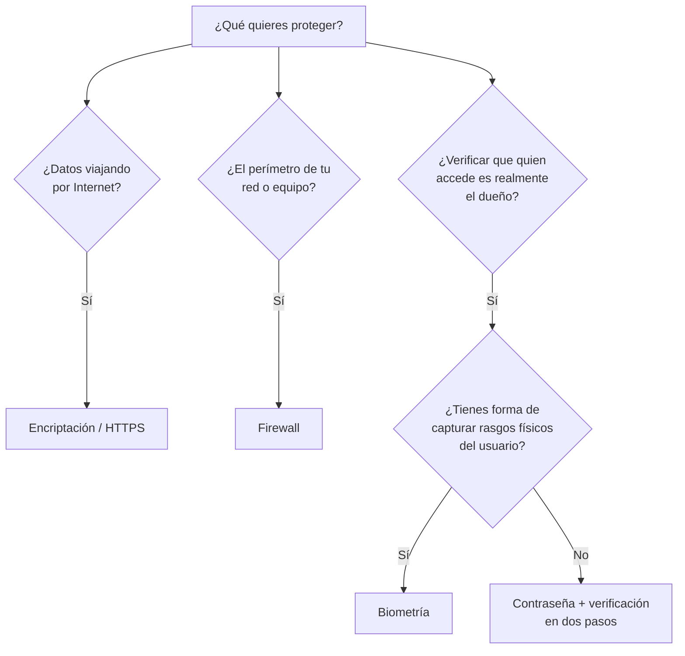

---
{"dg-publish":true,"permalink":"/universidad/2do-semestre/computacion-y-sociedad/unidad-4-historia-de-internet/07-privacidad-y-proteccion-de-datos/","dg-note-properties":{}}
---


# 🔐 Privacidad y Protección de Datos

## 🎯 Introducción

> [!info] 💡 "Uno de los desafíos más serios que enfrentamos"
> 
> Barack Obama lo resumió así: *"It's now clear this cyber threat is one of the most serious economic and national security challenges we face as a nation."* Esta nota cierra el bloque de ciberseguridad conectando dos ideas: **el derecho a la privacidad** que toda persona tiene, y los **métodos concretos** con los que se protege (o se vulnera) ese derecho en la práctica.
> 
> ```mermaid
> graph TD
>     A[Privacidad y Protección] --> B[Derecho a la Privacidad]
>     A --> C[Métodos de Protección]
>     C --> D[Biometría]
>     C --> E[Encriptación]
>     C --> F[Firewalls]
>     C --> G[Control de acceso]
>     A --> H[Otras consecuencias]
>     H --> I[Cyberbullying]
>     H --> J[Cyberstalking]
>     style A fill:#1e3a5f,color:#fff
> ```

---

## ⚖️ Derecho a la Privacidad

> [!note] 📋 Definición — Derecho a la privacidad
> 
> **Todo el mundo tiene derecho a la privacidad.** Es un **derecho humano fundamental**, por virtud del cual se tiene la facultad de **excluir o negar a las demás personas** el conocimiento de ciertos aspectos de la vida de cada persona, que solo a esta le incumben.
> 
> **Posibles violaciones a este derecho:**
> 
> - Intervenir en la vida privada.
> - Impedir la vida familiar.
> - Intervenir en sus medios/datos digitales.

> [!note] 📋 Derecho a la privacidad en Internet
> 
> La tecnología ha hecho que la **definición convencional de información personalmente identificable quede obsoleta** — hoy en día, datos que antes no se consideraban "identificables" (patrones de navegación, ubicación, metadatos) pueden combinarse para identificar a una persona igual de bien que un nombre o número de cédula.
> 
> Marco legal (parafraseado del material de clase): las entidades **no podrán difundir, distribuir o comercializar** los datos personales contenidos en los sistemas de información desarrollados en el ejercicio de sus funciones, **salvo que haya mediado el consentimiento expreso** — por escrito o por un medio de autenticación similar — de los individuos a quienes hace referencia la información.

> [!warning] ⚠️ El impacto no es solo "molestia"
> 
> El acceso y uso no autorizado **genera impacto real**: se produce cada vez que un individuo gana acceso a un ordenador, red, archivo u otro recurso sin permiso y lo utiliza para beneficio propio, **dañando la honra y la economía** de las demás personas — no es un problema abstracto, tiene consecuencias concretas y medibles.

---

## 🛡️ Métodos de Protección contra el Acceso No Autorizado

### Biometría

> [!note] 👤 Definición — Biometría
> 
> La **biometría** es la identificación o verificación automatizada de identidad en seres humanos vivos, haciendo uso de **características fisiológicas o de comportamiento**.
> 
> **Tecnologías biométricas existentes:** biometría dactilar (huella digital), reconocimiento facial, reconocimiento de iris, geometría de la mano, reconocimiento dinámico de firma, reconocimiento de voz, geometría de dedos, y reconocimiento de cadencia de digitación (cómo escribes en el teclado).
> 
> La **más usada a nivel mundial es la huella digital**, por las diversas ventajas que ofrece frente a otras tecnologías (costo, facilidad de captura, precisión).

### Encriptación (Encryption)

> [!note] 🔒 Definición — Encriptación
> 
> Las **páginas web seguras usan encriptación** para que los datos sensibles (como números de tarjeta de crédito) enviados a través de la página estén protegidos mientras viajan por Internet.
> 
> Es una forma de **convertir temporalmente los datos en una forma ilegible**, conocida como cifrado, hasta que es descifrada. Se identifica visualmente por el candado y el prefijo `https://` en la barra de direcciones.

### Firewalls

> [!note] 🧱 Definición — Firewall
> 
> Un **firewall** es un sistema de seguridad que **crea una barrera** entre un computador o red e Internet, para proteger contra el acceso no autorizado.
> 
> Típicamente es **bidireccional**: revisa tanto el tráfico **entrante** (de Internet hacia el computador/red) como el **saliente** (del computador/red hacia Internet), y permite pasar únicamente el tráfico autorizado.

### Sistemas de control de acceso

> [!note] 🔑 Access control systems
> 
> **Passwords (contraseñas):** una contraseña **no asegura que el dueño sea quien dice ser** — solo asegura que quien la ingresó la conocía. Por eso, en muchos sitios se recomienda usar contraseñas difíciles (mayúsculas, minúsculas, números y caracteres especiales) que además sean **fuertes y fáciles de recordar** para el usuario legítimo.
> 
> Otros mecanismos complementarios de control de acceso:
> 
> - **Preguntas de seguridad** al usuario.
> - **Confirmación** vía correo electrónico o teléfono (verificación en dos pasos).
> - **Registro de IP** (detectar accesos desde ubicaciones inusuales).

> [!warning] ⚠️ Ninguna medida es suficiente sola
> 
> Ninguno de estos métodos es infalible por sí solo: una contraseña puede ser robada por phishing (ver nota de Ingeniería Social), un firewall no protege contra ingeniería social, y la biometría puede tener falsos positivos. La seguridad real viene de **combinar varias capas** — esto se conoce como *defensa en profundidad*.

---

## 📊 Tabla Comparativa de Métodos de Protección

> [!note] 📊 Comparación de métodos de protección
> 
> | Método | ¿Qué protege? | ¿Contra qué amenaza es más útil? | Limitación principal |
> |---|---|---|---|
> | **Biometría** | Identidad del usuario | Acceso físico/lógico no autorizado | Puede fallar (falsos positivos/negativos); si se "roba" no se puede cambiar como una contraseña |
> | **Encriptación** | Datos en tránsito o en reposo | Sniffers, interceptación de datos | No protege si el atacante ya tiene acceso al dispositivo desbloqueado |
> | **Firewall** | La red/el equipo como perímetro | Accesos no autorizados desde/hacia la red | No detiene ingeniería social ni malware ya instalado |
> | **Contraseñas** | Acceso a una cuenta o sistema | Acceso no autorizado básico | No verifica identidad real, solo conocimiento del password |
> | **Verificación en 2 pasos** | Acceso a una cuenta | Robo de contraseña (phishing) | Requiere un segundo dispositivo/canal disponible |

---

## 😔 Otras Consecuencias

> [!note] 📋 Cyberbullying, Cyberstalking y otras consecuencias
> 
> No todas las consecuencias de un entorno digital inseguro son técnicas o financieras — también existen impactos directamente sobre las personas:
> 
> - **Cyberbullying**: acoso realizado a través de medios digitales.
> - **Cyberstalking**: los *stalkers* buscan víctimas en línea y las amenazan vía Internet.
> - **Pornografía en línea**: mencionada en el material de clase como otra consecuencia asociada al mal uso de la tecnología y la falta de protección de la privacidad.

---

## 🧭 Flujograma de Decisión — ¿Qué método de protección aplicar?



---

## 🖥️ Aplicación Práctica

> [!tip] 🖥️ Defensa en profundidad, en la práctica
> 
> Una cuenta bien protegida hoy en día normalmente combina: **contraseña fuerte y única** (gestor de contraseñas) + **verificación en dos pasos** (código al teléfono) + **HTTPS** en cualquier sitio donde ingreses datos +, si el dispositivo lo permite, **biometría** como capa adicional de desbloqueo local. Ninguna capa sola sustituye a las demás — se complementan.

---

## 📝 Ejercicios Progresivos

> [!question] 📋 Nivel 1 — Identificación básica
> 
> 1. ¿Qué protege específicamente la encriptación: los datos en tránsito, el perímetro de la red, o la identidad del usuario?
> 2. Nombra dos tecnologías biométricas mencionadas en clase.
> 3. Define con tus palabras el derecho a la privacidad.

> [!success]- ✅ Respuestas — Nivel 1
> 
> 1. Los **datos en tránsito** (y en algunos casos en reposo) — no protege el perímetro de la red (eso lo hace el firewall) ni verifica identidad (eso lo hacen contraseñas/biometría).
> 2. Cualquiera de: huella digital, reconocimiento facial, reconocimiento de iris, geometría de la mano, reconocimiento de voz, reconocimiento dinámico de firma.
> 3. Es el derecho humano fundamental a excluir o negar a otros el conocimiento de aspectos de la vida propia que solo a uno le incumben.

> [!question] 📋 Nivel 2 — Análisis de casos
> 
> 4. Una empresa tiene firewall y contraseñas fuertes, pero un empleado cae en un correo de phishing y entrega su contraseña. ¿Qué capa de protección falló y cuál NO habría evitado este ataque de todas formas?
> 5. ¿Por qué se dice que una contraseña "no asegura que el dueño sea quien dice ser"? Relaciona tu respuesta con la biometría.
> 6. Un sitio web usa HTTPS pero no tiene firewall en su servidor. ¿Qué tipo de ataque de la nota de Sabotaje seguiría siendo posible?

> [!success]- ✅ Respuestas — Nivel 2
> 
> 4. Falló la **capa humana** (el empleado reveló su contraseña) — ni el firewall ni la contraseña fuerte por sí sola habrían evitado esto, porque el ataque fue de ingeniería social, no técnico. La verificación en dos pasos sí podría haber mitigado el daño, ya que el atacante necesitaría también el segundo factor.
> 5. Porque una contraseña solo demuestra que quien la ingresó **la conocía**, no que sea el dueño legítimo — pudo haberla robado, adivinado o comprado. La biometría, en cambio, intenta verificar una característica física o de comportamiento **propia de la persona**, difícil (aunque no imposible) de replicar.
> 6. Un ataque de **DoS/DDoS** seguiría siendo posible: HTTPS protege la confidencialidad de los datos en tránsito, pero no evita que el servidor sea inundado de solicitudes — eso requiere mitigación específica de DDoS, no solo cifrado.

> [!question] 📋 Nivel 3 — Aplicación y síntesis
> 
> 7. Diseña un esquema de "defensa en profundidad" (mínimo 3 capas) para proteger una cuenta bancaria en línea, explicando qué amenaza específica de las notas anteriores mitiga cada capa.
> 8. La nota menciona que "el acceso no autorizado daña la honra y la economía de las demás personas". Conecta esta idea con el cyberbullying y el cyberstalking: ¿por qué se agrupan como "consecuencias" y no como "amenazas técnicas"?
> 9. Evalúa críticamente: ¿por qué la definición legal de "información personalmente identificable" quedar obsoleta (según la diapositiva) representa un desafío incluso para las medidas de protección técnica vistas en esta nota (firewall, encriptación, biometría)?

> [!success]- ✅ Respuestas — Nivel 3
> 
> 7. Ejemplo de esquema: (1) **Encriptación/HTTPS** en el sitio del banco, mitigando sniffers; (2) **Contraseña fuerte + verificación en dos pasos**, mitigando el robo de credenciales vía phishing; (3) **Firewall** en el lado del banco, mitigando accesos no autorizados a la red interna; (4) opcionalmente, **biometría** en la app móvil del banco, como capa adicional de verificación de identidad.
> 8. Se agrupan como "consecuencias" porque **no son técnicas de intrusión a un sistema**, sino resultados del mal uso del acceso a la información o a los canales digitales para dañar directamente a una persona — el daño es humano y social, no informático en sí mismo, aunque ocurra por medios digitales.
> 9. Porque los métodos de protección técnica (firewall, encriptación, biometría) fueron diseñados asumiendo una noción relativamente estable de qué es un "dato identificable" (nombre, cédula, tarjeta). Si esa definición queda obsoleta —porque datos aparentemente inocuos combinados sí identifican a alguien— entonces esas medidas pueden **proteger correctamente los datos "tradicionales"** y aun así dejar expuesta la privacidad real de la persona a través de datos que nadie consideró necesario cifrar o controlar.

---

## 🎯 Metas de Aprendizaje

> [!success] ✅ Nivel Básico
> 
> - [ ] Puedo definir el derecho a la privacidad y nombrar posibles violaciones.
> - [ ] Puedo nombrar los principales métodos de protección vistos en clase.
> - [ ] Puedo distinguir cyberbullying de cyberstalking.

> [!success] ✅ Nivel Intermedio
> 
> - [ ] Puedo explicar qué protege específicamente cada método (biometría, encriptación, firewall, contraseñas).
> - [ ] Puedo explicar por qué ninguna medida de protección es suficiente por sí sola.
> - [ ] Puedo identificar qué método de protección mitigaría una amenaza específica de notas anteriores.

> [!success] ✅ Nivel Avanzado
> 
> - [ ] Puedo diseñar un esquema de defensa en profundidad con varias capas justificadas.
> - [ ] Puedo argumentar por qué la obsolescencia de la definición legal de "dato identificable" es un desafío para la protección técnica.
> - [ ] Puedo conectar el marco de privacidad y protección con las amenazas de las tres notas anteriores del bloque.

---

## 📚 Referencias

> [!quote] 📖 Fuentes consultadas
> 
> [1] Material de clase, *Computación y Sociedad*, Unidad — Ciberseguridad y Privacidad, diapositivas sobre derecho a la privacidad y métodos de protección.

## 🔗 Conexiones

> [!quote] 🔗 Notas relacionadas
> 
> - [[Universidad/2do Semestre/Computación y Sociedad/Unidad 4 - Historia de Internet/04 - Crímenes Informáticos y Malware\|04 - Crímenes Informáticos y Malware]]
> - [[Universidad/2do Semestre/Computación y Sociedad/Unidad 4 - Historia de Internet/05 - Ingeniería Social y Fraudes en Línea\|05 - Ingeniería Social y Fraudes en Línea]]
> - [[Universidad/2do Semestre/Computación y Sociedad/Unidad 4 - Historia de Internet/06 - Sabotaje y Ataques de Red\|06 - Sabotaje y Ataques de Red]]

---

**Tags:** #computacion-y-sociedad #ciberseguridad #privacidad #proteccion-de-datos #ESPOL
