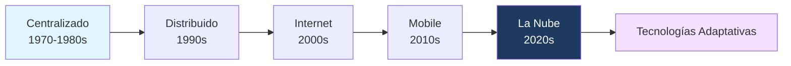
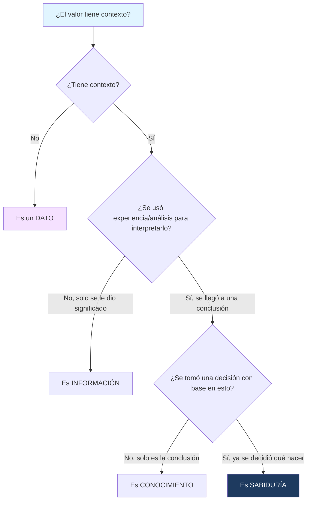

---
{"dg-publish":true,"permalink":"/universidad/2do-semestre/computacion-y-sociedad/unidad-4-profesional-de-la-computacion/01-fundamentos-del-computador-cardinalidad-y-dikw-4/","dg-note-properties":{}}
---


# 🖥️ Fundamentos del Computador, Cardinalidad y la Pirámide DIKW

## 🎯 Introducción

> [!info] 💡 ¿Por qué volver a lo básico en esta unidad?
> 
> Antes de hablar del profesional de la computación, hace falta un lenguaje común: qué es exactamente una computadora, cómo ha cambiado la forma en que las personas se relacionan con ellas a lo largo de la historia, y cómo se transforma un dato crudo en una decisión inteligente. Estos conceptos son la base conceptual sobre la que se construye todo el razonamiento ético y profesional que vendrá después en el curso.
> 
> - El modelo de cómo las personas usan las computadoras ha cambiado radicalmente: de salas enteras dedicadas a una sola máquina compartida por muchos, a que cada persona hoy controle varios dispositivos a la vez (celular, laptop, smartwatch, asistente en la nube).
> - Entender la diferencia entre **dato**, **información**, **conocimiento** y **sabiduría** (la pirámide DIKW) es clave en cualquier discusión moderna sobre inteligencia artificial, big data, y toma de decisiones basada en datos.
> 
> ```mermaid
> graph TD
>     A[Fundamentos del Computador] --> B[Cardinalidad Persona-Computadora]
>     A --> C[Evolución Histórica]
>     A --> D[Pirámide DIKW]
>     style A fill:#1e3a5f,color:#fff
>     style B fill:#e1f5ff
>     style C fill:#e1ffe1
>     style D fill:#f5e1ff
> ```

---

## 📋 Fundamentos y Estructura Formal

> [!note] 📋 Definición — Computador
> 
> Un **computador** se define como un dispositivo electrónico programable que **acepta datos**, **realiza operaciones** sobre esos datos, y produce un resultado útil. Esta definición es intencionalmente amplia: aplica tanto a una supercomputadora como a un microcontrolador dentro de un electrodoméstico.

> [!note] 📋 Ciclo de Procesamiento
> 
> Todo computador, sin importar su tamaño o propósito, sigue el mismo ciclo fundamental:
> 
> $$\text{Entrada} \rightarrow \text{Procesamiento} \rightarrow \text{Salida} \rightarrow \text{Almacenamiento}$$
> 
> - **Entrada:** los datos ingresan al sistema (teclado, sensor, archivo, etc.)
> - **Procesamiento:** el computador realiza operaciones sobre esos datos.
> - **Salida:** se produce un resultado visible o utilizable (pantalla, impresión, señal).
> - **Almacenamiento:** los datos o resultados se guardan para uso posterior.

---

## 👥 Cardinalidad: Modelos de Relación Persona-Computadora

> [!note] 📋 Definición — Cardinalidad
> 
> La **cardinalidad**, en este contexto, describe la relación numérica entre la cantidad de **personas** y la cantidad de **computadoras** que manejan. No es lo mismo notación de bases de datos — aquí se usa para clasificar modelos históricos y actuales de cómo se accede a la computación.

> [!note] 📊 Los tres modelos de cardinalidad
> 
> | Modelo | Relación | Descripción | Ejemplo típico |
> |---|---|---|---|
> | **N:1** | Varias personas → 1 computadora | Muchos usuarios comparten una sola máquina central | Mainframes de los años 60-70, laboratorios universitarios compartidos |
> | **1:1** | 1 persona → 1 computadora | Cada persona tiene su propio dispositivo dedicado | La PC de escritorio clásica, una laptop personal |
> | **1:N** | 1 persona → varias computadoras | Una sola persona controla o posee múltiples dispositivos | Usuario moderno con celular, laptop, tablet y smartwatch simultáneamente |

> [!success] ✅ Principio clave
> 
> La evolución de N:1 → 1:1 → 1:N **no es casualidad** — refleja directamente la caída en el costo del hardware y la miniaturización de los componentes. Mientras más barato y pequeño se vuelve un computador, más personas pueden tener uno propio, y eventualmente varios.

---

## 🕰️ Evolución del Computador

> [!note] 📋 Las cinco eras de la computación
> 
> La forma en que las personas acceden a la capacidad de cómputo ha pasado por etapas bien marcadas, cada una habilitada por avances tecnológicos específicos:

> [!note] 📊 Línea de tiempo de la evolución del computador
> 
> | Era | Década | Característica principal |
> |---|---|---|
> | **Centralizado** | 1970-1980s | Un mainframe central atendía a muchos usuarios (modelo N:1) |
> | **Distribuido** | 1990s | Las computadoras personales permiten que cada usuario procese localmente (modelo 1:1) |
> | **Internet** | 2000s | Las computadoras se conectan entre sí, compartiendo información globalmente |
> | **Mobile** | 2010s | Los dispositivos móviles llevan la computación a cualquier lugar |
> | **La Nube** | 2020s | El procesamiento y almacenamiento se mueven a servidores remotos, accesibles desde cualquier dispositivo |



> [!tip] 🖥️ ¿Qué son las "tecnologías adaptativas"?
> 
> Se refiere a la tendencia actual (2020s en adelante) donde los sistemas ya no son estáticos, sino que se ajustan dinámicamente al usuario, al contexto o a la carga de trabajo — por ejemplo, recomendaciones personalizadas por IA, escalado automático de servidores en la nube, o interfaces que se adaptan según el dispositivo desde el que accedes.

---

## 🧠 La Pirámide DIKW: Dato, Información, Conocimiento y Sabiduría

> [!note] 📋 Definición — Dato
> 
> Un **dato** es un valor **sin contexto**. Por sí solo, no significa nada específico hasta que se interpreta.
> 
> Ejemplos de datos aislados: $39$, `"sexo: M"`, $3.14$ — cada uno es solo un valor, sin saber a qué se refiere.

> [!note] 📋 Definición — Información
> 
> La **información** es el resultado de **darle contexto a un dato**, mediante procesamiento. Es el dato ya interpretado dentro de un marco que le da significado.
> 
> Ejemplo: el dato $39$ se convierte en información cuando se contextualiza como "la edad de una persona es 39 años".

> [!note] 📋 Definición — Conocimiento
> 
> El **conocimiento** es darle **razón** a la información, o llegar a una **conclusión** a partir de ella, aplicando **experiencia y visión** propias.
> 
> Ejemplo: sabiendo que la persona tiene 39 años y trabaja en un empleo de alto estrés, el conocimiento sería reconocer que está en un rango de edad asociado con mayor riesgo cardiovascular, basándose en experiencia médica previa.

> [!note] 📋 Definición — Sabiduría
> 
> La **sabiduría** es saber **qué hay que hacer** — es decir, tomar una **decisión** informada a partir del conocimiento adquirido.
> 
> Ejemplo: con ese conocimiento, la sabiduría sería decidir recomendarle a esa persona un chequeo médico preventivo antes de que aparezcan síntomas.

> [!success] ✅ Principio clave: la pirámide es acumulativa
> 
> Cada nivel de la pirámide **depende del anterior** — no puedes tener información sin datos, ni conocimiento sin información, ni sabiduría sin conocimiento. Es un proceso de refinamiento progresivo, no niveles independientes entre sí.

---

## ⚠️ Errores Comunes

> [!warning] ⚠️ Confundir "dato" con "información"
> 
> Es común usar "dato" e "información" como sinónimos en el lenguaje cotidiano, pero en este marco conceptual son **etapas distintas**. Un número suelto en una hoja de cálculo es un dato; ese mismo número con una etiqueta de columna que le da significado ("Edad del paciente") ya es información.

> [!warning] ⚠️ Confundir "conocimiento" con "tener mucha información"
> 
> Acumular información no equivale a tener conocimiento. El conocimiento requiere **procesamiento activo con experiencia y criterio** — dos personas pueden tener exactamente la misma información disponible y llegar a conclusiones (conocimiento) distintas según su experiencia previa.

---

## 📊 Tabla Comparativa

> [!note] 📊 Resumen de la Pirámide DIKW
> 
> | Nivel | Pregunta que responde | Qué le agrega al nivel anterior | Ejemplo |
> |---|---|---|---|
> | **Dato** | ¿Qué es? | — (es el punto de partida) | `39` |
> | **Información** | ¿Qué significa? | Contexto | "Edad: 39 años" |
> | **Conocimiento** | ¿Por qué importa? | Experiencia y análisis | "Edad de riesgo cardiovascular" |
> | **Sabiduría** | ¿Qué debo hacer? | Juicio y decisión | "Recomendar chequeo preventivo" |

---

## 🧭 Diagrama de Decisión — Ubicar un elemento en la Pirámide DIKW



---

## 📝 Ejercicios Progresivos

> [!question] 🟩 Nivel 1 — Básico
> 
> 1. Explica con tus propias palabras la diferencia entre dato e información.
> 2. Da un ejemplo de cardinalidad 1:N en tu vida diaria (piensa en cuántos dispositivos usas tú mismo/a).
> 3. Ordena cronológicamente las cinco eras de evolución del computador.

> [!question] 🟨 Nivel 2 — Intermedio
> 
> 4. Clasifica cada elemento según la pirámide DIKW: (a) "35°C", (b) "La temperatura corporal es 35°C", (c) "35°C indica hipotermia leve según referencias médicas", (d) "Se decide trasladar al paciente a observación".
> 5. Explica por qué el modelo centralizado (N:1) fue el primero en aparecer históricamente, en vez de empezar directamente con 1:1.
> 6. ¿Por qué la sabiduría requiere haber pasado primero por los tres niveles anteriores de la pirámide?

> [!question] 🟥 Nivel 3 — Avanzado
> 
> 7. Un sistema de recomendaciones de una app de streaming recibe millones de datos de reproducción (qué series ve cada usuario). Describe qué representaría el dato, la información, el conocimiento y la sabiduría en ese contexto.
> 8. Relaciona la evolución del computador (Centralizado → Nube) con la evolución de la cardinalidad (N:1 → 1:N). ¿Coinciden en el tiempo? Explica la relación.
> 9. ¿Podría un sistema de inteligencia artificial actual llegar por sí solo al nivel de "sabiduría" en la pirámide DIKW, o solo llega hasta "conocimiento"? Justifica tu postura con un argumento, reconociendo que es un tema debatible.

> [!success]- ✅ Respuestas
> 
> **Nivel 1:**
> 1. El dato es un valor sin contexto (ej. un número suelto); la información es ese mismo valor ya interpretado dentro de un contexto que le da significado.
> 2. Ejemplo: una persona que usa celular, laptop y smartwatch simultáneamente — 1 persona controlando 3 computadoras.
> 3. Centralizado (1970-1980s) → Distribuido (1990s) → Internet (2000s) → Mobile (2010s) → La Nube (2020s).
> 
> **Nivel 2:**
> 4. (a) Dato, (b) Información, (c) Conocimiento, (d) Sabiduría.
> 5. Porque en sus inicios el hardware era extremadamente costoso y voluminoso — solo instituciones grandes podían costear una computadora, así que tenía sentido que muchas personas compartieran el acceso a una sola máquina (N:1), en vez de que cada persona tuviera la suya.
> 6. Porque cada nivel depende del anterior: no se puede decidir qué hacer (sabiduría) sin antes haber llegado a una conclusión razonada (conocimiento), que a su vez requiere información con significado, que a su vez requiere datos crudos como punto de partida.
> 
> **Nivel 3:**
> 7. Dato: registros individuales de reproducción (usuario X vio el episodio Y a las 9pm). Información: patrones agregados, como "el usuario X ve principalmente series de comedia los fines de semana". Conocimiento: inferir que a ese usuario probablemente le gustaría una nueva serie de comedia similar, basado en patrones de usuarios parecidos. Sabiduría: decidir mostrarle esa recomendación específica en su pantalla de inicio en el momento adecuado.
> 8. Sí coinciden en el tiempo de forma aproximada: el modelo centralizado (N:1) corresponde a la era de mainframes; el modelo distribuido/1:1 surge con la PC personal; y el modelo 1:N se consolida con la era móvil y la nube, cuando una sola persona empieza a poseer y usar múltiples dispositivos conectados simultáneamente. La cardinalidad refleja directamente cómo cambió el acceso a la computación en cada era.
> 9. Este es un tema abierto a debate: se puede argumentar que la IA actual sí llega a "conocimiento" (encontrar patrones, generar conclusiones a partir de datos), pero que la "sabiduría" tal como se define aquí — tomar una decisión con juicio, considerando consecuencias éticas y contextuales más amplias — sigue requiriendo supervisión o intervención humana, ya que la IA carece de responsabilidad moral o comprensión genuina del contexto humano completo. Otros argumentarían que sistemas autónomos que ya toman decisiones reales (ej. vehículos autónomos frenando ante un peatón) sí están operando en el nivel de sabiduría, aunque sea de forma limitada y programada.

---

## 🎯 Metas de Aprendizaje

> [!success] ✅ Nivel Básico
> - [ ] Puedo definir qué es un computador y describir el ciclo Entrada-Procesamiento-Salida-Almacenamiento.
> - [ ] Puedo distinguir los tres modelos de cardinalidad (N:1, 1:1, 1:N).
> - [ ] Puedo nombrar las cinco eras de evolución del computador en orden.

> [!success] ✅ Nivel Intermedio
> - [ ] Puedo clasificar un ejemplo concreto según los cuatro niveles de la pirámide DIKW.
> - [ ] Puedo explicar por qué la evolución de la cardinalidad refleja cambios tecnológicos e históricos.
> - [ ] Entiendo por qué cada nivel de DIKW depende del anterior.

> [!success] ✅ Nivel Avanzado
> - [ ] Puedo aplicar la pirámide DIKW completa a un caso real y complejo (ej. sistemas de recomendación).
> - [ ] Puedo relacionar la evolución del computador con la evolución de la cardinalidad de forma argumentada.
> - [ ] Puedo debatir con argumentos si un sistema de IA puede alcanzar el nivel de "sabiduría".

---

## 📚 Referencias y Conexiones

> [!quote] 📖 Fuentes consultadas
> 
> [1] Apuntes de clase — Computación y Sociedad, tema visto en sesión no presencial (transcrito de notas manuscritas).

> [!quote] 🔗 Conexiones
> 
> - [[Universidad/2do Semestre/Computación y Sociedad/Unidad 3 - Representación de la información/I - Sistemas de Numeración/07 - Números Negativos\|Unidad 3 - Representación de la información/I - Sistemas de Numeración/07 - Números Negativos]] — ambos temas parten de la misma pregunta base: cómo se representa y procesa la información en un sistema computacional.

---

**Tags:** #computacion-y-sociedad #fundamentos #cardinalidad #evolucion-computador #dikw #unidad4
