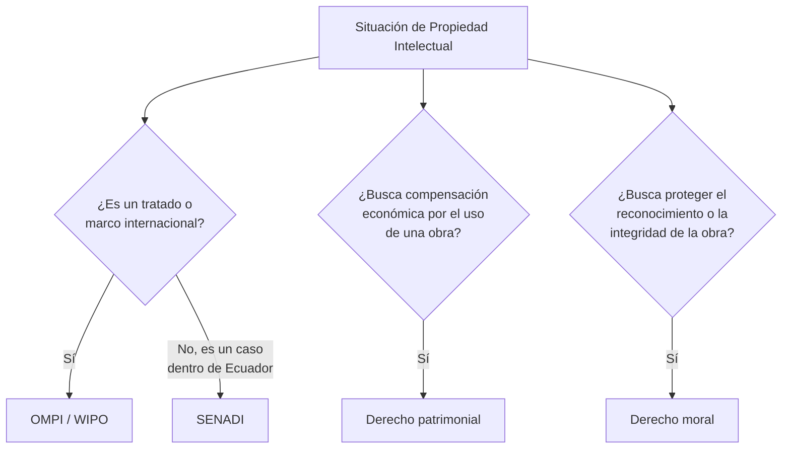

---
{"dg-publish":true,"permalink":"/universidad/2do-semestre/computacion-y-sociedad/unidad-5-privacidad-y-propiedad-intelectual/01-fundamentos-de-propiedad-intelectual/","dg-note-properties":{}}
---


# 📜 Fundamentos de Propiedad Intelectual

## 🎯 Introducción

> [!info] 💡 Proteger lo que no se puede tocar
> 
> Hasta ahora hemos visto amenazas contra la información y la privacidad de las personas. Esta nota cambia de eje: no se trata de proteger datos personales, sino de proteger **creaciones de la mente** — ideas, obras, invenciones — que también tienen valor y también pueden ser robadas o usadas sin autorización.
> 
> ```mermaid
> graph TD
>     A[Propiedad Intelectual] --> B[Derecho de Autor]
>     A --> C[Patentes]
>     A --> D[Trademarks / Marcas]
>     A --> E[Trade Secrets]
>     B --> F[Derechos Patrimoniales]
>     B --> G[Derechos Morales]
>     A --> H[Marco institucional]
>     H --> I[OMPI / WIPO]
>     H --> J[SENADI - Ecuador]
>     style A fill:#1e3a5f,color:#fff
> ```

---

## 📋 ¿Qué es la Propiedad Intelectual?

> [!note] 📋 Definición — Propiedad Intelectual
> 
> La **propiedad intelectual** se relaciona con las **creaciones de la mente**: invenciones, obras literarias y artísticas, así como símbolos, nombres e imágenes utilizados en el comercio.
> 
> Es decir, no protege un objeto físico, sino la **idea, expresión o identidad** detrás de ese objeto.

---

## 🏛️ Marco Institucional

### OMPI / WIPO

> [!note] 🌐 Definición — OMPI (WIPO)
> 
> La **Organización Mundial de la Propiedad Intelectual** (OMPI, o WIPO por sus siglas en inglés) tiene su **sede principal en Ginebra, Suiza**. Tiene a su cargo la administración de **26 tratados internacionales** que abordan diversos aspectos de la regulación de la propiedad intelectual.
> 
> La Organización tiene **188 Estados miembros**.

### SENADI (Ecuador)

> [!note] 🇪🇨 Definición — SENADI
> 
> El **Servicio Nacional de Derechos Intelectuales (SENADI)** promueve a la propiedad intelectual en el Ecuador, como una herramienta para alcanzar el desarrollo.
> 
> **Base legal:** la Declaración Universal de los Derechos Humanos, aprobada por la ONU, reconoce como un **derecho fundamental** la protección de las creaciones intelectuales y designa al Estado como su defensor.
> 
> En el mundo existe un organismo especializado del sistema de las Naciones Unidas, desde 1967, la **OMPI**, cuyo objetivo internacional es desarrollar un sistema de propiedad intelectual **equilibrado y accesible** que estimule la innovación y recompense la creatividad, salvaguardando a la vez el interés público.
> 
> Sitio oficial: `derechosintelectuales.gob.ec`

> [!tip] 🖥️ Relación entre OMPI y SENADI
> 
> La OMPI es el organismo **internacional** (188 países, bajo la ONU) que administra los tratados globales sobre propiedad intelectual. SENADI es el organismo **nacional ecuatoriano** que aplica y hace cumplir esos principios dentro del país. Es la misma relación que existe, por ejemplo, entre un tratado internacional y la ley local que lo implementa.

---

## ©️ Derecho de Autor (Copyright)

> [!note] 📋 Definición — Derecho de autor
> 
> En la terminología jurídica, la expresión **"derecho de autor"** se utiliza para describir los **derechos de los creadores** sobre sus obras literarias y artísticas.
> 
> Las obras que se prestan a la protección por derecho de autor van desde los **libros, la música, la pintura, la escultura y las películas** hasta los **programas informáticos, las bases de datos**, los anuncios publicitarios, los mapas y los dibujos técnicos.

> [!warning] ⚠️ El software también es una obra protegida
> 
> Vale la pena notar explícitamente que **los programas informáticos y las bases de datos** están dentro del alcance del derecho de autor, igual que un libro o una canción — no es solo un tema de "arte", también aplica directamente a lo que se produce en computación.

### Dos tipos de derechos dentro del derecho de autor

> [!note] 📋 Derechos patrimoniales vs. derechos morales
> 
> El derecho de autor abarca **dos tipos de derechos**:
> 
> - **Derechos patrimoniales**: permiten que el titular de los derechos **obtenga compensación financiera** por el uso de sus obras por parte de terceros.
> - **Derechos morales**: protegen los **intereses no patrimoniales** del autor (por ejemplo, ser reconocido como autor de la obra, o que no se distorsione de forma que dañe su reputación).

> [!note] 📊 Comparación — Derechos patrimoniales vs. morales
> 
> | Aspecto | Derechos patrimoniales | Derechos morales |
> |---|---|---|
> | **¿Qué protegen?** | El valor económico de la obra | La conexión personal del autor con la obra |
> | **¿Se pueden transferir/vender?** | Sí (típicamente) | No, son inherentes al autor |
> | **Ejemplo de violación** | Usar una obra sin pagar regalías | Publicar una obra sin dar crédito al autor, o alterarla de forma que dañe su reputación |

---

## 🧭 Flujograma de Decisión — ¿A qué organismo o derecho corresponde?



---

## 🖥️ Aplicación Práctica

> [!tip] 🖥️ Cómo se ve esto en un proyecto de software
> 
> Si programas una aplicación y la publicas, el **derecho de autor** protege tu código automáticamente desde el momento en que lo creas (no necesitas registrarlo para que exista el derecho, aunque registrarlo ayuda a probarlo legalmente). Tu **derecho patrimonial** te permitiría cobrar por licencias de uso; tu **derecho moral** te permitiría exigir que se te acredite como autor si alguien más lo distribuye.

---

## 📝 Ejercicios Progresivos

> [!question] 📋 Nivel 1 — Identificación básica
> 
> 1. ¿Qué protege la propiedad intelectual: objetos físicos o creaciones de la mente?
> 2. ¿Cuál es la diferencia entre OMPI y SENADI en cuanto a su alcance geográfico?
> 3. Nombra los dos tipos de derechos que abarca el derecho de autor.

> [!success]- ✅ Respuestas — Nivel 1
> 
> 1. Creaciones de la mente — invenciones, obras literarias/artísticas, símbolos, nombres e imágenes comerciales.
> 2. La OMPI tiene alcance **internacional** (188 Estados miembros, sede en Ginebra); SENADI tiene alcance **nacional**, aplicando estos principios dentro de Ecuador.
> 3. Derechos patrimoniales y derechos morales.

> [!question] 📋 Nivel 2 — Análisis de casos
> 
> 4. Un desarrollador publica una app y descubre que otra empresa la copió y la vende sin pagarle nada. ¿Qué tipo de derecho se violó?
> 5. Una editorial publica un libro pero omite el nombre del autor original en la portada. ¿Qué tipo de derecho se violó?
> 6. ¿Por qué se dice que la protección del derecho de autor sobre software es tan relevante para la industria tecnológica como lo es para la música o la literatura?

> [!success]- ✅ Respuestas — Nivel 2
> 
> 4. Se violó su **derecho patrimonial** — no recibió compensación económica por el uso de su obra.
> 5. Se violó su **derecho moral** — no fue reconocido como autor, independientemente de si recibió pago o no.
> 6. Porque el derecho de autor **explícitamente incluye** "programas informáticos" y "bases de datos" entre las obras protegibles — el software recibe el mismo tipo de protección legal que una novela o una canción, lo que sustenta gran parte del modelo de negocio de la industria tecnológica (licencias, ventas de software, SaaS).

> [!question] 📋 Nivel 3 — Aplicación y síntesis
> 
> 7. Explica por qué un derecho moral **no se puede vender**, a diferencia de un derecho patrimonial, usando el ejemplo de un músico que vende los derechos de una canción a una disquera.
> 8. ¿Por qué crees que la Declaración Universal de los Derechos Humanos reconoce la protección de las creaciones intelectuales como un derecho fundamental, y no solo como una regla comercial?
> 9. Diseña un escenario donde una misma acción viole simultáneamente un derecho patrimonial y un derecho moral.

> [!success]- ✅ Respuestas — Nivel 3
> 
> 7. El derecho patrimonial es esencialmente un **derecho económico transferible** — el músico puede vender el derecho a recibir regalías por el uso de la canción. El derecho moral, en cambio, está ligado a la **identidad del autor como creador** — venderlo significaría que alguien más podría reclamar haber creado la obra, lo cual no tiene sentido porque la autoría es un hecho, no una transacción.
> 8. Porque las creaciones intelectuales están directamente ligadas a la **dignidad y el desarrollo de la persona** (su expresión, su pensamiento, su identidad creativa) — no son solo mercancía; por eso se protegen como derecho humano y no únicamente como regulación de mercado.
> 9. Ejemplo: una empresa toma el código de un desarrollador independiente, lo distribuye bajo el nombre de otro programador (violando el **derecho moral** de reconocimiento) y además lo vende sin pagarle regalías al autor original (violando su **derecho patrimonial**).

---

## 🎯 Metas de Aprendizaje

> [!success] ✅ Nivel Básico
> 
> - [ ] Puedo definir qué es la propiedad intelectual.
> - [ ] Puedo nombrar los organismos OMPI y SENADI y su rol respectivo.
> - [ ] Puedo distinguir derechos patrimoniales de derechos morales.

> [!success] ✅ Nivel Intermedio
> 
> - [ ] Puedo identificar qué tipo de derecho se viola en un caso concreto.
> - [ ] Puedo explicar por qué el software está protegido por derecho de autor.
> - [ ] Puedo explicar la relación jerárquica entre OMPI (internacional) y SENADI (nacional).

> [!success] ✅ Nivel Avanzado
> 
> - [ ] Puedo argumentar por qué un derecho moral no es transferible, a diferencia de uno patrimonial.
> - [ ] Puedo diseñar un escenario donde se violen ambos tipos de derecho simultáneamente.
> - [ ] Puedo conectar el marco institucional de la propiedad intelectual con su fundamento como derecho humano.

---

## 📚 Referencias

> [!quote] 📖 Fuentes consultadas
> 
> [1] Material de clase, *Computación y Sociedad*, Unidad 5 — Privacidad y Propiedad Intelectual, diapositivas sobre propiedad intelectual, SENADI y derecho de autor.
> [2] Organización Mundial de la Propiedad Intelectual (OMPI/WIPO), citada en el material de clase (`wipo.int/copyright`).

## 🔗 Conexiones

> [!quote] 🔗 Notas relacionadas
> 
> - [[Universidad/2do Semestre/Computación y Sociedad/Unidad 5 - Privacidad y Propiedad Intelectual/02 - Tipos de Propiedad Intelectual - Patentes, Trademarks y Trade Secrets\|02 - Tipos de Propiedad Intelectual - Patentes, Trademarks y Trade Secrets]]
> - [[Universidad/2do Semestre/Computación y Sociedad/Unidad 5 - Privacidad y Propiedad Intelectual/03 - Infracciones y Protección Digital\|03 - Infracciones y Protección Digital]]

---

**Tags:** #computacion-y-sociedad #propiedad-intelectual #derecho-de-autor #senadi #ompi #ESPOL
