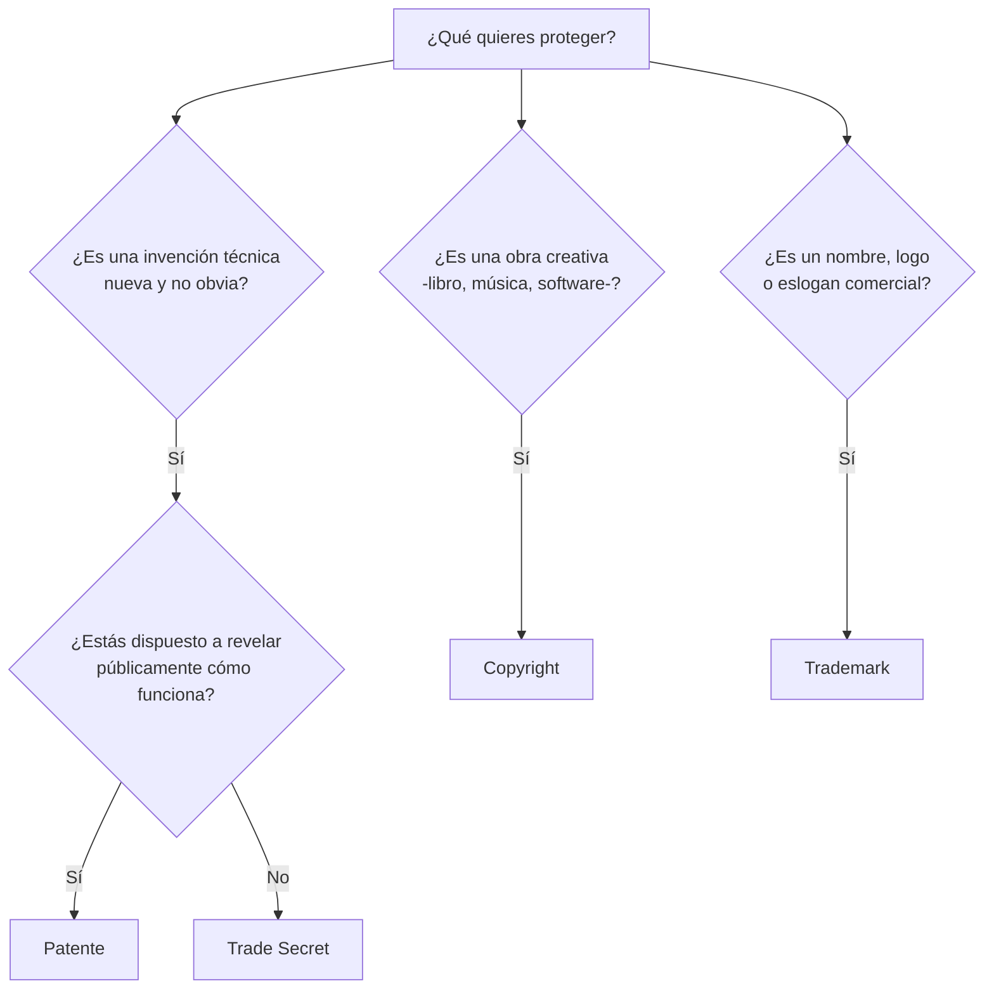

---
{"dg-publish":true,"permalink":"/universidad/2do-semestre/computacion-y-sociedad/unidad-5-privacidad-y-propiedad-intelectual/02-tipos-de-propiedad-intelectual-patentes-trademarks-y-trade-secrets/","dg-note-properties":{}}
---


# 🧩 Tipos de Propiedad Intelectual: Patentes, Trademarks y Trade Secrets

## 🎯 Introducción

> [!info] 💡 No toda creación se protege de la misma forma
> 
> Ya vimos que el **derecho de autor** protege obras literarias y artísticas (incluyendo software). Pero no todo lo que una empresa o persona quiere proteger es una "obra" — a veces es una invención, un nombre comercial, o una fórmula secreta. Cada uno de estos casos tiene **su propia figura legal**, con reglas y duración distintas.
> 
> ```mermaid
> graph TD
>     A[Propiedad Intelectual] --> B[Copyrights<br/>Derecho de Autor]
>     A --> C[Patentes]
>     A --> D[Trademarks<br/>Marcas]
>     A --> E[Trade Secrets<br/>Secretos Comerciales]
>     B --> F[Libros, música,<br/>software, fotos]
>     C --> G[Invenciones, procesos,<br/>tecnologías]
>     D --> H[Nombres, logotipos,<br/>eslóganes]
>     E --> I[Información confidencial<br/>con ventaja competitiva]
>     style A fill:#1e3a5f,color:#fff
> ```

---

## 💡 Patentes

> [!note] 💡 Definición — Patentes
> 
> Las **patentes** protegen **invenciones nuevas, útiles y no obvias**: productos, procesos o tecnologías.
> 
> - **Ejemplo:** un nuevo mecanismo de cierre, o una tecnología innovadora de batería.
> - **Otorgan un derecho exclusivo por tiempo limitado**, normalmente alrededor de **20 años**.
> - **Protegen cómo funciona** una invención — es decir, protegen la solución técnica, no su apariencia ni su nombre comercial.

---

## ©️ Copyrights (Derecho de Autor) — Repaso Contextual

> [!note] 📋 Recordatorio — Copyrights
> 
> Los **copyrights** protegen obras originales de autoría: **libros, música, fotos, software, películas e ilustraciones**.
> 
> - **Ejemplo:** una novela, una canción o una fotografía original.
> - **Surgen al crear la obra** (no requieren registro para existir) y suelen durar muchos años, a menudo la **vida del autor más décadas adicionales**.
> - **Protegen la expresión creativa** — es decir, la forma concreta en que una idea fue expresada, no la idea en sí misma.

> [!tip] 🖥️ Ver también
> 
> El detalle completo del derecho de autor (derechos patrimoniales vs. morales) está en [[Universidad/2do Semestre/Computación y Sociedad/Unidad 5 - Privacidad y Propiedad Intelectual/01 - Fundamentos de Propiedad Intelectual\|01 - Fundamentos de Propiedad Intelectual]] — aquí solo se retoma como parte de la comparación general.

---

## ™️ Trademarks (Marcas)

> [!note] ™️ Definición — Trademarks
> 
> Los **trademarks** protegen **nombres, logotipos, eslóganes y signos** que identifican el **origen comercial** de bienes o servicios.
> 
> - **Ejemplo:** el nombre y logotipo de una cafetería o empresa ficticia.
> - **Pueden renovarse indefinidamente** mientras sigan en uso y se mantengan registradas cuando corresponda — a diferencia de las patentes o el copyright, **no tienen una fecha de expiración fija**.
> - **Protegen la identidad comercial.**

> [!note] 📋 Definición ampliada — ¿Qué es una marca?
> 
> Una marca protege la **asociación de un proveedor de bienes o servicios con una imagen**, una palabra, un eslogan o una melodía. Conocido genéricamente como **marca**.
> 
> Fue **originalmente desarrollado como una extensión** de los conceptos de **competencia desleal** y **protección del consumidor** — es decir, su propósito original no era solo proteger a la empresa, sino evitar que el consumidor sea engañado sobre el origen de lo que compra.

> [!warning] ⚠️ Por qué las marcas no "caducan" como las patentes
> 
> A diferencia de una patente (protección técnica con fecha de vencimiento fija, ~20 años) o un copyright (protección ligada a la vida del autor), una marca protege la **identidad comercial en uso activo**. Mientras la empresa siga usando y renovando la marca, la protección puede extenderse indefinidamente — esto tiene sentido si recordamos que su origen es evitar la confusión del consumidor, un problema que no desaparece con el tiempo.

---

## 🔒 Trade Secrets (Secretos Comerciales)

> [!note] 🔒 Definición — Trade Secrets
> 
> Los **trade secrets** protegen **información valiosa y confidencial** que da ventaja competitiva.
> 
> - **Ejemplo:** una receta, un proceso interno o una fórmula confidencial.
> - **Duran mientras la información se mantenga en secreto** — no tienen un plazo fijo como las patentes, pero tampoco garantía legal si la información se filtra o se descubre de forma independiente.
> - **Protegen información confidencial valiosa.**

> [!warning] ⚠️ Patente vs. Trade Secret — una decisión estratégica real
> 
> Una empresa que inventa algo nuevo debe decidir: ¿lo **patenta** (protección legal fuerte, pero de duración limitada, y **debe revelar públicamente cómo funciona**) o lo mantiene como **trade secret** (protección indefinida mientras el secreto se guarde, pero sin garantía legal si alguien lo descubre por su cuenta, por ejemplo mediante ingeniería inversa)? La fórmula de Coca-Cola es el ejemplo clásico de una empresa que eligió trade secret en lugar de patente, precisamente para no tener que revelar la fórmula.

---

## 📊 Tabla Comparativa Completa

> [!note] 📊 Comparación — Patentes, Copyrights, Trademarks y Trade Secrets
> 
> | Figura legal | ¿Qué protege? | Ejemplo | Duración | Requiere registro para existir |
> |---|---|---|---|---|
> | **Patente** | Invenciones nuevas, útiles y no obvias (productos, procesos, tecnologías) | Nuevo mecanismo de cierre | ~20 años | Sí |
> | **Copyright** | Obras originales de autoría (expresión creativa) | Una novela, canción o software | Vida del autor + décadas | No (surge al crear la obra) |
> | **Trademark** | Nombres, logotipos, eslóganes (identidad comercial) | Nombre y logo de una marca | Indefinida, mientras esté en uso y renovada | Sí (para protección plena) |
> | **Trade Secret** | Información confidencial con ventaja competitiva | Una receta o fórmula secreta | Mientras se mantenga en secreto | No |

---

## 🧭 Flujograma de Decisión — ¿Qué figura legal aplica?



---

## 🖥️ Aplicación Práctica

> [!tip] 🖥️ Ejemplo integrado: una startup de software
> 
> Una startup que lanza una app nueva probablemente usa **las cuatro figuras a la vez**: el **código fuente** está protegido por **copyright** automáticamente; el **nombre y logo** de la app se registran como **trademark**; si desarrollaron un **algoritmo técnico realmente novedoso**, podrían patentarlo; y su **modelo de negocio interno o base de datos de clientes** probablemente se protege como **trade secret**, sin registrarlo públicamente en ningún lado.

---

## 📝 Ejercicios Progresivos

> [!question] 📋 Nivel 1 — Identificación básica
> 
> 1. ¿Qué figura legal protege el nombre y logotipo de una empresa?
> 2. ¿Cuánto tiempo dura, aproximadamente, la protección de una patente?
> 3. ¿Qué figura legal no requiere registro para existir y protege obras creativas?

> [!success]- ✅ Respuestas — Nivel 1
> 
> 1. **Trademark** (marca).
> 2. Aproximadamente **20 años**.
> 3. **Copyright** (derecho de autor).

> [!question] 📋 Nivel 2 — Análisis de casos
> 
> 4. Una empresa de bebidas decide no patentar su fórmula secreta y en cambio mantenerla en absoluto secreto durante décadas. ¿Qué figura legal está usando y qué está sacrificando a cambio?
> 5. ¿Por qué una marca (trademark) puede protegerse "indefinidamente" mientras que una patente no?
> 6. Un desarrollador crea un nuevo algoritmo de compresión de datos técnicamente novedoso. ¿Qué figura legal sería más apropiada si quiere protección legal fuerte, aunque tenga que revelar cómo funciona?

> [!success]- ✅ Respuestas — Nivel 2
> 
> 4. Está usando **trade secret**. Sacrifica la protección legal formal (si alguien descubre la fórmula de forma independiente, como por ingeniería inversa, no hay violación legal) a cambio de no tener el límite de tiempo de una patente y no tener que revelar públicamente la fórmula.
> 5. Porque el propósito de la marca es evitar la **confusión del consumidor** sobre el origen comercial de un producto — ese problema no desaparece con el tiempo mientras la empresa siga operando y usando la marca, a diferencia de una patente, cuyo propósito es dar un incentivo temporal a cambio de que la invención eventualmente sea de dominio público.
> 6. Una **patente** — protege específicamente "cómo funciona" una invención técnica nueva y no obvia, a cambio de revelar el funcionamiento públicamente.

> [!question] 📋 Nivel 3 — Aplicación y síntesis
> 
> 7. Explica la relación entre "trade secret" e "ingeniería inversa": ¿por qué un trade secret es legalmente más vulnerable frente a la ingeniería inversa que una patente?
> 8. Diseña un caso donde una misma empresa use simultáneamente copyright, trademark y trade secret para distintos activos de un mismo producto.
> 9. ¿Por qué crees que el trademark "originalmente desarrollado como extensión de competencia desleal y protección del consumidor" es una idea distinta a la de patentes y copyright, que se enfocan más en recompensar al creador?

> [!success]- ✅ Respuestas — Nivel 3
> 
> 7. Porque un **trade secret solo protege contra la apropiación indebida** (robo, espionaje, incumplimiento de confidencialidad) — pero si un competidor llega al mismo resultado de forma **independiente**, por ejemplo mediante ingeniería inversa de un producto legalmente adquirido, **no hay violación legal**. Una **patente**, en cambio, protege contra cualquier uso no autorizado de la invención, sin importar cómo se haya llegado a replicarla.
> 8. Ejemplo: una empresa de software protege su **código fuente** con copyright, su **nombre y logo comercial** con trademark, y su **algoritmo interno de recomendación** (no patentado, deliberadamente) como trade secret.
> 9. Porque las patentes y el copyright se centran en **incentivar la creación** (dar al creador un beneficio exclusivo temporal a cambio de aportar algo nuevo a la sociedad), mientras que el trademark se centra en **proteger al consumidor** de la confusión sobre el origen de lo que compra — el beneficio para la empresa es, en cierto sentido, secundario al objetivo original de evitar el engaño comercial.

---

## 🎯 Metas de Aprendizaje

> [!success] ✅ Nivel Básico
> 
> - [ ] Puedo nombrar las cuatro figuras de propiedad intelectual y qué protege cada una.
> - [ ] Puedo identificar la duración aproximada de cada figura.
> - [ ] Puedo dar un ejemplo de cada tipo.

> [!success] ✅ Nivel Intermedio
> 
> - [ ] Puedo explicar la diferencia entre proteger algo con patente vs. con trade secret.
> - [ ] Puedo explicar por qué las marcas no tienen fecha de expiración fija.
> - [ ] Puedo identificar qué figura legal aplica a un escenario concreto.

> [!success] ✅ Nivel Avanzado
> 
> - [ ] Puedo argumentar por qué un trade secret es más vulnerable a la ingeniería inversa que una patente.
> - [ ] Puedo diseñar un caso donde una empresa combine varias figuras de PI para distintos activos.
> - [ ] Puedo explicar el origen conceptual distinto del trademark frente a patentes/copyright.

---

## 📚 Referencias

> [!quote] 📖 Fuentes consultadas
> 
> [1] Material de clase, *Computación y Sociedad*, Unidad 5 — Privacidad y Propiedad Intelectual, diapositivas sobre patentes, copyrights, trademarks y trade secrets.

## 🔗 Conexiones

> [!quote] 🔗 Notas relacionadas
> 
> - [[Universidad/2do Semestre/Computación y Sociedad/Unidad 5 - Privacidad y Propiedad Intelectual/01 - Fundamentos de Propiedad Intelectual\|01 - Fundamentos de Propiedad Intelectual]]
> - [[Universidad/2do Semestre/Computación y Sociedad/Unidad 5 - Privacidad y Propiedad Intelectual/03 - Infracciones y Protección Digital\|03 - Infracciones y Protección Digital]]

---

**Tags:** #computacion-y-sociedad #propiedad-intelectual #patentes #trademarks #trade-secrets #ESPOL
