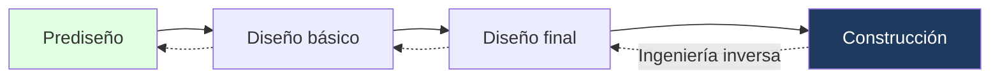
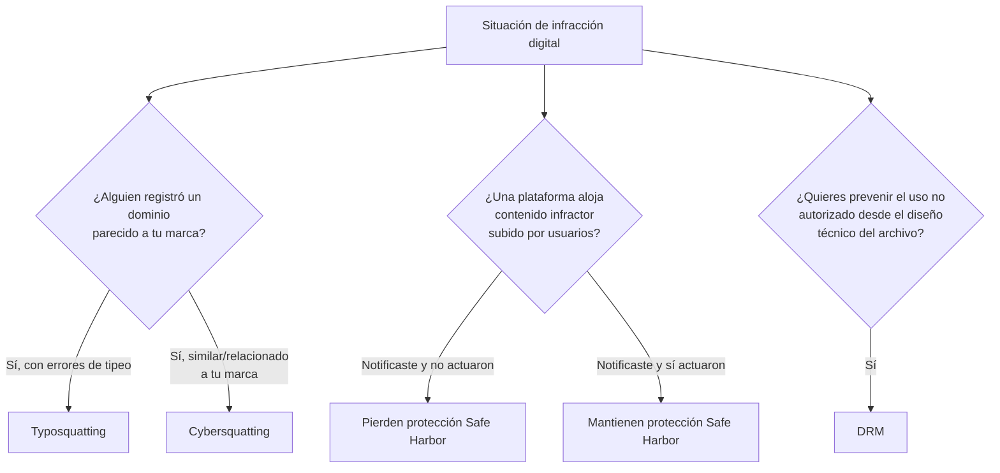

---
{"dg-publish":true,"permalink":"/universidad/2do-semestre/computacion-y-sociedad/unidad-5-privacidad-y-propiedad-intelectual/03-infracciones-y-proteccion-digital/","dg-note-properties":{}}
---


# ⚖️ Infracciones y Protección Digital

## 🎯 Introducción

> [!info] 💡 Cuando la propiedad intelectual se prueba en la práctica
> 
> Las dos notas anteriores definieron **qué** se protege y **con qué figura legal**. Esta nota cierra el bloque con la parte práctica: **cómo se infringe** la propiedad intelectual en el mundo digital, y **qué mecanismos existen** para hacer cumplir esa protección — desde la ingeniería inversa de un producto, hasta el registro de dominios falsos, pasando por la responsabilidad legal de las plataformas y el cifrado técnico del contenido.
> 
> ```mermaid
> graph TD
>     A[Infracciones y Protección Digital] --> B[Ingeniería Inversa]
>     A --> C[Casos de Infracción]
>     C --> D[Napster]
>     A --> E[Cybersquatting]
>     A --> F[Safe Harbor]
>     A --> G[DRM]
>     style A fill:#1e3a5f,color:#fff
> ```

---

## 🔄 Ingeniería Inversa

> [!note] 📋 Definición — Ingeniería Directa vs. Ingeniería Inversa
> 
> Un proyecto de ingeniería típicamente sigue un flujo **directo**: **prediseño → diseño básico → diseño final → construcción**. Este proceso, de principio a fin, se conoce como **ingeniería directa**.
> 
> La **ingeniería inversa** invierte ese flujo: parte de un producto ya **construido** y trabaja hacia atrás — **construcción → diseño final → diseño básico → prediseño** — para entender cómo fue diseñado, sin haber tenido acceso a los planos o especificaciones originales.



> [!warning] ⚠️ Ingeniería inversa y propiedad intelectual — la tensión
> 
> La ingeniería inversa es, en muchos países, una práctica **legal** cuando se aplica sobre un producto legítimamente adquirido — pero es precisamente el mecanismo que hace que un **trade secret** (ver [[Universidad/2do Semestre/Computación y Sociedad/Unidad 5 - Privacidad y Propiedad Intelectual/02 - Tipos de Propiedad Intelectual - Patentes, Trademarks y Trade Secrets\|02 - Tipos de Propiedad Intelectual - Patentes, Trademarks y Trade Secrets]]) sea más vulnerable que una patente: si alguien llega al mismo resultado mediante ingeniería inversa, normalmente **no hay violación legal**, a diferencia de infringir una patente registrada.

---

## 🎵 Caso Real — Napster

> [!example] 📝 Ejemplo — Napster: contribuidor a infracción de derechos de autor
> 
> **Napster** fue una de las plataformas más conocidas de intercambio de archivos MP3 entre usuarios (P2P). Se convirtió en un caso de referencia en el mundo del derecho de autor al ser señalada como **contribuidor a la infracción de derechos de autor**: aunque Napster no subía directamente música protegida, su plataforma **facilitaba y permitía** que los usuarios lo hicieran a gran escala.
> 
> Este caso ayudó a establecer un precedente importante: **una plataforma puede tener responsabilidad legal** por facilitar infracciones de derechos de autor cometidas por sus usuarios, incluso si no las comete directamente.

---

## 🌐 Cybersquatting

> [!note] 📋 Definición — Cybersquatting
> 
> El **cybersquatting** es la práctica de **registrar, comprar o utilizar** un nombre de dominio en Internet que **coincide o se parece mucho** a una marca, empresa o nombre reconocido, con la intención de **obtener un beneficio económico** o **aprovecharse de su reputación** — es decir, apropiarse de nombres de dominio ajenos para obtener una **ventaja indebida**.
> 
> **Las tres formas principales en que se materializa:**
> 
> - **Beneficio económico**: vender el dominio a la empresa titular de la marca por un precio elevado.
> - **Confusión**: aprovechar la similitud para confundir a los usuarios y atraer tráfico hacia otro sitio.
> - **Aprovechamiento de reputación**: usar el prestigio de la marca ajena para obtener visitas, publicidad o datos.

> [!example] 📝 Ejemplos de cybersquatting
> 
> - Un dominio que **simula la marca** para confundir y atraer visitantes (ej. una variación del dominio de Coca-Cola).
> - Un dominio que **usa el nombre de la marca** para dar una falsa impresión de afiliación o sucursal oficial (ej. algo como "microsoft-ecuador.net").
> - Un dominio que **aprovecha la confianza del usuario** para redirigirlo a otro sitio o tienda no oficial.
> - Un dominio que **ofrece supuestos descuentos** de una marca conocida para atraer tráfico o capturar datos.

> [!warning] ⚠️ Cybersquatting vs. Typosquatting — no confundir
> 
> Ambos abusan de nombres de dominio, pero de forma distinta:
> 
> - **Cybersquatting**: se registran dominios **relacionados con una marca o nombre reconocido** (puede incluir variaciones evidentes, no necesariamente errores de tipeo), buscando beneficio económico, confusión o explotar la reputación ajena.
> - **Typosquatting** (ver también [[Universidad/2do Semestre/Computación y Sociedad/Unidad 4 - Historia de Internet/05 - Ingeniería Social y Fraudes en Línea\|05 - Ingeniería Social y Fraudes en Línea]]): se registran dominios con **errores de escritura comunes** de una URL legítima (ej. `gooogle.com`, `facebcook.com`, `amaz0n.com`), esperando que el usuario escriba mal la dirección original y llegue ahí por accidente.
> 
> En síntesis: el **cybersquatting** apuesta por el **parecido con la marca**; el **typosquatting** apuesta por el **error de tipeo del usuario**.

---

## ⚓ Safe Harbor

> [!note] 📋 Definición — Safe Harbor (derecho de autor)
> 
> El principio de **Safe Harbor** implica que la **responsabilidad de los derechos de autor** recae sobre una plataforma **si bloquean el acceso a material presuntamente infractor**, o **lo eliminan**, después de **recibir la notificación del titular de los derechos de autor**.
> 
> En otras palabras: una plataforma (como una red social o un sitio de hosting) generalmente **no es responsable automáticamente** por contenido infractor que suban sus usuarios — pero **sí adquiere responsabilidad** si, tras ser notificada por el titular de los derechos, **no actúa** para bloquear o eliminar ese contenido.

> [!tip] 🖥️ El mecanismo de "notificación y retiro" en la práctica
> 
> Este es el principio detrás de sistemas como los "reportes de copyright" en YouTube o las notificaciones DMCA: la plataforma actúa como intermediario protegido **siempre que responda correctamente** cuando el titular de los derechos reclama una infracción — no se espera que la plataforma vigile proactivamente todo el contenido subido, pero sí que actúe una vez notificada.

---

## 🔐 Digital Rights Management (DRM)

> [!note] 📋 Definición — DRM
> 
> **DRM (Digital Rights Management)** es un concepto y, a la vez, un dispositivo que **combina hardware y software** — sistemas de cifrado/encriptación — con la finalidad de **establecer los usos permitidos** por el titular de los derechos sobre una obra digital.
> 
> El DRM es utilizado por **autores y editores** de obras protegidas por derecho de autor para:
> 
> - **Evitar el pirateo** y otras actividades ilegales.
> - **Establecer un rango de usos permitidos y no permitidos**, en base a diferentes circunstancias y condiciones.

> [!note] 📊 Dos enfoques de restricción DRM
> 
> | Enfoque | Cómo funciona |
> |---|---|
> | **Restricciones basadas en tecnología (DRM technology based)** | Las restricciones **permanecen adjuntas a la información** cuando se migra, mueve, guarda o copia — el archivo "lleva consigo" la protección a donde vaya. |
> | **Restricciones basadas en sistema (System based)** | Permiten que los registros e información sean migrados, movidos, guardados o copiados **solo dentro de un sistema cerrado específico** — la protección depende del entorno, no del archivo en sí. |

> [!warning] ⚠️ DRM no es lo mismo que "derecho de autor"
> 
> El derecho de autor es el **derecho legal**; el DRM es el **mecanismo técnico** que un titular de derechos usa para hacer cumplir ese derecho de forma automática, sin depender de que alguien lo denuncie después (a diferencia del Safe Harbor, que actúa *después* de una notificación, el DRM intenta **prevenir el uso no autorizado desde el inicio**, técnicamente).

---

## 🧭 Flujograma de Decisión — ¿Qué mecanismo aplica?



---

## 🖥️ Aplicación Práctica

> [!tip] 🖥️ Cómo se conectan estos conceptos en un caso real
> 
> Imagina una discográfica que distribuye música en streaming: usa **DRM** para limitar cuántos dispositivos pueden reproducir un archivo (protección técnica preventiva). Si un usuario sube esa música sin autorización a una red social, la discográfica puede **notificar** a la plataforma bajo el principio de **Safe Harbor** para exigir su retiro. Y si alguien registra un dominio como "discografica-descargas-gratis.com" para atraer tráfico ajeno, eso sería un caso de **cybersquatting**.

---

## 📝 Ejercicios Progresivos

> [!question] 📋 Nivel 1 — Identificación básica
> 
> 1. ¿Qué diferencia hay entre ingeniería directa e ingeniería inversa?
> 2. ¿Por qué Napster fue un caso relevante en el derecho de autor, si la plataforma no subía música directamente?
> 3. Define con tus palabras qué es el DRM.

> [!success]- ✅ Respuestas — Nivel 1
> 
> 1. La **ingeniería directa** sigue el flujo normal de diseño (prediseño → construcción); la **ingeniería inversa** parte de un producto ya construido y trabaja hacia atrás para entender su diseño original.
> 2. Porque estableció que una plataforma puede ser considerada **contribuidora** a una infracción de derechos de autor si **facilita** que sus usuarios cometan esa infracción a gran escala, aunque no la cometa directamente ella misma.
> 3. Es un sistema técnico (hardware + software, típicamente cifrado) que un titular de derechos usa para establecer y hacer cumplir qué usos están permitidos sobre una obra digital.

> [!question] 📋 Nivel 2 — Análisis de casos
> 
> 4. Alguien registra el dominio "nike-decuento.com" (con una falta de ortografía deliberada) ofreciendo supuestos descuentos de Nike. ¿Es cybersquatting, typosquatting, o ambos a la vez? Justifica.
> 5. Una red social recibe una notificación de un titular de derechos de autor sobre un video infractor, pero tarda seis meses en retirarlo. ¿Qué implicación tiene esto bajo el principio de Safe Harbor?
> 6. ¿Por qué se dice que el DRM "basado en tecnología" ofrece más control al titular de los derechos que el DRM "basado en sistema"?
> 
> > [!success]- ✅ Respuestas — Nivel 2
> > 
> > 4. Tiene elementos de **ambos**: usa el nombre de la marca de forma reconocible (cybersquatting, buscando aprovechar la reputación de Nike) y además incluye un error de escritura deliberado (elemento típico de typosquatting) — en la práctica, muchos casos reales combinan ambas técnicas.
> > 5. Al no actuar oportunamente tras la notificación, la plataforma **arriesga perder la protección de Safe Harbor** para ese caso específico, ya que el principio exige actuar (bloquear o eliminar el contenido) tras recibir la notificación del titular de los derechos.
> > 6. Porque las restricciones basadas en tecnología **viajan con el archivo** sin importar a dónde se mueva o copie, mientras que las restricciones basadas en sistema **solo funcionan dentro de un entorno cerrado específico** — si el archivo sale de ese sistema, la protección puede perderse.

> [!question] 📋 Nivel 3 — Aplicación y síntesis
> 
> 7. Relaciona la ingeniería inversa con los trade secrets (nota anterior): ¿por qué una empresa que protege su producto solo con trade secret está más expuesta frente a la ingeniería inversa que una empresa que lo protegió con patente?
> 8. Diseña un escenario donde el mismo actor cometa cybersquatting Y se beneficie de una laguna en el sistema Safe Harbor.
> 9. ¿Por qué crees que el DRM, siendo una medida puramente técnica, no sustituye la necesidad de mecanismos legales como el Safe Harbor o el derecho de autor?

> [!success]- ✅ Respuestas — Nivel 3
> 
> 7. Porque el **trade secret** solo protege contra la apropiación indebida (robo, espionaje), pero **no** contra alguien que llega al mismo resultado de forma legítima mediante ingeniería inversa de un producto legalmente adquirido — mientras que una **patente** protege contra cualquier uso no autorizado de la invención, sin importar el método usado para replicarla.
> 8. Ejemplo: alguien registra un dominio de cybersquatting imitando una marca conocida y sube contenido infractor a una plataforma; si la plataforma no recibe la notificación formal del titular de los derechos a tiempo (por ejemplo, porque el proceso de reporte es lento o poco claro), el contenido permanece visible más tiempo del debido, beneficiando al infractor mientras técnicamente la plataforma aún no ha "fallado" en su obligación de Safe Harbor.
> 9. Porque el DRM solo puede **prevenir o dificultar técnicamente** ciertos usos no autorizados (por ejemplo, copiar un archivo), pero no cubre todos los escenarios posibles de infracción (como redistribución fuera del sistema protegido, uso no autorizado del nombre de una marca, etc.), y **no otorga ningún remedio legal** por sí mismo — para eso se necesitan mecanismos legales como el derecho de autor y el Safe Harbor, que permiten exigir consecuencias cuando la protección técnica falla o es evadida.

---

## 🎯 Metas de Aprendizaje

> [!success] ✅ Nivel Básico
> 
> - [ ] Puedo explicar la diferencia entre ingeniería directa e ingeniería inversa.
> - [ ] Puedo definir cybersquatting y distinguirlo de typosquatting.
> - [ ] Puedo definir el principio de Safe Harbor y el DRM.

> [!success] ✅ Nivel Intermedio
> 
> - [ ] Puedo explicar por qué Napster es un caso de referencia legal.
> - [ ] Puedo identificar si una plataforma mantiene o pierde su protección de Safe Harbor en un escenario dado.
> - [ ] Puedo diferenciar los dos enfoques de restricción DRM.

> [!success] ✅ Nivel Avanzado
> 
> - [ ] Puedo relacionar la vulnerabilidad de los trade secrets frente a la ingeniería inversa con lo visto en la nota anterior.
> - [ ] Puedo diseñar un escenario que combine varios de estos mecanismos.
> - [ ] Puedo argumentar por qué la protección técnica (DRM) no reemplaza la protección legal.

---

## 📚 Referencias

> [!quote] 📖 Fuentes consultadas
> 
> [1] Material de clase, *Computación y Sociedad*, Unidad 5 — Privacidad y Propiedad Intelectual, diapositivas sobre ingeniería inversa, el caso Napster, cybersquatting, Safe Harbor y DRM.

## 🔗 Conexiones

> [!quote] 🔗 Notas relacionadas
> 
> - [[Universidad/2do Semestre/Computación y Sociedad/Unidad 5 - Privacidad y Propiedad Intelectual/01 - Fundamentos de Propiedad Intelectual\|01 - Fundamentos de Propiedad Intelectual]]
> - [[Universidad/2do Semestre/Computación y Sociedad/Unidad 5 - Privacidad y Propiedad Intelectual/02 - Tipos de Propiedad Intelectual - Patentes, Trademarks y Trade Secrets\|02 - Tipos de Propiedad Intelectual - Patentes, Trademarks y Trade Secrets]]
> - [[Universidad/2do Semestre/Computación y Sociedad/Unidad 4 - Historia de Internet/05 - Ingeniería Social y Fraudes en Línea\|05 - Ingeniería Social y Fraudes en Línea]]

---

**Tags:** #computacion-y-sociedad #propiedad-intelectual #cybersquatting #safe-harbor #drm #ESPOL
