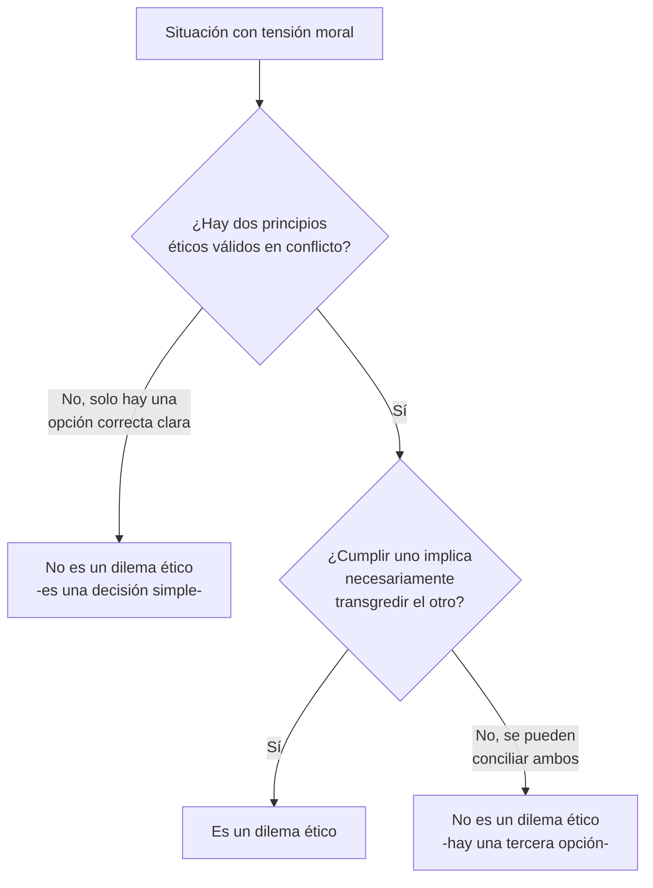

---
{"dg-publish":true,"permalink":"/universidad/2do-semestre/computacion-y-sociedad/unidad-6-etica-profesional/01-fundamentos-de-etica-y-moral/","dg-note-properties":{}}
---


# ⚖️ Fundamentos de Ética y Moral

## 🎯 Introducción

> [!info] 💡 ¿Ética y moral son lo mismo?
> 
> En el lenguaje cotidiano usamos "ética" y "moral" casi como sinónimos. Pero en el contexto profesional — y especialmente en computación, donde las decisiones técnicas tienen consecuencias sociales reales — vale la pena distinguirlos con precisión, porque **no responden a la misma pregunta**.
> 
> ```mermaid
> graph TD
>     A[Ética Profesional] --> B[Ética]
>     A --> C[Moral]
>     B --> D[Principio individual]
>     B --> E[Depende del contexto]
>     C --> F[Costumbre colectiva]
>     C --> G[No depende de la situación]
>     A --> H[Dilema Ético]
>     H --> I[Conflicto entre dos<br/>imperativos éticos]
>     style A fill:#1e3a5f,color:#fff
> ```

---

## ⚖️ Ética vs. Moral

> [!note] 📋 Definición — Moral
> 
> La **moral** son las **costumbres de un grupo** con respecto a lo que es correcto o incorrecto.
> 
> - **Creada por un colectivo.**
> - **No se puede aplicar en los negocios** (como principio general, es demasiado rígida para casos particulares).
> - **Los principios morales son concretos** y **no dependen de la situación**.

> [!note] 📋 Definición — Ética
> 
> La **ética** son los **principios que guían el comportamiento de un individuo**, ayudándolo a discernir el bien del mal.
> 
> - **Varía de un individuo a otro y de una situación a otra.**
> - **Se puede aplicar en los negocios.**
> - **Los principios éticos son abstractos**, dependen del contexto.

> [!note] 📊 Comparación — Moral vs. Ética
> 
> | Aspecto | Moral | Ética |
> |---|---|---|
> | **¿Quién la crea?** | Un colectivo (sociedad, cultura, religión) | Un individuo, guiado por principios |
> | **¿Depende de la situación?** | No — los principios son concretos | Sí — los principios son abstractos y dependen del contexto |
> | **¿Se aplica en los negocios?** | No, generalmente | Sí |
> | **Naturaleza** | Costumbre sobre lo correcto/incorrecto | Discernimiento del bien y el mal |

> [!warning] ⚠️ Por qué esta distinción importa en computación
> 
> Un código de ética profesional (como el de ACM o IEEE, ver [[Universidad/2do Semestre/Computación y Sociedad/Unidad 6 - Etica Profesional/03 - Códigos de Ética y Casos Reales\|03 - Códigos de Ética y Casos Reales]]) no es simplemente "la moral de la sociedad" trasladada al trabajo — es un conjunto de **principios que un profesional aplica activamente**, caso por caso, a situaciones que la ley o la costumbre colectiva no siempre cubren con claridad. Por eso la ética profesional exige juicio individual, no solo obediencia a una norma fija.

---

## 🤔 Dilema Ético

> [!note] 📋 Definición — Dilema ético
> 
> Un **dilema ético** es una situación en la que se hace presente un **aparente conflicto** entre **dos imperativos éticos**, de forma tal que **la obediencia a uno de ellos implica la transgresión del otro**.

> [!note] 📋 Los dilemas éticos como parte de la vida cotidiana
> 
> Los dilemas éticos están presentes en el día a día, por imperceptibles que sean — desde el comportamiento de nuestros conocidos, hasta nuestra vida profesional, nuestra reacción en momentos de adversidad, e incluso los clásicos dilemas amorosos.
> 
> Lo que hacen los dilemas éticos es **poner a prueba nuestras convicciones y creencias**, llevando a la gente a un estado paradójico y a menudo de estrés, en el que nuestro código moral es llevado a lo más crucial. Nos hacen reflexionar sobre nuestros motivos para hacer las cosas, y nuestra forma de ver el mundo — no son ajenos a nosotros, sino parte de nuestra vida normal.

---

## 📋 Ejemplos de Dilemas y Principios Éticos

> [!example] 📝 Ejemplos vistos en clase
> 
> - **Un juez se niega a recibir un soborno** para permitir que un criminal salga libre, siendo culpable de un delito.
> - **En una institución médica, un médico se niega a practicar un aborto**, porque esto infringe los principios de preservar la vida del paciente que le han sido inculcados, tanto dentro de la familia y la escuela, como aquellas reglas que su religión ha establecido y que él ha jurado proteger como médico que es.
> - **Un funcionario público que no se permite ser intimidado** por un funcionario superior, para cometer un acto indebido que pudiera causarle algún beneficio.
> - **Si una persona va caminando por la calle y ve que a un individuo se le cae la cartera llena de dinero** — ¿la devuelve o se la queda?
> - **En un partido de fútbol, el árbitro observa a todos los jugadores** e impone amonestaciones a quienes infringen las reglas, sin ningún favoritismo hacia alguno de los equipos contendientes.
> - **La usura es una práctica moralmente reprochable**, toda vez que se trata del cobro de los intereses provenientes de préstamos, pero de manera desmesurada.

> [!tip] 🖥️ Cómo actuar frente a un dilema ético
> 
> El material de clase remite a un recurso audiovisual complementario para profundizar en estrategias de resolución de dilemas éticos: [Cómo actuar frente a un dilema ético (YouTube)](https://www.youtube.com/watch?v=hB5u7wILAkC)

---

## 🧭 Flujograma de Decisión — ¿Es esto un dilema ético?



---

## 🖥️ Aplicación Práctica

> [!tip] 🖥️ Un dilema ético típico en tecnología
> 
> Un desarrollador descubre una vulnerabilidad grave de seguridad en el sistema de su empresa, justo antes del lanzamiento de un producto muy esperado. Reportarla podría **retrasar el lanzamiento** (afectando al negocio y a sus compañeros); no reportarla **expone a los usuarios** a un riesgo real. Ambos caminos tienen un costo — ese es precisamente el patrón de un dilema ético: cumplir un imperativo (lealtad al equipo/negocio) transgrede el otro (proteger a los usuarios).

---

## 📝 Ejercicios Progresivos

> [!question] 📋 Nivel 1 — Identificación básica
> 
> 1. ¿Cuál es la diferencia principal entre moral y ética según la definición vista en clase?
> 2. Define con tus palabras qué es un dilema ético.
> 3. De los ejemplos vistos, ¿cuál involucra a un funcionario público resistiendo presión de un superior?

> [!success]- ✅ Respuestas — Nivel 1
> 
> 1. La moral son costumbres de un **colectivo**, concretas y que no dependen de la situación; la ética son principios de un **individuo**, abstractos y que sí dependen del contexto.
> 2. Es una situación donde dos imperativos éticos entran en conflicto, de modo que cumplir uno implica transgredir el otro.
> 3. El ejemplo del funcionario público que no se permite ser intimidado por un superior para cometer un acto indebido.

> [!question] 📋 Nivel 2 — Análisis de casos
> 
> 4. ¿Por qué se dice que la ética "se puede aplicar en los negocios" pero la moral "no"? Relaciona tu respuesta con la diferencia entre principios concretos y abstractos.
> 5. En el ejemplo del médico que se niega a practicar un aborto, identifica los dos imperativos éticos en conflicto.
> 6. ¿Por qué el ejemplo de la cartera llena de dinero es un buen ejemplo de dilema ético cotidiano, y no solo un dilema legal?

> [!success]- ✅ Respuestas — Nivel 2
> 
> 4. Porque los negocios enfrentan situaciones particulares y cambiantes que requieren **juicio caso por caso** (abstracto, dependiente del contexto) — un principio moral rígido y colectivo no se adapta bien a la variedad de escenarios de negocio, mientras que un principio ético permite ese ajuste individual.
> 5. El imperativo de **preservar la vida del paciente** (su rol profesional/médico) frente al imperativo de **sus convicciones personales/religiosas** sobre cuándo es correcto intervenir médicamente.
> 6. Porque devolver la cartera no es estrictamente exigido por la ley en todos los contextos (a diferencia de, por ejemplo, robar activamente) — la tensión no es "legal vs. ilegal", sino **honestidad personal vs. beneficio propio**, lo que lo hace un dilema genuinamente ético más que legal.

> [!question] 📋 Nivel 3 — Aplicación y síntesis
> 
> 7. Retoma el ejemplo del árbitro de fútbol: ¿por qué actuar "sin ningún favoritismo" se presenta como un principio ético y no como un simple reglamento técnico del juego?
> 8. Diseña un dilema ético propio ambientado en un contexto de trabajo en tecnología (distinto al de las notas), identificando claramente los dos imperativos en conflicto.
> 9. ¿Por qué crees que el material de clase enfatiza que los dilemas éticos "no son ajenos a nosotros, sino parte de nuestra vida normal"? ¿Qué implicación tiene esto para un profesional que cree que "la ética es solo un tema para casos extremos"?

> [!success]- ✅ Respuestas — Nivel 3
> 
> 7. Porque el reglamento técnico le dice al árbitro **qué constituye una falta**, pero la **imparcialidad** (no favorecer a ningún equipo) es un principio de carácter, no una regla escrita en el reglamento — un árbitro técnicamente competente podría, en teoría, aplicar las reglas de forma sesgada; lo que lo hace éticamente correcto es aplicar el reglamento con imparcialidad consistente.
> 8. Ejemplo posible: un data scientist descubre que un modelo de IA de su empresa discrimina sutilmente contra cierto grupo demográfico, pero corregirlo retrasaría significativamente el lanzamiento y podría costarle su posición si insiste. Imperativos en conflicto: **lealtad y estabilidad laboral** vs. **evitar daño a usuarios reales**.
> 9. Porque si un profesional cree que la ética "solo aplica a casos extremos", tenderá a ignorar los dilemas éticos pequeños y cotidianos (una decisión de diseño, una omisión en un reporte, un atajo en una prueba) que, acumulados, pueden tener el mismo impacto que una decisión "grande" — reconocer que los dilemas éticos son constantes y frecuentemente imperceptibles ayuda a mantener el juicio ético activo en el trabajo diario, no solo en crisis evidentes.

---

## 🎯 Metas de Aprendizaje

> [!success] ✅ Nivel Básico
> 
> - [ ] Puedo diferenciar ética de moral según los criterios vistos en clase.
> - [ ] Puedo definir qué es un dilema ético.
> - [ ] Puedo reconocer un ejemplo de dilema ético entre los vistos en clase.

> [!success] ✅ Nivel Intermedio
> 
> - [ ] Puedo identificar los dos imperativos en conflicto dentro de un dilema ético dado.
> - [ ] Puedo explicar por qué la ética se aplica a los negocios y la moral no, según el material de clase.
> - [ ] Puedo distinguir un dilema ético de un simple dilema legal.

> [!success] ✅ Nivel Avanzado
> 
> - [ ] Puedo diseñar un dilema ético propio en un contexto tecnológico, identificando ambos imperativos.
> - [ ] Puedo argumentar por qué los dilemas éticos cotidianos e imperceptibles son tan relevantes como los extremos.
> - [ ] Puedo conectar la distinción ética/moral con la necesidad de códigos de ética profesional (ver [[Universidad/2do Semestre/Computación y Sociedad/Unidad 6 - Etica Profesional/03 - Códigos de Ética y Casos Reales\|03 - Códigos de Ética y Casos Reales]]).

---

## 📚 Referencias

> [!quote] 📖 Fuentes consultadas
> 
> [1] Material de clase, *Computación y Sociedad*, Unidad 7 — Ética Profesional, diapositivas sobre ética vs. moral y dilemas éticos.
> [2] Video complementario citado en clase: "Cómo actuar frente a un dilema ético", disponible en YouTube.

## 🔗 Conexiones

> [!quote] 🔗 Notas relacionadas
> 
> - [[Universidad/2do Semestre/Computación y Sociedad/Unidad 6 - Etica Profesional/02 - Falacias de la Ética Informática\|02 - Falacias de la Ética Informática]]
> - [[Universidad/2do Semestre/Computación y Sociedad/Unidad 6 - Etica Profesional/03 - Códigos de Ética y Casos Reales\|03 - Códigos de Ética y Casos Reales]]

---

**Tags:** #computacion-y-sociedad #etica-profesional #etica #moral #dilema-etico #ESPOL
