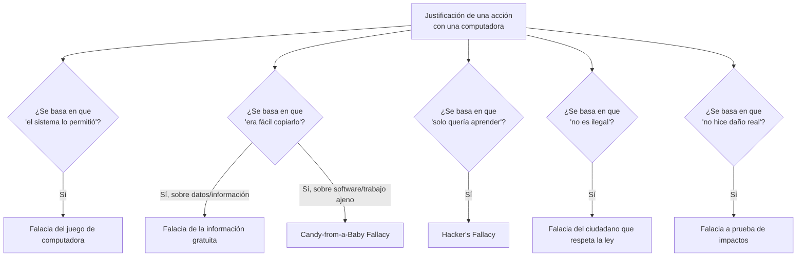

---
{"dg-publish":true,"permalink":"/universidad/2do-semestre/computacion-y-sociedad/unidad-6-etica-profesional/02-falacias-de-la-etica-informatica/","dg-note-properties":{}}
---


# 🧠 Falacias de la Ética Informática

## 🎯 Introducción

> [!info] 💡 Las excusas que usamos sin darnos cuenta
> 
> Una **falacia de ética informática** no es un argumento que alguien use conscientemente para justificar algo incorrecto — muchas veces es una **creencia genuina y difundida** que distorsiona el juicio ético de personas por lo demás razonables. Esta nota recopila seis de las más comunes, todas relacionadas con el uso de computadoras.
> 
> ```mermaid
> graph TD
>     A[Falacias de Ética Informática] --> B[Falacia del juego<br/>de computadora]
>     A --> C[Falacia de la<br/>información gratuita]
>     A --> D[Candy-from-a-Baby<br/>Fallacy]
>     A --> E[Hacker's Fallacy]
>     A --> F[Falacia del ciudadano<br/>que respeta la ley]
>     A --> G[Falacia a prueba<br/>de impactos]
>     style A fill:#1e3a5f,color:#fff
> ```

---

## 🎮 La Falacia del Juego de Computadora

> [!note] 📋 Definición — Falacia del juego de computadora
> 
> Incluso los usuarios de computadoras en general han recibido el mensaje de que **los ordenadores funcionan con exactitud** y **no permitirán acciones que no deberían ocurrir**.
> 
> Junto con esto, también hay la **percepción de que una persona puede hacer algo con una computadora sin ser atrapada**, de modo que si lo que se está haciendo **no está permitido**, la computadora de alguna manera **evitará que lo haga**.

> [!warning] ⚠️ Por qué es una falacia
> 
> Esta creencia trata a la computadora como si tuviera un juicio moral incorporado — como si "el sistema no me dejaría hacer algo malo". En realidad, una computadora **ejecuta exactamente lo que se le indica**, sea correcto o no; la ausencia de una restricción técnica **no equivale a un permiso ético**.

---

## 📖 La Falacia de la Información Gratuita

> [!note] 📋 Definición — Falacia de la información gratuita
> 
> Una opinión un tanto curiosa de muchos es la noción de que **la información "quiere ser libre"**, como se mencionó anteriormente. Se sugiere que esta falacia surgió del hecho de que **es tan fácil copiar información digital y distribuirla ampliamente**.
> 
> Sin embargo, esta línea de pensamiento **ignora completamente el hecho de que la copia y distribución de datos está completamente bajo el control y el capricho de las personas que lo permiten**.

> [!warning] ⚠️ Por qué es una falacia
> 
> La facilidad técnica de copiar algo **no genera un derecho** a hacerlo. Que la información digital sea fácil de duplicar no cambia el hecho de que sigue teniendo un titular de derechos (ver [[Universidad/2do Semestre/Computación y Sociedad/Unidad 5 - Privacidad y Propiedad Intelectual/01 - Fundamentos de Propiedad Intelectual\|01 - Fundamentos de Propiedad Intelectual]]) que decide, en última instancia, si esa copia y distribución están permitidas.

---

## 🍬 The Candy-from-a-Baby Fallacy

> [!note] 📋 Definición — Candy-from-a-Baby Fallacy
> 
> Las actividades ilegales y poco éticas, como la **piratería de software** y el **plagio**, son muy fáciles de hacer con una computadora. Sin embargo, **sólo porque es fácil no significa que sea correcto**.

> [!warning] ⚠️ Por qué es una falacia
> 
> El nombre alude a "quitarle un dulce a un bebé": algo trivialmente fácil de hacer, precisamente porque no hay resistencia. Esta falacia confunde **facilidad de ejecución** con **legitimidad moral** — la facilidad técnica de piratear software o plagiar contenido no dice nada sobre si está bien hacerlo.

---

## 💻 The Hacker's Fallacy

> [!note] 📋 Definición — Hacker's Fallacy
> 
> Numerosos informes y publicaciones comúnmente aceptan la creencia hacker de que **es aceptable hacer cualquier cosa con una computadora**, siempre y cuando la **motivación sea aprender** y **no ganar** o **hacer un beneficio de tales actividades**.

> [!warning] ⚠️ Por qué es una falacia
> 
> Esta falacia sustituye el criterio de **daño causado** por el criterio de **intención declarada**. Acceder sin autorización a un sistema, aunque la motivación sea "solo aprender", puede causar el mismo daño (interrupción de servicios, exposición de datos, costos de recuperación) que un ataque con fines de lucro — la ausencia de motivo económico no elimina la falta ética ni, en muchos casos, la ilegalidad del acto.

---

## ⚖️ La Falacia del Ciudadano que Respeta la Ley

> [!note] 📋 Definición — Falacia del ciudadano que respeta la ley
> 
> A veces los usuarios **confunden lo que es legal con respecto al uso de la computadora** con lo que es un **comportamiento razonable** para usar computadoras.

> [!warning] ⚠️ Por qué es una falacia
> 
> Que algo **no esté explícitamente prohibido por la ley** no significa automáticamente que sea **ético o razonable**. La ley suele ir por detrás de la tecnología — muchas prácticas cuestionables (ciertos usos agresivos de datos personales, ciertas formas de manipulación de interfaces) pueden ser técnicamente legales en un momento dado sin ser, por eso, comportamientos correctos.

---

## 💥 La Falacia a Prueba de Impactos

> [!note] 📋 Definición — Falacia a prueba de impactos
> 
> Muchos usuarios de computadoras **creen que pueden hacer poco daño accidentalmente con una computadora** más allá de quizás borrar o estropear un archivo.
> 
> Por ejemplo, **reenviar un correo electrónico** a un gran grupo de destinatarios es lo mismo que humillarlos públicamente. Otro ejemplo: **el reenvío de correo electrónico sin el permiso del autor** puede llevar a daño o vergüenza si el remitente original tenía la expectativa de que su mensaje fuera visto en privado, sin la expectativa de que fuera visto por otros.
> 
> Además, el uso del correo electrónico para **acosar o enviar spam**, o para **ofender al destinatario de alguna manera**, también son usos dañinos de las computadoras. La **piratería de software** es otro ejemplo de uso de computadoras para, en efecto, **lastimar a otros**.

> [!warning] ⚠️ Por qué es una falacia
> 
> Subestima el alcance real del daño digital: acciones que parecen "pequeñas" o "inofensivas" (reenviar un correo, compartir algo sin permiso) pueden tener consecuencias sociales, emocionales o económicas comparables a un daño físico directo — el medio digital no reduce la gravedad del daño, solo cambia su forma.

---

## 📊 Tabla Comparativa de Falacias

> [!note] 📊 Comparación de las seis falacias
> 
> | Falacia | Creencia errónea | Lo que ignora |
> |---|---|---|
> | **Del juego de computadora** | "Si el sistema me lo permite, es porque está bien" | Las computadoras ejecutan órdenes, no juzgan ética |
> | **De la información gratuita** | "Es fácil copiar, entonces la información es libre" | La facilidad técnica no otorga derechos legales |
> | **Candy-from-a-Baby** | "Es fácil piratear/plagiar, así que no pasa nada" | Facilidad de ejecución ≠ legitimidad moral |
> | **Hacker's Fallacy** | "Si solo aprendo, cualquier acceso no autorizado es aceptable" | La intención no elimina el daño causado |
> | **Del ciudadano que respeta la ley** | "Si no es ilegal, es razonable" | La ley no cubre todo comportamiento cuestionable |
> | **A prueba de impactos** | "Con una computadora hago poco daño" | El daño digital puede ser tan grave como el físico |

---

## 🧭 Flujograma de Decisión — ¿Qué falacia está en juego?



---

## 🖥️ Aplicación Práctica

> [!tip] 🖥️ Reconocer estas falacias en el día a día
> 
> Estas falacias no son solo teoría académica — aparecen constantemente en conversaciones cotidianas: "si no me lo bloqueó, es porque puedo hacerlo" (falacia del juego), "todo el mundo descarga música/series" (información gratuita / candy-from-a-baby), "yo solo estaba probando el sistema, no le hice daño a nadie" (hacker's fallacy), "reenviar ese chat no tiene nada de malo, no rompí ninguna ley" (ciudadano que respeta la ley + a prueba de impactos). Identificarlas por su nombre ayuda a notar el razonamiento defectuoso antes de repetirlo.

---

## 📝 Ejercicios Progresivos

> [!question] 📋 Nivel 1 — Identificación básica
> 
> 1. ¿Qué falacia describe la creencia de que "si el sistema lo permite, está bien hacerlo"?
> 2. ¿Qué falacia justifica la piratería o el plagio solo por ser fáciles de hacer?
> 3. ¿Qué falacia confunde legalidad con comportamiento razonable?

> [!success]- ✅ Respuestas — Nivel 1
> 
> 1. La **falacia del juego de computadora**.
> 2. **The Candy-from-a-Baby Fallacy**.
> 3. La **falacia del ciudadano que respeta la ley**.

> [!question] 📋 Nivel 2 — Análisis de casos
> 
> 4. Alguien accede sin autorización a un servidor "solo para ver si podía hacerlo, sin robar nada", y argumenta que no hizo nada malo porque no ganó dinero. ¿Qué falacia está cometiendo?
> 5. Un estudiante reenvía capturas de pantalla de un chat privado a un grupo grande, argumentando que "solo es texto, no hice daño real". ¿Qué falacia(s) identifica en este razonamiento?
> 6. ¿Por qué la falacia de la información gratuita y la Candy-from-a-Baby Fallacy, aunque parecidas, no son exactamente lo mismo?

> [!success]- ✅ Respuestas — Nivel 2
> 
> 4. La **Hacker's Fallacy** — justifica el acceso no autorizado por la motivación de "aprender" en lugar de "ganar", ignorando que el acceso no autorizado en sí mismo puede causar daño y ser ilegal, independientemente del motivo.
> 5. La **falacia a prueba de impactos** (cree que reenviar algo "no es daño real") y posiblemente la **falacia de la información gratuita** (trata el contenido de otra persona como libre de compartir solo porque es fácil hacerlo).
> 6. La falacia de la **información gratuita** se enfoca en la idea de que la información "quiere ser libre" por ser fácil de copiar (una creencia sobre la naturaleza de los datos); la **Candy-from-a-Baby Fallacy** se enfoca más directamente en que la facilidad técnica de un acto ilegal específico (piratería, plagio) no lo vuelve correcto — la primera es una creencia sobre la información en general, la segunda es sobre la justificación de actos concretos.

> [!question] 📋 Nivel 3 — Aplicación y síntesis
> 
> 7. Diseña un escenario donde una misma persona cometa simultáneamente la Hacker's Fallacy y la falacia del ciudadano que respeta la ley.
> 8. ¿Por qué crees que la falacia a prueba de impactos es particularmente peligrosa en el contexto de redes sociales y mensajería, comparado con el contexto en que probablemente fue formulada originalmente (correo electrónico)?
> 9. De las seis falacias, ¿cuál consideras que un código de ética profesional (ver [[Universidad/2do Semestre/Computación y Sociedad/Unidad 6 - Etica Profesional/03 - Códigos de Ética y Casos Reales\|03 - Códigos de Ética y Casos Reales]]) atacaría más directamente, y por qué?

> [!success]- ✅ Respuestas — Nivel 3
> 
> 7. Ejemplo: alguien realiza un escaneo de vulnerabilidades no autorizado en la red de una empresa "solo para aprender sobre seguridad" (Hacker's Fallacy), y al ser cuestionado responde que no rompió ninguna ley específica porque no extrajo datos (falacia del ciudadano que respeta la ley) — ambas falacias sirven para evadir la pregunta ética real: ¿tenía autorización para hacerlo?
> 8. Porque las redes sociales y la mensajería instantánea **amplifican el alcance y la velocidad** de cualquier reenvío o publicación mucho más que el correo electrónico de los años 90: un mensaje puede volverse viral y llegar a miles de personas en minutos, y el daño a la reputación o el acoso resultante puede ser mucho más difícil de contener o revertir.
> 9. La **Hacker's Fallacy** probablemente sea la más directamente atacada, ya que los códigos de ética profesional (como los "10 Mandamientos" o el código de ACM) suelen incluir explícitamente prohibiciones contra el acceso no autorizado a sistemas y datos, sin excepción por "buena intención" o motivo de aprendizaje — el criterio profesional es la autorización, no la intención declarada del actor.

---

## 🎯 Metas de Aprendizaje

> [!success] ✅ Nivel Básico
> 
> - [ ] Puedo nombrar las seis falacias de la ética informática.
> - [ ] Puedo dar un ejemplo cotidiano de al menos tres de ellas.
> - [ ] Puedo explicar en una frase por qué cada una es una falacia (no un argumento válido).

> [!success] ✅ Nivel Intermedio
> 
> - [ ] Puedo identificar qué falacia está presente en un escenario dado.
> - [ ] Puedo diferenciar falacias que parecen similares (ej. información gratuita vs. Candy-from-a-Baby).
> - [ ] Puedo reconocer cuando una misma situación combina más de una falacia.

> [!success] ✅ Nivel Avanzado
> 
> - [ ] Puedo diseñar un escenario que combine dos o más falacias de forma realista.
> - [ ] Puedo argumentar por qué ciertas falacias son más peligrosas en contextos tecnológicos actuales que en los que fueron formuladas.
> - [ ] Puedo relacionar cada falacia con la cláusula de un código de ética profesional que la contrarrestaría.

---

## 📚 Referencias

> [!quote] 📖 Fuentes consultadas
> 
> [1] Material de clase, *Computación y Sociedad*, Unidad 7 — Ética Profesional, diapositivas sobre las falacias de la ética informática.

## 🔗 Conexiones

> [!quote] 🔗 Notas relacionadas
> 
> - [[Universidad/2do Semestre/Computación y Sociedad/Unidad 6 - Etica Profesional/01 - Fundamentos de Ética y Moral\|01 - Fundamentos de Ética y Moral]]
> - [[Universidad/2do Semestre/Computación y Sociedad/Unidad 6 - Etica Profesional/03 - Códigos de Ética y Casos Reales\|03 - Códigos de Ética y Casos Reales]]
> - [[Universidad/2do Semestre/Computación y Sociedad/Unidad 5 - Privacidad y Propiedad Intelectual/01 - Fundamentos de Propiedad Intelectual\|01 - Fundamentos de Propiedad Intelectual]]

---

**Tags:** #computacion-y-sociedad #etica-profesional #falacias #etica-informatica #ESPOL
