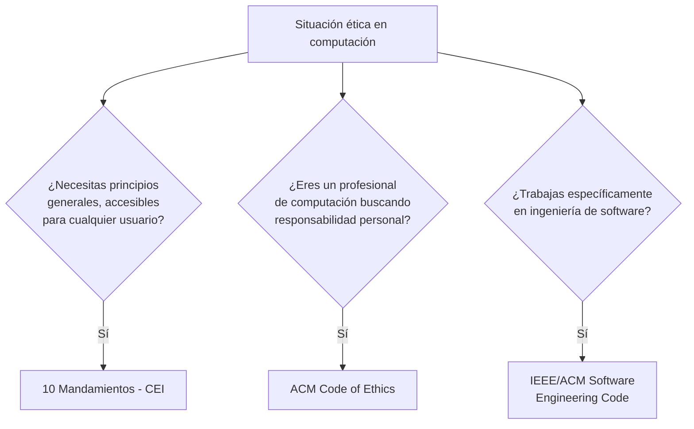

---
{"dg-publish":true,"permalink":"/universidad/2do-semestre/computacion-y-sociedad/unidad-6-etica-profesional/03-codigos-de-etica-y-casos-reales/","dg-note-properties":{}}
---


# 📜 Códigos de Ética y Casos Reales

## 🎯 Introducción

> [!info] 💡 De los principios abstractos a las reglas escritas
> 
> Las dos notas anteriores cubrieron la teoría: la diferencia entre ética y moral, qué es un dilema ético, y las falacias que distorsionan el juicio ético en computación. Esta nota cierra el bloque con la parte **institucional y práctica**: los códigos formales que la industria de la computación ha adoptado para guiar la conducta profesional, y un caso real donde la ética profesional se puso a prueba.
> 
> ```mermaid
> graph TD
>     A[Códigos de Ética] --> B[CEI - 10 Mandamientos]
>     A --> C[ACM Code of Ethics]
>     A --> D[IEEE/ACM Software<br/>Engineering Code]
>     A --> E[Caso Real: Samsung]
>     style A fill:#1e3a5f,color:#fff
> ```

---

## 📜 CEI — Los Diez Mandamientos de la Ética Computacional

> [!note] 📋 Origen — Computer Ethics Institute (CEI)
> 
> En **1991**, el Instituto de Ética Computacional (**CEI**) celebró su primera Conferencia Nacional de Ética Computacional en Washington, DC. Los **Diez Mandamientos de la Ética Computacional** fueron presentados por primera vez en el documento *"En búsqueda de un 'Diez Mandamientos' Ética"* del **Dr. Ramón C. Barquín**, preparado para la conferencia. El Instituto de Ética Computacional los publicó formalmente en **1992**.

> [!note] 📋 Los 10 Mandamientos de la Ética
> 
> 1. No usarás una computadora para dañar a otras personas.
> 2. Tú no interferirás con el trabajo de otras personas.
> 3. No deberías seguir en los archivos de la computadora de otras personas.
> 4. No usarás una computadora para robar.
> 5. No usarás una computadora para llevar un falso testimonio.
> 6. Usted no debe copiar ni utilizar software propietario para el cual no haya pagado.
> 7. No usarás los recursos informáticos de otras personas sin autorización ni compensación apropiada.
> 8. No debes apropiarse del rendimiento intelectual de otras personas.
> 9. Debes pensar en las consecuencias sociales del programa que estás escribiendo o del sistema que estás diseñando.
> 10. Siempre debes usar una computadora de maneras que aseguren consideración y respeto hacia la sociedad.

> [!tip] 🖥️ Conexión con las falacias vistas antes
> 
> Varios de estos mandamientos contrarrestan directamente las falacias de [[Universidad/2do Semestre/Computación y Sociedad/Unidad 6 - Etica Profesional/02 - Falacias de la Ética Informática\|02 - Falacias de la Ética Informática]]: el mandamiento 6 ("no copiarás software propietario") ataca directamente la **Candy-from-a-Baby Fallacy** y la **falacia de la información gratuita**; el mandamiento 3 ("no seguirás en archivos ajenos") ataca la **Hacker's Fallacy**, sin excepción por "buena intención".

---

## 💻 ACM Code of Ethics and Professional Conduct

> [!note] 📋 Definición — Código de ACM
> 
> La **ACM (Association for Computing Machinery)** adoptó su **Code of Ethics and Professional Conduct** en **octubre de 1992**.
> 
> - Consiste en **24 imperativos** formulados como declaraciones de **responsabilidad personal**.

---

## 🛠️ IEEE/ACM Software Engineering Code of Ethics and Professional Practice

> [!note] 📋 Definición — Código conjunto IEEE/ACM
> 
> El **IEEE/ACM Software Engineering Code of Ethics and Professional Practice** fue **adoptado por un grupo de trabajo conjunto entre IEEE-CS y ACM en 1999**, específicamente enfocado en la práctica de la **ingeniería de software**.

> [!note] 📊 Comparación de los tres códigos
> 
> | Código | Institución | Año | Enfoque |
> |---|---|---|---|
> | **10 Mandamientos** | Computer Ethics Institute (CEI) | 1992 (presentado en 1991) | Principios generales y accesibles para cualquier usuario de computadoras |
> | **ACM Code of Ethics** | Association for Computing Machinery | 1992 | 24 imperativos de responsabilidad personal para profesionales de computación |
> | **IEEE/ACM Software Engineering Code** | IEEE-CS + ACM (grupo de trabajo conjunto) | 1999 | Específico para la práctica profesional de ingeniería de software |

> [!warning] ⚠️ No son leyes, son estándares profesionales
> 
> Ninguno de estos tres códigos tiene fuerza de ley por sí solo — son estándares adoptados por **asociaciones profesionales**. Su cumplimiento depende en gran medida del compromiso individual del profesional y, en algunos casos, de las políticas internas de las empresas u organizaciones que los adoptan como referencia. Esto conecta directamente con la **falacia del ciudadano que respeta la ley** (ver [[Universidad/2do Semestre/Computación y Sociedad/Unidad 6 - Etica Profesional/02 - Falacias de la Ética Informática\|02 - Falacias de la Ética Informática]]): cumplir la ley no es lo mismo que actuar conforme a estos códigos éticos.

---

## 🏭 Caso Real — Samsung ante el Reto de Aplicar Política Ética

> [!example] 📝 Ejemplo — Samsung y su proveedor en China
> 
> El gigante tecnológico **Samsung Electronics** anunció su decisión de **suspender temporalmente los negocios** con un proveedor en China, tras encontrar **evidencias de un posible uso de mano de obra infantil**.
> 
> La multinacional surcoreana expuso en un comunicado que **"ha decidido suspender temporalmente los negocios con la fábrica" de Shinyang Electronics en Dongguan** (al sureste de China), **"ya que ha hallado evidencias de presunto uso de mano de obra infantil en el lugar de trabajo"**.

> [!warning] ⚠️ Por qué este caso es relevante para la ética profesional en computación
> 
> Este caso no trata sobre código, software o hackeo — pero es un ejemplo directo de **ética profesional aplicada a nivel corporativo** en la industria tecnológica: una empresa de tecnología enfrentando el **mandamiento 9** de los 10 Mandamientos ("pensar en las consecuencias sociales" de lo que se produce) y el **mandamiento 10** ("usar los recursos de manera que aseguren consideración y respeto hacia la sociedad") — no solo en el software que se escribe, sino en **toda la cadena de producción** detrás de un dispositivo tecnológico.

---

## 🧭 Flujograma de Decisión — ¿Qué código consultar?



---

## 🖥️ Aplicación Práctica

> [!tip] 🖥️ Cómo se usan estos códigos en la práctica profesional
> 
> Muchas empresas de tecnología incorporan referencias a estos códigos (o versiones adaptadas de ellos) en sus políticas internas de conducta, especialmente el ACM Code of Ethics. Cuando un ingeniero de software enfrenta una decisión ambigua — por ejemplo, si implementar una función que recolecta más datos de los estrictamente necesarios — estos códigos ofrecen un marco de referencia formal más allá de "¿es esto legal?", acercándose a la pregunta más exigente de "¿es esto correcto?".

---

## 📝 Ejercicios Progresivos

> [!question] 📋 Nivel 1 — Identificación básica
> 
> 1. ¿Quién presentó por primera vez los 10 Mandamientos de la Ética Computacional, y en qué año?
> 2. ¿Cuántos imperativos consta el ACM Code of Ethics?
> 3. ¿Qué tuvo que hacer Samsung al descubrir evidencias de mano de obra infantil en un proveedor?

> [!success]- ✅ Respuestas — Nivel 1
> 
> 1. El **Dr. Ramón C. Barquín**, presentados en 1991 y publicados formalmente por el CEI en 1992.
> 2. **24 imperativos**.
> 3. **Suspendió temporalmente los negocios** con esa fábrica proveedora.

> [!question] 📋 Nivel 2 — Análisis de casos
> 
> 4. ¿Por qué el IEEE/ACM Software Engineering Code es más específico que el ACM Code of Ethics general? ¿A qué crees que responde esa diferencia de enfoque?
> 5. Relaciona el caso de Samsung con el mandamiento 9 de los 10 Mandamientos ("pensar en las consecuencias sociales"). ¿Por qué aplica incluso si Samsung no fabricó directamente con mano de obra infantil, sino un proveedor?
> 6. ¿Por qué se dice que estos códigos "no tienen fuerza de ley"? ¿Qué consecuencia práctica tiene esto para un profesional que los incumple?

> [!success]- ✅ Respuestas — Nivel 2
> 
> 4. Porque la ingeniería de software tiene **responsabilidades técnicas específicas** (calidad del código, pruebas, mantenibilidad, impacto de los sistemas que se construyen) que un código general de "ética en computación" no puede cubrir con el mismo nivel de detalle — de ahí que un grupo de trabajo conjunto haya desarrollado un código dedicado en 1999.
> 5. Porque la responsabilidad ética de una empresa tecnológica **no termina en su propia línea de producción** — su cadena de suministro forma parte de las "consecuencias sociales" de operar el negocio; permitir (aunque sea indirectamente, a través de un proveedor) una práctica como el trabajo infantil compromete igualmente ese mandamiento.
> 6. Porque son **estándares profesionales voluntarios**, adoptados por asociaciones (ACM, IEEE-CS, CEI), no por gobiernos con poder coercitivo. La consecuencia práctica de incumplirlos generalmente no es un castigo legal directo, sino de índole profesional/reputacional (pérdida de confianza, sanciones internas de la empresa, o consecuencias dentro de la asociación profesional si aplica) — a menos que la conducta también viole una ley específica.

> [!question] 📋 Nivel 3 — Aplicación y síntesis
> 
> 7. Diseña un escenario donde un ingeniero de software cumpla estrictamente con la ley pero viole claramente el ACM Code of Ethics o los 10 Mandamientos.
> 8. El caso Samsung no involucra directamente "computadoras" en el sentido estricto de las falacias vistas en la nota anterior. ¿Por qué crees que se incluye como ejemplo dentro de un curso de Computación y Sociedad?
> 9. Compara los tres códigos de ética presentados (CEI, ACM, IEEE/ACM) en términos de su nivel de detalle y su público objetivo. ¿Por qué crees que la industria de la computación necesita los tres, en lugar de uno solo?

> [!success]- ✅ Respuestas — Nivel 3
> 
> 7. Ejemplo: un ingeniero recolecta datos de ubicación de los usuarios de una app de forma técnicamente legal (con un consentimiento genérico enterrado en términos y condiciones que casi nadie lee), pero sin pensar realmente en las **consecuencias sociales** de ese diseño (mandamiento 9) ni actuar con **consideración y respeto hacia la sociedad** (mandamiento 10) — cumple la ley, pero no el espíritu de los códigos éticos.
> 8. Porque la ética profesional en tecnología **no se limita al código que se escribe** — incluye las decisiones de negocio, la cadena de suministro y el impacto social más amplio de una empresa tecnológica. El curso "Computación y Sociedad" busca precisamente esa perspectiva ampliada: la tecnología no existe aislada de sus condiciones de producción y de sus consecuencias humanas.
> 9. El **CEI (10 Mandamientos)** es el más general y accesible, pensado para cualquier usuario de computadoras; el **ACM Code of Ethics** es más formal y específico para profesionales de computación en general (24 imperativos de responsabilidad personal); el **IEEE/ACM Software Engineering Code** es el más especializado, enfocado exclusivamente en la práctica de la ingeniería de software. La industria necesita los tres porque **el nivel de responsabilidad y el tipo de decisiones éticas difieren** según si hablamos de un usuario común, un profesional de TI en general, o un ingeniero de software construyendo sistemas complejos que otros usarán.

---

## 🎯 Metas de Aprendizaje

> [!success] ✅ Nivel Básico
> 
> - [ ] Puedo nombrar los tres códigos de ética vistos en clase y su institución de origen.
> - [ ] Puedo enumerar al menos 5 de los 10 Mandamientos de la Ética.
> - [ ] Puedo resumir el caso Samsung en 2-3 líneas.

> [!success] ✅ Nivel Intermedio
> 
> - [ ] Puedo explicar la diferencia de enfoque entre el ACM Code of Ethics y el IEEE/ACM Software Engineering Code.
> - [ ] Puedo conectar mandamientos específicos con falacias de la ética informática que contrarrestan.
> - [ ] Puedo explicar por qué estos códigos no tienen fuerza de ley y qué implica eso.

> [!success] ✅ Nivel Avanzado
> 
> - [ ] Puedo diseñar un escenario donde se cumpla la ley pero se viole un código de ética profesional.
> - [ ] Puedo argumentar por qué la industria necesita códigos con distintos niveles de especificidad.
> - [ ] Puedo relacionar el caso Samsung con los principios de ética profesional más allá del código puro (cadena de suministro, responsabilidad corporativa).

---

## 📚 Referencias

> [!quote] 📖 Fuentes consultadas
> 
> [1] Material de clase, *Computación y Sociedad*, Unidad 7 — Ética Profesional, diapositivas sobre códigos de ética (CEI, ACM, IEEE/ACM).
> [2] EFE, "Samsung ante el reto de aplicar política ética", citado en el material de clase (`laestrella.com.pa`).
> [3] Recurso citado en clase sobre el código IEEE/ACM en español: `etsu.edu/cbat/computing/seeri/documents/seeri.spanish.pdf`.

## 🔗 Conexiones

> [!quote] 🔗 Notas relacionadas
> 
> - [[Universidad/2do Semestre/Computación y Sociedad/Unidad 6 - Etica Profesional/01 - Fundamentos de Ética y Moral\|01 - Fundamentos de Ética y Moral]]
> - [[Universidad/2do Semestre/Computación y Sociedad/Unidad 6 - Etica Profesional/02 - Falacias de la Ética Informática\|02 - Falacias de la Ética Informática]]

---

**Tags:** #computacion-y-sociedad #etica-profesional #codigos-de-etica #acm #ieee #ESPOL
