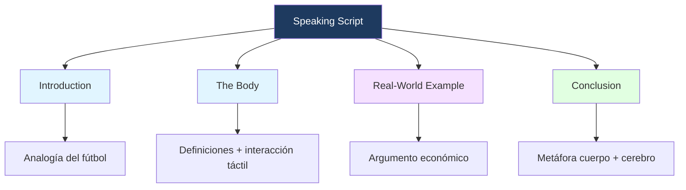

---
{"dg-publish":true,"permalink":"/universidad/2do-semestre/ingles-ii-c1-c2/unit-0-preliminar/guion-del-3-mit/","dg-note-properties":{}}
---


# 🎤 Hardware vs Software — Speaking Script

## 🎯 Introducción al Script

> [!info] 💡 ¿De qué trata esta presentación?
> 
> Este script explora las diferencias entre **hardware** y **software** usando analogías cotidianas. La estructura sigue el esquema clásico de introducción, desarrollo, ejemplo real y conclusión.
> 
> ```mermaid
> graph TD
>     A[Hardware vs Software] --> B[Hardware: parte física]
>     A --> C[Software: código e instrucciones]
>     B --> D["Pantallas, teclados, procesadores"]
>     C --> E["Apps, sistema operativo, lógica"]
>     B --> F[La herramienta]
>     C --> G[El cerebro]
>     style A fill:#1e3a5f,color:#fff
>     style B fill:#e1f5ff
>     style C fill:#f5e1ff
>     style F fill:#e1ffe1
>     style G fill:#e1ffe1
> ```

---

## 1️⃣ Introduction (~0:50 seg)

> [!tip] 💡 Cue de apertura
> Haz una pausa real después de la pregunta retórica — deja que la audiencia piense unos segundos antes de continuar.

"Good morning, everyone. My name is Freddy Steven Sánchez Saavedra, and today I am going to talk about the differences between software and hardware.

To start, have you ever thought about what makes a great football match? **[Pausa]** Think about the pitch, the ball, and the players. You can touch all of those things. However, what actually wins the game is the strategy.

In computers, we see the same thing. **Hardware** is the physical part, and **software** is the invisible strategy."

---

## 2️⃣ The Body (~0:50 seg)

> [!note] 📋 Concepto central
> Establece el contraste con claridad: uno es tangible, el otro es lógica pura. La metáfora **herramienta / cerebro** es el ancla conceptual de toda la presentación.

"Hardware is the physical base: screens, keyboards, and processors. If you can hold it, it is hardware. Software is the code and the apps. It tells the hardware what to do.

When you tap your screen, the software reads your touch, and the hardware shows the result. One is the **tool**, and the other is the **'brain'**."

---

## 3️⃣ The Real-World Example (~0:20 seg)

> [!example] 📝 ¿Por qué importa?
> El argumento económico conecta el concepto abstracto con algo que todos han vivido: actualizar una app sin comprar un equipo nuevo.

"Why does this matter? It is all about savings. If they were the same thing, you would need to buy a new computer for every new app.

Instead, software lets us update our devices instantly without changing the hardware, making technology **cheaper and better for everyone**."

---

## 4️⃣ Conclusion (~0:20 seg)

> [!success] ✅ Cierre
> Regresa a la metáfora central para cerrar el círculo. El público debe salir recordando: **cuerpo + cerebro = equipo**.

"In short, hardware and software are a team of **body and brain**. Next time you use your phone, remember: it is more than just glass and metal; it is a powerful partnership.

**Thank you very much for listening.**"

---

## 📊 Resumen Visual



---

## 📝 Tabla de Secciones

> [!question] 📋 Referencia rápida

| Sección | Duración | Idea clave | Recurso retórico |
|---|---|---|---|
| Introduction | ~0:50 seg | Hardware = físico / Software = estrategia | Pregunta retórica + analogía fútbol |
| The Body | ~0:50 seg | Interacción táctil: software lee, hardware muestra | Contraste herramienta / cerebro |
| Real-World Example | ~0:20 seg | Software = ahorro: no compras PC por cada app | Argumento económico cotidiano |
| Conclusion | ~0:20 seg | Equipo cuerpo + cerebro | Cierre circular con metáfora |

---

**Tags:** #english #speaking #hardware #software #script #FIEC