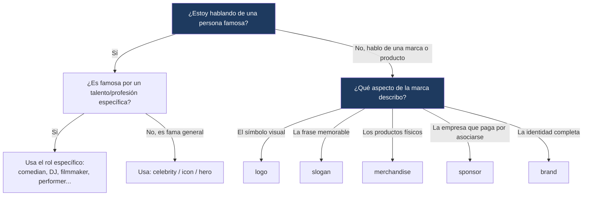

---
{"dg-publish":true,"permalink":"/universidad/2do-semestre/ingles-ii-c1-c2/unit-4-going-glocal/01-vocabulary-and-use-advertising-and-media-people/","dg-note-properties":{}}
---

# 📢 Vocabulary & Use — Advertising & Media People

## 🎯 Introducción

> [!info] 💡 ¿Qué vocabulario se trabaja en esta nota?
> 
> Esta nota cubre dos bloques de vocabulario de la **Unidad 4** de Keynote Upper-Intermediate (Going Glocal), enfocados en el mundo de la publicidad y los medios:
> 
> - **Talking about advertising:** términos para describir cómo las marcas se promocionan y venden productos (sección 4.1).
> - **Talking about people in the media:** vocabulario para describir a personas famosas o influyentes en internet y los medios (sección 4.2).
> 
> ```mermaid
> graph TD
>     A["Vocabulary & Use<br/>Unit 4"] --> B[Advertising]
>     A --> C[People in the Media]
> 
>     B --> D["brand · logo · slogan<br/>sponsor · merchandise"]
>     C --> E["celebrity · icon · performer<br/>entertainer · influencer-type roles"]
> 
>     style B fill:#e8eaf6
>     style C fill:#e0f7fa
> ```
> 
> |Bloque|¿Para qué sirve?|Sección del libro|
> |---|---|---|
> |**Advertising**|Describir cómo las empresas construyen y promocionan una marca|4.1 More Than Just a Jersey|
> |**People in the Media**|Hablar de personas famosas, virales o influyentes|4.2 Viral Stories|

---

## 📣 Talking About Advertising

> [!note] 📣 Contexto — Sports marketing
> 
> La sección **4.1** parte de un artículo sobre marketing deportivo: analiza de dónde sacan sus ingresos equipos como Real Madrid, PSG, Barcelona o Manchester United (venta de entradas, derechos de transmisión, patrocinios y merchandising), y cómo el patrocinio puede llegar a valer más que el propio equipo. A partir de ahí se introduce el vocabulario de publicidad.

---

### 🔹 Términos clave de publicidad

> [!note] 🔹 Vocabulario esencial
> 
> |Término en inglés|Traducción|¿Qué implica exactamente?|
> |---|---|---|
> |**ad / advertisement**|anuncio|Forma corta e informal (_ad_) vs. forma completa y algo más formal (_advertisement_). Ambas se refieren a la pieza publicitaria.|
> |**advertise**|anunciar / hacer publicidad|Es el **verbo**. _Companies advertise their products on TV._|
> |**commercial**|comercial (TV/radio)|Anuncio específicamente audiovisual, transmitido en TV o radio.|
> |**brand**|marca|La identidad completa de una empresa o producto (nombre, valores, reputación).|
> |**logo**|logotipo|El símbolo o diseño gráfico que representa a la marca.|
> |**slogan**|eslogan|La frase corta y memorable asociada a la marca.|
> |**sponsor**|patrocinador (n) / patrocinar (v)|Como sustantivo: la empresa que paga por asociarse a un equipo/evento. Como verbo: la acción de pagar por esa asociación.|
> |**merchandise / products**|mercancía / productos|Los artículos físicos que se venden (camisetas, tazas, etc.).|
> |**merchandising**|comercialización de productos|El **proceso o estrategia** de vender merchandise — no son sinónimos exactos: _merchandise_ es la cosa, _merchandising_ es la actividad.|
> |**status symbol**|símbolo de estatus|Un objeto que demuestra la posición social o económica de quien lo posee.|
> |**fashion statement**|declaración de moda|Algo que se usa/lleva para expresar estilo personal, no necesariamente estatus.|

> [!warning] ⚠️ Diferencias que se confunden fácilmente
> 
> - **sponsor (n) vs. sponsor (v):** _Emirates is a sponsor of PSG_ (sustantivo) vs. _Emirates sponsors PSG_ (verbo).
> - **merchandise vs. merchandising:** _merchandise_ = los productos en sí; _merchandising_ = la práctica de venderlos y promocionarlos.
> - **brand vs. logo vs. slogan:** la _brand_ es el concepto completo; el _logo_ es solo el símbolo visual; el _slogan_ es solo la frase.
> - **advertise (v) vs. an advertisement/ad (n) vs. a commercial (n):** _advertise_ es la acción; _ad/advertisement_ es cualquier pieza publicitaria (impresa, digital, etc.); _commercial_ es específicamente en TV o radio.
> - **status symbol vs. fashion statement:** un _status symbol_ comunica riqueza o estatus (un reloj de lujo); una _fashion statement_ comunica estilo personal, sin implicar necesariamente estatus.

> [!example]- 🟢 Ejemplo en contexto (artículo de marketing deportivo)
> 
> El artículo explica que, en el caso de Real Madrid, el patrocinio representa cerca de un tercio de los ingresos totales del equipo, mientras que en PSG el patrocinio y el merchandising juntos superan la mitad de sus ingresos — lo cual sugiere que la marca de PSG podría valer incluso más que el equipo como tal. También señala que ambos clubes comparten el mismo patrocinador principal (una aerolínea), y que las camisetas "de imitación" son comunes precisamente porque el merchandising mueve tanto dinero.

---

## 🎤 Talking About People in the Media

> [!note] 🎤 Contexto — Viral stories
> 
> La sección **4.2** explora cómo las historias se vuelven virales — muchas veces sin que la persona protagonista sea una celebridad reconocida. El vocabulario aquí sirve para **clasificar** distintos tipos de figuras públicas o mediáticas.

---

### 🔹 Vocabulario de personas en los medios

> [!note] 🔹 Roles y figuras públicas
> 
> |Término|Traducción|Descripción|
> |---|---|---|
> |**audience**|audiencia / público|El grupo de personas que ve, escucha o consume algo.|
> |**celebrity**|celebridad|Persona ampliamente conocida por el público, sin importar el campo (puede ser científico, actor, deportista, etc.).|
> |**comedian**|comediante|Persona que hace humor como profesión.|
> |**designer**|diseñador/a|Persona que crea diseños (moda, productos, gráficos).|
> |**DJ**|DJ|Persona que mezcla o pone música, normalmente en vivo.|
> |**entertainer**|animador / artista de entretenimiento|Término general para alguien cuyo trabajo es entretener (cantante, actor, cómico, etc.).|
> |**filmmaker**|cineasta|Persona que crea películas (dirección, producción, etc.).|
> |**hero**|héroe / ídolo|Persona admirada profundamente, a menudo por sus logros o valores.|
> |**icon**|ícono|Persona que representa o simboliza algo culturalmente significativo.|
> |**model**|modelo|Persona que posa profesionalmente para fotografía, moda, etc.|
> |**movie producer**|productor de cine|Persona responsable de organizar/financiar la producción de una película.|
> |**performer**|intérprete / artista|Término general para quien actúa, canta o se presenta ante un público.|

> [!tip]- 💡 Nota sobre "celebrity" vs. otros términos
> 
> _Celebrity_ es el término más general: **cualquier** figura famosa, sin importar el campo (puede ser un científico famoso, no solo un actor o cantante). Los demás términos (_comedian, DJ, filmmaker,_ etc.) son más específicos y describen la **profesión** o el rol concreto de esa persona famosa.

> [!example]- 🟢 Ejemplo en contexto (historia viral)
> 
> El libro presenta el caso de un niño afgano que se hizo viral tras ser fotografiado con una réplica casera de la camiseta de su ídolo (Lionel Messi), hecha con una bolsa plástica. La foto se difundió tanto que terminó viajando a Catar y conociendo a su héroe. El punto clave del ejercicio es que **no hace falta ser una celebridad o un ícono cultural para volverse viral** — muchas historias que emocionan al público simplemente ocurren y se comparten.

---

## 📊 Tabla comparativa — Publicidad vs. Personas en medios

> [!note] 📊 Comparación de campos semánticos
> 
> |Campo|Palabras clave|Enfoque|
> |---|---|---|
> |**Advertising**|brand, logo, slogan, sponsor, merchandise, ad|El **producto o la marca** y cómo se promociona|
> |**People in the media**|celebrity, icon, performer, entertainer|Las **personas** detrás del contenido o la fama|
> |**Punto de encuentro**|status symbol, fashion statement|Cómo las personas usan productos de marca para proyectar imagen|

---

## 🖥️ Aplicación práctica

> [!tip]- 🖥️ Cómo usar este vocabulario en una conversación
> 
> Para describir una campaña publicitaria: _"That commercial is terrible! The slogan is a little song, and it stays in my head for days!"_ — combina **commercial**, **slogan** y una opinión personal, tal como pide el ejercicio de speaking del libro (4.1C).
> 
> Para hablar de una persona famosa: _"A performer I really admire is..."_ — usa el vocabulario de personas en medios para completar oraciones personales (4.2D), practicando con roles específicos (DJ, filmmaker, icon) en vez de quedarte solo con "celebrity".

---

## 🧩 Diagrama de decisión — ¿Qué palabra uso?



---

## 📝 Ejercicios Progresivos

> [!question] 📋 Nivel 1 — Reconocimiento básico
> 
> **1.** Empareja cada palabra con su definición: _sponsor, logo, slogan_ — (a) frase memorable, (b) símbolo visual, (c) empresa que paga por asociarse a un equipo.
> 
> **2.** Elige la palabra correcta: _A famous scientist can also be a __________ (celebrity / DJ)._
> 
> **3.** Completa: _Nike's __________ (logo/slogan) is "Just Do It."_

> [!success]- ✅ Respuestas — Nivel 1
> 
> **1.** sponsor = (c), logo = (b), slogan = (a)
> 
> **2.** celebrity
> 
> **3.** slogan

---

> [!question] 📋 Nivel 2 — Aplicación en contexto
> 
> **1.** Reescribe usando el verbo _advertise_: _"Coca-Cola pays for a lot of TV commercials."_
> 
> **2.** Explica la diferencia entre _merchandise_ y _merchandising_ con un ejemplo propio.
> 
> **3.** Describe a una persona famosa de tu país usando al menos dos palabras de la sección "people in the media" (que no sea _celebrity_).

> [!success]- ✅ Respuestas — Nivel 2 (ejemplo de respuesta)
> 
> **1.** _Coca-Cola advertises a lot on TV._
> 
> **2.** _Merchandise_ = las camisetas y tazas que vende un equipo; _merchandising_ = la estrategia de diseñarlas, producirlas y venderlas para generar ingresos.
> 
> **3.** Respuesta abierta — ej.: _"She's a well-known entertainer and also an icon in Ecuadorian music."_

---

> [!question] 📋 Nivel 3 — Análisis y producción libre
> 
> **1.** ¿Por qué crees que el patrocinio (_sponsorship_) puede llegar a ser más valioso que las ventas de entradas para un equipo deportivo? Usa al menos 3 palabras de vocabulario en tu respuesta.
> 
> **2.** Diseña un eslogan (_slogan_) corto para una marca ficticia y explica qué _status symbol_ o _fashion statement_ busca proyectar.
> 
> **3.** Compara dos personas públicas: una que consideres _icon_ y otra que consideres solo _performer_. Justifica la diferencia.

> [!success]- ✅ Guía de respuesta — Nivel 3
> 
> Respuestas abiertas; se espera uso correcto y variado del vocabulario (mínimo 5-6 términos distintos combinados naturalmente), no solo repetición mecánica.

---

## 🎯 Metas de Aprendizaje

> [!success] ✅ Nivel Básico
> 
> - [ ] Reconozco y traduzco correctamente los 12 términos de advertising.
> - [ ] Reconozco y traduzco correctamente los 12 términos de people in the media.
> - [ ] Distingo _ad_ de _commercial_ y _advertisement_.

> [!success] ✅ Nivel Intermedio
> 
> - [ ] Uso correctamente _sponsor_ como sustantivo y como verbo.
> - [ ] Explico la diferencia entre _merchandise_ y _merchandising_ sin dudar.
> - [ ] Elijo el término específico correcto (DJ, filmmaker, comedian...) en vez de usar siempre "celebrity".

> [!success] ✅ Nivel Avanzado
> 
> - [ ] Puedo describir una campaña publicitaria completa (brand, logo, slogan, sponsor) en una conversación fluida.
> - [ ] Puedo argumentar por qué algo es un _status symbol_ vs. una _fashion statement_.
> - [ ] Combino vocabulario de ambas secciones (advertising + media people) al hablar de cómo las marcas usan celebridades para venderse.

---

> [!quote] 📖 Referencias
> 
> [1] _Keynote Upper-Intermediate_, National Geographic Learning / Cengage, Student's Book, Unit 4: Going Glocal, pp. 34–37.

> [!quote] 🔗 Conexiones
> 
> - [[Universidad/2do Semestre/Ingles II (C1-C2)/Unit 4 - Going Glocal/02 - Grammar & Examples - Modals of Speculation & Relative Clauses\|02 - Grammar & Examples - Modals of Speculation & Relative Clauses]]
> - [[03 - Functional Language & Pronunciation - Exchanging Opinions & Vowel Sounds\|03 - Functional Language & Pronunciation - Exchanging Opinions & Vowel Sounds]]
> - [[04 - Reading Writing Speaking - Building a Brand & Designing Ads\|04 - Reading Writing Speaking - Building a Brand & Designing Ads]]

---

**Tags:** #vocabulary #advertising #media #marketing #English #IDIG1007 #ESPOL #unit4