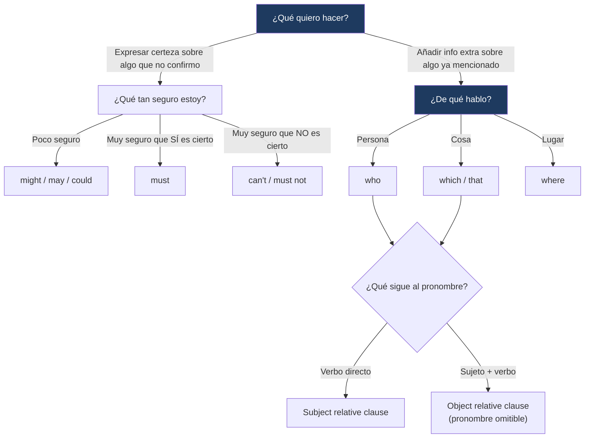

---
{"dg-publish":true,"permalink":"/universidad/2do-semestre/ingles-ii-c1-c2/unit-4-going-glocal/02-grammar-and-examples-modals-of-speculation-and-relative-clauses/","dg-note-properties":{}}
---

# 🧠 Grammar & Examples — Modals of Speculation & Relative Clauses

## 🎯 Introducción

> [!info] 💡 ¿Qué gramática se trabaja en esta nota?
> 
> Esta nota cubre dos estructuras gramaticales de la **Unidad 4** de Keynote Upper-Intermediate (Going Glocal):
> 
> - **Modals of speculation:** verbos modales para expresar distintos grados de certeza al especular sobre algo (sección 4.1).
> - **Subject and object relative clauses:** cláusulas que añaden información extra sobre personas, cosas o lugares (sección 4.2).
> 
> ```mermaid
> graph TD
>     A["Grammar & Examples<br/>Unit 4"] --> B["Modals of Speculation"]
>     A --> C["Relative Clauses"]
> 
>     B --> D["must / might / may / could / can't"]
>     C --> E["who · which · where<br/>subject vs. object"]
> 
>     style B fill:#e8eaf6
>     style C fill:#e0f7fa
> ```
> 
> |Bloque|¿Para qué sirve?|Sección del libro|
> |---|---|---|
> |**Modals of speculation**|Especular con distintos niveles de certeza sobre algo que no sabes con seguridad|4.1 More Than Just a Jersey|
> |**Relative clauses**|Dar información extra sobre personas, cosas o lugares dentro de una misma oración|4.2 Viral Stories|

---

## 🔮 Modals of Speculation

> [!note] 🔮 Definición — ¿Qué es especular con modales?
> 
> **Especular** (_speculate_) es expresar una opinión sobre algo que **no sabes con certeza absoluta**, basándote en la evidencia disponible. En inglés, el grado de certeza se marca con el **modal** que elijas — no es lo mismo decir _"it must be true"_ que _"it might be true"_.

> [!note] 📋 Las tres reglas básicas
> 
> |Nivel de certeza|Modal(es) a usar|Ejemplo|
> |---|---|---|
> |**No estás seguro de que algo sea verdad**|`might`, `could`, `may`|_It might be a sponsorship deal._|
> |**Estás seguro de que algo ES verdad**|`must`|_If it's three times the price, it must be real._|
> |**Estás seguro de que algo NO es verdad**|`can't`, `must not`|_If teams don't have sponsors, they can't be taken seriously._|

> [!warning] ⚠️ Error común — No uses "can" para especular
> 
> `can` (afirmativo) **no se usa** para especulación — solo se usa `can't` en su forma negativa.
> 
> |❌ Incorrecto|✅ Correcto|
> |---|---|
> |_They **can** be the best soccer team this season._|_They **might** be the best soccer team this season._|
> 
> Esta es una de las reglas de "accuracy check" que el libro marca explícitamente: `can` funciona para hablar de habilidad o posibilidad general, pero **no** para especular sobre si algo es probablemente cierto en este momento.

> [!example]- 🟢 Ejemplos del libro (contexto: marketing deportivo)
> 
> - _You **might** think that the money comes from ticket sales._ (no estás seguro de lo que piensa el lector)
> - _If it's three times the price, it **must** be real._ (conclusión lógica, alta certeza positiva)
> - _If teams don't have sponsors, they **can't** be taken seriously._ (alta certeza negativa)

---

### 🔹 Diferencias entre might / may / could

> [!tip]- 💡 ¿Son intercambiables?
> 
> En la práctica, para **especulación**, `might`, `may` y `could` funcionan de forma muy similar y son intercambiables en la mayoría de los contextos de este nivel. La diferencia formal (`may` como ligeramente más formal, `could` con matiz de "es posible que...") no suele marcar una diferencia de significado relevante aquí — lo importante es distinguir el grupo de **baja certeza** (`might/may/could`) frente a `must` (alta certeza positiva) y `can't/must not` (alta certeza negativa).

---

## 🔗 Subject and Object Relative Clauses

> [!note] 🔗 Definición — ¿Qué es una cláusula relativa?
> 
> Una **cláusula relativa** (_relative clause_) da información extra sobre una persona, cosa o lugar mencionado antes en la oración, sin necesidad de empezar una oración nueva.
> 
> Comienza con un **pronombre relativo**:
> 
> |Pronombre|Se usa para|
> |---|---|
> |**who**|personas|
> |**which**|cosas|
> |**where**|lugares|
> |**that**|personas o cosas (uso más informal, común en habla cotidiana)|

> [!note] 📋 Cláusulas de sujeto vs. cláusulas de objeto
> 
> |Tipo|¿Qué rol cumple el pronombre relativo?|Estructura|
> |---|---|---|
> |**Subject relative clause**|El pronombre relativo **es el sujeto** de la cláusula|pronombre relativo + **verbo**|
> |**Object relative clause**|El pronombre relativo **es el objeto** de la cláusula|pronombre relativo + **sustantivo/pronombre** + verbo|

> [!tip]- 💡 Truco para identificar el tipo
> 
> Pregúntate: _¿qué viene inmediatamente después del pronombre relativo?_
> 
> - Si viene un **verbo** directamente → es cláusula de **sujeto** (el pronombre relativo hace el trabajo del sujeto).
> - Si viene un **sustantivo o pronombre** (alguien/algo que hace la acción) antes del verbo → es cláusula de **objeto**.

> [!example]- 🟢 Ejemplos del libro (contexto: historias virales)
> 
> **Subject relative clause:** _Murtaza was an Afghani boy **who made** a copy of his hero Lionel Messi's jersey out of a plastic bag._ → `who` es el sujeto de `made`; justo después va el verbo.
> 
> **Object relative clause:** _The internet is full of viral stories – stories **that we see** and share, and then others reshare and reshare._ → `that` es el objeto de `see`; justo después va el sujeto (`we`) y luego el verbo.
> 
> **Cláusula de lugar (where):** _It went viral and changed Murtaza's life. He got to travel to Qatar **where his dreams came true**._ → `where` introduce información extra sobre un lugar (Qatar).

> [!warning] ⚠️ Cuándo se puede omitir el pronombre relativo
> 
> En las cláusulas de **objeto**, el pronombre relativo (`that`, `which`, `who`) muchas veces se puede omitir sin cambiar el significado: _stories we see and share_ (sin `that`) sigue siendo correcto. En las cláusulas de **sujeto**, el pronombre relativo **nunca** se omite, porque es indispensable como sujeto gramatical de la cláusula.

---

## 📊 Tabla comparativa — Ambas estructuras

> [!note] 📊 Modals of speculation vs. Relative clauses
> 
> |Aspecto|Modals of speculation|Relative clauses|
> |---|---|---|
> |**Función**|Expresar certeza/incertidumbre sobre algo|Añadir información extra sin crear otra oración|
> |**Palabras clave**|must, might, may, could, can't, must not|who, which, where, that|
> |**Se enfoca en**|El grado de confianza del hablante|La relación entre una idea principal y un dato adicional|
> |**Error típico**|Usar `can` en vez de `might`/`can't`|Omitir el pronombre relativo cuando es sujeto|

---

## 🖥️ Aplicación práctica

> [!tip]- 🖥️ Combinando ambas estructuras
> 
> Las dos gramáticas se pueden combinar naturalmente en una conversación de speculation sobre una imagen o situación:
> 
> _"He might be a photographer who works for a sports magazine."_
> 
> Aquí `might be` especula sobre la profesión, y `who works for a sports magazine` (subject relative clause) añade el detalle extra sobre esa persona — exactamente el tipo de oración que pide el ejercicio de speaking 4.1D (_"It can't be an actual game. He might be teaching the dog to play soccer"_).

---

## 🧩 Diagrama de decisión



---

## 📝 Ejercicios Progresivos

> [!question] 📋 Nivel 1 — Reconocimiento básico
> 
> **1.** Elige el modal correcto: _If they haven't won a single game, they __________ (must / can't) be a very good team._
> 
> **2.** Identifica el pronombre relativo correcto: _That's the boy __________ (who / which) became famous online._
> 
> **3.** ¿Sujeto u objeto? _"the jersey that he made"_ — ¿qué tipo de cláusula relativa es?

> [!success]- ✅ Respuestas — Nivel 1
> 
> **1.** can't
> 
> **2.** who
> 
> **3.** Objeto (`he` es el sujeto, `that` es el objeto de `made`)

---

> [!question] 📋 Nivel 2 — Aplicación en contexto
> 
> **1.** Completa con el modal adecuado: _They __________ be the best team this year, but I'm not sure._ (baja certeza)
> 
> **2.** Une las dos oraciones con una cláusula relativa: _"Murtaza was a boy. The boy loved Lionel Messi."_
> 
> **3.** Reescribe omitiendo el pronombre relativo si es posible: _"The stories that we see online are often about ordinary people."_

> [!success]- ✅ Respuestas — Nivel 2
> 
> **1.** might / may / could
> 
> **2.** _Murtaza was a boy who loved Lionel Messi._ (subject relative clause)
> 
> **3.** _The stories we see online are often about ordinary people._ (se puede omitir porque es objeto)

---

> [!question] 📋 Nivel 3 — Análisis y producción libre
> 
> **1.** Mira una foto (real o imaginada) y escribe 3 oraciones especulando sobre lo que ocurre, usando `must`, `might` y `can't` respectivamente.
> 
> **2.** Escribe una mini-historia (3-4 oraciones) sobre alguien que se volvió viral, usando al menos una subject relative clause, una object relative clause y una cláusula con `where`.
> 
> **3.** Explica con tus propias palabras por qué `can` no funciona para especulación, pero `can't` sí.

> [!success]- ✅ Guía de respuesta — Nivel 3
> 
> Respuestas abiertas. Se espera uso correcto y variado de los modales según su nivel de certeza, y cláusulas relativas gramaticalmente completas (con o sin pronombre omitido según corresponda).

---

## 🎯 Metas de Aprendizaje

> [!success] ✅ Nivel Básico
> 
> - [ ] Distingo las tres categorías de certeza (`might/may/could`, `must`, `can't/must not`).
> - [ ] Reconozco los pronombres relativos `who`, `which`, `where`.
> - [ ] Identifico si una cláusula relativa es de sujeto u objeto.

> [!success] ✅ Nivel Intermedio
> 
> - [ ] Evito el error de usar `can` para especular.
> - [ ] Sé cuándo puedo omitir el pronombre relativo (solo en cláusulas de objeto).
> - [ ] Formo oraciones con `where` para dar información extra sobre lugares.

> [!success] ✅ Nivel Avanzado
> 
> - [ ] Combino modals of speculation con relative clauses en una misma oración de forma natural.
> - [ ] Uso los modales con matices de certeza en una conversación de speculation sobre una imagen.
> - [ ] Puedo construir una mini-narrativa fluida (como la de Murtaza Ahmadi) usando ambos tipos de cláusula relativa correctamente.

---

> [!quote] 📖 Referencias
> 
> [1] _Keynote Upper-Intermediate_, National Geographic Learning / Cengage, Student's Book, Unit 4: Going Glocal, pp. 34–37.

> [!quote] 🔗 Conexiones
> 
> - [[Universidad/2do Semestre/Ingles II (C1-C2)/Unit 4 - Going Glocal/01 - Vocabulary & Use - Advertising & Media People\|01 - Vocabulary & Use - Advertising & Media People]]
> - [[03 - Functional Language & Pronunciation - Exchanging Opinions & Vowel Sounds\|03 - Functional Language & Pronunciation - Exchanging Opinions & Vowel Sounds]]
> - [[04 - Reading Writing Speaking - Building a Brand & Designing Ads\|04 - Reading Writing Speaking - Building a Brand & Designing Ads]]

---

**Tags:** #grammar #modals #relative-clauses #speculation #English #IDIG1007 #ESPOL #unit4