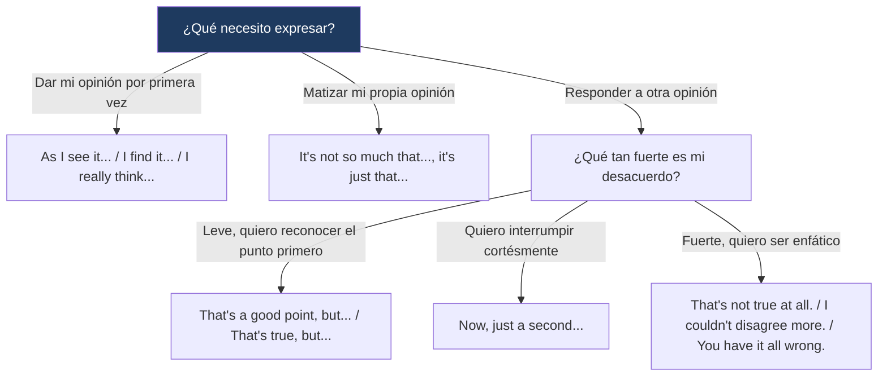

---
{"dg-publish":true,"permalink":"/universidad/2do-semestre/ingles-ii-c1-c2/unit-4-going-glocal/03-functional-language-and-pronunciation-exchanging-opinions-and-vowel-sounds/","dg-note-properties":{}}
---

# 🗣️ Functional Language & Pronunciation — Exchanging Opinions & Vowel Sounds

## 🎯 Introducción

> [!info] 💡 ¿Qué se trabaja en esta nota?
> 
> Esta nota cubre el lenguaje funcional y la pronunciación de la **Unidad 4** de Keynote Upper-Intermediate (Going Glocal):
> 
> - **Exchanging & discussing opinions:** frases para dar tu opinión, matizarla y responder a la de otra persona, incluso en desacuerdo (sección 4.3).
> - **Making opinions more emphatic:** expresiones para reforzar un desacuerdo fuerte (sección 4.3, Real-World Strategy).
> - **Pronunciation:** distinción entre los sonidos vocálicos /ɒ/ y /ʌ/ (sección 4.3) y el uso del **stress** (énfasis) para organizar temas en un discurso (sección 4.4).
> 
> ```mermaid
> graph TD
>     A["Functional Language<br/>& Pronunciation — Unit 4"] --> B["Exchanging Opinions"]
>     A --> C["Pronunciation"]
> 
>     B --> D["Giving opinions<br/>Discussing/disagreeing<br/>Being emphatic"]
>     C --> E["/ɒ/ vs /ʌ/<br/>Stress for topic organization"]
> 
>     style B fill:#e8eaf6
>     style C fill:#e0f7fa
> ```
> 
> |Bloque|¿Para qué sirve?|Sección del libro|
> |---|---|---|
> |**Exchanging/discussing opinions**|Dar tu punto de vista y responder al de otros con matices|4.3 That's a Good Point, But...|
> |**Making opinions emphatic**|Reforzar un desacuerdo fuerte de forma natural|4.3 Real-World Strategy|
> |**Pronunciation**|Distinguir sonidos vocálicos y usar el stress para marcar cambios de tema|4.3 / 4.4|

---

## 💬 Exchanging Opinions

> [!note] 💬 Dar tu opinión
> 
> |Expresión|Uso|
> |---|---|
> |**As I see it, ...**|Introduce tu punto de vista personal|
> |**I find it (really boring/interesting)**|Describe tu reacción o percepción sobre algo|
> |**I really think (you'd enjoy it)**|Refuerza una recomendación u opinión con convicción|
> |**It's not so much that..., it's just that...**|Matiza tu opinión: aclara qué NO quieres decir antes de aclarar qué sí quieres decir|

> [!example]- 🟢 Ejemplo del libro
> 
> _"It's not so much that I'm not interested, it's just that I don't really understand the game. I just feel lost when I watch it."_
> 
> Esta estructura es clave para matizar: primero **descarta** una interpretación posible de tu opinión (que no te interesa), y luego **aclara** la razón real (que no entiendes el juego).

---

## 🗨️ Discussing Opinions (responder / estar en desacuerdo)

> [!note] 🗨️ Responder a la opinión de otra persona
> 
> |Expresión|Uso|
> |---|---|
> |**Now, just a second...**|Interrumpe cortésmente para objetar algo|
> |**That's a good point, but...**|Reconoce el argumento del otro antes de contraargumentar|
> |**But the thing is, ...**|Introduce tu contraargumento principal|
> |**That's true, but...**|Valida parcialmente lo dicho, luego matiza o contradice|

> [!example]- 🟢 Ejemplo del libro (conversación completa, resumida)
> 
> En el diálogo del libro, A defiende el fútbol como algo estratégico y culturalmente valioso; B objeta que 90 minutos son demasiado tiempo para un resultado tan bajo. A responde reconociendo el punto ("that's a good point") pero defendiendo que hay mucha estrategia detrás incluso cuando el marcador es bajo. El patrón se repite: **reconocer → matizar → sostener tu postura**, en vez de simplemente contradecir.

---

## 🔥 Making Opinions More Emphatic

> [!note] 🔥 Real-World Strategy — Cuando el desacuerdo es fuerte
> 
> Cuando quieres expresar un desacuerdo **más enfático** que un simple "I disagree", el libro sugiere:
> 
> - **That's not true at all.**
> - **I couldn't disagree more.**
> - **You have it all wrong.**

> [!warning] ⚠️ Cuándo (no) usar estas frases
> 
> Estas expresiones son **fuertes** — funcionan bien en un debate informal entre amigos sobre gustos (películas, deportes, música), pero pueden sonar agresivas en un contexto profesional o formal. Combínalas con un tono conversacional relajado, no con hostilidad real.

---

## 🎧 Pronunciation: /ɒ/ vs /ʌ/

> [!note] 🎧 Dos sonidos vocálicos que se confunden
> 
> El libro trabaja la distinción entre dos sonidos vocálicos cortos que en español no existen como categorías separadas, por lo que a hispanohablantes les cuesta diferenciarlos de oído:
> 
> - **/ɒ/** — sonido más redondeado y posterior (como en _not_).
> - **/ʌ/** — sonido más central y abierto (como en _cup_).
> 
> Ejemplos guía del libro: la vocal de **all** (_"That's not fair at all"_) representa un sonido, y la vocal de **soccer** (_"Soccer is a cultural experience"_) representa el otro.

> [!warning] ⚠️ Esta clasificación requiere el audio del libro
> 
> El ejercicio de práctica (audio 1.40) pide clasificar palabras como _audience, not, model, awesome, sponsor, caught_ en columna A (/ɒ/) o columna B (/ʌ/). **No incluyo aquí las respuestas** porque la clasificación exacta depende de cómo se pronuncian en el audio original (hay variación entre inglés británico y americano en varias de estas palabras, p. ej. _caught_). Te recomiendo escuchar el audio 1.40 y completar la tabla tú mismo — si quieres, cuando tengas las respuestas del libro te ayudo a organizarlas aquí.

> [!tip]- 🖥️ Truco para practicar
> 
> Practica en pares mínimos exagerando la posición de la boca: para /ɒ/ redondea los labios como si fueras a decir una "o" corta; para /ʌ/ relaja la boca hacia una posición más neutra y central, casi como una "a" corta relajada. Repetir _not / nut_, _cot / cut_ en voz alta ayuda a sentir la diferencia físicamente.

---

## 📢 Pronunciation: Stress y organización de temas (4.4)

> [!note] 📢 El stress como marcador de estructura
> 
> Además de marcar énfasis emocional, el **stress** (acentuación fuerte en ciertas palabras) cumple una función organizativa en discursos y reportes orales: ayuda a indicar si el hablante sigue hablando del **mismo tema** o está introduciendo un **tema nuevo**.
> 
> > [!tip]- 💡 Regla práctica
> > 
> > Cuando el hablante marca stress inusual o adicional en ciertas palabras clave al inicio de una idea, generalmente está señalando que **está pasando a un tema nuevo**, no continuando el anterior. Reconocer este patrón ayuda mucho en listening de reportes o presentaciones largas, donde no siempre hay conectores explícitos ("firstly", "in addition") para guiarte.

---

## 📊 Tabla comparativa — Funciones del lenguaje de opinión

> [!note] 📊 Comparación de las tres funciones
> 
> |Función|Ejemplos|Nivel de fuerza|
> |---|---|---|
> |**Dar tu opinión**|As I see it..., I find it..., I really think...|Neutral|
> |**Discutir / matizar**|That's a good point, but... / But the thing is...|Moderado (reconoce antes de contraargumentar)|
> |**Enfatizar desacuerdo**|That's not true at all. / I couldn't disagree more.|Fuerte (usar con cuidado según contexto)|

---

## 🖥️ Aplicación práctica

> [!tip]- 🖥️ Estructura recomendada para una conversación de opinión
> 
> 1. Da tu opinión inicial: _"As I see it, soccer is more about strategy than people think."_
> 2. Si tu interlocutor objeta, reconoce su punto antes de sostener el tuyo: _"That's a good point, but the thing is, most people don't see that strategy because they don't understand the sport."_
> 3. Si el desacuerdo persiste y es fuerte, puedes escalar con una frase enfática: _"I couldn't disagree more — soccer is one of the most tactical sports there is."_
> 
> Este patrón evita que la conversación se sienta como una simple confrontación y suena mucho más natural que repetir "I disagree" una y otra vez.

---

## 🧩 Diagrama de decisión



---

## 📝 Ejercicios Progresivos

> [!question] 📋 Nivel 1 — Reconocimiento básico
> 
> **1.** Clasifica cada frase como "dar opinión", "discutir/matizar" o "enfatizar desacuerdo": _"I couldn't disagree more."_, _"As I see it..."_, _"That's a good point, but..."_
> 
> **2.** Completa: _"It's not so much that I don't like it, __________ I don't have time for it."_
> 
> **3.** ¿Qué frase es más fuerte: "That's true, but..." o "You have it all wrong"?

> [!success]- ✅ Respuestas — Nivel 1
> 
> **1.** _I couldn't disagree more_ = enfatizar desacuerdo; _As I see it_ = dar opinión; _That's a good point, but..._ = discutir/matizar.
> 
> **2.** it's just that
> 
> **3.** "You have it all wrong" es más fuerte/enfática.

---

> [!question] 📋 Nivel 2 — Aplicación en contexto
> 
> **1.** Escribe una respuesta usando "That's a good point, but..." a la afirmación: _"Soccer is boring because nothing happens for 90 minutes."_
> 
> **2.** Reescribe de forma más enfática: _"I don't agree with that."_
> 
> **3.** Usa la estructura "It's not so much that..., it's just that..." para explicar por qué no te gusta un tema de la escuela.

> [!success]- ✅ Respuestas — Nivel 2 (ejemplo de respuesta)
> 
> **1.** _"That's a good point, but there's actually a lot of strategy happening even when the score is low."_
> 
> **2.** _"I couldn't disagree more."_ / _"That's not true at all."_
> 
> **3.** _"It's not so much that I dislike math, it's just that I never had a teacher who explained it well."_

---

> [!question] 📋 Nivel 3 — Análisis y producción libre
> 
> **1.** Escribe un diálogo corto (6-8 líneas) entre dos personas que no están de acuerdo sobre un tema (una serie, un deporte, una marca), usando al menos una frase de cada categoría (dar opinión, matizar/discutir, ser enfático).
> 
> **2.** Explica en tus propias palabras por qué "reconocer antes de contraargumentar" (_"That's a good point, but..."_) suena más natural que simplemente decir "No, you're wrong."
> 
> **3.** Piensa en un contexto donde usar frases enfáticas como "I couldn't disagree more" sería inapropiado, y explica por qué.

> [!success]- ✅ Guía de respuesta — Nivel 3
> 
> Respuestas abiertas. Se espera coherencia en el uso progresivo de las frases (de neutral a enfático) y justificación razonada sobre el registro (formal/informal) en la pregunta 3.

---

## 🎯 Metas de Aprendizaje

> [!success] ✅ Nivel Básico
> 
> - [ ] Reconozco las frases para dar, discutir y enfatizar una opinión.
> - [ ] Distingo los sonidos /ɒ/ y /ʌ/ al escuchar pares mínimos.
> - [ ] Entiendo que el stress puede señalar un cambio de tema en un discurso.

> [!success] ✅ Nivel Intermedio
> 
> - [ ] Uso "It's not so much that..., it's just that..." para matizar mis propias opiniones.
> - [ ] Reconozco antes de contraargumentar ("That's a good point, but...") en vez de contradecir directamente.
> - [ ] Distingo cuándo una frase enfática es apropiada según el contexto (formal vs. informal).

> [!success] ✅ Nivel Avanzado
> 
> - [ ] Sostengo una conversación completa de desacuerdo usando las tres categorías de forma fluida y natural.
> - [ ] Identifico cambios de tema en un audio/reporte oral solo por el patrón de stress, sin depender de conectores explícitos.
> - [ ] Pronuncio correctamente pares mínimos con /ɒ/ y /ʌ/ tras practicar con el audio del libro.

---

> [!quote] 📖 Referencias
> 
> [1] _Keynote Upper-Intermediate_, National Geographic Learning / Cengage, Student's Book, Unit 4: Going Glocal, pp. 38–40.

> [!quote] 🔗 Conexiones
> 
> - [[Universidad/2do Semestre/Ingles II (C1-C2)/Unit 4 - Going Glocal/01 - Vocabulary & Use - Advertising & Media People\|01 - Vocabulary & Use - Advertising & Media People]]
> - [[Universidad/2do Semestre/Ingles II (C1-C2)/Unit 4 - Going Glocal/02 - Grammar & Examples - Modals of Speculation & Relative Clauses\|02 - Grammar & Examples - Modals of Speculation & Relative Clauses]]
> - [[04 - Reading Writing Speaking - Building a Brand & Designing Ads\|04 - Reading Writing Speaking - Building a Brand & Designing Ads]]

---

**Tags:** #functional-language #pronunciation #opinions #English #IDIG1007 #ESPOL #unit4