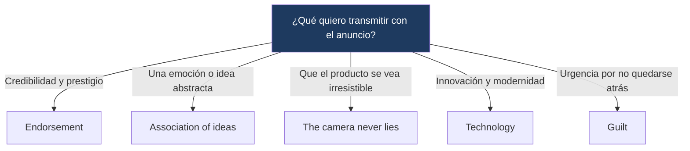

---
{"dg-publish":true,"permalink":"/universidad/2do-semestre/ingles-ii-c1-c2/unit-4-going-glocal/04-reading-writing-and-speaking-building-a-brand-and-designing-ads/","dg-note-properties":{}}
---

# 📰 Reading, Writing & Speaking — Building a Brand & Designing Ads

## 🎯 Introducción

> [!info] 💡 ¿Qué se trabaja en esta nota?
> 
> Esta nota cubre las destrezas integradas de la **Unidad 4** de Keynote Upper-Intermediate (Going Glocal), combinando listening, reading, writing y speaking alrededor de dos tareas finales:
> 
> - **Building a Brand:** el caso de estudio de Havaianas como marca que pasó de ser local a global, más un ejercicio de writing sobre el impacto de las marcas globales en comunidades locales (sección 4.4).
> - **Design an Ad:** una tarea de speaking en grupo para diseñar un anuncio publicitario aplicando técnicas reales de marketing (sección 4.5, Time to Speak).
> 
> ```mermaid
> graph TD
>     A["Reading, Writing & Speaking<br/>Unit 4"] --> B["Building a Brand"]
>     A --> C["Design an Ad"]
> 
>     B --> D["Caso Havaianas<br/>Reasons & consequences"]
>     C --> E["Endorsement · Association of ideas<br/>Visual appeal · Technology · Guilt"]
> 
>     style B fill:#e8eaf6
>     style C fill:#e0f7fa
> ```
> 
> |Bloque|¿Para qué sirve?|Sección del libro|
> |---|---|---|
> |**Building a Brand**|Analizar cómo una marca local se vuelve global y escribir sobre el impacto de marcas globales en tu comunidad|4.4 Building a Brand|
> |**Design an Ad**|Aplicar técnicas publicitarias reales para diseñar y presentar un anuncio en grupo|4.5 Time to Speak|

---

## 👡 Caso de Estudio: Havaianas

> [!note] 👡 Contexto — De marca local a marca global
> 
> La sección 4.4 presenta un reporte auditivo sobre la creación de **Havaianas**, la marca brasileña de sandalias/chanclas que pasó de ser un producto popular local a un fenómeno de moda internacional. El reporte cubre varios ángulos: el origen de la marca, su plan publicitario, su crecimiento internacional, problemas del negocio, y el proceso de fabricación.

> [!example]- 🟢 Datos clave del caso (resumen)
> 
> - En sus inicios, en la década de 1960, **no todo Brasil** usaba Havaianas — el producto ganó popularidad progresivamente, no de forma inmediata y masiva.
> - La empresa **no se limita** a vender únicamente chanclas; ha ampliado su catálogo de productos con el tiempo.
> - Fuera de Brasil, Havaianas se posicionó como un **artículo de lujo/moda**, muy distinto a su percepción original como producto cotidiano y económico dentro del país.
> - El precio internacional es considerablemente **más alto** que el precio dentro de Brasil.
> - Gran parte del éxito internacional del producto se explica más por la **estrategia de marketing** que por el producto en sí mismo — un punto central del caso.

> [!tip]- 💡 Insider English — Origen de "flip-flop"
> 
> La palabra **flip-flop** es **onomatopéyica**: describe el sonido que hacen las sandalias al caminar (_flip-flop, flip-flop_). El inglés tiene varias palabras que imitan sonidos de esta manera, como **clap** (aplaudir, imita el sonido de las palmas) o **bark** (ladrar, imita el sonido del ladrido de un perro).

---

## ✍️ Writing: Reasons and Consequences

> [!note] ✍️ Writing Skill — Expresar razones y consecuencias
> 
> La sección de reading/writing trabaja con un post de redes sociales que describe el impacto de una tienda de cadena internacional en un pueblo pequeño: cómo afectó a las tiendas locales tradicionales y qué cambios trajo esa apertura.
> 
> El objetivo del **writing skill** es identificar expresiones que marcan **razón** (por qué ocurre algo) y **consecuencia** (qué resultado tuvo), para poder usarlas tú mismo al escribir tu propia respuesta.

> [!note] 📋 Expresiones de razón y consecuencia
> 
> |Categoría|Expresiones típicas|Función|
> |---|---|---|
> |**Razón (because of)**|because, because of, due to, thanks to (fact that)|Explican **por qué** ocurre algo|
> |**Consecuencia (so)**|so, as a result, consequently|Explican **qué pasó después** como resultado|

> [!tip]- 🖥️ Cómo identificarlas en un texto
> 
> Al leer un texto de opinión o análisis, subraya primero las expresiones de razón (suelen aparecer cerca de explicaciones o justificaciones) y luego las de consecuencia (suelen aparecer cerca de resultados o efectos observables). Este ejercicio de "encontrarlas y escribirlas" es exactamente lo que pide el libro antes de redactar tu propia respuesta.

---

### 🔹 Tarea de Writing (Write It)

> [!note] 🔹 Consigna
> 
> Escribe una respuesta al post usando **tu propia comunidad** como ejemplo (100-120 palabras), incluyendo:
> 
> 1. Una descripción de los negocios **nuevos**.
> 2. Una descripción de los negocios **antiguos** (los que existían antes).
> 3. Las **razones** y **consecuencias** del cambio, usando el vocabulario de esta sección.

> [!example]- 🟢 Ejemplo de estructura (no es el texto del libro, es una guía)
> 
> 1ª oración: describe qué negocio nuevo llegó a tu zona. 2ª-3ª oración: explica, usando "because of" o "due to", por qué tuvo éxito o por qué cambió la dinámica local. 4ª-5ª oración: explica, usando "as a result" o "so", qué consecuencia tuvo esto para los negocios tradicionales o para la comunidad. Última oración: cierra con tu opinión personal sobre si el cambio fue positivo o negativo.

---

## 🎨 Design an Ad: Técnicas Publicitarias

> [!note] 🎨 Contexto — Time to Speak (4.5)
> 
> Esta es una tarea de speaking grupal: diseñar un anuncio para un producto (auto, cosméticos, producto alimenticio, joyería, equipo deportivo, programa de TV) aplicando conscientemente una o más técnicas publicitarias reales.

> [!note] 📋 Las 5 técnicas publicitarias del libro
> 
> |Técnica|Descripción|
> |---|---|
> |**1. Endorsement**|Una persona respetada o célebre (experto, celebridad) apoya o promociona el producto.|
> |**2. Association of ideas**|El producto se conecta con una idea o emoción (no necesariamente lógica) — por ejemplo, un auto asociado con la libertad.|
> |**3. "The camera never lies"**|El producto se muestra visualmente muy atractivo o apetecible (por ejemplo, una hamburguesa que luce perfecta en cámara).|
> |**4. Technology**|El producto usa o representa la tecnología más nueva y avanzada disponible.|
> |**5. Guilt**|El anuncio genera en el cliente la sensación de estar "fallando" si no tiene el producto (por ejemplo, un asiento de auto más seguro para niños).|

> [!example]- 🟢 Ejemplo del libro
> 
> Los anuncios de relojes de alta gama suelen incluir atletas famosos en su publicidad — un ejemplo claro de la técnica de **endorsement**: una figura respetada (el deportista) transmite credibilidad y prestigio al producto.

---

### 🔹 Proceso de la tarea grupal

> [!note] 🔹 Pasos: Research → Decide → Present → Agree
> 
> |Paso|Qué hacer|
> |---|---|
> |**A. Research**|Leer sobre las técnicas publicitarias y comentar con un compañero qué técnicas se usan típicamente para distintos tipos de producto.|
> |**B. Decide**|En grupos pequeños, elegir un producto y decidir la idea central, la imagen principal y la(s) técnica(s) que usarán.|
> |**C. Present**|Explicar la idea del grupo a un estudiante de otro grupo, pedir retroalimentación y refinar el anuncio con ese feedback.|
> |**D. Agree**|Presentar el anuncio final a toda la clase, explicar qué técnica(s) usaron, y como clase decidir cuál anuncio fue el más efectivo y original.|

> [!tip]- 🖥️ Frases útiles para cada etapa
> 
> **Research:** _"The ad for... uses... / The people in the ad look like they... / Ads for... make me feel..."_
> 
> **Decide:** _"How about a food product? / Let's use the... technique. / We could use images of..."_
> 
> **Present:** _"The central idea of our product is... / The advertising technique we plan to use is..."_

---

## 📊 Tabla comparativa — Building a Brand vs. Design an Ad

> [!note] 📊 Comparación de enfoques
> 
> |Aspecto|Building a Brand (4.4)|Design an Ad (4.5)|
> |---|---|---|
> |**Destreza principal**|Listening + Reading + Writing|Speaking (trabajo grupal)|
> |**Enfoque**|Analizar un caso real y sus consecuencias sociales/económicas|Crear un anuncio original aplicando técnicas de persuasión|
> |**Producto final**|Texto escrito de 100-120 palabras|Presentación oral de un anuncio diseñado en grupo|
> |**Vocabulario clave**|because of, due to, as a result, consequently|endorsement, association of ideas, guilt, technology|

---

## 🧩 Diagrama de decisión — ¿Qué técnica publicitaria usar?



---

## 📝 Ejercicios Progresivos

> [!question] 📋 Nivel 1 — Reconocimiento básico
> 
> **1.** ¿Qué técnica publicitaria se usa cuando un famoso deportista aparece en un anuncio de zapatillas?
> 
> **2.** ¿"as a result" marca una razón o una consecuencia?
> 
> **3.** ¿De dónde viene la palabra "flip-flop"?

> [!success]- ✅ Respuestas — Nivel 1
> 
> **1.** Endorsement
> 
> **2.** Consecuencia
> 
> **3.** Es onomatopéyica: imita el sonido que hacen las sandalias al caminar.

---

> [!question] 📋 Nivel 2 — Aplicación en contexto
> 
> **1.** Reescribe usando "due to": _"The store closed. There weren't enough customers."_
> 
> **2.** Identifica la técnica publicitaria: un anuncio de smartphone que enfatiza su cámara de última generación y procesador más rápido del mercado.
> 
> **3.** Explica con tus palabras la diferencia entre "association of ideas" y "endorsement".

> [!success]- ✅ Respuestas — Nivel 2 (ejemplo de respuesta)
> 
> **1.** _"The store closed due to a lack of customers."_
> 
> **2.** Technology
> 
> **3.** _Endorsement_ usa a una persona real y respetada para dar credibilidad; _association of ideas_ conecta el producto con un concepto o sentimiento (no una persona), como libertad o aventura.

---

> [!question] 📋 Nivel 3 — Análisis y producción libre
> 
> **1.** Escribe tu propia respuesta de 100-120 palabras describiendo un cambio de negocios en tu comunidad (nuevo vs. antiguo), usando al menos dos expresiones de razón y dos de consecuencia.
> 
> **2.** Diseña un concepto de anuncio (producto + técnica + slogan) y explica por qué elegiste esa técnica para ese producto específico.
> 
> **3.** Reflexiona: ¿qué técnica publicitaria te parece más efectiva sobre ti mismo como consumidor, y por qué crees que funciona particularmente bien contigo?

> [!success]- ✅ Guía de respuesta — Nivel 3
> 
> Respuestas abiertas. Se espera en la pregunta 1 el uso correcto y natural de al menos 4 expresiones de razón/consecuencia distintas, y coherencia entre descripción, razón y consecuencia (no frases sueltas sin conexión lógica).

---

## 🎯 Metas de Aprendizaje

> [!success] ✅ Nivel Básico
> 
> - [ ] Reconozco las 5 técnicas publicitarias y puedo nombrarlas.
> - [ ] Identifico expresiones de razón y consecuencia en un texto.
> - [ ] Entiendo el caso Havaianas y sus puntos clave (crecimiento, precio, marketing).

> [!success] ✅ Nivel Intermedio
> 
> - [ ] Uso "because of / due to" y "as a result / consequently" correctamente en mis propias oraciones.
> - [ ] Puedo identificar qué técnica publicitaria se está usando en un anuncio real que veo.
> - [ ] Escribo un texto de 100-120 palabras con estructura clara de razón-consecuencia.

> [!success] ✅ Nivel Avanzado
> 
> - [ ] Diseño y justifico un concepto publicitario completo (producto + técnica + idea central + slogan).
> - [ ] Presento y defiendo mi idea oralmente, incorporando feedback de otros.
> - [ ] Analizo críticamente por qué una marca local logra (o no) volverse global, más allá del producto en sí.

---

> [!quote] 📖 Referencias
> 
> [1] _Keynote Upper-Intermediate_, National Geographic Learning / Cengage, Student's Book, Unit 4: Going Glocal, pp. 40–42.

> [!quote] 🔗 Conexiones
> 
> - [[Universidad/2do Semestre/Ingles II (C1-C2)/Unit 4 - Going Glocal/01 - Vocabulary & Use - Advertising & Media People\|01 - Vocabulary & Use - Advertising & Media People]]
> - [[Universidad/2do Semestre/Ingles II (C1-C2)/Unit 4 - Going Glocal/02 - Grammar & Examples - Modals of Speculation & Relative Clauses\|02 - Grammar & Examples - Modals of Speculation & Relative Clauses]]
> - [[03 - Functional Language & Pronunciation - Exchanging Opinions & Vowel Sounds\|03 - Functional Language & Pronunciation - Exchanging Opinions & Vowel Sounds]]

---

**Tags:** #reading #writing #speaking #advertising #branding #English #IDIG1007 #ESPOL #unit4