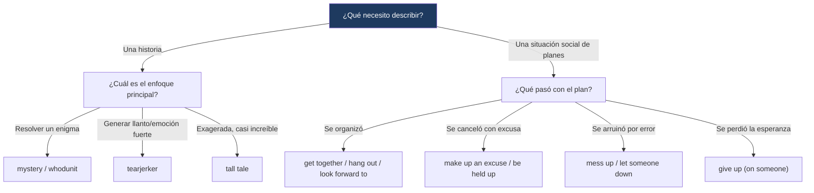

---
{"dg-publish":true,"permalink":"/universidad/2do-semestre/ingles-ii-c1-c2/unit-5-true-stories/01-vocabulary-and-use-describing-stories-and-making-breaking-plans/","dg-note-properties":{}}
---

# 📖 Vocabulary & Use — Describing Stories & Making/Breaking Plans

## 🎯 Introducción

> [!info] 💡 ¿Qué vocabulario se trabaja en esta nota?
> 
> Esta nota cubre dos bloques de vocabulario de la **Unidad 5** de Keynote Upper-Intermediate (True Stories):
> 
> - **Describing stories:** términos para clasificar tipos de historias según su tono, tema o estructura (sección 5.1).
> - **Making and breaking plans:** verbos y frases para hablar de planes, cambios de planes y las consecuencias sociales de romperlos (sección 5.2).
> 
> ```mermaid
> graph TD
>     A["Vocabulary & Use<br/>Unit 5"] --> B["Describing Stories"]
>     A --> C["Making & Breaking Plans"]
> 
>     B --> D["coming-of-age · tearjerker<br/>whodunit · tall tale"]
>     C --> E["give up · let someone down<br/>hang out · split up"]
> 
>     style B fill:#e8eaf6
>     style C fill:#e0f7fa
> ```
> 
> |Bloque|¿Para qué sirve?|Sección del libro|
> |---|---|---|
> |**Describing stories**|Clasificar y describir tipos de historias reales o ficticias|5.1 That's Another Story!|
> |**Making and breaking plans**|Hablar de organizar planes y de lo que pasa cuando se cancelan o cambian|5.2 Last-Minute-itis|

---

## 📚 Describing Stories

> [!note] 📚 Contexto — Sell Your Story
> 
> La sección **5.1** presenta el caso de una empresa ficticia (_PitchMasters_) que ayuda a escritores a convertir su historia en un "pitch" corto y atractivo para publicarla. A partir de tres resúmenes de historias (una de amor secreto, una de misterio, una sobre una escritora que finalmente publica) se trabaja el vocabulario para clasificar tipos de historia.

---

### 🔹 Tipos de historias

> [!note] 🔹 Vocabulario esencial
> 
> |Término en inglés|Traducción|¿Qué implica exactamente?|
> |---|---|---|
> |**coming-of-age story**|historia de mayoría de edad|Historia centrada en la maduración de un personaje joven, normalmente hacia la adultez.|
> |**horror story**|historia de terror|Historia diseñada para asustar o generar temor.|
> |**personal tragedy**|tragedia personal|Historia centrada en una pérdida o desgracia individual profunda.|
> |**family saga**|saga familiar|Historia que abarca generaciones o eventos extensos dentro de una familia.|
> |**human interest story**|historia de interés humano|Historia real, a menudo periodística, centrada en emociones humanas más que en hechos duros.|
> |**tall tale**|historia exagerada / cuento fantástico|Relato con eventos improbables o exagerados, contado como si fuera real.|
> |**feel-good story**|historia que reconforta|Historia con un tono positivo que deja una sensación de bienestar.|
> |**love story**|historia de amor|Historia centrada en una relación romántica.|
> |**mystery**|misterio|Historia centrada en resolver un enigma o crimen.|
> |**hard-luck story**|historia de mala suerte|Historia centrada en una serie de desgracias o dificultades.|
> |**success story**|historia de éxito|Historia centrada en el logro de una meta contra las dificultades.|
> |**tearjerker**|historia que hace llorar|Historia diseñada deliberadamente para generar una respuesta emocional intensa (llanto).|

> [!tip]- 💡 Insider English — Whodunit
> 
> **Whodunit** es una forma coloquial y juguetona de decir _"who has done it?"_ (¿quién lo hizo?), y se usa como sustantivo para referirse a un tipo específico de misterio: aquel centrado en descubrir **quién es el culpable** de un crimen.

> [!example]- 🟢 Ejemplo en contexto (resúmenes de pitch del libro)
> 
> - Una historia sobre dos personas que se amaron en secreto durante años sin decírselo, hasta que una carta de amor lo cambia todo, calificaría como **love story** (con un giro hacia la **tragedy**, dado el accidente que sigue).
> - Una historia sobre alguien que se muda a una casa nueva sin saber que la pareja anterior murió ahí, y empieza a escuchar ruidos extraños, es un ejemplo claro de **mystery** — específicamente un **whodunit**.
> - Una historia sobre una escritora que guardó sus textos por años por miedo, hasta que su padre los encuentra y los publica con gran éxito, combina **feel-good story** y **success story**.

> [!warning] ⚠️ Términos que se prestan a confusión
> 
> - **tall tale vs. hard-luck story:** un _tall tale_ exagera hechos de forma casi cómica o increíble; un _hard-luck story_ es realista, pero centrada en la mala suerte repetida.
> - **human interest story vs. personal tragedy:** un _human interest story_ puede tener cualquier tono (positivo o negativo); una _personal tragedy_ es específicamente negativa y centrada en una pérdida.
> - **feel-good story vs. tearjerker:** ambas buscan generar emoción, pero _feel-good_ deja una sensación positiva/reconfortante, mientras que _tearjerker_ apunta directamente a hacer llorar (puede ser triste o conmovedor, no necesariamente "feliz").

---

## 🗓️ Making and Breaking Plans

> [!note] 🗓️ Contexto — Last-minute-itis
> 
> La sección **5.2** gira en torno a Suzie, una amiga (ficticia, dentro del diálogo) que constantemente cancela planes a último momento. A partir de esa conversación se trabaja el vocabulario para describir cómo se organizan y cómo se rompen los planes sociales.

---

### 🔹 Verbos y frases clave

> [!note] 🔹 Vocabulario esencial
> 
> |Frase verbal|Traducción|¿Qué implica exactamente?|
> |---|---|---|
> |**be held up**|verse retrasado/a|Quedar detenido por una razón externa (tráfico, trabajo, etc.), causando un retraso.|
> |**cheer (someone) up**|animar a alguien|Ayudar a que alguien se sienta mejor cuando está triste o decaído.|
> |**end up**|terminar / acabar (haciendo algo)|Llegar a una situación final, a menudo no planeada originalmente.|
> |**get together**|reunirse|Juntarse socialmente con otra(s) persona(s).|
> |**give up**|rendirse / renunciar|Dejar de intentar algo o dejar de contar con alguien.|
> |**go ahead**|seguir adelante / proceder|Continuar con un plan, a veces sin esperar a alguien más.|
> |**hang out**|pasar el rato|Pasar tiempo social de forma relajada e informal con alguien.|
> |**let someone down**|decepcionar a alguien|Fallarle a alguien que confiaba en ti o esperaba algo de ti.|
> |**look forward to**|tener ganas de / esperar con ilusión|Anticipar algo con entusiasmo positivo.|
> |**make up (excuses)**|inventar (excusas)|Crear una justificación, a menudo poco creíble, para explicar algo.|
> |**mess (something) up**|arruinar / echar a perder|Estropear un plan o una situación por error o descuido.|
> |**split up**|separarse|Terminar una relación (de pareja) o dividir un grupo.|

> [!tip]- 💡 Insider English — What's up with...? / Something's up
> 
> Estas dos expresiones se usan específicamente para **hablar de problemas**:
> 
> - **"What's up with...?"** — pregunta sobre qué le pasa a alguien o algo que actúa de forma extraña. _"What's up with Suzie lately?"_
> - **"Something's up"** — afirma que algo anda mal, sin especificar qué. _"I know! Something's up with her."_

> [!example]- 🟢 Ejemplo en contexto (diálogo del libro)
> 
> En el audio, dos amigos comentan que Suzie canceló a último momento un plan para reunirse (_get together_), alegando que la retuvieron en el trabajo (_was held up_). Según el diálogo, ella ya le había fallado antes a la otra persona (_messed things up for me too_) — canceló una salida a un concierto justo antes de que se encontraran, inventando una excusa (_texted, said she was sorry_). Uno de los amigos concluye que está a punto de darse por vencido con ella (_about ready to give up on her_).

> [!warning] ⚠️ Diferencias sutiles
> 
> - **give up (something) vs. give up on (someone):** _give up smoking_ (dejar un hábito) es distinto de _give up on someone_ (perder la fe/paciencia con una persona).
> - **hang out vs. get together:** _hang out_ es más informal y casual (sin necesariamente un plan fijo); _get together_ implica una reunión más intencional.
> - **mess up vs. let someone down:** _mess up_ se enfoca en el error o el plan arruinado en sí; _let someone down_ se enfoca en el efecto emocional sobre la otra persona (decepción).

---

## 📊 Tabla comparativa — Historias vs. Planes

> [!note] 📊 Comparación de campos semánticos
> 
> |Campo|Palabras clave|Enfoque|
> |---|---|---|
> |**Describing stories**|coming-of-age, tearjerker, whodunit, tall tale|Clasificar el **tono y tema** de una narrativa|
> |**Making/breaking plans**|give up, let down, hang out, split up|Describir la **dinámica social** de organizar y cancelar planes|

---

## 🖥️ Aplicación práctica

> [!tip]- 🖥️ Cómo usar este vocabulario en una conversación
> 
> Para clasificar una historia que escuchaste: _"That's such a tearjerker — it's basically a family saga with a really sad hard-luck story at the center."_
> 
> Para hablar de planes cancelados: _"I was really looking forward to it, but she texted at the last minute saying she'd been held up at work, so we ended up staying home instead."_ — combina **look forward to**, **be held up** y **end up** de forma natural, tal como aparece en el audio del libro (5.2A).

---

## 🧩 Diagrama de decisión



---

## 📝 Ejercicios Progresivos

> [!question] 📋 Nivel 1 — Reconocimiento básico
> 
> **1.** ¿Qué tipo de historia describe mejor un relato sobre resolver un crimen: _tearjerker_ o _whodunit_?
> 
> **2.** Completa: _"I was really __________ to the party, but I had to cancel."_ (look forward)
> 
> **3.** ¿Qué significa "something's up"?

> [!success]- ✅ Respuestas — Nivel 1
> 
> **1.** whodunit
> 
> **2.** looking forward
> 
> **3.** Que algo anda mal, sin especificar exactamente qué.

---

> [!question] 📋 Nivel 2 — Aplicación en contexto
> 
> **1.** Clasifica esta historia: "Un niño pobre lucha por años y finalmente logra convertirse en un reconocido científico." ¿Qué tipo(s) de historia es?
> 
> **2.** Reescribe usando "let (someone) down": _"She cancelled on me again and I was really disappointed."_
> 
> **3.** Explica la diferencia entre "mess up" y "let someone down" con un ejemplo propio.

> [!success]- ✅ Respuestas — Nivel 2 (ejemplo de respuesta)
> 
> **1.** success story (posiblemente también hard-luck story por la lucha inicial)
> 
> **2.** _"She let me down again when she cancelled."_
> 
> **3.** _Mess up_ se centra en el error concreto ("I messed up the reservation"); _let someone down_ se centra en cómo se sintió la otra persona por ese error.

---

> [!question] 📋 Nivel 3 — Análisis y producción libre
> 
> **1.** Piensa en una historia real que conozcas (de la TV, noticias, o un amigo) y descríbela usando al menos dos tipos de historia de esta lista.
> 
> **2.** Escribe un mini-diálogo (4-6 líneas) donde una persona cancela un plan a último momento y la otra reacciona, usando al menos 4 verbos/frases de "making and breaking plans".
> 
> **3.** Reflexiona: ¿por qué crees que el inglés tiene tantos verbos específicos para "romper planes" (be held up, mess up, let down, give up on)? ¿En español existen equivalentes tan específicos?

> [!success]- ✅ Guía de respuesta — Nivel 3
> 
> Respuestas abiertas. Se espera en la pregunta 2 el uso natural y variado del vocabulario (no solo repetición mecánica de una sola frase).

---

## 🎯 Metas de Aprendizaje

> [!success] ✅ Nivel Básico
> 
> - [ ] Reconozco y traduzco los 12 tipos de historia.
> - [ ] Reconozco y traduzco los 12 verbos/frases de hacer y romper planes.
> - [ ] Entiendo qué significa "whodunit".

> [!success] ✅ Nivel Intermedio
> 
> - [ ] Distingo tearjerker de feel-good story y de human interest story.
> - [ ] Uso correctamente "give up on" (persona) vs. "give up" (hábito/actividad).
> - [ ] Uso "What's up with...?" y "Something's up" para preguntar sobre problemas.

> [!success] ✅ Nivel Avanzado
> 
> - [ ] Clasifico historias reales combinando varios tipos cuando es necesario (ej. success story + hard-luck story).
> - [ ] Narro con fluidez una situación de plan cancelado combinando 4+ verbos de esta lista.
> - [ ] Distingo matices finos entre mess up, let down, y give up on en un mismo relato.

---

> [!quote] 📖 Referencias
> 
> [1] _Keynote Upper-Intermediate_, National Geographic Learning / Cengage, Student's Book, Unit 5: True Stories, pp. 44–47.

> [!quote] 🔗 Conexiones
> 
> - [[Universidad/2do Semestre/Ingles II (C1-C2)/Unit 5 - True Stories/02 - Grammar & Examples - Past Perfect & Was Were Going To\|02 - Grammar & Examples - Past Perfect & Was Were Going To]]
> - [[Universidad/2do Semestre/Ingles II (C1-C2)/Unit 5 - True Stories/03 - Functional Language & Pronunciation - Reacting to Problems & Final Consonants\|03 - Functional Language & Pronunciation - Reacting to Problems & Final Consonants]]
> - [[Universidad/2do Semestre/Ingles II (C1-C2)/Unit 5 - True Stories/04 - Reading Writing Speaking - The Perfect Apology & A Chance Meeting\|04 - Reading Writing Speaking - The Perfect Apology & A Chance Meeting]]

---

**Tags:** #vocabulary #stories #plans #English #IDIG1007 #ESPOL #unit5