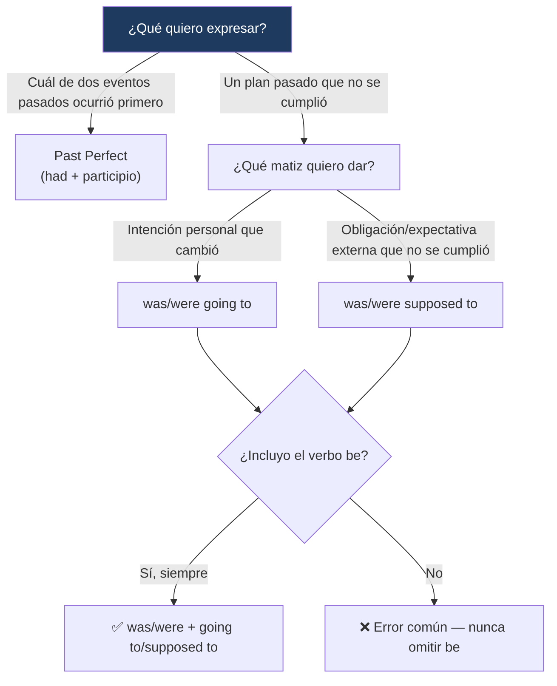

---
{"dg-publish":true,"permalink":"/universidad/2do-semestre/ingles-ii-c1-c2/unit-5-true-stories/02-grammar-and-examples-past-perfect-and-was-were-going-to/","dg-note-properties":{}}
---

# 🧠 Grammar & Examples — Past Perfect & Was/Were Going To

## 🎯 Introducción

> [!info] 💡 ¿Qué gramática se trabaja en esta nota?
> 
> Esta nota cubre dos estructuras gramaticales de la **Unidad 5** de Keynote Upper-Intermediate (True Stories), ambas centradas en el pasado:
> 
> - **Past perfect:** para hablar del orden entre dos eventos pasados (sección 5.1).
> - **Was/were going to & was/were supposed to:** para hablar de planes pasados que cambiaron o no se cumplieron (sección 5.2).
> 
> ```mermaid
> graph TD
>     A["Grammar & Examples<br/>Unit 5"] --> B["Past Perfect"]
>     A --> C["Planes que cambiaron"]
> 
>     B --> D["had + participio<br/>orden de eventos pasados"]
>     C --> E["was/were going to<br/>was/were supposed to"]
> 
>     style B fill:#e8eaf6
>     style C fill:#e0f7fa
> ```
> 
> |Bloque|¿Para qué sirve?|Sección del libro|
> |---|---|---|
> |**Past perfect**|Marcar qué evento pasado ocurrió primero cuando hay dos eventos en el pasado|5.1 That's Another Story!|
> |**Was/were going to · supposed to**|Hablar de planes pasados que se hicieron pero no se cumplieron|5.2 Last-Minute-itis|

---

## ⏮️ Past Perfect

> [!note] ⏮️ Definición — ¿Para qué se usa?
> 
> El **past perfect** se usa para hablar de algo que ocurrió **antes** de otro evento en el pasado. Cuando hay dos eventos completados en el pasado, el evento que ocurrió **primero** (el más antiguo) se marca con past perfect, y el evento que ocurrió **después** se marca con simple past.

> [!note] 📋 Reglas básicas
> 
> |Regla|Detalle|
> |---|---|
> |**Uso**|Habla de algo que ocurrió **antes** de otro evento en el pasado.|
> |**Con dos eventos pasados**|El evento que ocurrió **después** se marca con **simple past**.|
> |**Formación**|`had` + **participio pasado**|

> [!example]- 🟢 Ejemplos del libro (contexto: historias enviadas a PitchMasters)
> 
> - _It's about a man and a woman who **had secretly loved** each other for years, but they'd never even spoken._ → el amor secreto (past perfect) es anterior al hecho de nunca haberse hablado.
> - _A woman **had written** stories for years but hadn't had the courage to submit them._ → escribir por años (past perfect) es anterior al hecho de no tener el valor de enviarlas.

> [!tip]- 💡 Truco para identificar cuál evento va primero
> 
> Pregúntate: _¿cuál de los dos eventos, si los pongo en una línea de tiempo, ocurrió más atrás en el pasado?_ Ese evento **siempre** lleva `had + participio`, sin importar el orden en que aparezcan las cláusulas en la oración. Por ejemplo: _"He was surprised that he had never seen that photo before"_ — aunque "was surprised" aparece primero en la oración, el evento que ocurrió antes cronológicamente es "had never seen" (nunca haber visto la foto es anterior al momento de la sorpresa).

> [!warning] ⚠️ Error común
> 
> No asumas que el orden de las palabras en la oración indica el orden cronológico de los eventos. El **past perfect** es precisamente la herramienta gramatical que aclara ese orden, independientemente de qué cláusula se mencione primero.

---

## 🔄 Was/Were Going To & Was/Were Supposed To

> [!note] 🔄 Definición — Planes que no se cumplieron
> 
> Estas dos formas describen una acción que **fue planeada**, pero se usan específicamente para decir que ese plan **no se cumplió** (o cambió). Suelen ir seguidas de `but` y una explicación de qué pasó en realidad.

> [!note] 📋 Reglas básicas
> 
> |Regla|Detalle|
> |---|---|
> |**Describen**|Una acción que **fue planeada** (no que se completó).|
> |**Se usan para decir**|Que un plan **no ocurrió** como se esperaba.|
> |**Suelen ir seguidas de**|`but` + una explicación de lo que realmente pasó.|

> [!example]- 🟢 Ejemplos del libro
> 
> - _We **were going to** get together last night, but she was held up at work._
> - _An hour before we **were supposed to** meet, she texted me to cancel._

> [!warning] ⚠️ Error común — No omitas el verbo "be"
> 
> Es un error frecuente **eliminar el verbo `be`** en estas construcciones, dejando solo `supposed to` o `going to` sueltos.
> 
> |❌ Incorrecto|✅ Correcto|
> |---|---|
> |_The show **supposed to** start at 7:30._|_The show **was supposed to** start at 7:30._|

> [!tip]- 💡 ¿Cómo elegir entre going to y supposed to?
> 
> En la práctica, ambas formas comunican la misma idea central (un plan que cambió) y en la mayoría de los contextos son intercambiables. La diferencia de matiz es sutil: `was/were supposed to` suena ligeramente más formal o más orientado a una **obligación/expectativa externa** (algo que "debía" pasar), mientras que `was/were going to` suena más neutro, como una simple intención personal que cambió.

---

## 📊 Tabla comparativa — Ambas estructuras

> [!note] 📊 Past perfect vs. Planes que cambiaron
> 
> |Aspecto|Past perfect|Was/were going to · supposed to|
> |---|---|---|
> |**Función**|Ordenar dos eventos pasados (cuál ocurrió primero)|Hablar de un plan pasado que no se cumplió|
> |**Formación**|had + participio|was/were + going to / supposed to + infinitivo|
> |**Error típico**|Confundir el orden de la oración con el orden cronológico|Omitir el verbo `be` (_"supposed to start"_ en vez de _"was supposed to start"_)|
> |**Suele ir con**|before, by the time, when|but + explicación|

---

## 🖥️ Aplicación práctica

> [!tip]- 🖥️ Combinando ambas estructuras al contar una historia
> 
> Estas dos gramáticas se combinan naturalmente al narrar por qué algo salió mal:
> 
> _"I was going to visit my cousin in Miami. I had bought the tickets and everything. But when I got to the airport, I realized that I had forgotten my passport at home."_
> 
> Aquí `was going to visit` establece el plan original, y dos usos de past perfect (`had bought`, `had forgotten`) aclaran qué había pasado **antes** del momento en que se dio cuenta del problema — exactamente el tipo de narrativa que pide el ejercicio de speaking 5.2A.

---

## 🧩 Diagrama de decisión



---

## 📝 Ejercicios Progresivos

> [!question] 📋 Nivel 1 — Reconocimiento básico
> 
> **1.** Elige la forma correcta: _We __________ (had left / left) by the time they arrived._
> 
> **2.** Corrige el error: _"The meeting supposed to start at 9."_
> 
> **3.** ¿Qué evento ocurrió primero: "She had finished dinner when he called" — cenar o llamar?

> [!success]- ✅ Respuestas — Nivel 1
> 
> **1.** had left
> 
> **2.** _"The meeting was supposed to start at 9."_
> 
> **3.** Cenar (había terminado de cenar antes de que él llamara).

---

> [!question] 📋 Nivel 2 — Aplicación en contexto
> 
> **1.** Completa con past perfect: _"When the game finally ended, our team __________ (give up) seven goals."_
> 
> **2.** Reescribe usando "was going to, but...": _"I planned to go to the party. In the end, I stayed home because I got sick."_
> 
> **3.** Combina las dos oraciones usando past perfect: _"We arrived at the station. The train had left five minutes earlier."_

> [!success]- ✅ Respuestas — Nivel 2
> 
> **1.** had given up
> 
> **2.** _"I was going to go to the party, but I got sick and stayed home instead."_
> 
> **3.** _"By the time we arrived at the station, the train had already left."_

---

> [!question] 📋 Nivel 3 — Análisis y producción libre
> 
> **1.** Piensa en una persona real o histórica cuya vida haría una buena película. Escribe 3-4 oraciones usando past perfect para dar contexto de fondo sobre su vida.
> 
> **2.** Cuenta una historia corta (4-6 líneas) sobre un plan tuyo que no se cumplió, combinando "was/were going to" o "was/were supposed to" con al menos dos usos de past perfect.
> 
> **3.** Explica con tus propias palabras por qué el orden de las palabras en una oración no siempre coincide con el orden cronológico de los eventos, y cómo el past perfect resuelve ese problema.

> [!success]- ✅ Guía de respuesta — Nivel 3
> 
> Respuestas abiertas. Se espera en la pregunta 2 el uso correcto del verbo `be` en las construcciones de plan, y al menos dos formas de past perfect bien formadas gramaticalmente.

---

## 🎯 Metas de Aprendizaje

> [!success] ✅ Nivel Básico
> 
> - [ ] Formo correctamente el past perfect (`had` + participio).
> - [ ] Reconozco `was/were going to` y `was/were supposed to` como formas de hablar de planes pasados.
> - [ ] Identifico el error de omitir el verbo `be` en estas construcciones.

> [!success] ✅ Nivel Intermedio
> 
> - [ ] Identifico correctamente cuál de dos eventos pasados ocurrió primero, sin importar el orden en la oración.
> - [ ] Combino `was/were going to/supposed to` con `but` + explicación de forma natural.
> - [ ] Distingo el matiz entre `going to` (intención) y `supposed to` (expectativa/obligación externa).

> [!success] ✅ Nivel Avanzado
> 
> - [ ] Narro una historia de fondo completa (biografía o anécdota) combinando past perfect con simple past de forma fluida.
> - [ ] Cuento una anécdota de un plan fallido combinando ambas estructuras de esta nota sin errores.
> - [ ] Reconozco y corrijo espontáneamente el error de omitir `be` al escuchar o leer.

---

> [!quote] 📖 Referencias
> 
> [1] _Keynote Upper-Intermediate_, National Geographic Learning / Cengage, Student's Book, Unit 5: True Stories, pp. 44–47.

> [!quote] 🔗 Conexiones
> 
> - [[01 - Vocabulary & Use - Describing Stories & Making Breaking Plans\|01 - Vocabulary & Use - Describing Stories & Making Breaking Plans]]
> - [[Universidad/2do Semestre/Ingles II (C1-C2)/Unit 5 - True Stories/03 - Functional Language & Pronunciation - Reacting to Problems & Final Consonants\|03 - Functional Language & Pronunciation - Reacting to Problems & Final Consonants]]
> - [[Universidad/2do Semestre/Ingles II (C1-C2)/Unit 5 - True Stories/04 - Reading Writing Speaking - The Perfect Apology & A Chance Meeting\|04 - Reading Writing Speaking - The Perfect Apology & A Chance Meeting]]

---

**Tags:** #grammar #past-perfect #past-plans #English #IDIG1007 #ESPOL #unit5