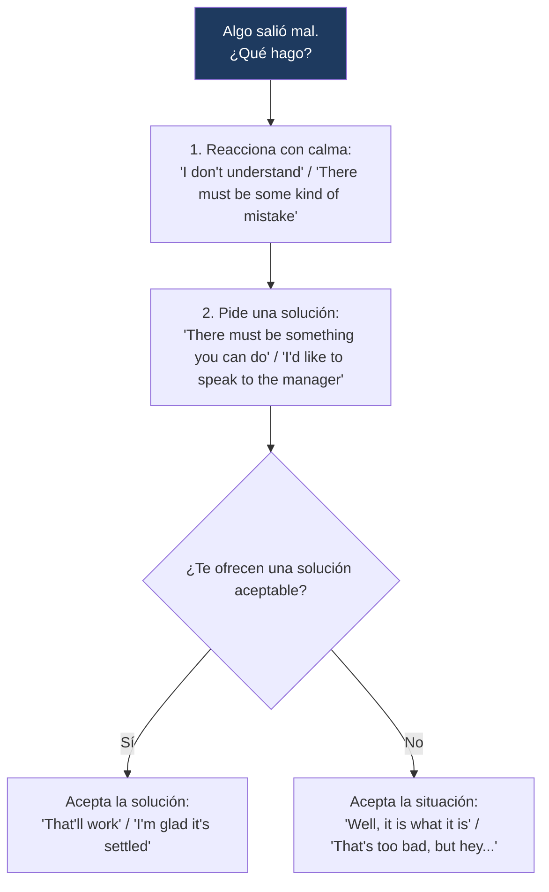

---
{"dg-publish":true,"permalink":"/universidad/2do-semestre/ingles-ii-c1-c2/unit-5-true-stories/03-functional-language-and-pronunciation-reacting-to-problems-and-final-consonants/","dg-note-properties":{}}
---

# 🗣️ Functional Language & Pronunciation — Reacting to Problems & Final Consonants

## 🎯 Introducción

> [!info] 💡 ¿Qué se trabaja en esta nota?
> 
> Esta nota cubre el lenguaje funcional y la pronunciación de la **Unidad 5** de Keynote Upper-Intermediate (True Stories), enfocados en cómo reaccionar cuando algo sale mal:
> 
> - **Reacting to problems, asking for & accepting a solution:** frases para manejar una situación incómoda de forma educada y efectiva.
> - **Accepting bad news:** expresiones para mostrar que algo te decepciona, pero que lo aceptas con calma.
> - **Pronunciation:** cómo pronunciar con claridad los sonidos consonánticos al final de una palabra.
> 
> ```mermaid
> graph TD
>     A["Functional Language<br/>& Pronunciation — Unit 5"] --> B["Manejar Problemas"]
>     A --> C["Pronunciation"]
> 
>     B --> D["Reaccionar<br/>Pedir solución<br/>Aceptar solución/mala noticia"]
>     C --> E["Consonantes finales<br/>claras"]
> 
>     style B fill:#e8eaf6
>     style C fill:#e0f7fa
> ```
> 
> |Bloque|¿Para qué sirve?|Sección del libro|
> |---|---|---|
> |**Reacting/asking/accepting**|Manejar un problema de servicio (reservas, pedidos, etc.) de forma educada|5.3 There Must Be a Mistake!|
> |**Accepting bad news**|Aceptar una situación decepcionante sin poder cambiarla|5.3 Real-World Strategy|
> |**Pronunciation**|Pronunciar con claridad las consonantes al final de las palabras|5.3 Pronunciation Focus|

---

## 🍽️ Contexto: Un problema en el restaurante

> [!note] 🍽️ Situación del libro
> 
> El diálogo de la sección 5.3 presenta a un cliente que llega a un restaurante con una reservación para seis personas, pero el restaurante no tiene ningún registro de ella. El cliente insiste en que hizo la reservación, pide hablar con el gerente, y finalmente el restaurante le ofrece una mesa una hora más tarde junto con un gesto de disculpa (aperitivos gratis). El cliente, aunque no del todo satisfecho, acepta la solución con calma.

---

## 🔧 Reacting, Asking for & Accepting a Solution

> [!note] 🔧 Las tres etapas de manejar un problema
> 
> |Etapa|Expresiones|Función|
> |---|---|---|
> |**Reacting to a problem**|I don't understand. / Would you mind taking another look? / Can you check again, please? / There must be some kind of mistake.|Señalar que algo no está bien, sin ser agresivo|
> |**Asking for a solution**|There must be something you can do. / I'd like to speak to the manager, please. / Is there someone else I could speak to about this, please?|Pedir que alguien resuelva el problema|
> |**Accepting a solution**|That'll work. / I'm glad it's settled.|Confirmar que la solución ofrecida es aceptable|

> [!example]- 🟢 Ejemplo del libro (resumen del diálogo)
> 
> El cliente reacciona pidiendo que revisen de nuevo la reservación y afirmando que debe haber algún error. Al confirmar que no hay mesa disponible, escala pidiendo hablar con el gerente porque debía celebrar el cumpleaños de su esposa esa noche. Cuando le ofrecen una mesa una hora después junto con una disculpa y un gesto de cortesía, el cliente acepta la solución mostrando alivio de que el asunto quedó resuelto.

> [!tip]- 💡 Patrón de escalamiento
> 
> Nota el patrón progresivo: primero se **señala el problema** con cortesía (_"I don't understand"_), luego se **pide una solución concreta** (_"I'd like to speak to the manager"_), y solo al final se **acepta** la solución ofrecida. Saltarse directamente a pedir el gerente sin dar oportunidad de resolverlo primero puede sonar innecesariamente agresivo.

---

## 😔 Accepting Bad News (Real-World Strategy)

> [!note] 😔 Cuando no hay nada que hacer
> 
> A veces no hay solución posible para una situación — simplemente hay que **aceptarla**. El libro sugiere expresiones que muestran decepción sin dejar de aceptar la situación:
> 
> - **That's not what I was hoping to hear, but what can you do?**
> - **Well, it is what it is.**
> - **Well, that's life.**
> - **That's too bad, but hey, ...**

> [!tip]- 💡 Diferencia con "asking for a solution"
> 
> Estas frases se usan **después** de haber intentado buscar una solución (o cuando queda claro que no la hay) — no reemplazan el proceso de pedir ayuda primero, sino que marcan el punto en el que decides no insistir más y aceptar la situación con una actitud tranquila.

---

## 🎩 Register Check: Mantén la calma

> [!warning] ⚠️ Cómo reaccionar cuando algo sale mal en un negocio
> 
> Cuando algo sale mal en un contexto de servicio al cliente — incluso si el error fue del negocio — el libro recomienda usar un **tono calmado y educado**, en lugar de mostrar enojo o gritar. Levantar la voz o mostrar enojo tiende a hacer que el personal esté **menos dispuesto a ayudar**, no más.

> [!example]- 🟢 Ejemplos de tono apropiado
> 
> - _"I'm sorry, sir, but I just rented out the last car."_
> - _"I don't understand. I reserved a car for today online. May I speak with the manager, please?"_
> 
> Ambos ejemplos mantienen un registro formal y calmado, incluso al señalar un problema serio.

---

## 🎧 Pronunciation: Consonantes al final de una palabra

> [!note] 🎧 El reto de pronunciar consonantes finales con claridad
> 
> En inglés, muchos hablantes (especialmente aprendices) tienden a **suavizar o casi eliminar** el sonido de la consonante final de una palabra, lo cual puede afectar la claridad de la comunicación — especialmente en palabras que terminan en sonidos como /k/, /t/, /d/.
> 
> Palabras de práctica del libro: **check, mistake, celebrate, ticket, bad, glad**.

> [!warning] ⚠️ Este ejercicio requiere el audio del libro
> 
> El ejercicio de práctica (audios 1.51 y 1.52) pide identificar quién pronuncia claramente el sonido consonántico final en cada palabra (columna A o B). **No incluyo aquí las respuestas** porque dependen del audio original. Te recomiendo escuchar los audios 1.51 y 1.52 y completar la tabla tú mismo — si me compartes las respuestas después, las agrego a esta nota.

> [!tip]- 🖥️ Truco para practicar
> 
> Exagera deliberadamente la consonante final al practicar en voz alta — pronuncia _check_ casi como si añadieras un pequeño "eco" al final del sonido /k/, sin llegar a agregar una vocal extra (evita decir "check-e"). Practicar frases completas como _"Can you check again, please?"_ ayuda más que practicar la palabra aislada, porque fuerza a mantener la claridad incluso dentro del ritmo natural de la oración.

---

## 📊 Tabla comparativa — Reaccionar vs. Aceptar mala noticia

> [!note] 📊 Comparación de funciones
> 
> |Función|Ejemplos|¿Cuándo se usa?|
> |---|---|---|
> |**Reacting to a problem**|I don't understand. / There must be some kind of mistake.|Al notar que algo salió mal|
> |**Asking for a solution**|There must be something you can do. / I'd like to speak to the manager.|Cuando quieres que alguien lo resuelva|
> |**Accepting a solution**|That'll work. / I'm glad it's settled.|Cuando la solución ofrecida es satisfactoria|
> |**Accepting bad news**|Well, it is what it is. / That's too bad, but hey...|Cuando NO hay solución posible|

---

## 🖥️ Aplicación práctica

> [!tip]- 🖥️ Estructura recomendada para manejar un problema de servicio
> 
> 1. Señala el problema con calma: _"I don't understand, I made this reservation myself."_
> 2. Pide una solución concreta: _"Is there something you can do?"_ 3a. Si te ofrecen algo aceptable: _"That'll work, thank you."_ 3b. Si no hay solución posible: _"Well, that's too bad, but hey, these things happen."_
> 
> Mantén siempre un registro calmado y educado — recuerda que el enojo reduce la disposición del personal a ayudarte, según la estrategia del libro.

---

## 🧩 Diagrama de decisión



---

## 📝 Ejercicios Progresivos

> [!question] 📋 Nivel 1 — Reconocimiento básico
> 
> **1.** Clasifica: _"There must be something you can do."_ — ¿reacting, asking for a solution, o accepting bad news?
> 
> **2.** Completa: _"Well, it __________ __________."_ (aceptar que algo no se puede cambiar)
> 
> **3.** ¿Por qué el libro recomienda mantener la calma cuando algo sale mal en un negocio?

> [!success]- ✅ Respuestas — Nivel 1
> 
> **1.** Asking for a solution
> 
> **2.** is what it is
> 
> **3.** Porque el enojo o los gritos hacen que el personal esté menos dispuesto a ayudar; un tono calmado es más efectivo.

---

> [!question] 📋 Nivel 2 — Aplicación en contexto
> 
> **1.** Escribe una respuesta usando "asking for a solution" a esta situación: _"The hotel says they don't have your reservation."_
> 
> **2.** Reescribe con un tono más calmado y formal: _"This is ridiculous! You lost my order!"_
> 
> **3.** Da un ejemplo de una situación donde no hay solución posible, y responde usando una frase de "accepting bad news".

> [!success]- ✅ Respuestas — Nivel 2 (ejemplo de respuesta)
> 
> **1.** _"There must be something you can do — is there another room available?"_
> 
> **2.** _"I don't understand — I think there might be a mistake with my order. Can you check again, please?"_
> 
> **3.** Ej.: perder un vuelo por retraso del aeropuerto → _"Well, that's life. I'll just book the next one."_

---

> [!question] 📋 Nivel 3 — Análisis y producción libre
> 
> **1.** Escribe un diálogo completo (8-10 líneas) entre un cliente y un empleado, siguiendo las tres etapas: reacting → asking for a solution → accepting (solución o mala noticia).
> 
> **2.** Practica en voz alta las palabras _check, mistake, celebrate, ticket, bad, glad_ enfatizando la consonante final, y grábate si es posible para autoevaluarte.
> 
> **3.** Reflexiona: ¿por qué crees que mantener un registro calmado es una habilidad importante incluso cuando tienes razón en un reclamo?

> [!success]- ✅ Guía de respuesta — Nivel 3
> 
> Respuestas abiertas. Se espera en la pregunta 1 el uso de al menos una frase de cada etapa (reacting, asking, accepting), y un tono consistente con el "register check" del libro (calmado, educado, sin agresividad).

---

## 🎯 Metas de Aprendizaje

> [!success] ✅ Nivel Básico
> 
> - [ ] Reconozco las frases de las tres etapas: reaccionar, pedir solución, aceptar.
> - [ ] Reconozco las frases para aceptar una mala noticia.
> - [ ] Entiendo por qué el tono calmado es más efectivo en un reclamo.

> [!success] ✅ Nivel Intermedio
> 
> - [ ] Uso el patrón de escalamiento correcto: reaccionar → pedir solución → aceptar.
> - [ ] Distingo cuándo usar "accepting a solution" vs. "accepting bad news".
> - [ ] Pronuncio con claridad las consonantes finales en palabras clave (check, ticket, glad).

> [!success] ✅ Nivel Avanzado
> 
> - [ ] Manejo una conversación completa de reclamo de servicio de forma fluida y educada.
> - [ ] Adapto mi registro (formal/calmado) automáticamente en situaciones de conflicto.
> - [ ] Sostengo consonantes finales claras incluso dentro del ritmo natural de una oración completa.

---

> [!quote] 📖 Referencias
> 
> [1] _Keynote Upper-Intermediate_, National Geographic Learning / Cengage, Student's Book, Unit 5: True Stories, pp. 48–49.

> [!quote] 🔗 Conexiones
> 
> - [[01 - Vocabulary & Use - Describing Stories & Making Breaking Plans\|01 - Vocabulary & Use - Describing Stories & Making Breaking Plans]]
> - [[Universidad/2do Semestre/Ingles II (C1-C2)/Unit 5 - True Stories/02 - Grammar & Examples - Past Perfect & Was Were Going To\|02 - Grammar & Examples - Past Perfect & Was Were Going To]]
> - [[Universidad/2do Semestre/Ingles II (C1-C2)/Unit 5 - True Stories/04 - Reading Writing Speaking - The Perfect Apology & A Chance Meeting\|04 - Reading Writing Speaking - The Perfect Apology & A Chance Meeting]]

---

**Tags:** #functional-language #pronunciation #problems #complaints #English #IDIG1007 #ESPOL #unit5