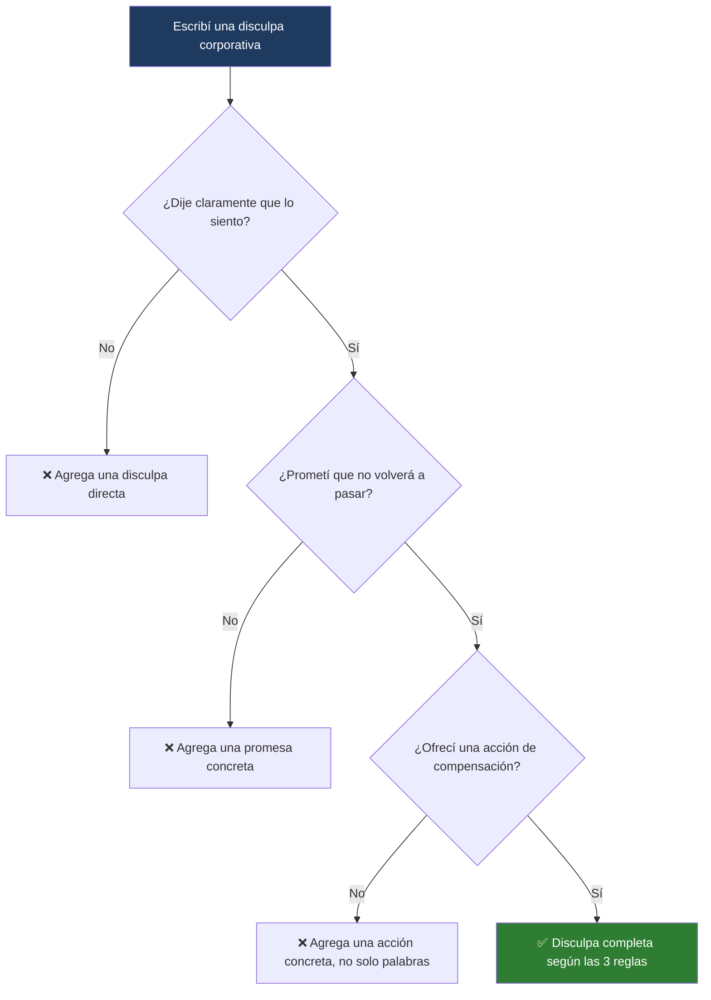

---
{"dg-publish":true,"permalink":"/universidad/2do-semestre/ingles-ii-c1-c2/unit-5-true-stories/04-reading-writing-speaking-the-perfect-apology-and-a-chance-meeting/","dg-note-properties":{}}
---

# 📰 Reading, Writing & Speaking — The Perfect Apology & A Chance Meeting

## 🎯 Introducción

> [!info] 💡 ¿Qué se trabaja en esta nota?
> 
> Esta nota cubre las destrezas integradas de la **Unidad 5** de Keynote Upper-Intermediate (True Stories), combinando reading, writing y speaking alrededor de dos tareas finales:
> 
> - **The Perfect Apology:** análisis de una disculpa corporativa real (JetBlue) para identificar qué hace que una disculpa sea efectiva, y redacción de tu propia disculpa formal (sección 5.4).
> - **A Chance Meeting:** una tarea de speaking en grupo para construir y narrar colaborativamente una historia de un encuentro casual (sección 5.5, Time to Speak).
> 
> ```mermaid
> graph TD
>     A["Reading, Writing & Speaking<br/>Unit 5"] --> B["The Perfect Apology"]
>     A --> C["A Chance Meeting"]
> 
>     B --> D["Caso JetBlue<br/>3 reglas de una buena disculpa"]
>     C --> E["Backstories · predicción<br/>narración colaborativa"]
> 
>     style B fill:#e8eaf6
>     style C fill:#e0f7fa
> ```
> 
> |Bloque|¿Para qué sirve?|Sección del libro|
> |---|---|---|
> |**The Perfect Apology**|Analizar y escribir una disculpa corporativa formal y efectiva|5.4 The Perfect Apology?|
> |**A Chance Meeting**|Narrar oralmente en grupo una historia con un final propio|5.5 Time to Speak|

---

## ✈️ Caso de Estudio: La disculpa de JetBlue

> [!note] ✈️ Contexto — El error de invierno de 2007
> 
> El artículo relata cómo una fuerte tormenta de nieve en EE.UU. en el invierno de 2007 obligó a cancelar cientos de vuelos. En un aeropuerto, pasajeros que ya habían abordado aviones de JetBlue quedaron atrapados dentro de las naves, en tierra, durante **11 horas**, antes de que se cancelara su vuelo. Lo que hizo memorable el caso no fue el error en sí, sino la **disculpa pública** que hizo el CEO de la aerolínea poco después.

> [!example]- 🟢 Qué incluyó la disculpa (resumen, no cita textual)
> 
> El CEO reconoció abiertamente que la aerolínea había manejado mal la situación y que muchos pasajeros habían sufrido las consecuencias. Ofreció compensación a todos los afectados — un gesto que le costó a la empresa más de $20 millones — y explicó con detalle qué había salido mal y qué cambios harían para evitar que volviera a ocurrir.

> [!note] 📋 Las tres reglas de una disculpa perfecta
> 
> Según el artículo, cualquier disculpa corporativa efectiva debería seguir estas tres reglas:
> 
> 1. **Decir que lo sientes** (say you're sorry) — de forma clara y directa.
> 2. **Prometer que no volverá a pasar** (promise it will never happen again).
> 3. **Hacer algo para compensar** (do something to make up for it) — una acción concreta, no solo palabras.

---

### 🔹 Vocabulario en contexto

> [!note] 🔹 Términos clave del artículo
> 
> |Definición|Palabra|
> |---|---|
> |(v) experimentar dolor o una emoción desagradable|**suffer**|
> |(adj) asociado con negocios/empresas|**corporate**|
> |(n) dinero que recibes cuando has tenido un problema|**compensation**|
> |(phr v) reducir el efecto negativo de algo|**make up for**|

---

## ✍️ Writing: Evitar la repetición

> [!note] ✍️ Comparando dos disculpas corporativas
> 
> El libro presenta un extracto de otra disculpa corporativa famosa (de Apple, sobre un problema con su app de mapas) para compararla con la de JetBlue. La pregunta clave es: **¿sigue también las tres reglas de una buena disculpa?** El ejercicio pide identificar a qué se refiere una frase como _"this commitment"_ dentro del texto — es decir, entender cómo el escritor **evita repetir** la misma idea con las mismas palabras.

> [!note] ✍️ Writing Skill — Sustituir en vez de repetir
> 
> Para evitar sonar repetitivo al mencionar el mismo problema dos veces en un texto corto, se puede reemplazar la descripción original por una frase corta que la resuma, como:
> 
> |Frase original (idea completa)|Sustituto posible en la segunda mención|
> |---|---|
> |Descripción detallada del error|**this mistake**|
> |Descripción del objetivo/promesa incumplida|**this goal / this commitment**|
> |Descripción del acuerdo original|**our agreement**|
> |Promesa hecha al cliente|**this promise to you**|

> [!tip]- 🖥️ Cómo aplicarlo
> 
> En vez de escribir dos veces la misma descripción larga ("releasing the personal data of some of our customers"), la segunda vez se puede resumir con una frase corta como _"this mistake"_ o _"this situation"_. Esto hace el texto más fluido y evita que suene mecánico o repetitivo — una habilidad de escritura formal muy valorada en cartas de disculpa, informes y correos corporativos.

---

### 🔹 Glosario de la lectura

> [!note] 🔹 Términos del glosario
> 
> |Término|Tipo|Significado|
> |---|---|---|
> |**strive**|(v)|esforzarse mucho, intentar con dedicación|
> |**deliver**|(v)|entregar, dar, cumplir (una promesa o producto)|
> |**launch**|(n)|primer lanzamiento o presentación de algo (un producto)|
> |**fall short**|(phr v)|no alcanzar el nivel esperado; no cumplir con lo prometido|

---

### 🔹 Tarea de Writing (Write It)

> [!note] 🔹 Consigna
> 
> Escribe una disculpa pública del CEO de una empresa automotriz que descubrió un problema mecánico peligroso y debe informar a sus clientes (ofreciendo reemplazar los autos afectados). Debes escribir **unas 80 palabras**, siguiendo las tres reglas de una buena disculpa y evitando la repetición.

> [!example]- 🟢 Ejemplo de estructura (guía, no el texto del libro)
> 
> 1ª oración: reconoce el problema y pide disculpas claramente. 2ª oración: explica brevemente qué pasó, sin entrar en excesivo detalle técnico. 3ª oración: promete que se está solucionando y que no volverá a pasar. 4ª oración: describe la acción concreta de compensación (reemplazo de vehículos). Última oración: usa una frase corta de sustitución en vez de repetir toda la descripción del problema otra vez ("this issue", "this situation").

---

## 🤝 A Chance Meeting

> [!note] 🤝 Contexto — Time to Speak (5.5)
> 
> Esta es una tarea de speaking colaborativa: la clase se divide en dos grupos, cada uno recibe una "historia de fondo" (_backstory_) diferente sobre dos personajes que están por encontrarse. A partir de ahí, cada estudiante debe **predecir y narrar** cómo se desarrolla el encuentro, sin conocer la versión completa del otro grupo.

> [!note] 📋 Pasos de la tarea: Prepare → Discuss → Present → Share
> 
> |Paso|Qué hacer|
> |---|---|
> |**A. Prepare**|Observar la imagen inicial y especular: ¿qué está pasando? ¿dónde se van a encontrar? ¿qué van a hacer?|
> |**B. (Backstories)**|Cada grupo recibe información de fondo distinta sobre uno de los dos personajes (páginas separadas del libro).|
> |**C. Discuss**|Trabajar con un compañero del otro grupo: compartir las historias de fondo, predecir qué se dijeron por teléfono los personajes, qué pasa después y cómo termina la historia.|
> |**D. Present**|Unirse a otra pareja de estudiantes y **actuar** la historia completa, desde el encuentro hasta el final propuesto, respondiendo preguntas de los demás.|
> |**E. Share**|Compartir las historias con toda la clase, comparar los distintos finales inventados, y revisar cuál es el final real según el libro.|

> [!tip]- 🖥️ Frases útiles para cada etapa
> 
> **Prepare:** _"They are going to... / I think they're planning to..."_
> 
> **Discuss:** _"I think they're probably going to... / And then they might... / They definitely won't..."_
> 
> **Present:** _"So this is what I know: ... / She/He was supposed to... / But instead she/he... / From the woman's/man's point of view..."_

> [!tip]- 💡 Conexión con la gramática de esta unidad
> 
> Fíjate que las frases de "Present" (_"was supposed to... but instead..."_) conectan directamente con la gramática de **02 - Grammar & Examples** de esta unidad (`was/were supposed to` para hablar de planes que cambiaron). Esta tarea de speaking es una oportunidad perfecta para poner en práctica esa estructura en un contexto narrativo real.

---

## 📊 Tabla comparativa — Apology vs. Chance Meeting

> [!note] 📊 Comparación de enfoques
> 
> |Aspecto|The Perfect Apology (5.4)|A Chance Meeting (5.5)|
> |---|---|---|
> |**Destreza principal**|Reading + Writing|Speaking (trabajo grupal, actuación)|
> |**Enfoque**|Analizar y producir un texto formal estructurado|Predecir, narrar y actuar una historia colaborativa|
> |**Producto final**|Disculpa escrita de ~80 palabras|Historia actuada en grupo con final propio|
> |**Habilidad clave**|Evitar repetición, seguir las 3 reglas de una disculpa|Especular y narrar usando past perfect / supposed to|

---

## 🧩 Diagrama de decisión — ¿Sigue mi disculpa las 3 reglas?



---

## 📝 Ejercicios Progresivos

> [!question] 📋 Nivel 1 — Reconocimiento básico
> 
> **1.** ¿Cuáles son las tres reglas de una disculpa perfecta según el artículo?
> 
> **2.** ¿Qué significa "compensation"?
> 
> **3.** En la tarea de speaking, ¿qué grupo recibe qué información al inicio?

> [!success]- ✅ Respuestas — Nivel 1
> 
> **1.** Decir que lo sientes, prometer que no volverá a pasar, y hacer algo para compensar.
> 
> **2.** Dinero que recibes cuando has tenido un problema.
> 
> **3.** Cada grupo recibe una historia de fondo (backstory) distinta sobre uno de los dos personajes del encuentro.

---

> [!question] 📋 Nivel 2 — Aplicación en contexto
> 
> **1.** Identifica cuál de las tres reglas de disculpa **falta** en este ejemplo: _"We're very sorry for the delay. It won't happen again."_
> 
> **2.** Reescribe evitando la repetición: _"We made a mistake with your order. We are sorry for the mistake we made with your order."_
> 
> **3.** Usando "was/were supposed to", describe lo que se suponía que iba a pasar en el encuentro casual antes de que algo cambiara el plan.

> [!success]- ✅ Respuestas — Nivel 2 (ejemplo de respuesta)
> 
> **1.** Falta la acción de compensación (regla 3) — solo se disculpan y prometen, pero no ofrecen nada concreto.
> 
> **2.** _"We made a mistake with your order. We are sorry for this."_
> 
> **3.** _"They were supposed to meet at the entrance, but instead she got held up at work."_

---

> [!question] 📋 Nivel 3 — Análisis y producción libre
> 
> **1.** Escribe tu propia disculpa formal de ~80 palabras para una situación inventada (un producto defectuoso, un servicio cancelado, etc.), siguiendo las tres reglas y evitando repetición.
> 
> **2.** Con un compañero (o solo, imaginando ambos roles), inventa las dos backstories de un "chance meeting" y narra cómo termina el encuentro, usando al menos una vez "was/were supposed to... but instead...".
> 
> **3.** Reflexiona: ¿por qué crees que las disculpas corporativas que solo dicen "lo sentimos" sin ofrecer una acción concreta suelen sentirse insuficientes para el público?

> [!success]- ✅ Guía de respuesta — Nivel 3
> 
> Respuestas abiertas. Se espera en la pregunta 1 la presencia clara de las tres reglas y al menos una sustitución para evitar repetición; en la pregunta 2, uso correcto de la estructura gramatical de planes cambiados vista en la nota 02.

---

## 🎯 Metas de Aprendizaje

> [!success] ✅ Nivel Básico
> 
> - [ ] Reconozco las tres reglas de una disculpa corporativa efectiva.
> - [ ] Entiendo el vocabulario clave del artículo (suffer, corporate, compensation, make up for).
> - [ ] Sigo la estructura de la tarea de speaking (Prepare → Discuss → Present → Share).

> [!success] ✅ Nivel Intermedio
> 
> - [ ] Escribo una disculpa formal de ~80 palabras siguiendo las tres reglas.
> - [ ] Sustituyo frases repetidas por resúmenes cortos ("this mistake", "this situation") en un texto formal.
> - [ ] Narro predicciones usando frases de "Discuss" (I think they're probably going to...).

> [!success] ✅ Nivel Avanzado
> 
> - [ ] Analizo críticamente si una disculpa real (de una empresa, figura pública) cumple o no las tres reglas.
> - [ ] Combino past perfect y "was/were supposed to" al narrar oralmente una historia colaborativa.
> - [ ] Improviso y sostengo una actuación grupal coherente con un final propio y justificado.

---

> [!quote] 📖 Referencias
> 
> [1] _Keynote Upper-Intermediate_, National Geographic Learning / Cengage, Student's Book, Unit 5: True Stories, pp. 50–52.

> [!quote] 🔗 Conexiones
> 
> - [[01 - Vocabulary & Use - Describing Stories & Making Breaking Plans\|01 - Vocabulary & Use - Describing Stories & Making Breaking Plans]]
> - [[Universidad/2do Semestre/Ingles II (C1-C2)/Unit 5 - True Stories/02 - Grammar & Examples - Past Perfect & Was Were Going To\|02 - Grammar & Examples - Past Perfect & Was Were Going To]]
> - [[Universidad/2do Semestre/Ingles II (C1-C2)/Unit 5 - True Stories/03 - Functional Language & Pronunciation - Reacting to Problems & Final Consonants\|03 - Functional Language & Pronunciation - Reacting to Problems & Final Consonants]]

---

**Tags:** #reading #writing #speaking #apology #storytelling #English #IDIG1007 #ESPOL #unit5