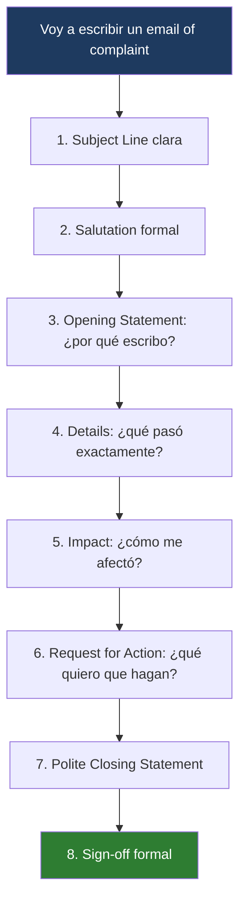

---
{"dg-publish":true,"permalink":"/universidad/2do-semestre/ingles-ii-c1-c2/unit-5-true-stories/recursos-adicionales/command-the-complaint-email-of-complaint/","dg-note-properties":{}}
---


# ✉️ Command the Complaint — Email Writing Strategies (AWC)

## 🎯 Introducción

> [!info] 💡 ¿Qué es esta nota?
> 
> Esta nota organiza el material del taller **"Command the Complaint: Email Writing Strategies"** del Academic Writing Center (AWC) de ESPOL, impartido por Karen Yambay de Armijos. Es un recurso transversal de escritura académica/profesional en inglés — no pertenece a una lección específica del libro Keynote, pero se ubica aquí en la Unidad 5 porque fue el material adicional trabajado durante ese período. Es especialmente relevante porque **forma parte del writing del examen final**.
> 
> ```mermaid
> graph TD
>     A["Email of Complaint<br/>AWC Workshop"] --> B["Estructura de 8 partes"]
>     A --> C["Vocabulario especializado"]
>     A --> D["Práctica guiada"]
> 
>     B --> E["Subject · Salutation · Opening<br/>Details · Impact · Request · Closing · Sign-off"]
>     C --> F["Product issues · Service issues"]
> 
>     style B fill:#e8eaf6
>     style C fill:#e0f7fa
>     style D fill:#f5e1ff
> ```

---

## 📬 ¿Qué es un email of complaint?

> [!note] 📬 Definición
> 
> Un **email of complaint** es un mensaje formal que se envía cuando no estás satisfecho con un producto, servicio o situación, y quieres que la empresa o persona responsable **solucione el problema**.

---

## 🧩 Las 8 partes del Email of Complaint

> [!note] 🧩 Estructura general
> 
> |#|Parte|Función|
> |---|---|---|
> |1|**Subject Line**|Oración corta que indica de qué trata el correo|
> |2|**Salutation**|Saludo formal y educado|
> |3|**Opening Statement**|Explica por qué escribes|
> |4|**Details of the Complaint**|Explica claramente qué pasó (fecha, número de orden, el problema, dónde lo compraste)|
> |5|**Impact of the Issue**|Explica cómo te afectó el problema|
> |6|**Request for Action**|Dice qué quieres que haga la empresa|
> |7|**Polite Closing Statement**|Cierre educado|
> |8|**Sign-off**|Despedida formal + tu nombre|

---

### 1️⃣ Subject Line

> [!note] 1️⃣ Expresiones útiles
> 
> |Expresión|
> |---|
> |Complaint Regarding…|
> |Issue with Order #…|
> |Urgent: Problem with Recent Purchase|
> |Request for Assistance with…|
> |Follow-Up on Unresolved Issue|
> |Product/Service Complaint – Immediate Attention Needed|

---

### 2️⃣ Salutation

> [!note] 2️⃣ Expresiones útiles
> 
> |Expresión|
> |---|
> |Dear Customer Support,|
> |Dear [Company Name] Team,|
> |To Whom It May Concern,|
> |Dear Service Department,|

---

### 3️⃣ Opening Statement

> [!note] 3️⃣ Expresiones útiles
> 
> |Expresión|
> |---|
> |I am writing to report a problem with…|
> |I would like to make a formal complaint about…|
> |I would like to report a problem with…|
> |I am contacting you because I am dissatisfied with…|
> |I am writing to express my concern regarding…|
> |I recently purchased/used your… and encountered an issue.|

---

### 4️⃣ Details of the Complaint

> [!note] 4️⃣ Qué incluir
> 
> Explica claramente **qué pasó**, incluyendo detalles importantes como:
> - Fecha (date)
> - Número de orden (order number)
> - Cuál es el problema (what the problem is)
> - Dónde lo compraste (where you bought it)

> [!note] 4️⃣ Expresiones útiles
> 
> |Expresión|
> |---|
> |On [date], I purchased/received…|
> |When I tried to use the product/service, I noticed that…|
> |The item arrived damaged/defective/incomplete.|
> |I was surprised to find that… (+ a sentence)|
> |The product does not match the description on your website.|

> [!tip]- 🖥️ Vocabulario para detallar un problema de producto
> 
> |Adjetivos útiles|Sustantivos útiles|Verbos y frases útiles|
> |---|---|---|
> |damaged, broken, defective, faulty|fault, defect, mark/stain, crack|arrived damaged|
> |stained, scratched, torn, loose|tear, issue, problem, delay|does not work properly|
> |missing, cracked, not working|packaging, order number, item|does not turn on / does not open|
> |low quality, different from the description|—|stopped working|
> |the wrong size/color/model|—|is not what I ordered / is not the correct size|
> |—|—|was missing from the package / was delivered late|

> [!tip]- 🖥️ Vocabulario para detallar un problema de servicio
> 
> |Adjetivos útiles|Sustantivos útiles|Verbos y frases útiles|
> |---|---|---|
> |slow, rude, unhelpful|delay, misunderstanding, complaint|provided poor service|
> |poor quality, unprofessional|inconvenience, service failure|did not meet my expectations|
> |uncomfortable, unreliable, late|mistake, overcharge, interruption|caused a delay / made a mistake in the order|
> |—|noise, long wait|charged me incorrectly / kept me waiting|
> |—|—|failed to resolve the issue / did not deliver on time|

---

### 📝 Práctica — Identify the Problem

> [!question] 📋 Ejercicio: describe cada situación como si fuera el inicio de tu "Details of the Complaint"
> 
> **1.** Compraste un libro en línea. Cuando llegó, faltaban varias páginas.
> 
> **Tu respuesta:**
> 
> 
> 
> ---
> 
> **2.** Reservaste una cita para las 10:00, pero te atendieron a las 11:00.
> 
> **Tu respuesta:**
> 
> 
> 
> ---
> 
> **3.** Pediste una chaqueta azul pero recibiste una roja.
> 
> **Tu respuesta:**
> 
> 
> 
> ---
> 
> **4.** Pediste servicio de internet rápido, pero la conexión se detiene cada cinco minutos.
> 
> **Tu respuesta:**
> 
> 

---

### 5️⃣ Impact of the Issue

> [!note] 5️⃣ Expresiones útiles
> 
> |Expresión|
> |---|
> |This situation has caused significant inconvenience because…|
> |As a result, I have been unable to…|
> |This problem has affected my schedule/work/travel plans.|
> |I am disappointed because I expected better quality.|
> |This issue has caused additional expenses for me.|

---

### 6️⃣ Request for Action

> [!note] 6️⃣ Expresiones útiles
> 
> |Expresión|
> |---|
> |I kindly request a full refund or replacement.|
> |I would appreciate it if you could repair/replace the item.|
> |I would like to ask for compensation for the inconvenience caused.|
> |Please let me know how you plan to resolve this issue.|
> |Could you please update me on the next steps?|

---

### 7️⃣ Polite Closing Statement

> [!note] 7️⃣ Expresiones útiles
> 
> |Expresión|
> |---|
> |Thank you for taking the time to review my complaint.|
> |I look forward to your prompt response.|
> |Thank you for your cooperation in resolving this matter.|
> |I appreciate your attention to this issue.|

---

### 8️⃣ Sign-off

> [!note] 8️⃣ Expresiones útiles
> 
> |Expresión|
> |---|
> |Sincerely,|
> |Kind regards,|
> |Yours faithfully,|
> |Best regards,|

---

## 📄 Ejemplo completo de Email of Complaint

> [!example]- 🟢 Ejemplo del taller (jacket dañado)
> 
> **Subject:** Complaint about damaged jacket / Request for replacement/refund
> 
> **Dear Customer Support Team,**
> 
> El correo explica que el remitente compró una chaqueta en la tienda en línea de la empresa dos semanas atrás, y al recibirla notó una mancha grande en la manga. Señala que esta situación le causó un inconveniente importante porque no podrá usar la prenda para un evento importante esa semana, lo cual le resulta decepcionante.
> 
> Como solicitud, pide que le envíen un reemplazo en buen estado o le reembolsen el monto completo, y pregunta qué pasos debe seguir para devolver el artículo dañado. Cierra agradeciendo la atención y se despide de forma cordial.
> 
> **Kind regards, [Your Name]**

> [!tip]- 💡 Por qué este ejemplo funciona
> 
> Nota cómo el correo sigue estrictamente las 8 partes: subject claro, saludo formal, opening statement directo, detalles concretos (cuándo, qué pasó), impacto explicado (el evento que se verá afectado), una solicitud específica (reemplazo o reembolso), cierre cortés, y despedida formal. Ningún paso se salta, y el tono se mantiene profesional y calmado en todo momento — coherente con el "register check" de mantener la calma que vimos en la Unidad 5 (nota 03).

---

## 📊 Tabla comparativa — Product Issue vs. Service Issue

> [!note] 📊 Comparación de vocabulario según el tipo de problema
> 
> |Aspecto|Product Issue|Service Issue|
> |---|---|---|
> |**Adjetivos típicos**|damaged, defective, faulty, torn|slow, rude, unprofessional, unreliable|
> |**Sustantivos típicos**|defect, crack, stain, packaging|delay, misunderstanding, overcharge|
> |**Verbos/frases típicas**|arrived damaged, stopped working|kept me waiting, failed to resolve the issue|
> |**Foco**|El objeto físico y su estado|La atención recibida y el trato|

---

## 🧩 Diagrama de decisión — Estructura del correo



---

## 📝 Prompt Principal — SunStyle Clothing

> [!question] 📋 Consigna
> 
> Escribe un email formal a **SunStyle Clothing Customer Support** (100-120 palabras).
> 
> **Problema:** Recibiste una chaqueta dañada.
> **Destinatario:** Customer Support Team
> **Detalles a incluir:**
> - Cuándo y dónde ocurrió
> - Cuál fue el problema
> - Cómo te afectó
> - Tu solicitud

> [!question] ✍️ Escribe tu email aquí
> 
> **Subject:**
> 
> 
> 
> **Cuerpo del correo:**
> 
> 
> 
> 
> 
> 
> 
> 
> 
> 
> 
> **Despedida:**
> 
> 

---

## 📝 Mini-Practice: Describe Your Own Issue

> [!question] 📋 Consigna
> 
> Escribe 3-4 oraciones describiendo un problema real o imaginario de un producto o servicio, usando al menos **4 palabras de vocabulario** practicadas en esta nota.

> [!question] ✍️ Tu respuesta
> 
> 
> 
> 
> 
> 

---

## 🎯 Metas de Aprendizaje

> [!success] ✅ Nivel Básico
> - [ ] Reconozco las 8 partes de un email of complaint y su función.
> - [ ] Identifico expresiones útiles para cada parte del correo.
> - [ ] Distingo vocabulario de "product issue" vs. "service issue".

> [!success] ✅ Nivel Intermedio
> - [ ] Escribo un opening statement y una request for action apropiados para una situación dada.
> - [ ] Combino vocabulario de detalles, impacto y solicitud en un párrafo coherente.
> - [ ] Mantengo un registro formal y calmado en todo el correo.

> [!success] ✅ Nivel Avanzado
> - [ ] Escribo un email of complaint completo de 100-120 palabras, siguiendo las 8 partes sin omitir ninguna.
> - [ ] Adapto el vocabulario según se trate de un problema de producto o de servicio.
> - [ ] Reviso y pulo mi propio correo para eliminar informalidad o ambigüedad, listo para un contexto de examen.

---

> [!quote] 📖 Referencias
> 
> [1] Yambay de Armijos, Karen. _Command the Complaint: Email Writing Strategies_. Academic Writing Center (AWC), ESPOL — Vicerrectorado de Investigación, Desarrollo e Innovación I+D+i.

> [!quote] 🔗 Conexiones
> 
> - [[Universidad/2do Semestre/Ingles II (C1-C2)/Unit 5 - True Stories/03 - Functional Language & Pronunciation - Reacting to Problems & Final Consonants\|03 - Functional Language & Pronunciation - Reacting to Problems & Final Consonants]]
> - [[Universidad/2do Semestre/Ingles II (C1-C2)/Unit 5 - True Stories/04 - Reading Writing Speaking - The Perfect Apology & A Chance Meeting\|04 - Reading Writing Speaking - The Perfect Apology & A Chance Meeting]]

---

**Tags:** #writing #complaint-email #awc #exam-prep #English #IDIG1007 #ESPOL #unit5
