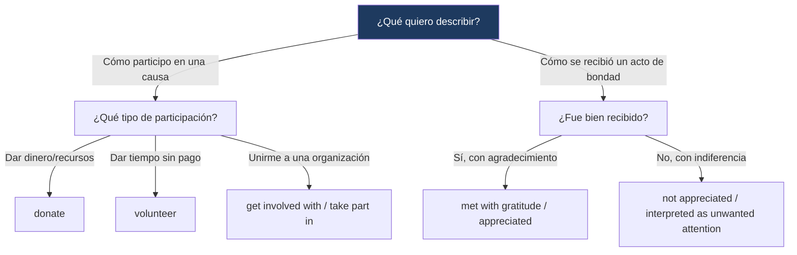

---
{"dg-publish":true,"permalink":"/universidad/2do-semestre/ingles-ii-c1-c2/unit-6-community-action/01-vocabulary-and-use-discussing-good-works-and-describing-good-deeds/","dg-note-properties":{}}
---


# 🤝 Vocabulary & Use — Discussing Good Works & Describing Good Deeds

## 🎯 Introducción

> [!info] 💡 ¿Qué vocabulario se trabaja en esta nota?
> 
> Esta nota cubre dos bloques de vocabulario de la **Unidad 6** de Keynote Upper-Intermediate (Community Action):
> 
> - **Discussing good works:** verbos y frases para hablar de trabajo voluntario y participación comunitaria (sección 6.1).
> - **Describing good deeds:** familias de palabras (verbo/sustantivo/adjetivo/expresión) para hablar de actos de bondad y su recepción (sección 6.2).
> 
> ```mermaid
> graph TD
>     A["Vocabulary & Use<br/>Unit 6"] --> B["Discussing Good Works"]
>     A --> C["Describing Good Deeds"]
> 
>     B --> D["volunteer · donate<br/>get involved · take care of"]
>     C --> E["gratitude · appreciative<br/>kind · rewarding"]
> 
>     style B fill:#e8eaf6
>     style C fill:#e0f7fa
> ```
> 
> |Bloque|¿Para qué sirve?|Sección del libro|
> |---|---|---|
> |**Discussing good works**|Hablar de organizaciones de voluntariado y cómo involucrarte con ellas|6.1 Helping Out|
> |**Describing good deeds**|Describir actos de bondad y cómo son recibidos por otros|6.2 Random Acts of Kindness|

---

## 🙋 Discussing Good Works

> [!note] 🙋 Contexto — Tres voluntarios, tres organizaciones
> 
> La sección **6.1** presenta a tres personas (Hiro, Sandra y Kemal) que describen su experiencia con distintas organizaciones: un centro que reúne a personas mayores, un refugio de animales callejeros, y un café que entrena a personas sin hogar en habilidades laborales. A partir de sus testimonios se trabaja el vocabulario de participación comunitaria.

---

### 🔹 Verbos y frases clave

> [!note] 🔹 Vocabulario esencial
> 
> |Frase verbal|Traducción|¿Qué implica exactamente?|
> |---|---|---|
> |**help out**|ayudar / echar una mano|Asistir con una tarea o necesidad, generalmente de forma informal.|
> |**connect with**|conectar con|Encontrar algo en común con otra persona; generar cercanía genuina.|
> |**get to know**|llegar a conocer|Aprender más sobre alguien con el tiempo.|
> |**take care of**|cuidar de|Encargarse del bienestar de alguien o algo.|
> |**pass on**|transmitir / compartir|Compartir conocimiento o experiencia con otros.|
> |**donate**|donar|Dar dinero u otros recursos para ayudar a una organización.|
> |**volunteer**|ser voluntario / ofrecerse|Hacer algo sin recibir dinero a cambio.|
> |**take part in**|participar en|Involucrarse activamente en una actividad.|
> |**get involved (with)**|involucrarse (con)|Unirse o comprometerse con una causa u organización.|
> |**bring (people) together**|reunir (a personas)|Ayudar a que las personas socialicen o se conecten entre sí.|

> [!example]- 🟢 Ejemplo en contexto (testimonios del libro)
> 
> - Hiro se involucró con un centro que reúne a personas mayores en su vecindario, donde es voluntario y las visita en sus casas para que lo conozcan y confíen en él.
> - Sandra ayuda en un refugio para animales callejeros, cuidando de mascotas abandonadas mientras la gente dona dinero para sostener el lugar.
> - Kemal, antes desempleado y sin hogar, encontró un café que le enseñó una habilidad práctica; ahora también participa en sesiones de entrenamiento para nuevos empleados, buscando transmitir lo que aprendió a otros.

> [!tip]- 💡 Insider English — Glosario del libro
> 
> - **shelter** (n): un lugar que protege a personas o animales.
> - **stray** (adj): que vive en la calle sin dueño (para perros/gatos).

---

## 💛 Describing Good Deeds

> [!note] 💛 Contexto — "Paying It Forward"
> 
> La sección **6.2** analiza el concepto de **"pay it forward"** (pagarlo hacia adelante): en vez de devolverle un favor a quien te ayudó, ayudas a otra persona distinta, generando una cadena de buenas acciones. El texto revisa un libro sobre un experimento de actos de bondad y explora tanto sus beneficios como sus límites.

---

### 🔹 Familias de palabras

> [!note] 🔹 Verbo / Sustantivo / Adjetivo / Expresión
> 
> |Verbo|Sustantivo|Adjetivo|Expresión relacionada|
> |---|---|---|---|
> |help|help|helpful|lend/give a helping hand|
> |appreciate|appreciation|appreciative|show your appreciation|
> |—|gratitude|grateful|show some gratitude|
> |think|thought|thoughtful|a thoughtful gesture|
> |—|kindness|kind|kindness is its own reward|
> |reward|reward|rewarding|—|

> [!tip]- 💡 Nota sobre esta tabla
> 
> Esta tabla reconstruye las familias de palabras centrales del ejercicio 6.2A a partir del texto de "Paying It Forward". Te recomiendo verificarla contra tu libro al completar el ejercicio, ya que algunas casillas del original piden que tú mismo las completes durante la clase.

> [!example]- 🟢 Ejemplo en contexto (reseña del libro "Paying It Forward")
> 
> El texto describe un experimento de un profesor universitario que ofrece ayuda a extraños — como prestar su paraguas o dar monedas para un parquímetro — pidiéndoles que hagan una buena acción por otra persona a cambio. El experimento revela que, para que la cadena de favores continúe, el gesto debe ser recibido con gratitud; si la persona ayudada no se muestra agradecida, quien ayudó puede sentirse mal, incluso si su intención era genuina.

> [!note] 📋 Posible mapeo de encabezados del texto
> 
> El ejercicio 6.2A pide asignar tres encabezados a los tres párrafos de la reseña: *"There are limits"*, *"A chain of favors"*, *"Two sides to the story"*. Según el contenido de cada párrafo:
> 
> |Párrafo|Encabezado probable|Por qué|
> |---|---|---|
> |1 (el experimento y la idea de "pay it forward")|A chain of favors|Describe cómo un acto de bondad genera una cadena de favores hacia adelante.|
> |2 (la reacción del receptor, gratitud vs. indiferencia)|Two sides to the story|Contrasta la perspectiva de quien ayuda con la de quien recibe la ayuda.|
> |3 (el punto donde el esfuerzo supera la recompensa)|There are limits|Señala que la bondad tiene un límite práctico.|
> 
> Verifica esta asignación con tu libro — es mi mejor interpretación basada en el contenido de cada párrafo, no una respuesta oficial confirmada.

---

## 📊 Tabla comparativa — Discussing Good Works vs. Describing Good Deeds

> [!note] 📊 Comparación de campos semánticos
> 
> |Campo|Palabras clave|Enfoque|
> |---|---|---|
> |**Discussing good works**|volunteer, donate, get involved, take care of|La **acción** de participar en una organización|
> |**Describing good deeds**|gratitude, appreciative, kind, rewarding|Cómo se **percibe y recibe** un acto de bondad|

---

## 🖥️ Aplicación práctica

> [!tip]- 🖥️ Cómo usar este vocabulario en una conversación
> 
> Para hablar de una organización a la que perteneces: *"I got involved with an animal shelter because I wanted to help out with stray dogs — now I really connect with the volunteers there."*
> 
> Para hablar de un acto de bondad: *"It was such a thoughtful gesture, and I was really grateful — but I know that not everyone shows appreciation the same way."*

---

## 🧩 Diagrama de decisión



---

## 📝 Ejercicios Progresivos

> [!question] 📋 Nivel 1 — Reconocimiento básico
> 
> **1.** ¿Qué verbo significa "ayudar sin recibir dinero a cambio"?
> 
> **2.** Completa: *"I really __________ your help with this project."* (mostrar agradecimiento)
> 
> **3.** ¿Cuál es el sustantivo relacionado con el adjetivo "grateful"?

> [!success]- ✅ Respuestas — Nivel 1
> 
> **1.** volunteer
> 
> **2.** appreciate
> 
> **3.** gratitude

---

> [!question] 📋 Nivel 2 — Aplicación en contexto
> 
> **1.** Reescribe usando "get involved with": *"I joined a local charity two years ago."*
> 
> **2.** Explica la diferencia entre "help out" y "take care of" con un ejemplo propio.
> 
> **3.** Completa la familia de palabras: verbo = think, sustantivo = __________, adjetivo = thoughtful.

> [!success]- ✅ Respuestas — Nivel 2 (ejemplo de respuesta)
> 
> **1.** *"I got involved with a local charity two years ago."*
> 
> **2.** *Help out* es asistir puntualmente con una tarea ("I helped out at the shelter this weekend"); *take care of* implica una responsabilidad continua sobre el bienestar de alguien/algo ("I take care of the shelter's cats every day").
> 
> **3.** thought

---

> [!question] 📋 Nivel 3 — Análisis y producción libre
> 
> **1.** Describe una organización de voluntariado (real o inventada) usando al menos 5 palabras/frases de "discussing good works".
> 
> **2.** Escribe un mini-relato (3-4 oraciones) sobre un acto de bondad que hiciste o recibiste, usando al menos 3 palabras de las familias de "describing good deeds".
> 
> **3.** Reflexiona: ¿por qué crees que un acto de bondad puede sentirse "no apreciado" a veces, aunque la intención haya sido genuina?

> [!success]- ✅ Guía de respuesta — Nivel 3
> 
> Respuestas abiertas. Se espera uso variado y natural del vocabulario, no solo repetición mecánica de una sola palabra.

---

## 🎯 Metas de Aprendizaje

> [!success] ✅ Nivel Básico
> - [ ] Reconozco y traduzco los 10 verbos/frases de "discussing good works".
> - [ ] Reconozco las familias de palabras de "describing good deeds" (help, gratitude, appreciation, thought, kindness, reward).
> - [ ] Entiendo el concepto de "pay it forward".

> [!success] ✅ Nivel Intermedio
> - [ ] Distingo "help out" de "take care of" y de "volunteer".
> - [ ] Uso correctamente las formas verbo/sustantivo/adjetivo de una misma familia de palabras (appreciate/appreciation/appreciative).
> - [ ] Explico con mis propias palabras qué significa "kindness is its own reward".

> [!success] ✅ Nivel Avanzado
> - [ ] Describo con fluidez mi propia experiencia de voluntariado combinando ambos bloques de vocabulario.
> - [ ] Analizo críticamente los límites de "pagar hacia adelante" un acto de bondad.
> - [ ] Combino naturalmente vocabulario de participación y de recepción de bondad en una misma narrativa.

---

> [!quote] 📖 Referencias
> 
> [1] _Keynote Upper-Intermediate_, National Geographic Learning / Cengage, Student's Book, Unit 6: Community Action, pp. 54–57.

> [!quote] 🔗 Conexiones
> 
> - [[Universidad/2do Semestre/Ingles II (C1-C2)/Unit 6 - Community Action/02 - Grammar & Examples - Present Past Passive & Passive with Modals\|02 - Grammar & Examples - Present Past Passive & Passive with Modals]]
> - [[Universidad/2do Semestre/Ingles II (C1-C2)/Unit 6 - Community Action/03 - Functional Language & Pronunciation - Offering Refusing Help & Consonant Sounds\|03 - Functional Language & Pronunciation - Offering Refusing Help & Consonant Sounds]]
> - [[Universidad/2do Semestre/Ingles II (C1-C2)/Unit 6 - Community Action/04 - Reading Writing Speaking - Urban Projects & Community Reports\|04 - Reading Writing Speaking - Urban Projects & Community Reports]]

---

**Tags:** #vocabulary #volunteering #kindness #community #English #IDIG1007 #ESPOL #unit6
