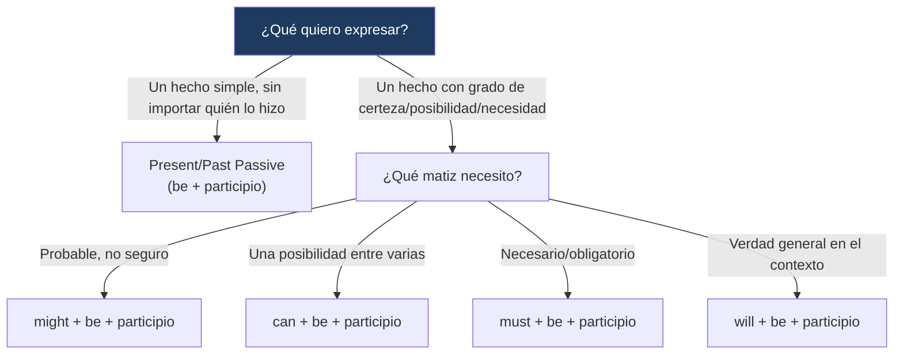

---
{"dg-publish":true,"permalink":"/universidad/2do-semestre/ingles-ii-c1-c2/unit-6-community-action/02-grammar-and-examples-present-past-passive-and-passive-with-modals/","dg-note-properties":{}}
---


# 🧠 Grammar & Examples — Present/Past Passive & Passive with Modals

## 🎯 Introducción

> [!info] 💡 ¿Qué gramática se trabaja en esta nota?
> 
> Esta nota cubre dos estructuras gramaticales de la **Unidad 6** de Keynote Upper-Intermediate (Community Action), ambas centradas en la voz pasiva:
> 
> - **Present and past passive:** para describir acciones cuando el agente (quién hace la acción) no es importante o no se conoce (sección 6.1).
> - **Passive with modals:** para combinar la voz pasiva con distintos grados de certeza, posibilidad o necesidad (sección 6.2).
> 
> ```mermaid
> graph TD
>     A["Grammar & Examples<br/>Unit 6"] --> B["Present/Past Passive"]
>     A --> C["Passive with Modals"]
> 
>     B --> D["is/are + participio<br/>was/were + participio"]
>     C --> E["modal + be + participio<br/>can/might/must/will"]
> 
>     style B fill:#e8eaf6
>     style C fill:#e0f7fa
> ```
> 
> |Bloque|¿Para qué sirve?|Sección del libro|
> |---|---|---|
> |**Present/Past passive**|Enfocarse en la acción o el receptor, no en quién la hizo|6.1 Helping Out|
> |**Passive with modals**|Combinar voz pasiva con grados de certeza/posibilidad/necesidad|6.2 Random Acts of Kindness|

---

## 🔄 Present and Past Passive

> [!note] 🔄 Definición — ¿Cuándo usar la voz pasiva?
> 
> La voz pasiva se usa cuando **el foco de la oración es la acción o quien la recibe**, no quien la realiza — porque el agente no es importante, no se conoce, o simplemente no interesa mencionarlo.

> [!note] 📋 Formación
> 
> |Tiempo|Estructura|Ejemplo|
> |---|---|---|
> |**Present passive**|`am/is/are` + participio pasado|*The Center **is designed** to bring elderly people together.*|
> |**Past passive**|`was/were` + participio pasado|*The café **was set up** to help people learn a skill.*|

> [!example]- 🟢 Ejemplos del libro
> 
> - *Supplies **are** always **needed** at the shelter.*
> - *Second chances aren't **given** out all the time.*
> - *My life **was changed** by this place.*

> [!warning] ⚠️ Accuracy Check — El verbo "to be" siempre concuerda con el sujeto
> 
> Un error muy común es no ajustar el verbo `be` al número del sujeto (singular/plural).
> 
> |❌ Incorrecto|✅ Correcto|
> |---|---|
> |_Our program **are** designed for elderly people._|_Our program **is** designed for elderly people._|

> [!tip]- 🖥️ Ejemplo aplicado (texto sobre Friends of the Earth)
> 
> El ejercicio 6.1C pide completar un texto sobre la organización *Friends of the Earth (FOE)* usando la voz pasiva con verbos como `found, base, focus, support, produce, donate, coordinate, organize`. Una posible resolución del texto sería:
> 
> *FOE **was founded** in 1969 by Robert O. Anderson. Originally, it **was based** in North America and Europe, but now it **is focused** on the developing world. The project **is supported** by many celebrities... A song called "A Love Song to the Earth" **was produced**, and all the profits **are donated** to FOE. Today, some activities **are coordinated** at the international level, but a lot of different protests **are organized** by local FOE groups.*
> 
> Esta es mi mejor interpretación del ejercicio según el contexto — **verifícala contra tu libro**, ya que no tengo la clave de respuestas oficial.

---

## 🎲 Passive with Modals

> [!note] 🎲 Definición — Combinando voz pasiva con modales
> 
> Esta estructura combina la voz pasiva con un verbo modal para expresar, además de quién recibe la acción, **qué tan seguro, posible o necesario** es que ocurra.

> [!note] 📋 Formación y uso de los modales
> 
> |Regla|Detalle|Modal|
> |---|---|---|
> |**Formación**|modal + `be` + participio pasado|—|
> |**Probable pero no definitivo**|Algo que probablemente pase, pero sin certeza|`might`|
> |**Una de muchas posibilidades**|Algo que podría pasar de varias formas|`can`|
> |**Definitivo o necesario**|Algo obligatorio o seguro que debe pasar|`must`|
> |**Generalmente cierto en la situación**|Una verdad general dentro del contexto|`will`|

> [!example]- 🟢 Ejemplos del libro
> 
> - *An act of kindness **must be met** with gratitude.* (necesario/definitivo)
> - *Your gesture **might not** always **be accepted** with a smile.* (probable pero no definitivo)
> - *Efforts to help **can be interpreted** as unwanted attention.* (una de muchas posibilidades)
> - *A kind act **will not be carried out** if it is too difficult.* (generalmente cierto en la situación)

> [!tip]- 🖥️ Ejemplo aplicado (ejercicio 6.2B)
> 
> Posibles respuestas sugeridas para el ejercicio de completar con el modal apropiado (algunas oraciones aceptan más de una opción correcta):
> 
> 1. *If the program gets enough support, its goals **might/could be achieved** by the end of this year.* (probable pero no definitivo)
> 2. *These rooms **can/might be set up** as a job center or a children's after-school program. We're not sure yet.* (una de varias posibilidades)
> 3. *Unfortunately, these facilities **can't be adapted** for the disabled because there is no place for an elevator.* (imposibilidad práctica)
> 4. *Next winter, help **must be provided** to all families in need. You **can donate** used coats and blankets anytime.* (necesidad / posibilidad general)
> 
> Igual que en la sección anterior, **verifica estas respuestas contra tu libro** — son mi mejor interpretación lógica del contexto, no una clave oficial.

---

## 📊 Tabla comparativa — Ambas estructuras

> [!note] 📊 Passive simple vs. Passive with modals
> 
> |Aspecto|Present/Past Passive|Passive with Modals|
> |---|---|---|
> |**Función**|Enfocar la acción/receptor sin mencionar el agente|Agregar un grado de certeza, posibilidad o necesidad|
> |**Formación**|be (conjugado) + participio|modal + be + participio|
> |**Error típico**|No hacer concordar `be` con el sujeto|Olvidar el `be` después del modal|
> |**Ejemplo**|*The shelter is run by volunteers.*|*The shelter must be run by trained volunteers.*|

---

## 🖥️ Aplicación práctica

> [!tip]- 🖥️ Combinando ambas estructuras
> 
> Estas dos gramáticas se combinan naturalmente al describir el funcionamiento y las reglas de una organización:
> 
> *"The center is designed to help elderly people. Donations must be collected regularly, and volunteers might be asked to visit people at home."*
> 
> Aquí se combina el present passive (`is designed`) para describir el propósito general, con passive + modal (`must be collected`, `might be asked`) para describir reglas y posibilidades específicas — un patrón muy común al escribir sobre organizaciones sin fines de lucro.

---

## 🧩 Diagrama de decisión



---

## 📝 Ejercicios Progresivos

> [!question] 📋 Nivel 1 — Reconocimiento básico
> 
> **1.** Convierte a voz pasiva: *"Volunteers run the shelter."*
> 
> **2.** Corrige el error: *"Our program are designed for elderly people."*
> 
> **3.** ¿Qué modal usarías para algo "necesario/definitivo": might o must?

> [!success]- ✅ Respuestas — Nivel 1
> 
> **1.** *"The shelter is run by volunteers."*
> 
> **2.** *"Our program is designed for elderly people."*
> 
> **3.** must

---

> [!question] 📋 Nivel 2 — Aplicación en contexto
> 
> **1.** Completa con passive + modal: *"These supplies __________ (donate) by local businesses next month."* (probable, no seguro)
> 
> **2.** Reescribe en pasiva: *"Someone founded this organization in 1990."*
> 
> **3.** Explica la diferencia entre "can be interpreted" y "must be interpreted" en el contexto de un acto de bondad.

> [!success]- ✅ Respuestas — Nivel 2
> 
> **1.** might be donated
> 
> **2.** *"This organization was founded in 1990."*
> 
> **3.** *"Can be interpreted"* indica una posibilidad entre varias (podría malinterpretarse, pero no necesariamente); *"must be interpreted"* indicaría una necesidad/certeza absoluta, lo cual no encaja con el matiz real de esa idea (la interpretación de un gesto de bondad nunca es 100% segura).

---

> [!question] 📋 Nivel 3 — Análisis y producción libre
> 
> **1.** Describe una organización benéfica (real o inventada) usando al menos 3 oraciones en voz pasiva simple (present o past).
> 
> **2.** Escribe 3 reglas o políticas de esa organización usando "passive with modals" (must, might, can, will), variando el modal según el matiz correcto.
> 
> **3.** Reflexiona: ¿por qué crees que la voz pasiva es tan común al describir organizaciones y proyectos comunitarios, en vez de usar voz activa?

> [!success]- ✅ Guía de respuesta — Nivel 3
> 
> Respuestas abiertas. Se espera en la pregunta 2 el uso correcto de al menos 3 modales distintos con el matiz adecuado (no repetir siempre "must").

---

## 🎯 Metas de Aprendizaje

> [!success] ✅ Nivel Básico
> - [ ] Formo correctamente el present y past passive (be + participio).
> - [ ] Formo correctamente el passive with modals (modal + be + participio).
> - [ ] Identifico el error de no ajustar `be` al sujeto.

> [!success] ✅ Nivel Intermedio
> - [ ] Elijo el modal correcto según el matiz (might, can, must, will) al usar voz pasiva.
> - [ ] Transformo oraciones activas a pasivas sin perder el significado original.
> - [ ] Reconozco cuándo el agente de una acción no necesita mencionarse.

> [!success] ✅ Nivel Avanzado
> - [ ] Combino present/past passive con passive + modals en un mismo texto de forma natural.
> - [ ] Describo reglas y políticas de una organización usando el matiz modal correcto para cada regla.
> - [ ] Reconozco y corrijo espontáneamente errores de concordancia en voz pasiva al leer o escuchar.

---

> [!quote] 📖 Referencias
> 
> [1] _Keynote Upper-Intermediate_, National Geographic Learning / Cengage, Student's Book, Unit 6: Community Action, pp. 54–57.

> [!quote] 🔗 Conexiones
> 
> - [[Universidad/2do Semestre/Ingles II (C1-C2)/Unit 6 - Community Action/01 - Vocabulary & Use - Discussing Good Works & Describing Good Deeds\|01 - Vocabulary & Use - Discussing Good Works & Describing Good Deeds]]
> - [[Universidad/2do Semestre/Ingles II (C1-C2)/Unit 6 - Community Action/03 - Functional Language & Pronunciation - Offering Refusing Help & Consonant Sounds\|03 - Functional Language & Pronunciation - Offering Refusing Help & Consonant Sounds]]
> - [[Universidad/2do Semestre/Ingles II (C1-C2)/Unit 6 - Community Action/04 - Reading Writing Speaking - Urban Projects & Community Reports\|04 - Reading Writing Speaking - Urban Projects & Community Reports]]

---

**Tags:** #grammar #passive-voice #modals #English #IDIG1007 #ESPOL #unit6
