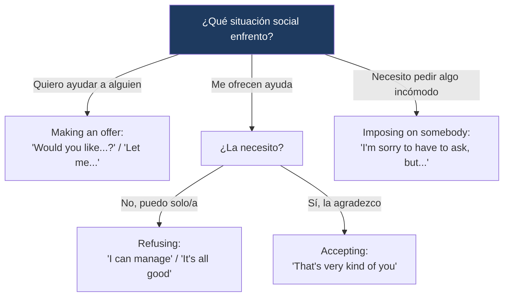

---
{"dg-publish":true,"permalink":"/universidad/2do-semestre/ingles-ii-c1-c2/unit-6-community-action/03-functional-language-and-pronunciation-offering-refusing-help-and-consonant-sounds/","dg-note-properties":{}}
---


# 🗣️ Functional Language & Pronunciation — Offering, Refusing & Accepting Help

## 🎯 Introducción

> [!info] 💡 ¿Qué se trabaja en esta nota?
> 
> Esta nota cubre el lenguaje funcional y la pronunciación de la **Unidad 6** de Keynote Upper-Intermediate (Community Action):
> 
> - **Offering, refusing & accepting help:** frases para ofrecer ayuda, rechazarla educadamente, o aceptarla con gratitud (sección 6.3).
> - **Imposing on somebody:** cómo suavizar una petición que el otro podría no querer cumplir.
> - **Pronunciation:** distinción entre /b/ y /v/ en medio de una palabra (6.3), y el sonido de conexión /j/ entre palabras (6.4).
> 
> ```mermaid
> graph TD
>     A["Functional Language<br/>& Pronunciation — Unit 6"] --> B["Offering/Refusing/Accepting Help"]
>     A --> C["Pronunciation"]
> 
>     B --> D["Let me... / I can manage<br/>I insist / Imposing on somebody"]
>     C --> E["/b/ vs /v/<br/>Conexión con /j/"]
> 
>     style B fill:#e8eaf6
>     style C fill:#e0f7fa
> ```
> 
> |Bloque|¿Para qué sirve?|Sección del libro|
> |---|---|---|
> |**Offering/refusing/accepting help**|Manejar situaciones cotidianas de ofrecer o recibir ayuda|6.3 It's All Good|
> |**Imposing on somebody**|Pedir algo que el otro podría no querer aceptar, con tacto|6.3 Real-World Strategy|
> |**Pronunciation**|Distinguir /b/ de /v/ y reconocer conexiones con /j/ entre palabras|6.3 / 6.4|

---

## 🤲 Offering, Refusing & Accepting Help

> [!note] 🤲 Contexto — Tres situaciones cotidianas
> 
> La sección **6.3** presenta tres micro-situaciones sociales: ceder un asiento en el transporte público, compartir un paraguas bajo la lluvia, y ayudar a un vecino con las manos llenas de bolsas. A partir de estos diálogos se trabaja el vocabulario para **ofrecer, rechazar y aceptar** ayuda de forma natural y educada.

> [!note] 📋 Las tres funciones
> 
> |Función|Expresiones|
> |---|---|
> |**Making offers**|Would you like (to sit down)? / Let me (share my umbrella with you). / Let me give you a hand with that. / Can I help you with anything else?|
> |**Refusing offers**|I'm OK. Thanks anyway. / You don't have to do that. / I can manage. / Nope, it's all good.|
> |**Accepting offers**|OK then, thanks. / That's very kind of you. / Thanks, I really appreciate it.|

> [!example]- 🟢 Ejemplo del libro (resumen de un diálogo)
> 
> Un vecino ofrece ayudar a otro con sus compras. La persona ayudada primero rechaza cortésmente diciendo que puede sola, pero el vecino insiste amablemente señalando que sus manos se ven muy llenas, ofreciéndose de nuevo. Al final, la persona acepta con gratitud, agradeciendo el gesto, y el vecino pregunta si necesita ayuda con algo más, a lo que ella responde que ya está todo bien.

> [!tip]- 💡 Insider English — "I insist"
> 
> La frase **"I insist"** es una forma educada de mostrarle a alguien que **no vas a cambiar de opinión** — se usa típicamente para reforzar una oferta después de que la otra persona la rechazó una primera vez.

---

## 🙏 Real-World Strategy: Imposing on Somebody

> [!note] 🙏 Cómo suavizar una petición incómoda
> 
> A veces necesitas pedirle algo a alguien que probablemente no le agrade — el libro sugiere **suavizar la petición** comenzándola con una de estas fórmulas:
> 
> - **I'm sorry to have to ask, but is it OK if...?**
> - **I don't mean to be rude, but would you mind...?**

> [!tip]- 💡 Insider English — Cut the line / Jump the line
> 
> Cuando alguien que está al final de una fila de personas no quiere esperar y se mueve hacia el frente sin permiso, se dice que **"cuts the line"** o **"jumps the line"** — la situación típica que motiva este tipo de petición incómoda hacia un desconocido.

> [!example]- 🟢 Ejemplo de aplicación
> 
> *"I'm sorry to have to ask, but could you move over? It's difficult for me to sit in the middle with all these bags."* — nota cómo la petición incómoda (pedirle a alguien que se mueva) se suaviza con la disculpa inicial antes de formular el pedido concreto.

---

## 🎧 Pronunciation: /b/ vs. /v/ en medio de palabra

> [!note] 🎧 Un contraste difícil para hispanohablantes
> 
> En español, los sonidos /b/ y /v/ tienden a pronunciarse de forma muy similar (o incluso igual, según el dialecto). En inglés, en cambio, son sonidos **claramente distintos**: /b/ es un sonido oclusivo (los labios se cierran completamente), mientras que /v/ es un sonido fricativo (el labio inferior toca los dientes superiores, sin cerrar del todo).
> 
> Ejemplos guía del libro: **umbrella** (/b/) vs. **conversation** (/v/).

> [!warning] ⚠️ Este ejercicio requiere el audio del libro
> 
> El ejercicio de práctica (audio 1.59) pide identificar quién pronuncia correctamente el sonido /b/ o /v/ en palabras como *umbrella, conversation, have, terrible, give, problem*. **No incluyo aquí las respuestas** porque dependen del audio original. Te recomiendo escucharlo y completar la tabla — si me compartes las respuestas después, las agrego a esta nota.

> [!tip]- 🖥️ Truco para practicar
> 
> Para /b/: junta los labios completamente antes de soltar el sonido (como al decir "boca" en español). Para /v/: apoya el labio inferior contra los dientes superiores, sin llegar a cerrar la boca, y deja salir el aire con una vibración suave — es el mismo movimiento que harías para /f/, pero con las cuerdas vocales activas.

---

## 🎧 Pronunciation: El sonido de conexión /j/

> [!note] 🎧 Cómo se conectan palabras en inglés fluido
> 
> En inglés hablado, cuando una palabra **termina en un sonido /i/** (como *we, the, me, she*) y la siguiente palabra **empieza con una vocal**, los hablantes suelen insertar un pequeño sonido de conexión /j/ (parecido a la "y" del español) entre ambas, para que la transición suene fluida.

> [!example]- 🟢 Ejemplos del libro
> 
> - *Today, we're going to Portland, Oregon, to hear about **the** ˘ **Intersection** Repair project.* → "the" + "Intersection" se conectan con /j/.
> - *And how was **the** ˘ **experience**?* → "the" + "experience" se conectan con /j/.
> - *Kids, **the** ˘ **unemployed**, **the** ˘ **elderly** – everyone just did whatever they could to help out.* → dos conexiones con /j/: "the" + "unemployed" y "the" + "elderly".

> [!tip]- 💡 Ejercicio de identificación (mi mejor interpretación)
> 
> Para el ejercicio 4.2B (identificar qué palabras se conectan con /j/):
> 
> 1. *"**We** ˘ **asked** for Portlanders to call in and share their thoughts."* → "we" (termina en /i/) + "asked" (empieza con vocal) se conectan con /j/.
> 2. *"**Me** ˘ **and** my friends all worked on the project."* → "me" (termina en /i/) + "and" (empieza con vocal) se conectan con /j/.
> 
> Esta identificación se basa en aplicar la regla fonética explicada en el libro, no en escuchar el audio — probablemente coincide, pero verifícalo si tienes duda.

> [!note] 📋 Regla para completar el enunciado del libro
> 
> *"A /j/ sound is often used to connect two words when the first word **ends** in an /i/ sound and the second word starts with a **vowel**."*

---

## 📊 Tabla comparativa — Offering vs. Imposing

> [!note] 📊 Comparación de funciones
> 
> |Función|Ejemplos|¿Cuándo se usa?|
> |---|---|---|
> |**Making an offer**|Would you like...? / Let me...|Cuando tú quieres ayudar a otra persona|
> |**Refusing an offer**|I can manage. / It's all good.|Cuando no necesitas la ayuda ofrecida|
> |**Accepting an offer**|That's very kind of you.|Cuando aceptas la ayuda con gratitud|
> |**Imposing on somebody**|I'm sorry to have to ask, but...|Cuando tú necesitas pedirle algo incómodo a otra persona|

---

## 🖥️ Aplicación práctica

> [!tip]- 🖥️ Estructura recomendada para ofrecer y pedir ayuda
> 
> **Al ofrecer ayuda (y que la rechacen una vez):**
> 1. Ofrece: *"Let me give you a hand with that."*
> 2. Si rechazan: acepta la negativa o insiste una vez con *"I insist"* si realmente quieres ayudar.
> 3. Si aceptan: responde con calidez, *"There you go!"*
> 
> **Al pedir algo incómodo:**
> 1. Suaviza la petición: *"I'm sorry to have to ask, but..."*
> 2. Formula el pedido concreto: *"...is it OK if I sit here?"*

---

## 🧩 Diagrama de decisión



---

## 📝 Ejercicios Progresivos

> [!question] 📋 Nivel 1 — Reconocimiento básico
> 
> **1.** Clasifica: *"I can manage."* — ¿making an offer, refusing, o accepting?
> 
> **2.** Completa: *"That's very __________ of you."* (amable)
> 
> **3.** ¿Qué frase usarías para insistir en una oferta después de que la rechazaron?

> [!success]- ✅ Respuestas — Nivel 1
> 
> **1.** Refusing an offer
> 
> **2.** kind
> 
> **3.** "I insist."

---

> [!question] 📋 Nivel 2 — Aplicación en contexto
> 
> **1.** Escribe una respuesta de "making an offer" para esta situación: *"Your neighbor is carrying heavy bags."*
> 
> **2.** Suaviza esta petición usando la estrategia de "imposing on somebody": *"Can you turn down the music?"*
> 
> **3.** Identifica el sonido de conexión: *"She and I worked together."* — ¿qué dos palabras se conectan con /j/?

> [!success]- ✅ Respuestas — Nivel 2
> 
> **1.** *"Let me give you a hand with those bags."*
> 
> **2.** *"I'm sorry to have to ask, but would you mind turning down the music?"*
> 
> **3.** "she" + "and" (she termina en /i/, and empieza con vocal)

---

> [!question] 📋 Nivel 3 — Análisis y producción libre
> 
> **1.** Escribe un diálogo completo (6-8 líneas) donde una persona ofrece ayuda, la otra rechaza, la primera insiste, y finalmente se acepta con gratitud.
> 
> **2.** Piensa en una situación real donde tuviste que "imponerte" pidiendo algo incómodo a un desconocido, y escribe cómo lo dirías usando las fórmulas de esta nota.
> 
> **3.** Practica en voz alta 5 palabras con /b/ y 5 con /v/, prestando atención consciente a la posición de tus labios.

> [!success]- ✅ Guía de respuesta — Nivel 3
> 
> Respuestas abiertas. Se espera en la pregunta 1 el uso de al menos una frase de cada categoría (offer, refuse, insist, accept) en un orden lógico.

---

## 🎯 Metas de Aprendizaje

> [!success] ✅ Nivel Básico
> - [ ] Reconozco las frases para ofrecer, rechazar y aceptar ayuda.
> - [ ] Entiendo la función de "I insist" y cuándo usarla.
> - [ ] Reconozco la estrategia de "imposing on somebody".

> [!success] ✅ Nivel Intermedio
> - [ ] Suavizo una petición incómoda usando las fórmulas correctas.
> - [ ] Distingo /b/ de /v/ al pronunciar palabras clave.
> - [ ] Identifico conexiones con /j/ entre palabras aplicando la regla fonética.

> [!success] ✅ Nivel Avanzado
> - [ ] Manejo una conversación completa de ofrecer/rechazar/aceptar ayuda de forma fluida y natural.
> - [ ] Pido algo incómodo a un desconocido con tacto, usando el registro adecuado.
> - [ ] Pronuncio con fluidez conexiones /j/ y contrastes /b/-/v/ dentro de oraciones completas, no solo palabras aisladas.

---

> [!quote] 📖 Referencias
> 
> [1] _Keynote Upper-Intermediate_, National Geographic Learning / Cengage, Student's Book, Unit 6: Community Action, pp. 58–61.

> [!quote] 🔗 Conexiones
> 
> - [[Universidad/2do Semestre/Ingles II (C1-C2)/Unit 6 - Community Action/01 - Vocabulary & Use - Discussing Good Works & Describing Good Deeds\|01 - Vocabulary & Use - Discussing Good Works & Describing Good Deeds]]
> - [[Universidad/2do Semestre/Ingles II (C1-C2)/Unit 6 - Community Action/02 - Grammar & Examples - Present Past Passive & Passive with Modals\|02 - Grammar & Examples - Present Past Passive & Passive with Modals]]
> - [[Universidad/2do Semestre/Ingles II (C1-C2)/Unit 6 - Community Action/04 - Reading Writing Speaking - Urban Projects & Community Reports\|04 - Reading Writing Speaking - Urban Projects & Community Reports]]

---

**Tags:** #functional-language #pronunciation #offering-help #community #English #IDIG1007 #ESPOL #unit6
