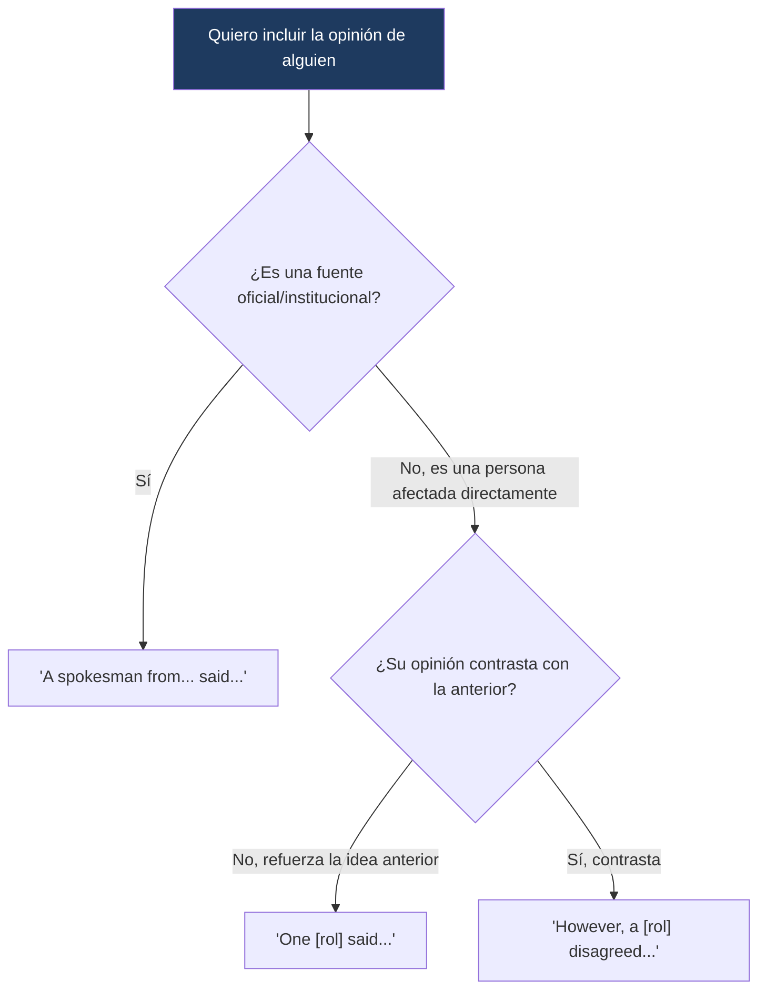

---
{"dg-publish":true,"permalink":"/universidad/2do-semestre/ingles-ii-c1-c2/unit-6-community-action/04-reading-writing-speaking-urban-projects-and-community-reports/","dg-note-properties":{}}
---


# 📰 Reading, Writing & Speaking — Urban Projects & Community Reports

## 🎯 Introducción

> [!info] 💡 ¿Qué se trabaja en esta nota?
> 
> Esta nota cubre las destrezas integradas de la **Unidad 6** de Keynote Upper-Intermediate (Community Action), combinando listening, reading, writing y speaking alrededor de dos tareas finales:
> 
> - **Painting Safer Streets:** comparación de dos proyectos urbanos reales (Portland y Ciudad de México), con enfoque en cómo introducir citas de opiniones distintas dentro de un reporte (sección 6.4).
> - **Your Urban Art Project:** una tarea de speaking en grupo inspirada en el proyecto Morrinho de Río de Janeiro, para diseñar tu propio proyecto de arte urbano (sección 6.5, Time to Speak).
> 
> ```mermaid
> graph TD
>     A["Reading, Writing & Speaking<br/>Unit 6"] --> B["Painting Safer Streets"]
>     A --> C["Your Urban Art Project"]
> 
>     B --> D["Intersection Repair (Portland)<br/>Verde Vertical (CDMX)"]
>     C --> E["Morrinho Art Project<br/>Research · Decide · Present"]
> 
>     style B fill:#e8eaf6
>     style C fill:#e0f7fa
> ```
> 
> |Bloque|¿Para qué sirve?|Sección del libro|
> |---|---|---|
> |**Painting Safer Streets**|Analizar y comparar proyectos urbanos, y escribir un reporte con opiniones citadas|6.4 Painting Safer Streets|
> |**Your Urban Art Project**|Diseñar y presentar en grupo un proyecto de arte urbano para tu comunidad|6.5 Time to Speak|

---

## 🎨 Caso de Estudio: Dos proyectos urbanos

### 🔹 Intersection Repair (Portland, Oregon)

> [!note] 🔹 Contexto — Un podcast sobre pintar intersecciones
> 
> La sección 6.4 presenta un podcast sobre el **Intersection Repair Project** en Portland: un proyecto comunitario donde vecinos pintan las intersecciones de sus calles con diseños coloridos, transformándolas en espacios más agradables y seguros. El podcast entrevista a varias personas involucradas (Eric, Isabel, Jeannette), cada una con una actitud distinta hacia el proyecto — el ejercicio de listening pide identificar si cada persona tiene una actitud positiva o negativa, y qué palabras usan para expresarlo.

> [!tip]- 💡 Cómo detectar la actitud del hablante
> 
> Más allá de las palabras explícitas ("I love this" o "I don't like it"), el tono, las pausas y el tipo de detalles que una persona elige compartir también revelan su actitud. Presta atención a si describen el proyecto con entusiasmo (detalles positivos, energía en la voz) o con reservas (mencionan dudas, comparan con problemas "más importantes" que atender).

---

### 🔹 Verde Vertical (Ciudad de México)

> [!note] 🔹 Contexto — Jardines verticales bajo los puentes
> 
> El artículo de lectura describe el proyecto **"Verde Vertical"** en Ciudad de México, que transforma cientos de pilares que sostienen pasos elevados (*overpasses*) en jardines verticales. El objetivo declarado es reducir la contaminación y mejorar el paisaje urbano.

> [!example]- 🟢 Opiniones contrastantes del artículo
> 
> El texto presenta dos perspectivas opuestas: un conductor comenta que ver algo verde en su trayecto diario, en medio del tráfico, le resulta relajante. En cambio, un peatón se muestra escéptico, argumentando que las plantas solo disfrazan el hecho de que sigue siendo una carretera, sin cambiar realmente el problema de fondo. El proyecto busca aportar decenas de miles de metros de vegetación adicional para mejorar la calidad del aire y el ánimo de los millones de residentes de la ciudad — aunque, como señala el propio artículo, esto funciona "al menos en teoría".

> [!tip]- 🖥️ Insider English — Glosario
> 
> **overpass** (n): un puente que permite que una vía o vía férrea pase por encima de otra.

---

## ✍️ Writing Skill: Introducir citas de opinión

> [!note] ✍️ Cómo incorporar opiniones de otras personas en un texto
> 
> Al escribir un reporte que incluye las opiniones de distintas personas (como en el artículo de Verde Vertical), es importante usar frases claras para **introducir cada cita** y dejar explícito de quién es esa opinión.

> [!note] 📋 Frases típicas para introducir citas
> 
> |Frase|Uso|
> |---|---|
> |**A spokesman from the company said...**|Introduce la voz oficial/institucional|
> |**When asked for comment, one driver said...**|Introduce la opinión de alguien afectado directamente|
> |**However, a pedestrian disagreed...**|Introduce una opinión que contrasta con la anterior|

> [!tip]- 🖥️ Por qué esto importa
> 
> Sin estas frases, un texto con varias opiniones puede sentirse confuso o parecer que todas las ideas vienen del mismo narrador. Introducir claramente cada cita (quién la dice, y si contrasta o refuerza la opinión anterior) le da estructura y credibilidad periodística al reporte.

---

### 🔹 Tarea de Writing (Write It)

> [!note] 🔹 Consigna
> 
> Escucha de nuevo el podcast sobre el proyecto de Portland y escribe un **reporte corto (120-150 palabras)** que incluya:
> 
> 1. Una descripción del proyecto.
> 2. Cómo se llevó a cabo.
> 3. Opiniones positivas **y** negativas de las personas que llamaron al programa, introduciendo cada cita correctamente.

> [!example]- 🟢 Ejemplo de estructura (guía, no el texto del libro)
> 
> 1ª oración: presenta el proyecto y su ubicación (Portland, Intersection Repair).
> 2ª-3ª oración: explica brevemente cómo se organizó (vecinos, pintura, participación comunitaria).
> 4ª oración: introduce una opinión positiva citando a la persona correspondiente.
> 5ª oración: introduce una opinión negativa o con reservas, marcando el contraste ("however", "on the other hand").
> Última oración: cierra con una valoración general del impacto del proyecto en la comunidad.

---

## 🖼️ Your Urban Art Project

> [!note] 🖼️ Contexto — Inspiración: el Proyecto Morrinho
> 
> Esta es una tarea de speaking grupal inspirada en el **Morrinho Art Project**, una maqueta a gran escala de una *comunidade* (barrio) de Río de Janeiro, creada por un residente de 14 años, Cirlan Souza de Oliveira, como una forma de mostrar orgullo por su comunidad.

> [!note] 📋 Pasos de la tarea: Research → Decide → Discuss → Return → Present
> 
> |Paso|Qué hacer|
> |---|---|
> |**A. Research**|Observar la imagen y leer la descripción del proyecto Morrinho; investigar más en línea y discutir qué lo hace interesante, cómo beneficia a la comunidad, y si existe algo similar en tu zona.|
> |**B. Decide**|En grupos pequeños, elegir un espacio de tu ciudad que podría beneficiarse de arte urbano, y decidir: el lugar, el proyecto concreto, y los beneficios esperados para la comunidad.|
> |**C. Discuss**|Explicar tu proyecto a un estudiante de otro grupo, y sugerir mejoras o cambios posibles a los proyectos de los demás.|
> |**D. Return**|Volver a tu grupo original, comparar notas, hacer ajustes, identificar los puntos clave, ponerle un nombre al proyecto, y preparar la presentación.|
> |**E. Present**|Presentar la idea a toda la clase; escuchar todas las presentaciones y decidir en conjunto cuál es la más efectiva y original.|

> [!tip]- 🖥️ Frases útiles para cada etapa
> 
> **Decide:** *"We're going to focus on... (place) / We're going to create... / The project will help the area because..."*
> 
> **Discuss:** *"Our group decided to... / Your project could be improved by... / Have you thought about...?"*
> 
> **Present:** *"Our project is called... / We decided/thought that... / We chose to... because..."*

> [!tip]- 💡 Conexión con el listening skill de 6.4
> 
> Al presentar tu proyecto y recibir feedback de otro grupo (paso C), estás practicando exactamente la misma habilidad de **detectar actitud** (positiva/negativa/con reservas) que trabajaste en el listening del Intersection Repair Project — solo que ahora en vivo, con tus compañeros.

---

## 📊 Tabla comparativa — Intersection Repair vs. Verde Vertical

> [!note] 📊 Comparación de los dos proyectos
> 
> |Aspecto|Intersection Repair (Portland)|Verde Vertical (CDMX)|
> |---|---|---|
> |**Quién lo hace**|Vecinos y voluntarios de la comunidad|Una empresa especializada|
> |**Qué transforma**|Intersecciones de calles residenciales|Pilares de pasos elevados|
> |**Objetivo principal**|Crear comunidad y espacios de convivencia|Reducir contaminación y mejorar el paisaje|
> |**Opiniones**|Mixtas, según la persona entrevistada|Divididas entre conductores y peatones|

---

## 🧩 Diagrama de decisión — ¿Cómo introduzco una cita en mi reporte?



---

## 📝 Ejercicios Progresivos

> [!question] 📋 Nivel 1 — Reconocimiento básico
> 
> **1.** ¿Qué proyecto urbano transforma pilares de pasos elevados en jardines?
> 
> **2.** ¿Qué significa "overpass"?
> 
> **3.** ¿Qué frase se usa para introducir una opinión que contrasta con la anterior?

> [!success]- ✅ Respuestas — Nivel 1
> 
> **1.** Verde Vertical
> 
> **2.** Un puente que permite que una vía pase por encima de otra.
> 
> **3.** "However, [persona] disagreed..."

---

> [!question] 📋 Nivel 2 — Aplicación en contexto
> 
> **1.** Introduce esta opinión correctamente: *[Un residente] / "This project brought our whole street together."*
> 
> **2.** Explica con tus palabras la diferencia de enfoque entre Intersection Repair y Verde Vertical.
> 
> **3.** Escribe una frase usando "Decide" phrases para proponer un proyecto de arte urbano en un parque de tu ciudad.

> [!success]- ✅ Respuestas — Nivel 2 (ejemplo de respuesta)
> 
> **1.** *"One resident said, 'This project brought our whole street together.'"*
> 
> **2.** Intersection Repair se enfoca en la comunidad y la convivencia vecinal (lo hacen los propios vecinos); Verde Vertical se enfoca en el impacto ambiental y visual a gran escala (lo hace una empresa).
> 
> **3.** *"We're going to focus on the old park near downtown, because it needs more color and community activity."*

---

> [!question] 📋 Nivel 3 — Análisis y producción libre
> 
> **1.** Escribe tu propio reporte de 120-150 palabras sobre un proyecto urbano (real o inventado) en tu comunidad, incluyendo al menos dos opiniones citadas correctamente (una positiva, una con reservas).
> 
> **2.** Diseña un proyecto de arte urbano inspirado en el Morrinho Project para un espacio real de tu ciudad, y explica cómo beneficiaría a la comunidad.
> 
> **3.** Reflexiona: ¿estás más de acuerdo con la postura del conductor o del peatón sobre Verde Vertical? Justifica tu opinión.

> [!success]- ✅ Guía de respuesta — Nivel 3
> 
> Respuestas abiertas. Se espera en la pregunta 1 el uso correcto de frases para introducir citas y un balance real entre opiniones positivas y negativas (no solo una perspectiva).

---

## 🎯 Metas de Aprendizaje

> [!success] ✅ Nivel Básico
> - [ ] Reconozco los dos proyectos urbanos y sus objetivos principales.
> - [ ] Identifico frases para introducir citas de opinión.
> - [ ] Sigo la estructura de la tarea de speaking (Research → Decide → Discuss → Return → Present).

> [!success] ✅ Nivel Intermedio
> - [ ] Escribo un reporte de 120-150 palabras con opiniones citadas correctamente introducidas.
> - [ ] Detecto actitudes positivas/negativas en un texto o audio, incluso sin palabras explícitas.
> - [ ] Propongo un proyecto de arte urbano usando las frases de "Decide" con claridad.

> [!success] ✅ Nivel Avanzado
> - [ ] Comparo críticamente dos proyectos urbanos distintos, evaluando sus enfoques y limitaciones.
> - [ ] Incorporo opiniones contrastantes en un reporte de forma fluida y periodística.
> - [ ] Presento y defiendo un proyecto grupal completo, incorporando feedback de otros equipos.

---

> [!quote] 📖 Referencias
> 
> [1] _Keynote Upper-Intermediate_, National Geographic Learning / Cengage, Student's Book, Unit 6: Community Action, pp. 60–62.

> [!quote] 🔗 Conexiones
> 
> - [[Universidad/2do Semestre/Ingles II (C1-C2)/Unit 6 - Community Action/01 - Vocabulary & Use - Discussing Good Works & Describing Good Deeds\|01 - Vocabulary & Use - Discussing Good Works & Describing Good Deeds]]
> - [[Universidad/2do Semestre/Ingles II (C1-C2)/Unit 6 - Community Action/02 - Grammar & Examples - Present Past Passive & Passive with Modals\|02 - Grammar & Examples - Present Past Passive & Passive with Modals]]
> - [[Universidad/2do Semestre/Ingles II (C1-C2)/Unit 6 - Community Action/03 - Functional Language & Pronunciation - Offering Refusing Help & Consonant Sounds\|03 - Functional Language & Pronunciation - Offering Refusing Help & Consonant Sounds]]

---

**Tags:** #reading #writing #speaking #urban-projects #community #English #IDIG1007 #ESPOL #unit6
