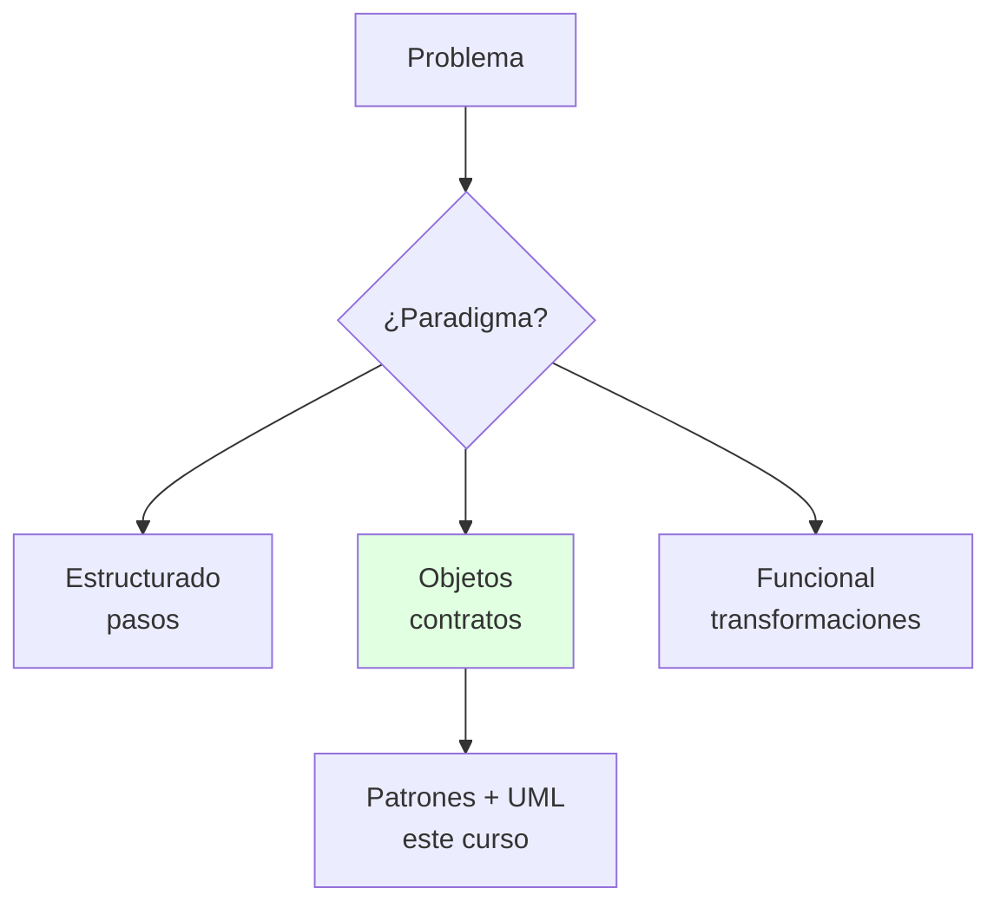
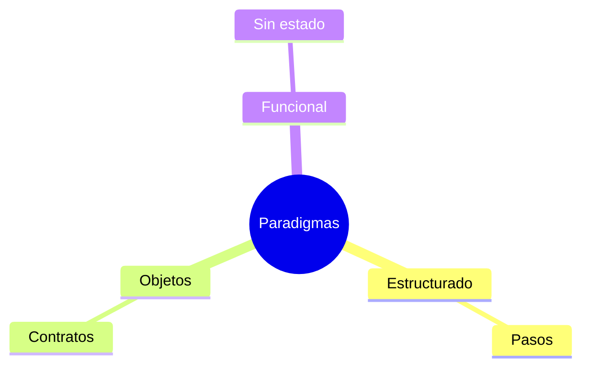

---
{"dg-publish":true,"permalink":"/universidad/3er-semestre/diseno-de-software/unidad-1-introduccion-al-diseno/03-paradigmas-de-programacion-y-diseno/","tags":["CCPG1042","unidad1","paradigmas","diseno-software"],"dg-note-properties":{"tags":["CCPG1042","unidad1","paradigmas","diseno-software"]}}
---

# 🔀 Paradigmas de Programación y Diseño

## 🎯 Introducción

> [!info] 💡 ¿Por Qué el Paradigma Manda sobre el Código?
>
> Un **paradigma** es la forma de pensar con la que atacas un problema: el mismo sistema se diseña distinto en estructurado, objetos o funciones. El docente lo pone al inicio porque tu paradigma decide qué patrones y principios aplican después.
>
> **Analogía del mundo real:** Piensa en cocinar el mismo plato:
>
> - **Estructurado** → Receta paso a paso (secuencia, selección, iteración)
> - **Objetos** → Brigada de cocina (cada estación con misión y contrato)
> - **Funcional** → Ingredientes que se transforman sin tocar la despensa (sin estado mutable)
> - **Tu proyecto** → OO (el curso), pero reconocer los otros evita forzar todo a clases
>
> | Paradigma | Idea central | Dónde lo ves en el curso |
> |---|---|---|
> | **Estructurado** | Flujo + descomposición | Base histórica, funciones claras |
> | **Orientado a objetos** | Encapsulación + mensajes | Todo el curso (U2-U3) |
> | **Funcional** | Sin estado mutable | Streams, lambdas en tests |
> | **Lógico/restricciones** | Reglas que se resuelven | Mención, casos puntuales |

---

## 🧵 Cada Paradigma en 1 Minuto

> [!note] 🎨 Lo Esencial
>
> - **Estructurado:** divide en procedimientos; el diseño es el diagrama de flujo. Riesgo: datos globales.
> - **OO:** divide en objetos con contratos (ver U1-01/U1-02 y U2). Riesgo: jerarquías rígidas.
> - **Funcional:** funciones puras + inmutabilidad; ideal para procesamiento y tests predecibles.
>
> **Regla del docente:** el paradigma no se discute en abstracto — se ve en cómo modelas (S4-S5) y qué patrones eliges (S6-S9).

---

## ⚠️ Problemas Comunes y Soluciones

> [!danger] ❌ Error: Todo a Clases (Martillo OO)
>
> **Síntomas:** `UtilidadesEstaticas` con 30 métodos, DTOs anemicos, lógica en un solo Manager.
>
> **Solución:**
>
> - Lógica de transformación pura → función, no clase
> - Flujo secuencial simple → procedimiento claro, no 5 clases de 1 método

---

## 🎯 Mejores Prácticas

> [!tip] 🏆 Checklist
>
> **1. Nombra tu paradigma por módulo**
>
> - Dominio con estado → OO. Transformación de datos → funcional. Script lineal → estructurado.
>
> **2. Mezcla con criterio**
>
> - OO por fuera (arquitectura), funcional por dentro (lógica pura testeable).

---

## 📊 Resumen Visual

> [!success] 🔍 Comparación Final
>
> | Aspecto | Un Solo Paradigma | Paradigma Adecuado |
> |---|---|---|
> | **Ajuste** | ❌ Forzado | ✅ Natural |
> | **Tests** | Difíciles | Predecibles |
> | **Uso Recomendado** | Nunca por defecto | ✅ **Según el módulo** |

---

## 🚀 Próximos Pasos

> [!quote] 🌟 Continuando
>
> **Has aprendido:**
>
> ✅ 3 paradigmas y cuándo usar cada uno
> ✅ Conexión con patrones y modelado
>
> **Próximo tema:**
>
> | Tema | Qué verás | Por qué importa |
> |---|---|---|
> | **Principios SOLID** | 5 reglas OO del docente | El examen de diseño bien hecho |

---

## 🔗 Seguir estudiando

> [!info] 📚 Seguir estudiando
>
> - Mapa de contenido: [[Universidad/3er Semestre/Diseño de Software/Diseño de Software\|Diseño de Software]]
> - Índice Unidad 1: [[Universidad/3er Semestre/Diseño de Software/Unidad 1 - Introducción al diseño/00 - Índice Unidad 1\|00 - Índice Unidad 1]]
> - Anterior: [[Universidad/3er Semestre/Diseño de Software/Unidad 1 - Introducción al diseño/02 - Principios de diseño, cohesión y acoplamiento\|02 - Principios de diseño, cohesión y acoplamiento]]
> - Siguiente: [[Universidad/3er Semestre/Diseño de Software/Unidad 1 - Introducción al diseño/04 - Principios SOLID\|04 - Principios SOLID]]
> - Syllabus: [[Universidad/3er Semestre/Diseño de Software/Bienvenida y Syllabus Diseño de Software\|Bienvenida y Syllabus Diseño de Software]]

## 📚 Referencias

> [!quote] 📖 Fuentes
>
> - Deck docente 01bDisenoSoftware: paradigmas.
> - R. Pressman, B. Maxim, *Software Engineering: A Practitioner's Approach*, 9th ed.

---

**Tags:** #CCPG1042 #unidad1 #paradigmas #diseno-software
