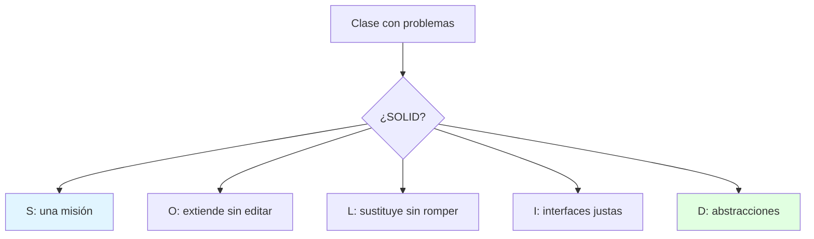
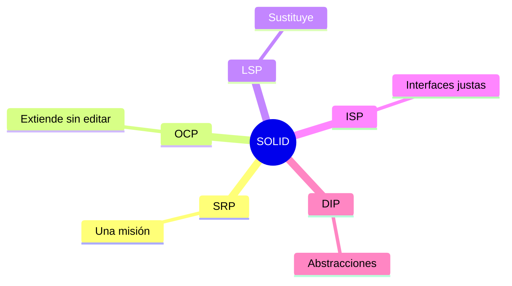

---
{"dg-publish":true,"permalink":"/universidad/3er-semestre/diseno-de-software/unidad-1-introduccion-al-diseno/04-principios-solid/","tags":["CCPG1042","unidad1","solid","principios"],"dg-note-properties":{"tags":["CCPG1042","unidad1","solid","principios"]}}
---


# 🖐️ Principios SOLID

## 🎯 Introducción

> [!info] 💡 ¿Por Qué 5 Reglas Valen un Parcial?
>
> **SOLID** son 5 principios OO que convierten "código que funciona" en "diseño que aguanta cambios". El docente les dedica una semana completa: si tus clases los violan, los patrones llegan tarde.
>
> **Analogía del mundo real:** Piensa en un taller mecánico:
>
> - **S** → Cada mecánico, una especialidad (no el mismo hace frenos y pinta)
> - **O** → Agregas un elevador nuevo sin demoler el taller (abierto a extensión)
> - **L** → Cualquier mecánico certificado hace el trabajo base (sustituible)
> - **I** → Manual por puesto, no un tomo para todos (interfaces justas)
> - **D** → Pides "un elevador", no "el Hidráulico-3000" (depende de abstracciones)
>
> | Principio | 1 línea | Huele mal cuando... |
> |---|---|---|
> | **S**RP | Una razón para cambiar | La clase hace 3 cosas |
> | **O**CP | Abierto a extender, cerrado a modificar | Cada variante edita la misma clase |
> | **L**SP | Derivada sustituye a la base | `override` que rompe contratos |
> | **I**SP | Interfaces pequeñas por rol | Clientes obligados a métodos inútiles |
> | **D**IP | Depende de abstracciones | `new Concreta()` regado |



---

## 🧵 Los 5 con Java Mínimo

> [!note] 🎨 SRP + OCP (los que más evalúan)
>
> ```java
> // ❌ SRP+OCP rotos: una clase, tres misiones, if por variante
> class Reporte {
>     String generar(String tipo) {
>         if (tipo.equals("pdf")) { /* ... */ }
>         else { /* ... */ }
>     }
>     void guardarEnDisco() { /* ... */ }
>     void enviarPorMail() { /* ... */ }
> }
>
> // ✅ SRP+OCP: misiones separadas, variante = clase nueva
> interface Formato { String generar(Datos d); }
> class ReportePdf implements Formato {
>     public String generar(Datos d) { /* ... */ return ""; }
> }
> class ServicioReporte {
>     String emitir(Datos d, Formato f) { return f.generar(d); }
> }
> ```
>
> | Principio | Chequeo de 10 segundos |
> |---|---|
> | **SRP** | Describe la clase sin usar "y" |
> | **OCP** | Nueva variante = archivo nuevo, cero ediciones |
> | **LSP** | Prueba la derivada donde va la base: ¿todo sigue verde? |
> | **ISP** | ¿Algún cliente implementa métodos vacíos? Divide |
> | **DIP** | ¿Constructores reciben interfaces? Bien |

---

## ⚠️ Problemas Comunes y Soluciones

> [!danger] ❌ Error: SOLID como Decoración
>
> **Síntomas:** nombras los principios en el informe pero el código tiene Managers dioses y `new` por doquier.
>
> **Solución:**
>
> - 1 principio por semana de práctica: SRP esta semana en tu proyecto
> - El code review pregunta "¿qué principio protege este cambio?"

---

## 🎯 Mejores Prácticas

> [!tip] 🏆 Checklist
>
> **1. SRP primero, el resto después**
>
> - Sin una misión por clase, OCP/LSP no tienen dónde pararse.
>
> **2. DIP en constructores desde el día 1**
>
> - Recibe interfaces: tus tests con mocks (U5) te lo agradecerán.

---

## 📊 Resumen Visual



> [!success] 🔍 Comparación Final
>
> | Aspecto | Sin SOLID | Con SOLID |
> |---|---|---|
> | **Cambio** | ❌ Cascada | ✅ Local |
> | **Tests** | Pegados | Mocks fáciles |
> | **Uso Recomendado** | Prototipo | ✅ **Todo diseño OO** |

---

## 🚀 Próximos Pasos

> [!quote] 🌟 Continuando
>
> **Has aprendido:**
>
> ✅ Los 5 principios con chequeos de 10 segundos
> ✅ SRP+OCP con código antes/después
>
> **Próximo tema Unidad 2:**
>
> | Tema | Qué verás | Por qué importa |
> |---|---|---|
> | **Diseño arquitectónico** | Estilos y vistas (S1 del deck) | Donde SOLID se vuelve sistema |

---

## 🔗 Seguir estudiando

> [!info] 📚 Seguir estudiando
>
> - Mapa de contenido: [[Universidad/3er Semestre/Diseño de Software/Diseño de Software\|Diseño de Software]]
> - Índice Unidad 1: [[Universidad/3er Semestre/Diseño de Software/Unidad 1 - Introducción al diseño/00 - Índice Unidad 1\|00 - Índice Unidad 1]]
> - Anterior: [[Universidad/3er Semestre/Diseño de Software/Unidad 1 - Introducción al diseño/03 - Paradigmas de programación y diseño\|03 - Paradigmas de programación y diseño]]
> - Syllabus: [[Universidad/3er Semestre/Diseño de Software/Bienvenida y Syllabus Diseño de Software\|Bienvenida y Syllabus Diseño de Software]]

## 📚 Referencias

> [!quote] 📖 Fuentes
>
> - Deck docente 01bDisenoSoftware (S3): SOLID.
> - R. Martin, *Agile Software Development* (origen SOLID).

---

**Tags:** #CCPG1042 #unidad1 #solid #principios #diseno-software
