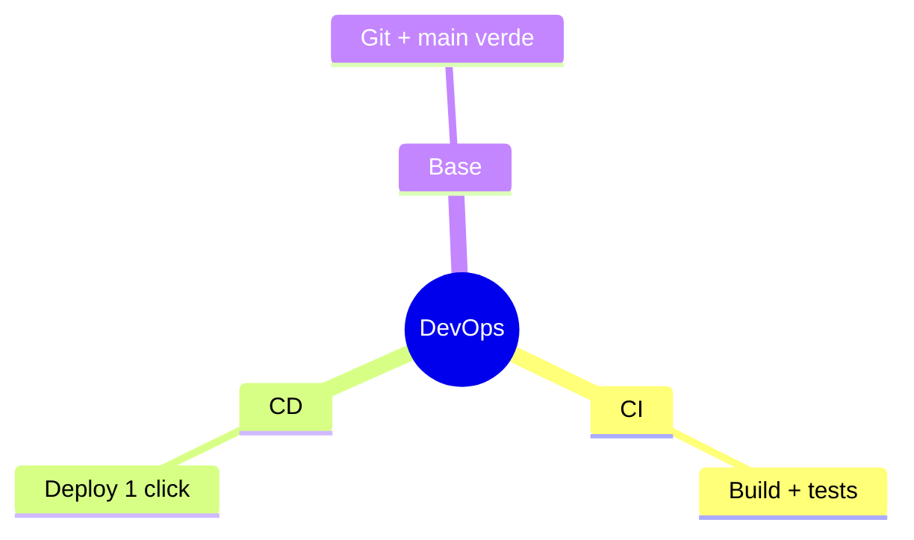

---
{"dg-publish":true,"permalink":"/universidad/3er-semestre/diseno-de-software/unidad-5-pruebas-unitarias/03-entrega-continua-y-dev-ops/","tags":["CCPG1042","unidad5","devops","entrega-continua"],"dg-note-properties":{"tags":["CCPG1042","unidad5","devops","entrega-continua"]}}
---

# 🚀 Entrega Continua y DevOps

## 🎯 Introducción

> [!info] 💡 ¿Por Qué el Docente Cierra con DevOps?
>
> La **entrega continua** lleva tu proyecto del "funciona en mi máquina" al "despliegue repetible con 1 comando". **DevOps** une desarrollo y operaciones: integra, prueba y entrega en ciclos cortos. Es el cierre del curso: todo lo anterior (diseño, tests, Git) existe para poder entregar seguido sin miedo.
>
> **Analogía del mundo real:** Piensa en una panadería:
>
> - **Sin DevOps** → Hornean a ciegas y descubren el pan quemado al abrir (deploy manual mensual)
> - **Con DevOps** → Receta versionada + horno calibrado + prueba de cada hornada (pipeline por push)
> - **Tu proyecto** → Compilar + tests + empaquetar automático en cada PR
>
> | Razón | Deploy Manual | Pipeline |
> |---|---|---|
> | **Frecuencia** | Mensual con miedo | Semanal sin drama |
> | **Errores** | "En mi máquina sí" | Mismo entorno siempre |
> | **Reversión** | Horas | 1 click / 1 comando |
> | **Nota** | Demo frágil | Entrega verificable |

---

## 🧵 Pipeline Mínimo de Curso

> [!note] 🎨 4 Etapas que Sí Puedes Montar
>
> 1. **Integración:** cada push compila + corre JUnit (ver U5-01). Rojo = no se fusiona.
> 2. **Empaquetado:** 1 artefacto versionado (jar/zip/imagen) por commit verde.
> 3. **Despliegue:** mismo procedimiento siempre (script, no clicks manuales).
> 4. **Observación:** logs y health-check básicos tras desplegar.
>
> | Práctica | Qué es | Herramienta típica |
> |---|---|---|
> | **CI** | Integrar y probar a cada push | GitHub Actions / Jenkins |
> | **CD** | Desplegar automático o a 1 click | Scripts / plataformas |
> | **IaC** | Infra como código versionado | Archivos de config en Git |
>
> **Conexión con Git (U5-02):** main siempre verde + PRs revisados es el prerrequisito. Sin eso no hay pipeline que valga.

---

## ⚠️ Problemas Comunes y Soluciones

> [!danger] ❌ Error: "DevOps" = Una Carpeta Llamada deploy-final-2
>
> **Síntomas:** despliegue = pasos orales que solo una persona sabe.
>
> **Solución:**
>
> - Todo despliegue escrito como script en el repo desde el día 1
> - Si no corre en limpio (máquina nueva), no es entrega continua

---

## 🎯 Mejores Prácticas

> [!tip] 🏆 Checklist
>
> **1. Verde para avanzar**
>
> - Merge solo con tests en verde: protege main como tu nota.
>
> **2. Despliega temprano y seguido**
>
> - Primera entrega mínima temprano en el curso, no todo al final.

---

## 📊 Resumen Visual

> [!success] 🔍 Comparación Final
>
> | Aspecto | Manual | Pipeline |
> |---|---|---|
> | **Riesgo** | ❌ Alto | ✅ Bajo y reversible |
> | **Frecuencia** | Rara | Continua |
> | **Uso Recomendado** | Nunca en equipo | ✅ **Cierre del curso** |

---

## 🚀 Cierre Unidad 5

> [!quote] 🌟 Lo de U5
>
> - U5-01 pruebas JUnit + U5-02 Git + U5-03 DevOps = validar, colaborar y entregar.
> - Siguiente: repasar patrones y smells para las lecciones del 19-oct y 4-nov.

---

## 🔗 Seguir estudiando

> [!info] 📚 Seguir estudiando
>
> - Mapa de contenido: [[Universidad/3er Semestre/Diseño de Software/Diseño de Software\|Diseño de Software]]
> - Índice Unidad 5: [[Universidad/3er Semestre/Diseño de Software/Unidad 5 - Pruebas unitarias/00 - Índice Unidad 5\|00 - Índice Unidad 5]]
> - Anterior: [[Universidad/3er Semestre/Diseño de Software/Unidad 5 - Pruebas unitarias/02 - Control de versiones con Git\|02 - Control de versiones con Git]]
> - Syllabus: [[Universidad/3er Semestre/Diseño de Software/Bienvenida y Syllabus Diseño de Software\|Bienvenida y Syllabus Diseño de Software]]

## 📚 Referencias

> [!quote] 📖 Fuentes
>
> - Políticas oficiales 01a: entrega continua / DevOps.
> - R. Pressman, B. Maxim, *Software Engineering: A Practitioner's Approach*, 9th ed.

---

**Tags:** #CCPG1042 #unidad5 #devops #cd #diseno-software
