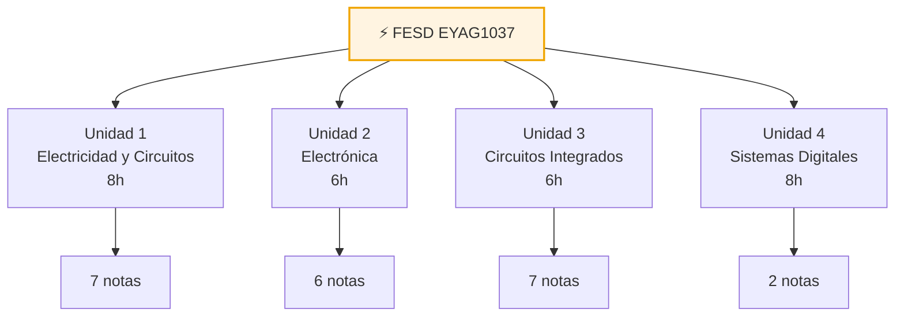

---
{"dg-publish":true,"permalink":"/universidad/3er-semestre/fundamentos-de-electricidad-y-sistemas-digitales/fundamentos-de-electricidad-y-sistemas-digitales/","title":"Fundamentos de Electricidad y Sistemas Digitales — EYAG1037","tags":["FESD","EYAG1037","ESPOL","indice","MOC"],"dg-note-properties":{"title":"Fundamentos de Electricidad y Sistemas Digitales — EYAG1037","description":"Notas completas de FESD (ESPOL) — 4 unidades","tags":["FESD","EYAG1037","ESPOL","indice","MOC"]}}
---

# ⚡ Fundamentos de Electricidad y Sistemas Digitales
**EYAG1037 · 3er Semestre · FIEC-ESPOL** · [[Universidad/3er Semestre/Fundamentos de Electricidad y Sistemas Digitales/Bienvenida y Syllabus FESD\|📖 Ver Syllabus completo]]

---

## ⚡ Unidad 1 — Electricidad y Circuitos *(8h)* → [[Universidad/3er Semestre/Fundamentos de Electricidad y Sistemas Digitales/Teórico/Unidad 1 - Electricidad y Circuitos/00 - Índice Unidad 1\|📂 Índice Dataview]]

> [!note] Electricidad y Circuitos
> - [[Universidad/3er Semestre/Fundamentos de Electricidad y Sistemas Digitales/Teórico/Unidad 1 - Electricidad y Circuitos/01 - Conceptos Fundamentales de la Electricidad\|01 — Conceptos Fundamentales]]
> - [[Universidad/3er Semestre/Fundamentos de Electricidad y Sistemas Digitales/Teórico/Unidad 1 - Electricidad y Circuitos/02 - Principios de Generacion de Energia Electrica\|02 — Generación de Energía]]
> - [[Universidad/3er Semestre/Fundamentos de Electricidad y Sistemas Digitales/Teórico/Unidad 1 - Electricidad y Circuitos/03 - Elementos Basicos de un Circuito Electrico\|03 — Elementos Básicos]]
> - [[Universidad/3er Semestre/Fundamentos de Electricidad y Sistemas Digitales/Teórico/Unidad 1 - Electricidad y Circuitos/04 - Circuitos en Serie Paralelo y Mixtos\|04 — Serie / Paralelo / Mixtos]]
> - [[Universidad/3er Semestre/Fundamentos de Electricidad y Sistemas Digitales/Teórico/Unidad 1 - Electricidad y Circuitos/05 - Leyes de Ohm y Kirchhoff\|05 — Ohm y Kirchhoff]]
> - [[Universidad/3er Semestre/Fundamentos de Electricidad y Sistemas Digitales/Teórico/Unidad 1 - Electricidad y Circuitos/06 - Teoremas de Analisis de Circuitos\|06 — Teoremas]]
> - [[Universidad/3er Semestre/Fundamentos de Electricidad y Sistemas Digitales/Teórico/Unidad 1 - Electricidad y Circuitos/Ejercicios Recopilados - EYAG1037\|Ejercicios Recopilados]]

---

## 🔌 Unidad 2 — Introducción a la Electrónica *(6h)* → [[Universidad/3er Semestre/Fundamentos de Electricidad y Sistemas Digitales/Teórico/Unidad 2 - Introducción a la Electrónica/00 - Índice Unidad 2\|📂 Índice Dataview]]

> [!note] Electrónica
> - [[Universidad/3er Semestre/Fundamentos de Electricidad y Sistemas Digitales/Teórico/Unidad 2 - Introducción a la Electrónica/01 - Semiconductores y Bandas de Energía\|01 — Semiconductores]]
> - [[Universidad/3er Semestre/Fundamentos de Electricidad y Sistemas Digitales/Teórico/Unidad 2 - Introducción a la Electrónica/02 - El Diodo - Unión P-N\|02 — Diodo Unión P-N]]
> - [[Universidad/3er Semestre/Fundamentos de Electricidad y Sistemas Digitales/Teórico/Unidad 2 - Introducción a la Electrónica/03 - Transistor BJT\|03 — Transistor BJT]]
> - [[Universidad/3er Semestre/Fundamentos de Electricidad y Sistemas Digitales/Teórico/Unidad 2 - Introducción a la Electrónica/04 - Circuitos de Filtrado y Fuentes Lineales\|04 — Filtrado y Fuentes]]
> - [[Universidad/3er Semestre/Fundamentos de Electricidad y Sistemas Digitales/Teórico/Unidad 2 - Introducción a la Electrónica/05 - Reguladores en Fuentes Lineales\|05 — Reguladores]]
> - [[Universidad/3er Semestre/Fundamentos de Electricidad y Sistemas Digitales/Teórico/Unidad 2 - Introducción a la Electrónica/06 - Ruido Electrónico e Interferencia\|06 — Ruido e Interferencia]]

---

## 🧩 Unidad 3 — Circuitos Integrados *(6h)* → [[Universidad/3er Semestre/Fundamentos de Electricidad y Sistemas Digitales/Teórico/Unidad 3 - Introducción a los circuitos integrados/00 - Índice Unidad 3\|📂 Índice Dataview]]

> [!note] Circuitos Integrados
> - [[Universidad/3er Semestre/Fundamentos de Electricidad y Sistemas Digitales/Teórico/Unidad 3 - Introducción a los circuitos integrados/01 - Introducción a los Circuitos Integrados No Programables\|01 — CI No Programables]]
> - [[Universidad/3er Semestre/Fundamentos de Electricidad y Sistemas Digitales/Teórico/Unidad 3 - Introducción a los circuitos integrados/02 - Aplicaciones de los OPAMs - Minimización de Ruido\|02 — OPAMs y Ruido]]
> - [[Universidad/3er Semestre/Fundamentos de Electricidad y Sistemas Digitales/Teórico/Unidad 3 - Introducción a los circuitos integrados/03 - Configuraciones Lineales Básicas del OPAM\|03 — Lineales Básicas]]
> - [[Universidad/3er Semestre/Fundamentos de Electricidad y Sistemas Digitales/Teórico/Unidad 3 - Introducción a los circuitos integrados/04 - Integrador, Derivador y Circuitos No Lineales\|04 — Integrador / Derivador / No Lineales]]
> - [[Universidad/3er Semestre/Fundamentos de Electricidad y Sistemas Digitales/Teórico/Unidad 3 - Introducción a los circuitos integrados/05 - Ejercicios Resueltos y de Oposición\|05 — Ejercicios Resueltos]]
> - [[Universidad/3er Semestre/Fundamentos de Electricidad y Sistemas Digitales/Teórico/Unidad 3 - Introducción a los circuitos integrados/06 - Aplicaciones de Integrados 555 - ADC - PWM\|06 — 555 / ADC / PWM]]
> - [[Universidad/3er Semestre/Fundamentos de Electricidad y Sistemas Digitales/Teórico/Unidad 3 - Introducción a los circuitos integrados/07 - Circuitos Integrados de Logica Fija y Tablas de Verdad\|07 — Lógica Fija]]

---

## 💻 Unidad 4 — Sistemas Digitales *(8h)* → [[Universidad/3er Semestre/Fundamentos de Electricidad y Sistemas Digitales/Teórico/Unidad 4 - Sistemas Digitales/00 - Índice Unidad 4\|📂 Índice Dataview]]

> [!note] Sistemas Digitales
> - [[Universidad/3er Semestre/Fundamentos de Electricidad y Sistemas Digitales/Teórico/Unidad 4 - Sistemas Digitales/01 - Introducción a la Electrónica Digital\|01 — Electrónica Digital]]
> - [[Universidad/3er Semestre/Fundamentos de Electricidad y Sistemas Digitales/Teórico/Unidad 4 - Sistemas Digitales/02 - Minimización de Funciones Lógicas\|02 — Minimización]]

---

## 🧪 Práctico y Laboratorio

> [!note] Fundamentos
> - [[Universidad/3er Semestre/Fundamentos de Electricidad y Sistemas Digitales/Practico/Fundamentos del Laboratorio/Equipos del Laboratorio — FESD\|Equipos del Laboratorio]]

> [!note] Prácticas
> - [[Universidad/3er Semestre/Fundamentos de Electricidad y Sistemas Digitales/Practico/Practicas del Laboratorio/Práctica 1 FESD/Práctica 1 — Manejo de Equipos del Laboratorio\|Práctica 1 — Manejo de Equipos]]
> - [[Universidad/3er Semestre/Fundamentos de Electricidad y Sistemas Digitales/Practico/Practicas del Laboratorio/Práctica 2 FESD/Práctica 2 — Ley de Ohm y Kirchhoff\|Práctica 2 — Ohm y Kirchhoff]]
> - [[Universidad/3er Semestre/Fundamentos de Electricidad y Sistemas Digitales/Practico/Practicas del Laboratorio/Práctica 3 FESD/Práctica 3 — Diodos y Transistores\|Práctica 3 — Diodos y Transistores]]
> - [[Universidad/3er Semestre/Fundamentos de Electricidad y Sistemas Digitales/Practico/Practicas del Laboratorio/Práctica 4 FESD/Práctica 4 — Fuentes Lineales\|Práctica 4 — Fuentes Lineales]]
> - [[Universidad/3er Semestre/Fundamentos de Electricidad y Sistemas Digitales/Practico/Practicas del Laboratorio/Práctica 5 FESD/Práctica 5 — Filtros Activos\|Práctica 5 — Filtros Activos]]
> - [[Universidad/3er Semestre/Fundamentos de Electricidad y Sistemas Digitales/Practico/Practicas del Laboratorio/Práctica 6 FESD/Práctica 6 — Logica Combinatoria y Arduino\|Práctica 6 — Lógica y Arduino]]

---

> [!quote] 🔗 Navegación
> - Syllabus: [[Universidad/3er Semestre/Fundamentos de Electricidad y Sistemas Digitales/Bienvenida y Syllabus FESD\|Bienvenida y Syllabus FESD]]
> - Índices: [[Universidad/3er Semestre/Fundamentos de Electricidad y Sistemas Digitales/Teórico/Unidad 1 - Electricidad y Circuitos/00 - Índice Unidad 1\|00 - Índice Unidad 1]] · [[Universidad/3er Semestre/Fundamentos de Electricidad y Sistemas Digitales/Teórico/Unidad 2 - Introducción a la Electrónica/00 - Índice Unidad 2\|00 - Índice Unidad 2]] · [[Universidad/3er Semestre/Fundamentos de Electricidad y Sistemas Digitales/Teórico/Unidad 3 - Introducción a los circuitos integrados/00 - Índice Unidad 3\|00 - Índice Unidad 3]] · [[Universidad/3er Semestre/Fundamentos de Electricidad y Sistemas Digitales/Teórico/Unidad 4 - Sistemas Digitales/00 - Índice Unidad 4\|00 - Índice Unidad 4]]

**Tags:** #FESD #EYAG1037 #ESPOL #indice #MOC
