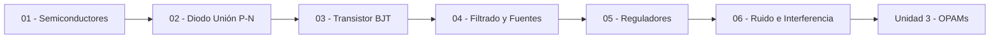

---
{"dg-publish":true,"permalink":"/universidad/3er-semestre/fundamentos-de-electricidad-y-sistemas-digitales/teorico/unidad-2-introduccion-a-la-electronica/00-indice-unidad-2/","tags":["FESD","unidad2","indice","EYAG1037"],"dg-note-properties":{"tags":["FESD","unidad2","indice","EYAG1037"]}}
---

# 🗺️ Unidad 2 — Introducción a la Electrónica — Índice

> [!info] ℹ️ Índice auto-actualizable con Dataview

## 📑 Notas de la Unidad

| Nota                                                                                                                                                                                                                           | Actualizado | Salientes | Entrantes |
| ------------------------------------------------------------------------------------------------------------------------------------------------------------------------------------------------------------------------------ | ----------- | --------- | --------- |
| [[Universidad/3er Semestre/Fundamentos de Electricidad y Sistemas Digitales/Teórico/Unidad 2 - Introducción a la Electrónica/01 - Semiconductores y Bandas de Energía\|01 — Semiconductores y Bandas de Energía]]           | 2026-08-26  | 7         | 7         |
| [[Universidad/3er Semestre/Fundamentos de Electricidad y Sistemas Digitales/Teórico/Unidad 2 - Introducción a la Electrónica/02 - El Diodo - Unión P-N\|02 — El Diodo — Unión P-N]]                                         | 2026-08-26  | 9         | 9         |
| [[Universidad/3er Semestre/Fundamentos de Electricidad y Sistemas Digitales/Teórico/Unidad 2 - Introducción a la Electrónica/03 - Transistor BJT\|03 — Transistor BJT]]                                                     | 2026-08-26  | 7         | 6         |
| [[Universidad/3er Semestre/Fundamentos de Electricidad y Sistemas Digitales/Teórico/Unidad 2 - Introducción a la Electrónica/04 - Circuitos de Filtrado y Fuentes Lineales\|04 — Circuitos de Filtrado y Fuentes Lineales]] | 2026-07-22  | 7         | 12        |
| [[Universidad/3er Semestre/Fundamentos de Electricidad y Sistemas Digitales/Teórico/Unidad 2 - Introducción a la Electrónica/05 - Reguladores en Fuentes Lineales\|05 — Reguladores en Fuentes Lineales]]                   | 2026-08-26  | 7         | 6         |
| [[Universidad/3er Semestre/Fundamentos de Electricidad y Sistemas Digitales/Teórico/Unidad 2 - Introducción a la Electrónica/06 - Ruido Electrónico e Interferencia\|06 — Ruido Electrónico e Interferencia]]               | 2026-08-26  | 8         | 5         |

{ .block-language-dataview}

## ✅ Avance — Metas de Aprendizaje

# [[Universidad/3er Semestre/Fundamentos de Electricidad y Sistemas Digitales/Teórico/Unidad 2 - Introducción a la Electrónica/01 - Semiconductores y Bandas de Energía\|01 - Semiconductores y Bandas de Energía]]

    - [ ] Defino semiconductor y distingo conductor vs semiconductor vs aislante por resistividad y Eg.
    - [ ] Explico banda de valencia, conduccion y band gap (Si 1.1 eV, Ge 0.67 eV) con diagrama.
    - [ ] Distingo silicio intrinseco (puro) vs extrinseco (dopado) y por que aumenta la conductividad.
    - [ ] Diferencio tipo N (donadores P/Sb, electrones mayoritarios) y tipo P (aceptores B/Ga, huecos).
    - [ ] Calculo R = delta·l/A y comparo conductividades de Cu, Ge, Si, mica.
    - [ ] Justifico por que el material dopado sigue neutro pese a tener portadores libres.
    - [ ] Relaciono coeficiente negativo de temperatura con liberacion de portadores.
    - [ ] Predigo portador mayoritario/minoritario y el ion fijo tras el dopaje.
    - [ ] Conecto bandas y dopaje con la futura union P-N y el BJT.
# [[Universidad/3er Semestre/Fundamentos de Electricidad y Sistemas Digitales/Teórico/Unidad 2 - Introducción a la Electrónica/02 - El Diodo - Unión P-N\|02 - El Diodo - Unión P-N]]

    - [ ] Describo la union P-N, la region de vaciamiento y Vbarrera (0.7 V Si, 0.3 V Ge).
    - [ ] Distingo polarizacion directa (vaciamiento se reduce, conduce) vs inversa (se ensancha, Is).
    - [ ] Identifico anodo (P) y catodo (N) y el sentido convencional de corriente.
    - [ ] Interpreto la curva I-V en sus 3 zonas (directa exponencial, inversa ~-Is, ruptura) y ubico Zener.
    - [ ] Aplico modelo ideal (0 V) y 2a aproximacion (0.7 V) para calcular IL en un circuito con diodo.
    - [ ] Diferencio diodo rectificador, Zener, LED y varicap por aplicacion.
    - [ ] Resuelvo un circuito con 2-3 resistencias y diodo determinando si conduce antes de calcular.
    - [ ] Justifico por que Is(Si) << Is(Ge) y que implica en bloqueo inverso.
    - [ ] Predigo el comportamiento en ruptura y por que solo el Zener esta disenado para operar ahi.
# [[Universidad/3er Semestre/Fundamentos de Electricidad y Sistemas Digitales/Teórico/Unidad 2 - Introducción a la Electrónica/03 - Transistor BJT\|03 - Transistor BJT]]

    - [ ] Identifico terminales B, C, E y leo la flecha del simbolo para distinguir NPN vs PNP.
    - [ ] Escribo IE = IC + IB y en activa IC = beta·IB con beta tipico 20-500.
    - [ ] Distingo corte (IB=0, switch abierto), activa (amplificador) y saturacion (VCE 0.2 V, switch cerrado).
    - [ ] Aplico la metodologia de 5 pasos (asumir activa -> KVL base -> IC -> KVL colector -> verificar VCE).
    - [ ] Calculo ICsat = (VCC-VCEsat)/(RC+RE) y verifico si ICactiva > ICsat para declarar saturacion.
    - [ ] Aplico la regla de saturacion forzada con beta forzada 5-10 para garantizar margen.
    - [ ] Diseno la RB o VIN minima para forzar saturacion dado VCC, RC, RE y beta.
    - [ ] Justifico por que la union EB debe estar en directa y BC en inversa para amplificar.
    - [ ] Predigo el modo de un BJT en un circuito mixto y uso la analogia de la llave de agua.
# [[Universidad/3er Semestre/Fundamentos de Electricidad y Sistemas Digitales/Teórico/Unidad 2 - Introducción a la Electrónica/04 - Circuitos de Filtrado y Fuentes Lineales\|04 - Circuitos de Filtrado y Fuentes Lineales]]

    - [ ] Identifico las 4 etapas de una fuente lineal y su orden.
    - [ ] Calculo el voltaje de secundario de un transformador dada su relación de vueltas.
    - [ ] Distingo un rectificador de media onda de uno de onda completa por su circuito.
    - [ ] Sé qué hace un capacitor de filtro en el circuito.
    - [ ] Explico en una frase qué función cumple el regulador, sin necesidad de conocer su circuito interno todavía.
    - [ ] Calculo $V_{DC}$ para media onda y onda completa dado $V_m$.
    - [ ] Calculo el voltaje de rizado $V_r(pp)$ dado $I_{DC}$, $f$ y $C$, identificando correctamente la frecuencia de rizado según el tipo de rectificador.
    - [ ] Elijo la capacitancia $C$ necesaria para cumplir un rizado máximo permitido.
    - [ ] Comparo PIV, eficiencia y rizado entre las tres configuraciones de rectificador para elegir la más adecuada a un requerimiento dado.
    - [ ] Explico el trade-off entre capacitancia del filtro, corriente de carga y rizado tolerado.
    - [ ] Identifico las limitaciones de un filtro puramente capacitivo (sin regulación) frente a variaciones de carga.
# [[Universidad/3er Semestre/Fundamentos de Electricidad y Sistemas Digitales/Teórico/Unidad 2 - Introducción a la Electrónica/05 - Reguladores en Fuentes Lineales\|05 - Reguladores en Fuentes Lineales]]

    - [ ] Explico qué función cumple el regulador dentro de la fuente lineal.
    - [ ] Distingo un regulador fijo (78xx/79xx) de uno ajustable (LM317/LM337/LM137).
    - [ ] Identifico los terminales típicos de un regulador de 3 pines (entrada, tierra/ajuste, salida).
    - [ ] Calculo $R_2$ dado $R_1$ y el $V_O$ deseado en un LM317 (o viceversa).
    - [ ] Explico para qué sirven los capacitores de entrada y salida en estos reguladores.
    - [ ] Sé cuándo usar 79xx/LM337/LM137 en vez de 78xx/LM317 (tensiones negativas).
    - [ ] Comparo el criterio de selección entre un regulador fijo y uno ajustable para un diseño dado.
    - [ ] Relaciono esta etapa con las anteriores (transformador, rectificador, filtro) para diseñar una fuente lineal completa.
# [[Universidad/3er Semestre/Fundamentos de Electricidad y Sistemas Digitales/Teórico/Unidad 2 - Introducción a la Electrónica/06 - Ruido Electrónico e Interferencia\|06 - Ruido Electrónico e Interferencia]]

    - [ ] Distingo ruido electrónico (interno) de interferencia electromagnética (externa).
    - [ ] Nombro los tres tipos principales de ruido interno: térmico, shot y flicker.
    - [ ] Identifico los cuatro modos de acoplamiento de interferencia: conducido, capacitivo, inductivo y radiado.
    - [ ] Calculo el voltaje de ruido térmico dado $R$, $T$ y $B$.
    - [ ] Relaciono cada técnica de mitigación (desacople, blindaje, twisted pair, optoacoplador, TVS) con el tipo de acoplamiento que combate.
    - [ ] Explico por qué el filtro capacitivo y el regulador Zener, vistos antes, también actúan como mitigadores de ruido.
    - [ ] Propongo una estrategia de mitigación completa para un circuito expuesto a varios tipos de interferencia simultáneamente.
    - [ ] Explico el concepto de rechazo de modo común como antesala al amplificador diferencial de la Unidad 3.

{ .block-language-dataview}

## ⚠️ Notas huérfanas

{ .block-language-dataview}

## 📊 Mapa de conexiones

> [!quote] 🔗 Conexiones
> - Previo: [[Universidad/3er Semestre/Fundamentos de Electricidad y Sistemas Digitales/Teórico/Unidad 1 - Electricidad y Circuitos/06 - Teoremas de Analisis de Circuitos\|06 - Teoremas de Analisis de Circuitos]] (Unidad 1)
> - Siguiente: [[Universidad/3er Semestre/Fundamentos de Electricidad y Sistemas Digitales/Teórico/Unidad 3 - Introducción a los circuitos integrados/01 - Introducción a los Circuitos Integrados No Programables\|01 - Introducción a los Circuitos Integrados No Programables]] (Unidad 3)
> - MOC general: [[Universidad/3er Semestre/Fundamentos de Electricidad y Sistemas Digitales/Fundamentos de Electricidad y Sistemas Digitales\|Fundamentos de Electricidad y Sistemas Digitales]]

---
**Tags:** #FESD #unidad2 #indice
