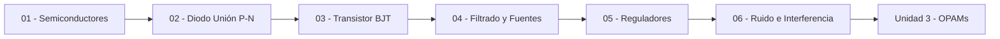

---
{"dg-publish":true,"permalink":"/universidad/3er-semestre/fundamentos-de-electricidad-y-sistemas-digitales/teorico/unidad-2-introduccion-a-la-electronica/00-indice-unidad-2/","tags":["FESD","unidad2","indice","EYAG1037"],"dg-note-properties":{"tags":["FESD","unidad2","indice","EYAG1037"]}}
---

# 🗺️ Unidad 2 — Introducción a la Electrónica — Índice

> [!info] ℹ️ Índice manual

## 📑 Notas de la Unidad

- [[Universidad/3er Semestre/Fundamentos de Electricidad y Sistemas Digitales/Teórico/Unidad 2 - Introducción a la Electrónica/01 - Semiconductores y Bandas de Energía\|01 - Semiconductores y Bandas de Energía]]
- [[Universidad/3er Semestre/Fundamentos de Electricidad y Sistemas Digitales/Teórico/Unidad 2 - Introducción a la Electrónica/02 - El Diodo - Unión P-N\|02 - El Diodo - Unión P-N]]
- [[Universidad/3er Semestre/Fundamentos de Electricidad y Sistemas Digitales/Teórico/Unidad 2 - Introducción a la Electrónica/03 - Transistor BJT\|03 - Transistor BJT]]
- [[Universidad/3er Semestre/Fundamentos de Electricidad y Sistemas Digitales/Teórico/Unidad 2 - Introducción a la Electrónica/04 - Circuitos de Filtrado y Fuentes Lineales\|04 - Circuitos de Filtrado y Fuentes Lineales]]
- [[Universidad/3er Semestre/Fundamentos de Electricidad y Sistemas Digitales/Teórico/Unidad 2 - Introducción a la Electrónica/05 - Reguladores en Fuentes Lineales\|05 - Reguladores en Fuentes Lineales]]
- [[Universidad/3er Semestre/Fundamentos de Electricidad y Sistemas Digitales/Teórico/Unidad 2 - Introducción a la Electrónica/06 - Ruido Electrónico e Interferencia\|06 - Ruido Electrónico e Interferencia]]

## 📊 Mapa de conexiones

```mermaid
graph LR
    A[01 - Semiconductores] --> B[02 - Diodo Unión P-N]
    B --> C[03 - Transistor BJT]
    C --> D[04 - Filtrado y Fuentes]
    D --> E[05 - Reguladores]
    E --> F[06 - Ruido e Interferencia]
    F --> G[Unidad 3 - OPAMs]
```

> [!quote] 🔗 Conexiones
> - Previo: [[Universidad/3er Semestre/Fundamentos de Electricidad y Sistemas Digitales/Teórico/Unidad 1 - Electricidad y Circuitos/06 - Teoremas de Analisis de Circuitos\|06 - Teoremas de Analisis de Circuitos]] (Unidad 1)
> - Siguiente: [[Universidad/3er Semestre/Fundamentos de Electricidad y Sistemas Digitales/Teórico/Unidad 3 - Circuitos integrados/01 - CI no programables\|01 - CI no programables]] (Unidad 3)
> - MOC general: [[Universidad/3er Semestre/Fundamentos de Electricidad y Sistemas Digitales/Fundamentos de Electricidad y Sistemas Digitales\|Fundamentos de Electricidad y Sistemas Digitales]]

---
**Tags:** #FESD #unidad2 #indice
