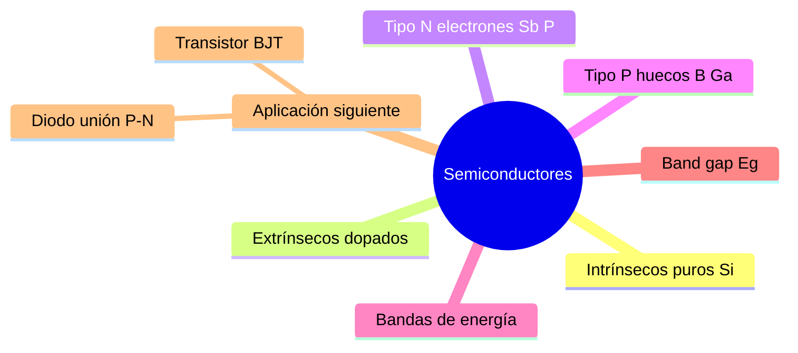

---
{"dg-publish":true,"permalink":"/universidad/3er-semestre/fundamentos-de-electricidad-y-sistemas-digitales/teorico/unidad-2-introduccion-a-la-electronica/01-semiconductores-y-bandas-de-energia/","dg-note-properties":{}}
---

# ⚡ Semiconductores y Bandas de Energía

## 🎯 Introducción

> [!info] 💡 ¿Qué es la electrónica y por qué importa?
> 
> La **electrónica** es la rama de la física e ingeniería que estudia el comportamiento y control de los electrones en materiales semiconductores, y su aplicación en dispositivos y circuitos. A diferencia de los circuitos eléctricos vistos en la Unidad 1, donde los elementos eran lineales (resistencias, fuentes), la electrónica introduce elementos **no lineales** como diodos y transistores.
> 
> Su historia moderna comienza en los años cuarenta con la introducción del transistor semiconductor, que hizo posible la **miniaturización** de los circuitos y dio origen a toda la electrónica moderna.
> 
> ```mermaid
> graph TD
>     A[Electrónica] --> B[Semiconductores]
>     B --> C[Diodos]
>     B --> D[Transistores]
>     C --> C1[Rectificación<br/>Regulación<br/>Emisión de luz]
>     D --> D1[Switch<br/>Amplificador]
> 
>     style B fill:#e1f5ff
>     style C fill:#e1ffe1
>     style D fill:#fff4e1
>     style C1 fill:#e1ffe1
>     style D1 fill:#fff4e1
> ```
> 
> |Elemento|Tipo|Función principal|
> |---|---|---|
> |**Resistor**|Pasivo lineal|Limitar corriente|
> |**Diodo**|Activo no lineal|Paso unidireccional de corriente|
> |**Transistor**|Activo no lineal|Switch o amplificador|

---

## 🔬 Semiconductores

> [!note] 🔬 ¿Qué es un semiconductor?
> 
> Un **semiconductor** es un material cuya conductividad eléctrica está entre la de un conductor (cobre) y un aislante (vidrio). El más usado es el **silicio (Si)**.
> 
> La resistencia de un material semiconductor se calcula con:
> 
> $$R = \frac{\delta \cdot l}{A}$$
> 
> Donde $\delta$ es la resistividad $(\Omega \cdot m)$, $l$ es la longitud de la muestra $(m)$ y $A$ es el área superficial incidente $(m^2)$.
> 
> |Material|Tipo|Resistividad|
> |---|---|---|
> |Cobre|Conductor|$10^{-6}\ \Omega\cdot cm$|
> |Germanio (Ge)|Semiconductor|$50\ \Omega\cdot cm$|
> |Silicio (Si)|Semiconductor|$50\times10^{3}\ \Omega\cdot cm$|
> |Mica|Aislante|$10^{12}\ \Omega\cdot cm$|

---

## 🧱 Estructura Atómica y Bandas de Energía

> [!note] 🧱 Estructura cristalina y enlaces covalentes
> 
> Los semiconductores forman un **cristal** — un sólido organizado por la combinación periódica de átomos. En el silicio, cada átomo comparte sus 4 electrones de valencia con 4 vecinos formando **enlaces covalentes**.
> 
> Los semiconductores tienen un **coeficiente negativo de temperatura**: al aumentar la temperatura, los átomos vibran más y algunos electrones se liberan de sus enlaces, aumentando la conductividad.

> [!note] ⚡ Bandas de energía
> 
> Los niveles de energía discretos de los átomos se expanden al cristalizarse en **bandas de energía**. Entre bandas existe una zona prohibida llamada **banda gap** ($E_g$) donde ningún electrón puede existir.
> 
> ```mermaid
> graph TD
>     subgraph AISLANTE
>         A1[Banda de conducción]
>         A2["Eg > 5 eV — grande"]
>         A3[Banda de valencia]
>     end
>     subgraph SEMICONDUCTOR
>         B1[Banda de conducción]
>         B2["Eg = 1.1 eV Si / Eg = 0.67 eV Ge"]
>         B3[Banda de valencia]
>     end
>     subgraph CONDUCTOR
>         C1[Banda de conducción]
>         C2[Se solapan]
>         C3[Banda de valencia]
>     end
> 
>     style A2 fill:#ffe1e1
>     style B2 fill:#fff4e1
>     style C2 fill:#e1ffe1
> ```
> 
> |Material|Band gap $E_g$|Comportamiento|
> |---|---|---|
> |**Aislante**|$> 5\text{ eV}$|Electrones no pueden saltar a conducción|
> |**Semiconductor Si**|$1.1\text{ eV}$|Salto posible con energía térmica o luz|
> |**Semiconductor Ge**|$0.67\text{ eV}$|Más fácil de excitar que el Si|
> |**Conductor**|$\approx 0$|Bandas solapadas, electrones libres siempre|


---

## 🔩 Tipos de Semiconductores

> [!tip] 🔩 Intrínseco vs Extrínseco
> 
> **Intrínsecos — puros (Si-Si):**
> 
> - Cristal perfecto de silicio con enlaces covalentes.
> - Materiales que se han refinado para reducir impurezas al mínimo.
> - Muy poca conductividad a temperatura ambiente.
> 
> **Extrínsecos — dopados:**
> 
> - Se agrega una impureza controlada (**dopaje**) para crear estados de energía permisibles en la banda prohibida, reduciendo $E_g$ efectivo.
> - Resultado: mayor conductividad controlada.
> 
> ```mermaid
> graph LR
>     A[Semiconductor<br/>de Silicio] --> B[Intrínseco<br/>Si puro]
>     A --> C[Extrínseco<br/>Dopado]
>     C --> D[Tipo N<br/>Dopante: P o Sb<br/>Portador: e⁻]
>     C --> E[Tipo P<br/>Dopante: B o Ga<br/>Portador: h⁺]
> 
>     style B fill:#e1f5ff
>     style D fill:#ffe1e1
>     style E fill:#e1ffe1
> ```

> [!tip] 🔴 Material Tipo N
> 
> Se dopa con impurezas **pentavalentes** (5 electrones de valencia) como Antimonio (Sb) o Fósforo (P).
> 
> - El quinto electrón queda libre — no forma enlace covalente.
>     
> - **Portador mayoritario:** electrones libres (carga negativa).
>     
> - **Portador minoritario:** huecos.
>     
> - Cuando el electrón extra abandona el átomo donador, ese átomo queda con carga positiva neta.
>     
> 
> > 📌 El material tipo N es eléctricamente neutro en conjunto — los iones positivos fijos compensan los electrones libres.

> [!tip] 🔵 Material Tipo P
> 
> Se dopa con impurezas **trivalentes** (3 electrones de valencia) como Boro (B) o Galio (Ga).
> 
> - Solo forma 3 de los 4 enlaces necesarios — queda una **vacancia o hueco**.
>     
> - **Portador mayoritario:** huecos (carga positiva).
>     
> - **Portador minoritario:** electrones.
>     
> 
> > 💡 **Analogía del hueco:** es como un asiento vacío en un bus. El asiento no se mueve, pero cuando alguien lo ocupa deja otro vacío — la "ausencia" se desplaza.


---

## 📊 Comparación General

> [!success] 📊 Conductor vs Semiconductor vs Aislante
> 
> |Propiedad|Conductor|Semiconductor|Aislante|
> |---|---|---|---|
> |**Resistividad**|$\sim 10^{-6}\ \Omega\cdot cm$|$50$ a $50\times10^3\ \Omega\cdot cm$|$10^{12}\ \Omega\cdot cm$|
> |**Ejemplo**|Cobre|Silicio, Germanio|Mica, vidrio|
> |**Band gap**|$\approx 0$|$0.67$ a $1.1\text{ eV}$|$>5\text{ eV}$|
> |**Control**|No controlable|Controlable por dopaje|No controlable|

---

## 📊 Resumen Visual



---

> [!quote] 📖 Fuentes consultadas
> 
> [1] A. Sedra y K. Smith, _Microelectronic Circuits_, 7th ed. New York, USA: Oxford University Press, 2015, pp. 139–220.
> 
> [2] R. L. Boylestad y L. Nashelsky, _Electrónica: Teoría de Circuitos y Dispositivos Electrónicos_, 10th ed. México: Pearson, 2009, pp. 1–80.
> 
> [3] A. R. Hambley, _Electrical Engineering: Principles and Applications_, 7th ed. Hoboken, NJ, USA: Pearson, 2018, pp. 440–510.
> 
> [4] Ing. Adriana Aguirre Alonso, _Sesión 6,7 — Introducción a la Electrónica_, EYAG1037. Guayaquil, Ecuador: ESPOL — FIEC, 2026.

> [!quote] 🔗 Conexiones
> 
> Esta nota es la base conceptual para:
> 
> - [[Universidad/3er Semestre/Fundamentos de Electricidad y Sistemas Digitales/Teórico/Unidad 2 - Introducción a la Electrónica/02 - El Diodo - Unión P-N\|02 - El Diodo - Unión P-N]] — la unión de un material tipo P con uno tipo N.
> - [[Universidad/3er Semestre/Fundamentos de Electricidad y Sistemas Digitales/Teórico/Unidad 2 - Introducción a la Electrónica/03 - Transistor BJT\|03 - Transistor BJT]] — dispositivo de tres terminales formado por dos uniones P-N.

---

**Tags:** #semiconductores #electronica #bandasEnergia #tipoN #tipoP #EYAG1037 #FESD #ESPOL #unidad2