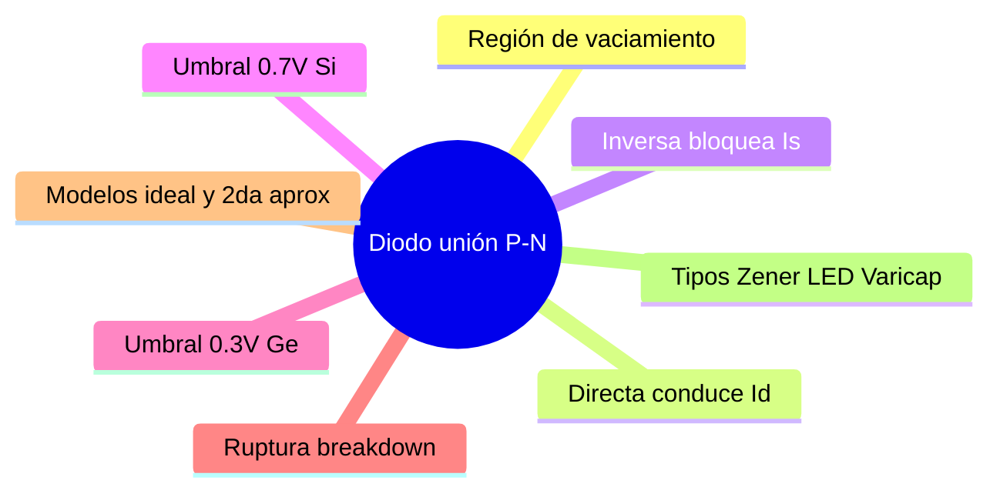

---
{"dg-publish":true,"permalink":"/universidad/3er-semestre/fundamentos-de-electricidad-y-sistemas-digitales/teorico/unidad-2-introduccion-a-la-electronica/02-el-diodo-union-p-n/","dg-note-properties":{}}
---

# 🔌 El Diodo — Unión P-N

## 🎯 Introducción

> [!info] 💡 ¿Qué es el diodo?
> 
> El **diodo** se forma al unir un material tipo P con uno tipo N (ver [[Universidad/3er Semestre/Fundamentos de Electricidad y Sistemas Digitales/Teórico/Unidad 2 - Introducción a la Electrónica/01 - Semiconductores y Bandas de Energía\|01 - Semiconductores y Bandas de Energía]]). Es el elemento semiconductor más básico — un **dispositivo no lineal de dos terminales** que funciona como interruptor (encendido o apagado).
> 
> |Terminal|Región|Polaridad|
> |---|---|---|
> |**Ánodo (+)**|Tipo P|Entrada de corriente convencional|
> |**Cátodo (−)**|Tipo N|Salida de corriente convencional|
> 
> La corriente fluye de **Ánodo → Cátodo** en polarización directa (sentido convencional = flujo de huecos).


---

## 🏗️ Región de Vaciamiento

> [!note] 🏗️ Sin polarización
> 
> Al unirse P y N, huecos y electrones se combinan en la zona de unión formando **pares de iones dipolo**. Esto crea la **región de vaciamiento**: una zona sin portadores libres que actúa como barrera de potencial.
> 
> $$V_{barrera} \approx 0.3\text{ V (Ge)} \qquad V_{barrera} \approx 0.7\text{ V (Si)} \qquad \text{a } 25°C$$
> 
> Con cero polarización: $I = 0$ — la barrera impide el flujo neto de portadores.

---

## 🔋 Polarización del Diodo

> [!warning] 🔋 Polarización inversa
> 
> Se conecta el terminal negativo de la fuente al ánodo (P) y el positivo al cátodo (N).
> 
> **Efecto:**
> 
> - La región de vaciamiento se **ensancha**.
>     
> - La barrera de potencial aumenta.
>     
> - $I_{mayoritarios} = 0$ — los portadores mayoritarios no pueden cruzar.
>     
> - Solo circula una corriente mínima de saturación inversa $I_S$ (del orden de $\mu A$), causada por portadores minoritarios activados térmicamente.
>     
> 
> > 📌 $I_S$ del silicio es mucho menor que $I_S$ del germanio — el Si es mejor para bloquear corriente inversa.
> 
> Además existe una **corriente superficial de fuga** ($I_{sup\ fuga}$) dependiente de la polarización.

> [!warning] ⚡ Polarización directa
> 
> Se conecta el terminal positivo de la fuente al ánodo (P) y el negativo al cátodo (N).
> 
> **Efecto:**
> 
> - La región de vaciamiento se **reduce**.
> - La barrera de potencial disminuye.
> - Se produce un flujo denso de portadores mayoritarios a través de la unión.
> 
> La corriente del diodo es:
> 
> $$I_D = I_{mayoritarios} - I_S$$
> 
> Para que conduzca, el voltaje aplicado debe superar la barrera:
> 
> |Material|Tensión de umbral|
> |---|---|
> |**Silicio (Si)**|$V_{umbral} \approx 0.7\text{ V}$|
> |**Germanio (Ge)**|$V_{umbral} \approx 0.3\text{ V}$|

---

## 📊 Curva Característica I-V

> [!note] 📊 Tres zonas de operación
> 
> La curva muestra tres zonas claramente diferenciadas:
> 
> ```mermaid
> graph LR
>     A["Zona de ruptura<br/>V < -Vruptura<br/>Corriente inversa crece"] --> B["Zona inversa<br/>-Vruptura < V < 0<br/>I ≈ -Is pequeña"]
>     B --> C["Zona directa<br/>V > 0.7V Si<br/>Corriente crece exponencialmente"]
> 
>     style A fill:#ffe1e1
>     style B fill:#fff4e1
>     style C fill:#e1ffe1
> ```
> 
> - **Zona directa:** para $V_D > V_{umbral}$, la corriente crece exponencialmente.
> - **Zona inversa:** corriente prácticamente nula ($\approx -I_S$).
> - **Zona de ruptura:** si $V_{inv}$ supera $V_{ruptura}$, la corriente inversa crece bruscamente — destructivo en diodos normales, intencional en Zener.

> [!tip] 🔧 Modelos de aproximación del diodo
> 
> Para análisis de circuitos se usan modelos simplificados:
> 
> |Modelo|Directa|Inversa|Cuándo usar|
> |---|---|---|---|
> |**Ideal (1ª aprox.)**|Cortocircuito $V_D = 0$|Circuito abierto|Análisis rápido|
> |**2ª aproximación**|Fuente de $0.7\text{ V}$ en serie|Circuito abierto|Análisis más preciso|
> 
> > 📌 **Regla práctica:** diodo ideal en directa = interruptor cerrado; en inversa = interruptor abierto.


---

## 💡 Tipos de Diodos

> [!tip] 💡 Variantes del diodo
> 
> |Tipo|Aplicación principal|Nota|
> |---|---|---|
> |**Rectificador**|Convertir CA → CD|El más común|
> |**Zener**|Regulación de voltaje|Opera en ruptura de forma controlada|
> |**LED**|Emisión de luz|Emite fotones al conducir|
> |**Varicap (Varactor)**|Capacitancia variable|Controlada por voltaje inverso|
> 
> > 💡 El **Zener** está diseñado específicamente para operar en la zona de ruptura manteniendo un voltaje constante — por eso se usa como regulador de voltaje.

---

## 🧪 Ejercicios Prácticos

> [!example]- ✏️ Ejercicio 1 — Diodo ideal en circuito (Sesión 6,7)
> 
> **Circuito (a):** $V_S = 10\text{ V}$, diodo ideal, $R_L = 1\text{ k}\Omega$.
> 
> |Paso|Acción|
> |---|---|
> |**1**|Verificar polarización: $V_S > 0$ → ánodo más positivo que cátodo → **directa**|
> |**2**|Diodo ideal en directa = cortocircuito ($V_D = 0$)|
> |**3**|$I_L = \dfrac{V_S}{R_L} = \dfrac{10}{1000} = 10\text{ mA}$|
> 
> **Circuito (b):** $V_S = 36\text{ V}$, $R_1 = 6\text{ k}\Omega$, $R_2 = 3\text{ k}\Omega$, $R_3 = 1\text{ k}\Omega$, diodo ideal.
> 
> |Paso|Acción|
> |---|---|
> |**1**|Verificar polarización: ánodo conectado al nodo entre $R_1$ y $R_2$, cátodo a $R_3$ → asumir **directa**|
> |**2**|Diodo ideal en directa = cortocircuito → $R_2$ queda en paralelo con $R_3$|
> |**3**|$R_{2\|3} = \dfrac{3k \cdot 1k}{3k + 1k} = 0.75\text{ k}\Omega$|
> |**4**|$R_{total} = R_1 + R_{2\|3} = 6k + 0.75k = 6.75\text{ k}\Omega$|
> |**5**|$I_{total} = \dfrac{36}{6750} \approx 5.33\text{ mA}$|
> |**6**|$V_{R_{2\|3}} = 5.33\text{ mA} \times 750\ \Omega = 4\text{ V}$|
> |**7**|$I_{R_3} = \dfrac{4\text{ V}}{1\text{ k}\Omega} = 4\text{ mA}$ → corriente que pasa por $R_3$|
> 
> > 📌 Verificación: el ánodo está a $4\text{ V}$ y el cátodo también (cortocircuito ideal) → polarización directa confirmada ✅
> 
> **Circuito (c):** $V_S = 12\text{ V}$, $R = 2\text{ k}\Omega$, diodo ideal, $R_L = 1\text{ k}\Omega$.
> 
> |Paso|Acción|
> |---|---|
> |**1**|Polarización directa → diodo = cortocircuito|
> |**2**|$I = \dfrac{12}{2000 + 1000} = 4\text{ mA}$|
> |**3**|$V_{R_L} = 4\text{ mA} \times 1\text{ k}\Omega = 4\text{ V}$|

> [!example]- ✏️ Ejercicio 1b — Mismos circuitos con segunda aproximación ($V_D = 0.7\text{ V}$)
> 
> Con la **segunda aproximación**, el diodo en directa se modela como una fuente de $0.7\text{ V}$ en serie (no como cortocircuito). En inversa sigue siendo circuito abierto.
> 
> **Circuito (a) — 2ª aprox:** $V_S = 10\text{ V}$, diodo Si, $R_L = 1\text{ k}\Omega$.
> 
> |Paso|Acción|
> |---|---|
> |**1**|$V_S > V_{umbral}$ → diodo conduce|
> |**2**|$V_D = 0.7\text{ V}$ (caída fija en directa)|
> |**3**|$V_{R_L} = V_S - V_D = 10 - 0.7 = 9.3\text{ V}$|
> |**4**|$I_L = \dfrac{9.3}{1000} = 9.3\text{ mA}$|
> 
> **Circuito (b) — 2ª aprox:** $V_S = 36\text{ V}$, $R_1 = 6\text{ k}\Omega$, $R_2 = 3\text{ k}\Omega$, $R_3 = 1\text{ k}\Omega$.
> 
> |Paso|Acción|
> |---|---|
> |**1**|Diodo conduce → reemplazar por fuente de $0.7\text{ V}$|
> |**2**|$R_{2\|3} = 0.75\text{ k}\Omega$ (igual que antes)|
> |**3**|$V_{disponible} = 36 - 0.7 = 35.3\text{ V}$|
> |**4**|$I_{total} = \dfrac{35.3}{6750} \approx 5.23\text{ mA}$|
> |**5**|$V_{R_{2\|3}} = 5.23\text{ mA} \times 750\ \Omega \approx 3.92\text{ V}$|
> 
> **Circuito (c) — 2ª aprox:** $V_S = 12\text{ V}$, $R = 2\text{ k}\Omega$, $R_L = 1\text{ k}\Omega$.
> 
> |Paso|Acción|
> |---|---|
> |**1**|$V_{disponible} = 12 - 0.7 = 11.3\text{ V}$|
> |**2**|$I = \dfrac{11.3}{3000} \approx 3.77\text{ mA}$|
> |**3**|$V_{R_L} = 3.77\text{ mA} \times 1\text{ k}\Omega \approx 3.77\text{ V}$|
> 
> > 📌 **Comparación clave:** la diferencia entre modelo ideal y 2ª aproximación es pequeña cuando $V_S \gg 0.7\text{ V}$, pero se vuelve significativa en circuitos de bajo voltaje.

---

## 📊 Resumen Visual



---

> [!quote] 📖 Fuentes consultadas
> 
> [1] A. Sedra y K. Smith, _Microelectronic Circuits_, 7th ed. New York, USA: Oxford University Press, 2015, pp. 139–220.
> 
> [2] R. L. Boylestad y L. Nashelsky, _Electrónica: Teoría de Circuitos y Dispositivos Electrónicos_, 10th ed. México: Pearson, 2009, pp. 1–80.
> 
> [5] Ph.D. Carlos Salazar López, _Clase 1 — Diodos_, EYAG1037. Guayaquil, Ecuador: ESPOL — FIEC, 2026.

> [!quote] 🔗 Conexiones
> 
> - [[Universidad/3er Semestre/Fundamentos de Electricidad y Sistemas Digitales/Teórico/Unidad 2 - Introducción a la Electrónica/01 - Semiconductores y Bandas de Energía\|01 - Semiconductores y Bandas de Energía]] — fundamento de la unión P-N.
> - [[03 - Transistor BJT\|03 - Transistor BJT]] — dos uniones P-N combinadas forman el transistor.

---

**Tags:** #diodo #unionPN #regionVaciamiento #zener #LED #varicap #EYAG1037 #FESD #ESPOL #unidad2