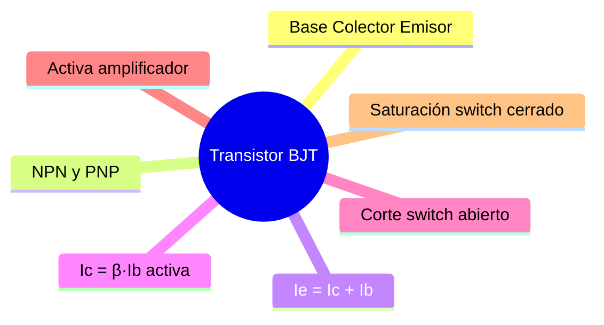

---
{"dg-publish":true,"permalink":"/universidad/3er-semestre/fundamentos-de-electricidad-y-sistemas-digitales/teorico/unidad-2-introduccion-a-la-electronica/03-transistor-bjt-switch-o-amplificador/","dg-note-properties":{}}
---

# ⚙️ Transistor BJT — Switch o Amplificador

## 🎯 Introducción

> [!info] ⚙️ ¿Qué es el transistor?
> 
> El **transistor BJT (Bipolar Junction Transistor)** es un elemento semiconductor de tres terminales formado por dos uniones P-N (ver [[02 - El Diodo (Unión P-N)\|02 - El Diodo (Unión P-N)]]). Puede operar como **interruptor (switch)** o como **amplificador de señal**.
> 
> |Terminal|Símbolo|Función|
> |---|---|---|
> |**Base (B)**|Control|Controla la corriente de colector|
> |**Colector (C)**|Principal|Por donde entra la corriente principal|
> |**Emisor (E)**|Salida|Por donde sale la corriente total|
> 
> |Tipo|Estructura|Portador mayoritario|
> |---|---|---|
> |**NPN**|N-P-N|Electrones|
> |**PNP**|P-N-P|Huecos|

---

## 📐 Relaciones Fundamentales de Corriente

> [!note] 📐 Ecuaciones base
> 
> $$\boxed{I_E = I_C + I_B} \quad \text{(siempre — KCL)}$$
> 
> $$\boxed{I_C = \beta \cdot I_B} \quad \text{(solo en zona activa)}$$
> 
> Donde $\beta$ es la **ganancia de corriente** (típicamente entre 20 y 500).

---

## 🔄 Regiones de Operación

> [!note] 🔄 Corte, Activa y Saturación
> 
> ```mermaid
> graph TD
>     A{Estado del<br/>transistor} --> B[CORTE<br/>Ib = 0<br/>Ic ≈ 0<br/>Vce = Vcc]
>     A --> C[ACTIVA<br/>Ic = β·Ib<br/>Vce variable]
>     A --> D[SATURACIÓN<br/>Ic = Icmáx<br/>Vce ≈ 0]
> 
>     B --> B1[Switch ABIERTO]
>     C --> C1[AMPLIFICADOR]
>     D --> D1[Switch CERRADO]
> 
>     style B fill:#ffe1e1
>     style C fill:#fff4e1
>     style D fill:#e1ffe1
>     style B1 fill:#ffe1e1
>     style C1 fill:#fff4e1
>     style D1 fill:#e1ffe1
> ```
> 
> |Región|Condición|$I_C$|$V_{CE}$|Uso|
> |---|---|---|---|---|
> |**Corte**|$I_B = 0$|$\approx 0$|$V_{CC}$|Switch abierto|
> |**Activa**|$I_B > 0$, sin saturar|$\beta \cdot I_B$|Variable|Amplificador|
> |**Saturación**|$I_B$ suficientemente grande|$I_{C_{máx}}$|$\approx 0$|Switch cerrado|

---

## 🧮 Metodología para Análisis como Switch

> [!warning] 🧮 Pasos para determinar la región de operación
> 
> ```mermaid
> graph TD
>     P1[1️⃣ Asumir región activa<br/>Ic = β·Ib] --> P2
>     P2[2️⃣ Calcular Ib<br/>con KVL en malla de base] --> P3
>     P3[3️⃣ Calcular Ic = β·Ib] --> P4
>     P4[4️⃣ Calcular Vce<br/>con KVL en malla de colector] --> P5
>     P5{¿Vce > Vce_sat?}
>     P5 -->|Sí| P6[✅ Región ACTIVA confirmada]
>     P5 -->|No| P7[❌ Transistor en SATURACIÓN<br/>Vce = Vce_sat]
> 
>     style P1 fill:#e1f5ff
>     style P2 fill:#e1ffe1
>     style P3 fill:#fff4e1
>     style P4 fill:#e1f5ff
>     style P6 fill:#e1ffe1
>     style P7 fill:#ffe1e1
> ```
> 
> **Datos típicos del problema:**
> 
> - $V_{BEON}$: tensión base-emisor en conducción ($\approx 0.7\text{ V}$ para Si)
> - $V_{CEsat}$: tensión colector-emisor en saturación ($\approx 0.2\text{ V}$)
> - $\beta$: ganancia de corriente

> [!tip] 📌 Regla práctica para forzar saturación
> 
> Para garantizar que el transistor entre en saturación, la corriente de base debe cumplir:
> 
> $$I_B \geq \frac{I_{C(sat)}}{\beta_{forzada}}$$
> 
> Donde $\beta_{forzada}$ es un valor reducido (entre 5 y 10) que introduce un **margen de seguridad** — asegura saturación incluso con variaciones de $\beta$ entre transistores.
> 
> **Procedimiento:**
> 
> |Paso|Acción|
> |---|---|
> |**1**|Calcular $I_{C(sat)} = \dfrac{V_{CC} - V_{CEsat}}{R_C}$ (o $R_C + R_E$ si hay emisor)|
> |**2**|Elegir $\beta_{forzada}$ entre 5 y 10|
> |**3**|Calcular $I_{B(min)} = \dfrac{I_{C(sat)}}{\beta_{forzada}}$|
> |**4**|Verificar que el $I_B$ real del circuito sea $\geq I_{B(min)}$|
> 
> > 📌 Si usas $\beta_{forzada} = \beta_{real}$ del transistor, estás justo en el límite — cualquier variación podría sacar al transistor de saturación. Por eso se usa un $\beta_{forzada}$ menor.


---

## 🧪 Ejercicios Prácticos

> [!example]- ✏️ Ejercicio 2 — Análisis de transistor (Problema 3.1)
> 
> **Dato:** $V_{CC} = 5\text{ V}$, $V_{EE} = -10\text{ V}$, $R_C = 8\text{ k}\Omega$, $R_B = 5\text{ k}\Omega$, $V_{BB} = 1\text{ V}$, $V_{BEON} = 0.7\text{ V}$, $V_{CEsat} = 0.2\text{ V}$, $\beta = 10$.
> 
> **Encontrar:** $I_C$ y $V_{CE}$. Indicar región de operación.
> 
> |Paso|Acción|
> |---|---|
> |**1**|Asumir región activa|
> |**2**|KVL malla de base: $V_{BB} = I_B \cdot R_B + V_{BEON}$|
> |**3**|$I_C = \beta \cdot I_B$|
> |**4**|KVL malla de colector → $V_{CE}$|
> |**5**|Si $V_{CE} > V_{CEsat}$ → activa ✅; si no → saturación|

> [!example]- ✏️ Ejercicio 3 — Verificar saturación (Problema 3.2)
> 
> **Dato:** $V_{CC} = 10\text{ V}$, $R_B = 200\text{ k}\Omega$, $R_C = 2\text{ k}\Omega$, $R_E = 1\text{ k}\Omega$, $V_{CESAT} = 0.2\text{ V}$, $\beta = 100$, $V_{BE} = 0.7\text{ V}$.
> 
> |Paso|Acción|
> |---|---|
> |**1**|Calcular $I_B$ desde la malla de base|
> |**2**|$I_{C_{activa}} = \beta \cdot I_B$|
> |**3**|$I_{C_{sat}} = \dfrac{V_{CC} - V_{CEsat}}{R_C + R_E}$|
> |**4**|Si $I_{C_{activa}} > I_{C_{sat}}$ → transistor en **saturación** ✅|

> [!example]- ✏️ Ejercicio 4 — Tensión de entrada para saturación (Problema 3.3)
> 
> **Dato:** $V_{CC} = 10\text{ V}$, $R = R_C = R_E$, $V_{BEON} = 0.7\text{ V}$, $V_{CEsat} = 0.2\text{ V}$, $\beta = 300$.
> 
> |Paso|Acción|
> |---|---|
> |**1**|$I_{C_{sat}} = \dfrac{V_{CC} - V_{CEsat}}{2R}$|
> |**2**|$I_{B_{min}} = \dfrac{I_{C_{sat}}}{\beta}$|
> |**3**|KVL malla de base → despejar $V_{IN}$|

---

## 📊 Resumen Visual



---

> [!quote] 📖 Fuentes consultadas
> 
> [1] A. Sedra y K. Smith, _Microelectronic Circuits_, 7th ed. New York, USA: Oxford University Press, 2015, pp. 139–220.
> 
> [3] A. R. Hambley, _Electrical Engineering: Principles and Applications_, 7th ed. Hoboken, NJ, USA: Pearson, 2018, pp. 440–510.

> [!quote] 🔗 Conexiones
> 
> - [[02 - El Diodo (Unión P-N)\|02 - El Diodo (Unión P-N)]] — el transistor BJT combina dos uniones P-N.
> - [[Universidad/3er Semestre/Fundamentos de Electricidad y Sistemas Digitales/Teórico/Unidad 2 - Introducción a la Electrónica/01 - Semiconductores y Bandas de Energía\|01 - Semiconductores y Bandas de Energía]] — base física de las regiones N y P.

---

**Tags:** #transistor #BJT #NPN #PNP #switch #amplificador #saturacion #EYAG1037 #FESD #ESPOL #unidad2